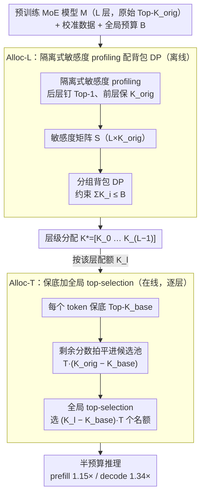

# Alloc-MoE: Budget-Aware Expert Activation Allocation for Efficient Mixture-of-Experts Inference

**会议**: ACL 2026  
**arXiv**: [2604.08133](https://arxiv.org/abs/2604.08133)  
**代码**: 无  
**领域**: LLM 效率 / MoE 推理  
**关键词**: Mixture-of-Experts, 专家激活预算, 动态规划, Token 级再分配, 推理加速

## 一句话总结
把 MoE 推理的"激活专家个数"抽象成全局预算 $B$，先用动态规划在层间做最优 Top-K 分配（Alloc-L），再用全局 Top-(K·T) 选择在 token 间重分配（Alloc-T），在 DeepSeek-V2-Lite 上把激活预算砍掉一半还能保持精度，prefill 加速 1.15×、decode 加速 1.34×。

## 研究背景与动机

**领域现状**：稀疏 MoE（DeepSeek-V2/V3、Qwen-MoE、OLMoE 等）把每个 token 路由到 Top-K 个专家。推理延迟近似随激活专家数线性增长，因此降低 K 是天然的加速思路。

**现有痛点**：两条主流压缩路线都把"减少激活"当目标，但忽视了对模型性能的影响。Token 级方法（XMoE 的 Top-P、Dynamic-MoE、NAEE、AdapMoE）大多依赖训练期校准或固定阈值；层级方法（LExI 等启发式）对不同层一视同仁。论文实测：DeepSeek-V2-Lite 把每 token 激活从 6 砍到 3，性能掉 17%；砍到 2 时直接掉到接近 40%。

**核心矛盾**：激活配额是稀缺资源，但既不应在所有层均摊，也不应在所有 token 均摊——不同层对稀疏化的敏感度差异显著，不同 token 的路由分布也疏密不一。已有工作要么只动层、要么只动 token，从未把两者作为同一个预算优化问题来解。

**本文目标**：在固定全局激活预算 $B$ 下，找到层级分配 $\mathbf{K}^{\ast}=[K_0,\dots,K_{L-1}]$ 和 token 级激活分布，使整体性能损失最小。

**切入角度**：作者发现层敏感度可以被一个端到端 PPL 指标准确量化（关键技巧：profile 第 $i$ 层时把它**后面所有层** 固定到 Top-1、**前面所有层**保持 $K_{\text{orig}}$，剥离深层补偿效应）；token 级再分配则可以转化成在 $T\times K_{\text{orig}}$ 的候选集合上做全局 top-selection。

**核心 idea**：把"激活预算"显式建模成可调度的资源，用 DP 做层间最优分配 + 用全局 top-selection 做 token 间再分配，两者正交、可叠加。

## 方法详解

### 整体框架

Alloc-MoE 把"激活多少个专家"显式建模成一份固定的全局预算 $B$，再分两个正交维度去最优调度它。输入是一个预训练 MoE 模型 $M$（含 $L$ 个 MoE 层、原始 Top-$K$ 为 $K_{\text{orig}}$）、校准数据 $D_{\text{calib}}$ 和预算 $B$。离线阶段先量化每一层对稀疏化的敏感度、用动态规划把预算切成层级分配 $\mathbf{K}^{\ast}=[K_0,\dots,K_{L-1}]$（Alloc-L）；在线阶段在每层内部、按该层配额把激活机会在 token 之间重新抢占（Alloc-T）。两个阶段一个动层、一个动 token，互不重叠，叠起来就是完整框架，输出是一个激活预算砍半却几乎不掉点的推理流程。

### 关键设计

**1. Alloc-L：隔离式敏感度 profiling 配背包 DP，把预算最优地切到各层**

层级分配的难点有二：测不准和算不快。直接独立量化某层敏感度时，后面的深层会偷偷"补偿"它的稀疏化，让浅层看起来无所谓——本设计在 profile 第 $i$ 层、取 $k\in\{K_{\text{orig}},\dots,1\}$ 时，强制所有 $j>i$ 的深层都退到 Top-1 以剥离补偿、所有 $j<i$ 的浅层保持原配置，记下 $\mathbf{S}[i,k]=\mathrm{PPL}$，得到敏感度矩阵 $\mathbf{S}\in\mathbb{R}^{L\times K_{\text{orig}}}$。求最优分配 $\arg\min_{\mathbf{K}}\sum_i\mathbf{S}[i,K_i]\ \text{s.t.}\ \sum_i K_i\le B$ 本是 $K_{\text{orig}}^L$ 量级的组合爆炸，这里套分组背包 DP $\mathrm{DP}[i,b]=\min_{k\le b}\big(\mathrm{DP}[i-1,b-k]+\mathbf{S}[i,k]\big)$，复杂度降到 $O(L\cdot B\cdot K_{\text{orig}})$，又因 $B\le L K_{\text{orig}}$ 实际很快。隔离 profiling 解决"测得准"、DP 解决"算得快"，两件事一次办完。

**2. Alloc-T：保底加全局 top-selection，把层级预算在 token 间按疏密重排**

标准 Top-$K$ routing 对每个 token 一刀切，完全无视"有的 token 第一个专家分数 0.9、有的前四个都才 0.25"的客观差异。Alloc-T 把每层的 token-expert 选择写成 0-1 整数规划 $\max\sum z_{t,e}w_{t,e}$，约束 $\sum z_{t,e}\le T\cdot K_l$ 且每个 token 至少分到 $K_{\text{base}}$ 个专家；它在实操上等价于三步——先给每个 token 保住 Top-$K_{\text{base}}$、再把剩下 $K_{\text{orig}}-K_{\text{base}}$ 列分数拍平进一个 $T\cdot(K_{\text{orig}}-K_{\text{base}})$ 的候选池、最后全局选出 top $(K_l-K_{\text{base}})\cdot T$ 个名额。整套就是两次 mask 加一次 top-K，零额外内核、零额外参数，却让路由不自信（高熵）的 token 多拿配额、自信的 token 少拿。当 $K_{\text{base}}=K_l$ 时它退化为标准 Top-K，因而是后者的严格泛化。

**3. Alloc-MoE：层级与 token 级正交叠加成统一框架**

Alloc-L 和 Alloc-T 作用在互不重叠的资源维度上——前者决定每层平均预算 $K_l^{\ast}$，后者在这个 $K_l^{\ast}$ 之下再做 token 级重排，因此可以乘法组合。这种正交性是有数据支撑的：单跑 Alloc-L 在四个预算上平均 +0.4%、单跑 Alloc-T 平均 +0.93%，说明 token 级再分配在激进稀疏化下增益更大，但两者并不打架，组合后取得最高均值 45.19%（对比 Uniform 的 44.19%），在全预算区间都最优或近最优。

### 损失函数 / 训练策略

完全无需重训。Alloc-L 只需离线跑 $L\cdot K_{\text{orig}}$ 次 PPL 拿到敏感度矩阵 $\mathbf{S}$；Alloc-T 是纯推理期的 mask 加 top-K，不引入任何额外参数。默认 $K_{\text{base}}=1$，在所有模型和预算上都接近最优。

## 实验关键数据

### 主实验
在 DeepSeek-V2-Lite（$L=26$, $K_{\text{orig}}=6$）/ Qwen1.5-MoE-A2.7B / OLMoE-1B-7B 三个模型 + 20 个 NLU / Reasoning / Math benchmark 上评估，与 Uniform / LExI / Dynamic-MoE / NAEE 对比。下表是 DeepSeek 半预算（$B=78$，即每 token 平均 3 个专家）下的"任务组均值"。

| 任务组 | Uniform | Dynamic-MoE | NAEE | LExI | **Alloc-MoE** |
|---|---|---|---|---|---|
| NLU | ~63.0 | ~62.5 | ~62.6 | ~63.4 | **~63.5** |
| Reasoning | ~37.2 | ~37.9 | ~38.0 | ~37.5 | **~38.6** |
| Math | ~31.6 | ~32.3 | ~31.7 | ~31.0 | **~34.4** |

整体上 Alloc-MoE 在 12 个 budget×task 配置里赢了 10 个，且任务越难提升越明显：NLU 平均 +0.05%、Reasoning +0.70%、Math +2.15%。推理效率上半预算下 prefill 1.15× / decode 1.34× 加速，与 LExI 同档但精度高一截。

### 消融实验（DeepSeek-V2-Lite 任务组平均）

| 配置 | $B=52$ | $B=78$ | $B=104$ | $B=130$ | 均值 |
|---|---|---|---|---|---|
| Uniform | 41.27 | 43.90 | 45.51 | 46.06 | 44.19 |
| +Alloc-L | 41.53 | 44.61 | 45.76 | 46.47 | 44.59 |
| +Alloc-T | 42.83 | 45.42 | 45.93 | 46.30 | 45.12 |
| **+Alloc-L +Alloc-T** | **43.09** | **45.48** | **46.01** | 46.17 | **45.19** |

### 关键发现
- 预算越紧（$B=52$，即每层均摊 2 个专家）时 Alloc-T 贡献越大（+1.56），说明在激进稀疏化下 token 级再分配比层级再分配更值钱；预算宽松时两者贡献趋平。
- $K_{\text{base}}$ 消融：从 0 到 5 扫，$K_{\text{base}}=1$ 在所有预算上几乎都是最优，$K_{\text{base}}\ge 2$ 在紧预算下显著掉点——保得越多，可重分配的灵活性就越小。
- 校准数据集（WikiText2 / C4 / Pile）对 Alloc-L 几乎无影响，4 个预算的均值在 44.59 ~ 44.68 之间，说明敏感度 profiling 鲁棒。
- Alloc-MoE 的层级分配可视化显示：浅层留多、深层砍狠，与"浅层提取通用特征更敏感"的直觉一致；token 级则在分配数和路由熵之间呈现 $>0.7$ 的强正相关。

## 亮点与洞察
- **"激活预算"这一抽象是最大亮点**：把原本散落在层级 / token 级的稀疏化决策统一成可调度资源，让 DP 与全局 top-K 这两件常规武器立刻可用。这种"先把问题换个名字"的思路可以迁移到 KV 缓存预算、注意力头预算、并行专家切分等场景。
- **隔离式敏感度 profiling 的小技巧很关键**：直接独立量化每层敏感度时，深层会"补偿"浅层的稀疏化，让浅层看起来"无所谓"；强行把后面所有层钉死到 Top-1 反而能测到真实的敏感度。这是个可复用的 profiling 范式。
- **Alloc-T 的零开销实现优雅**：把整数规划等价成"两次 mask + 一次全局 top-K"，没有引入任何额外内核，可直接嵌入现有 MoE 路由器。
- **expert load 分析做得稳**：分配后专家负载分布与原模型 Spearman 相关 0.93~0.99，JS 散度 <0.014，说明并不破坏专家专精——对分布式 MoE 部署友好。

## 局限与展望
- 作者承认未考虑硬件感知（expert 放置、通信开销），分布式 MoE 部署收益可能进一步放大。
- Alloc-L 需要离线跑 $L\cdot K_{\text{orig}}$ 次 PPL，对 100B+ 模型的 profiling 成本不可忽视；可以考虑用代理小模型估计敏感度。
- 框架完全 post-hoc，未与训练阶段联动。如果在训练时就引入"激活预算感知"的辅助 loss，可能进一步提升鲁棒性。
- 仅评了三类任务和三种模型，未覆盖 long-context、code 这种激活模式可能很不同的场景。

## 相关工作与启发
- **vs XMoE / Dynamic-MoE**：都是 token 级动态路由，但 XMoE 需要训练期校准 Top-P 阈值、Dynamic-MoE 在训练目标里加入熵正则；Alloc-T 完全 post-hoc 且零额外参数。
- **vs NAEE**：NAEE 限定 Top-2 路由下跳过第二专家，难以扩展到 Top-K>2；Alloc-T 是真正的通用 top-selection。
- **vs LExI**：LExI 是层级启发式分配，没有 DP 最优性保证；Alloc-L 给出预算约束下的全局最优解。
- **vs MoE 剪枝/量化**：本文与剪枝/量化完全正交，可叠加进一步加速。

## 评分
- 新颖性: ⭐⭐⭐⭐ "激活预算"的统一抽象 + 隔离敏感度 profiling 是清新组合，但 DP / 全局 top-K 这两件武器都不新。
- 实验充分度: ⭐⭐⭐⭐ 三模型 × 四预算 × 20 数据集，消融、$K_{\text{base}}$ 扫、校准集鲁棒性、负载分析齐全；缺超大模型实测。
- 写作质量: ⭐⭐⭐⭐ 公式与算法清楚，图表（Figure 3-8）信息量大；术语 Alloc-L / Alloc-T 名字直观。
- 价值: ⭐⭐⭐⭐ 纯后处理、零训练、能直接落地到现有 MoE 框架（vLLM 等），半预算下 34% decode 加速对实际部署吸引力强。

<!-- RELATED:START -->

## 相关论文

- [\[ICML 2026\] TEAM: Temporal-Spatial Consistency Guided Expert Activation for MoE Diffusion Language Model Acceleration](../../ICML2026/llm_efficiency/team_temporal-spatial_consistency_guided_expert_activation_for_moe_diffusion_lan.md)
- [\[ICML 2025\] Mixture of Lookup Experts](../../ICML2025/llm_efficiency/mixture_of_lookup_experts.md)
- [\[ICLR 2026\] Semantic Parallelism: Redefining Efficient MoE Inference via Model-Data Co-Scheduling](../../ICLR2026/llm_efficiency/semantic_parallelism_redefining_efficient_moe_inference_via_model-data_co-schedu.md)
- [\[NeurIPS 2025\] Advancing Expert Specialization for Better MoE](../../NeurIPS2025/llm_efficiency/advancing_expert_specialization_for_better_moe.md)
- [\[ICLR 2026\] Expert Divergence Learning for MoE-based Language Models](../../ICLR2026/llm_efficiency/expert_divergence_learning_for_moe-based_language_models.md)

<!-- RELATED:END -->
