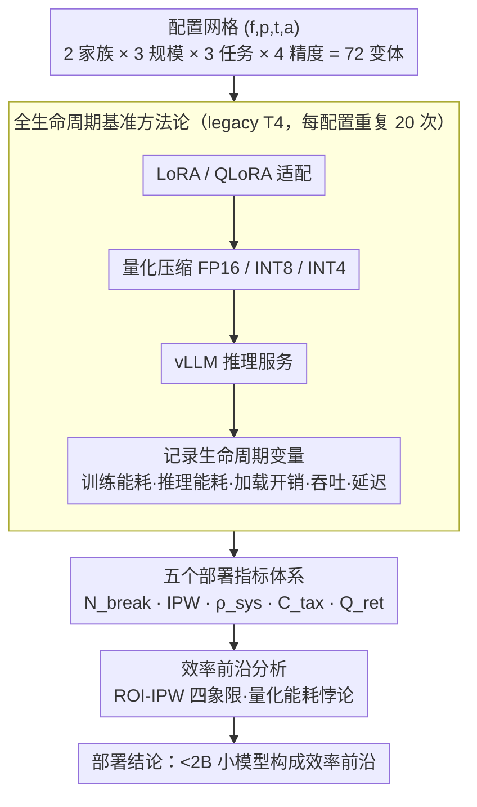

# Are Large Language Models Economically Viable for Industry Deployment?

**会议**: ACL 2026  
**arXiv**: [2604.19342](https://arxiv.org/abs/2604.19342)  
**代码**: [https://github.com/Abdullah4152/EDGE-EVAL](https://github.com/Abdullah4152/EDGE-EVAL)  
**领域**: 其他  
**关键词**: 部署经济性, 生命周期基准, 能效评估, 量化保真度, 边缘推理

## 一句话总结

提出Edge-Eval框架，通过5个部署指标（经济盈亏平衡、智能功耗比、系统密度、冷启动税、量化保真度）在传统T4 GPU上全生命周期评估LLM，揭示<2B小模型在经济和生态维度全面优于7B模型，并发现QLoRA虽降低内存但能耗增加最高7倍的反常现象。

## 研究背景与动机

**领域现状**：生成式AI驱动的LLM正从研究原型向工业部署快速转型，在医疗决策、金融分析、企业检索、对话自动化等领域广泛应用。这些场景对能耗、延迟、硬件利用率有严格约束。

**现有痛点**：现有评估流水线以准确率为中心，缺乏运营和经济指标，形成了"部署-评估鸿沟"（Deployment-Evaluation Gap）。模型在准确率上表现优秀，但部署时可能在能效、成本回收、硬件利用等方面不可行。

**核心矛盾**：内存效率≠能源效率≠部署效率。例如QLoRA将内存降低约60%，但微调能耗反而增加最高7.2倍。这些关键trade-off在准确率基准中完全不可见。

**本文目标**：构建面向工业部署的全生命周期评估框架，填补从实验室到生产环境的评估盲区。

**切入角度**：在广泛部署的传统NVIDIA Tesla T4 GPU上，对LLaMA和Qwen系列从适配到推理进行完整生命周期基准测试。

**核心 idea**：定义5个部署指标覆盖盈利性、能效、硬件密度、冷启动开销和压缩安全性，揭示小模型的效率前沿和量化的能耗悖论。

## 方法详解

### 整体框架

Edge-Eval 是一套面向工业部署的全生命周期评估框架，核心是把准确率基准看不见的"运营与经济"维度量化出来。它对每个配置 $(f, p, t, a) \in \mathcal{F} \times \mathcal{P} \times \mathcal{T} \times \mathcal{A}$（模型家族 × 参数规模 × 任务 × 精度）跑完一条完整部署流水线——从 LoRA/QLoRA 适配，到可选的量化压缩，再到 vLLM 推理服务，全程在最广泛部署的 legacy T4 GPU 上进行；覆盖 2 个模型家族 × 3 个参数级别 × 3 个任务 × 4 个精度配置共 72 个变体，每条流水线沿途记录训练能耗、推理能耗、加载开销、吞吐与延迟等生命周期变量，最终用五个部署指标和效率前沿分析把"哪种配置真能落地"讲清楚。

### 关键设计

**1. 全生命周期基准方法论：在受控 legacy 硬件上做端到端评估**

为模拟真实工业条件，评测固定在双 GPU T4 节点上进行（T4 是全球部署量最大的推理 GPU 之一），对 LLaMA（1B/3B/8B）与 Qwen（1.5B/3B/7B）在摘要、RAG、对话三个工业任务上，分别跑 LoRA-FP16/INT8/INT4 与 QLoRA-INT4 四种精度配置的完整测试。每个配置独立重复 20 次以压住方差，并把训练能耗、推理能耗、加载开销、持续吞吐、延迟特性、GPU 内存占用等全部生命周期变量记录在案，从而让"从适配到推理"整条链路、而非仅推理一段被纳入度量。这条受控流水线是后续两个设计的数据来源——没有它，经济与能效指标都无从计算。

**2. 五个部署指标体系：把经济、能效、可行性逐项量化**

准确率掩盖了部署真正在意的维度，本文据此在流水线记录的生命周期变量之上定义五个互补指标。**经济盈亏平衡** $N_{break} = (C_{train}+C_{setup})/(C_{api}-C_{infer})$，算出本地部署要跑多少请求才能追平调用 API 的成本；**智能功耗比** $IPW = \mathcal{S}_{task} \cdot \alpha / E_{req}$，把任务性能归一到每瓦能耗上；**系统密度** $\rho_{sys} = \mathcal{T}_{put}/M_{vram}$，衡量每 GB VRAM 产出的吞吐；**冷启动税** $C_{tax} = E_{load}/E_{infer}$，刻画模型加载相对稳态推理的能耗惩罚；**量化保真度** $Q_{ret} = \mathcal{S}_{INT4}/\mathcal{S}_{FP16} \times 100\%$，量化 4-bit 压缩后推理性能的保留率。五者从盈利、能效、硬件密度、冷启动开销到压缩安全性，正好补齐准确率指标看不见的那一面，给工业决策提供可直接读数的依据。

**3. 效率前沿分析：从多维可视化里挖出最优配置与反常现象**

拿到全生命周期数据后，本文用 ROI-IPW 四象限图、系统密度分析、质量-稳定性权衡图等多角度可视化交叉比对，识别出 <2B 小模型构成的效率前沿；同时把 LoRA 与 QLoRA 的能耗并排对照，揭出"量化能耗悖论"——QLoRA 虽降内存却反而显著抬高微调能耗。这一步把零散指标拧成可操作的部署结论，告诉工业用户在什么规模、什么精度下部署才真正划算。

### 损失函数 / 训练策略

评估框架本身不引入新的训练策略，统一使用标准 LoRA（$r=16$, $\alpha=32$）与对应的 QLoRA 配置，以保证 72 个变体之间的可比性。

## 实验关键数据

### 主实验

生命周期效率前沿（INT4中位数，20次运行，3个任务）：

| 模型 | $N_{break}$ | IPW | $\rho_{sys}$ (tok/s/GB) | $Q_{ret}$ | $C_{tax}$ |
|------|------------|-----|------------------------|----------|----------|
| LLaMA-1B | **14 Reqs** | 0.45 | **6,930** | 100.6% | 183x |
| LLaMA-3B | 33 Reqs | 0.27 | 1,336 | 99.8% | 184x |
| LLaMA-7B | 43 Reqs | 0.15 | 387 | 100.3% | 230x |
| Qwen-1.5B | 21 Reqs | **0.48** | 6,942 | 99.6% | 179x |
| Qwen-3B | 28 Reqs | 0.23 | 1,419 | 97.3% | 188x |
| Qwen-7B | 39 Reqs | 0.14 | 394 | 99.5% | 237x |

### 消融实验

QLoRA能耗悖论（LoRA-FP16 vs QLoRA-INT4）：

| 模型 | LoRA-FP16 能耗 | QLoRA-INT4 能耗 | 倍率 |
|------|---------------|----------------|------|
| LLaMA-1B | 0.039 kWh | 0.251 kWh | **6.4×** |
| LLaMA-3B | 0.171 kWh | 0.511 kWh | 3.0× |
| LLaMA-7B | 0.244 kWh | 0.552 kWh | 2.3× |
| Qwen-1.5B | 0.129 kWh | 0.301 kWh | 2.3× |

### 关键发现

- <2B模型形成明确的效率前沿：LLaMA-1B仅需14个请求即可收回部署成本，系统密度达6,930 tok/s/GB，是7B模型的17倍
- 量化保真度普遍>97%，INT4几乎无损——这意味着在legacy硬件上，量化是一个"免费"的推理加速器
- QLoRA的能耗悖论在小模型上最严重（6.4×），随模型增大逐渐缓解（降至2.3×），可能与量化开销在小模型中占比更大有关
- 冷启动税约为稳态推理能耗的180-237倍，对serverless部署场景有重要影响

## 亮点与洞察

- "内存效率≠能源效率"是一个重要且反直觉的发现：QLoRA被广泛推荐为节省资源的方案，但本文揭示了其隐藏的能耗成本，这对绿色AI实践有重要警示意义。
- 五个部署指标的设计覆盖了从经济盈利到生态环保的完整维度，$N_{break}$（经济盈亏平衡点）对实际部署决策特别有用——14个请求即可回本意味着几乎零门槛。
- 在legacy T4硬件上的评估具有极强的实践意义，因为T4是全球数据中心中部署量最大的推理GPU之一。

## 局限与展望

- 仅评估了LLaMA和Qwen两个家族，缺少Mistral、Gemma等其他流行模型
- 仅在T4 GPU上测试，更新的硬件（A100、H100）上的效率格局可能不同
- batch size固定为1模拟低负载场景，高并发场景下的效率前沿可能发生变化
- 未考虑蒸馏、剪枝等其他压缩技术与量化的组合效应
- 5个指标虽全面，但缺少指标间权衡的统一框架（如帕累托最优的自动化识别）

## 相关工作与启发

- **vs MLPerf Tiny**: 评估超低功耗设备上的推理，但仅关注推理阶段；Edge-Eval覆盖全生命周期
- **vs Green AI (Schizas et al.)**: 倡导报告能耗，但未提供统一框架；Edge-Eval将能效嵌入系统化的指标体系
- **vs 常规压缩评估**: 通常只关注准确率保留，Edge-Eval增加了经济性和系统密度维度

## 评分
- 新颖性: ⭐⭐⭐⭐ 部署指标体系新颖，QLoRA能耗悖论是重要发现
- 实验充分度: ⭐⭐⭐⭐⭐ 72个变体×20次运行×3任务，实验极其充分
- 写作质量: ⭐⭐⭐⭐ 指标定义清晰，可视化分析到位
- 价值: ⭐⭐⭐⭐⭐ 对工业LLM部署决策有直接指导意义

<!-- RELATED:START -->

## 相关论文

- [\[ACL 2026\] Lizard: An Efficient Linearization Framework for Large Language Models](lizard_an_efficient_linearization_framework_for_large_language_models.md)
- [\[ACL 2026\] CreditDecoding: Accelerating Parallel Decoding in Diffusion Large Language Models with Trace Credit](creditdecoding_accelerating_parallel_decoding_in_diffusion_large_language_models.md)
- [\[ACL 2026\] Breaking Block Boundaries: Anchor-based History-stable Decoding for Diffusion Large Language Models](breaking_block_boundaries_anchor-based_history-stable_decoding_for_diffusion_lar.md)
- [\[ACL 2026\] Tandem: Riding Together with Large and Small Language Models for Efficient Reasoning](tandem_riding_together_with_large_and_small_language_models_for_efficient_reason.md)
- [\[ICLR 2026\] DND: Boosting Large Language Models with Dynamic Nested Depth](../../ICLR2026/llm_efficiency/dnd_boosting_large_language_models_with_dynamic_nested_depth.md)

<!-- RELATED:END -->
