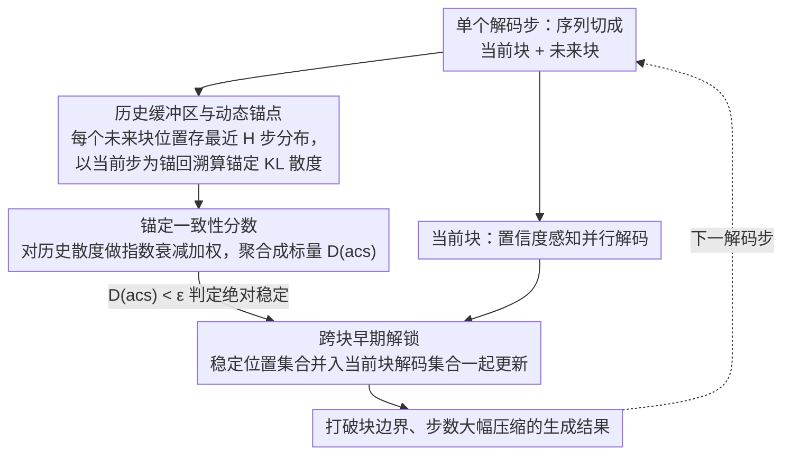

# Breaking Block Boundaries: Anchor-based History-stable Decoding for Diffusion Large Language Models

**会议**: ACL 2026  
**arXiv**: [2604.08964](https://arxiv.org/abs/2604.08964)  
**代码**: [GitHub](https://github.com/zs1314/AHD)  
**领域**: LLM效率  
**关键词**: 扩散语言模型, 半自回归解码, 跨块稳定token, 动态锚点, 推理加速

## 一句话总结
提出 AHD（Anchor-based History-stable Decoding），一种无需训练的即插即用动态解码策略，通过动态锚点回溯历史轨迹判定扩散LLM中跨块稳定token，实现早期解锁，在BBH上减少80%解码步数的同时提升3.67%性能。

## 研究背景与动机

**领域现状**：扩散大语言模型（dLLMs）如LLaDA已成为自回归LLM的有力替代。半自回归（Semi-AR）解码被广泛采用——将输出序列分为多个block从左到右顺序解码，每个block内用扩散迭代去噪。

**现有痛点**：Semi-AR解码中存在严重的"块边界延迟"问题——许多token在对应block解码之前就已经收敛到最终值并保持稳定，但被迫等到所属block轮次才能解码。这些"跨块稳定token"的延迟解码不仅浪费了大量解码步数，还因为压制了局部区域的辐射效应导致性能下降。

**核心矛盾**：如何准确识别跨块稳定token？现有方法（基于置信度/熵的单步判断）不可靠——(1) 已稳定token仍可能出现局部波动导致误判；(2) 标准解码中历史信息是孤立的，每步预测仅依赖上一步。

**本文目标**：打破Semi-AR解码的块边界约束，通过早期解锁跨块稳定token同时提升效率和性能。

**切入角度**：三个关键洞察——(1) 朴素前瞻解码不可靠（局部波动）；(2) token稳定性与收敛趋势高度相关（绝对稳定趋势）；(3) 历史信息在标准解码中被孤立。因此需要引入历史轨迹信息来判定全局稳定性。

**核心 idea**：在每个解码步以当前步为动态锚点，回溯历史缓冲区计算锚定一致性分数（anchored consistency score），捕捉token的绝对稳定趋势，一旦确认稳定即跨块早期解码。

## 方法详解

### 整体框架
AHD 在扩散 LLM 常用的半自回归解码框架上做改造：每个解码步把序列切成当前块 $B_{current}^t$ 和未来块 $B_{future}^t$，当前块内沿用置信度感知的并行解码，关键的新机制都发生在未来块。AHD 为每个未来块位置维护一段历史分布轨迹，以"当前步"为动态锚点回溯这段轨迹、衡量该位置是否已呈现绝对稳定趋势；一旦确认稳定，就把它从未来块提前解锁、并入当前步的解码集合一起更新序列。这样输入是一条逐步去噪的扩散轨迹，中间靠历史一致性判定哪些 token 已"提前收敛"，输出则是一个打破了块边界、解码步数大幅压缩的生成结果。

### 关键设计

**1. 历史缓冲区与动态锚点：用轨迹而非单步判断稳定性**

判定一个 token 是否真正稳定，单看当前步的置信度或熵并不可靠——已稳定的 token 仍可能出现局部波动而被误判。AHD 的做法是为未来块的每个位置 $j$ 维护一个长度为 $H$ 的历史缓冲区 $\mathcal{H}_j^t = \{P_j^{t-H+1}, \dots, P_j^t\}$，记录它在最近若干步的预测分布；再以当前步分布 $P_j^t$ 作为动态锚点，回溯计算它与各历史步的锚定 KL 散度 $\delta_j^{t,\tau} = D_{KL}(P_{j,anchor}^t \,\|\, P_j^{t-\tau})$。相比标准解码里每步只依赖上一步、历史信息彼此孤立的情形，这种以当前为锚回看过去的视角能从全局轨迹中捕捉到稳定趋势的早期信号。

**2. 锚定一致性分数：把历史证据聚合成一个可判定的标量**

有了一串锚定散度还需要一个稳健的判据。AHD 对历史一致性序列 $\{\delta_j^{t,1}, \dots, \delta_j^{t,H-1}\}$ 做指数衰减加权求和，得到锚定一致性分数 $D_j^t(acs) = \sum_{\tau=1}^{H-1} w_\tau \delta_j^{t,\tau}$，其中权重 $w_\tau = e^{-\lambda\tau}/Z$ 让越近的历史占越大比重。指数衰减在这里同时照顾了两端——对近期变化保持敏感、又能容纳长期趋势的稳健性；当 $D_j^t(acs) < \varepsilon$ 时即判定该位置已达绝对稳定趋势，阈值 $\varepsilon$ 则充当解锁保守程度的旋钮。

**3. 跨块早期解锁：释放稳定 token 的辐射效应**

最后一步是真正打破块边界。AHD 把未来块中满足稳定条件的位置集合 $G_f^t = \{j \mid j \in B_{future} \wedge D_j^t(acs) < \varepsilon\}$ 与当前块的解码集合 $G_c^t$ 合并成 $G_{unmasked}^t$，一并解锁更新。这一步之所以能同时提速又提质，关键在于稳定 token 的"辐射效应"——一个 token 确定下来会加速邻近 token 的收敛，而 Semi-AR 原本强制它们等到所属块轮次才解码，恰好压制了这种辐射。提前解锁等于把被块边界憋住的辐射效应释放出来，于是减少解码步数与提升生成质量在这里不再是此消彼长，而是一回事。

AHD 全程无需训练、即插即用，只在推理阶段生效。默认超参为历史缓冲区长度 $H=6$、一致性阈值 $\varepsilon=0.01$，衰减率 $\lambda$ 控制历史权重的分布形状。

## 实验关键数据

### 主实验（LLaDA-8B-Instruct）

| 任务 | 指标 | AHD | Vanilla | 步数减少 |
|------|------|-----|---------|----------|
| BBH | Score↑ | 56.78 | 53.11 | 80% |
| HumanEval | Score↑ | 43.29 | 40.85 | 70% |
| MBPP | Score↑ | 31.20 | 29.20 | 74% |
| MMLU-Pro | Score↑ | 37.42 | 35.57 | 48% |
| Asdiv | Score↑ | 77.09 | 75.57 | 76% |

### 消融实验

| 方法 | BBH Score | 步数减少 | 说明 |
|------|-----------|----------|------|
| Vanilla | 53.11 | 0% | 标准解码 |
| Fast-dLLM | 53.17 | 78% | 性能持平但无提升 |
| KLASS | 53.03 | 62% | 轻微下降 |
| Saber | 52.88 | 66% | 性能下降 |
| AHD | 56.78 | 80% | 唯一同时提升性能和效率的方法 |

### 关键发现
- AHD是唯一能在加速的同时提升性能的方法，其他加速策略（Saber、KLASS）往往导致性能下降
- 在LLaDA-1.5上同样有效，BBH提升+1.55，步数减少78%，证明方法的通用性
- 扩展到视觉-语言（MMaDA）和音频-语言（DIFFA）领域同样有效，证明跨模态适用性

## 亮点与洞察
- **"稳定token的辐射效应"**：发现稳定token呈聚类模式出现，一个token稳定会加速邻近token收敛。这个洞察对理解扩散LLM的解码动力学很有价值
- **"加速即提升"的反直觉发现**：早期解锁不仅加速推理，还因释放辐射效应提升了生成质量。这挑战了"速度vs质量trade-off"的常见假设
- **锚点回溯机制的通用性**：这种基于历史轨迹判定稳定性的方法可迁移到任何迭代式生成过程（如扩散图像生成中的像素级提前确定）

## 局限与展望
- 需要维护历史缓冲区增加了内存开销，对于超长序列生成可能成为瓶颈
- 阈值 $\varepsilon$ 和缓冲区长度 $H$ 需要针对不同模型/任务调优
- 目前主要在LLaDA系列上验证，其他dLLM架构（如MDLM）的适用性待验证
- 理论分析假设了token稳定性的单调收敛性，极端情况下可能不成立

## 相关工作与启发
- **vs Fast-dLLM**: Fast-dLLM使用置信度阈值加速但性能持平；AHD通过历史轨迹判定实现加速+提升双赢
- **vs Saber**: Saber使用预测器选择性去噪但导致性能下降；AHD的动态锚点方法更鲁棒
- **vs PC-sampler**: PC-sampler修改采样过程但不减少步数；AHD直接减少70-80%步数

## 评分
- 新颖性: ⭐⭐⭐⭐⭐ 三个洞察→动态锚点方法的推导链路严谨自然，"加速即提升"的发现很有价值
- 实验充分度: ⭐⭐⭐⭐⭐ 7个语言benchmark+5个视觉+5个音频，两个dLLM模型，5个baseline对比
- 写作质量: ⭐⭐⭐⭐⭐ 观察→洞察→方法的叙事流畅，图表设计出色（特别是热力图分析）

<!-- RELATED:START -->

## 相关论文

- [\[ACL 2026\] CreditDecoding: Accelerating Parallel Decoding in Diffusion Large Language Models with Trace Credit](creditdecoding_accelerating_parallel_decoding_in_diffusion_large_language_models.md)
- [\[ICML 2026\] dLLM-Cache: Accelerating Diffusion Large Language Models with Adaptive Caching](../../ICML2026/llm_efficiency/dllm-cache_accelerating_diffusion_large_language_models_with_adaptive_caching.md)
- [\[ACL 2026\] Lizard: An Efficient Linearization Framework for Large Language Models](lizard_an_efficient_linearization_framework_for_large_language_models.md)
- [\[ACL 2026\] Are Large Language Models Economically Viable for Industry Deployment?](are_large_language_models_economically_viable_for_industry_deployment.md)
- [\[ACL 2026\] Tandem: Riding Together with Large and Small Language Models for Efficient Reasoning](tandem_riding_together_with_large_and_small_language_models_for_efficient_reason.md)

<!-- RELATED:END -->
