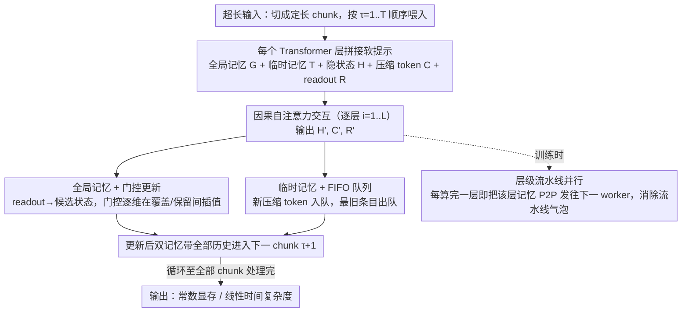

# CoMeT: Collaborative Memory Transformer for Efficient Long Context Modeling

**会议**: ACL 2026  
**arXiv**: [2602.01766](https://arxiv.org/abs/2602.01766)  
**代码**: https://github.com/LivingFutureLab/Comet (有)  
**领域**: LLM 效率 / 长上下文 / 记忆机制  
**关键词**: 长上下文, 循环 Transformer, 双记忆系统, 门控更新, 流水线并行

## 一句话总结
CoMeT 给已有 LLM 加一个"全局记忆 + FIFO 临时记忆"的双记忆插件，分块处理输入实现常数显存、线性时间复杂度，仅在 32k 上下文上微调就能在 1M token 内任意位置精确找回密码，并提出层级流水线并行让 16×80GB GPU 就能微调 128k 上下文。

## 研究背景与动机
**领域现状**：标准 Transformer 因 KV cache 随上下文线性增长、注意力计算二次复杂度，在百万级 token 上几乎不可用。两类主流解法分别是上下文压缩（LLMLingua / ICAE / Activation Beacon）和有限状态记忆模型（Transformer-XL / RMT / HMT）。

**现有痛点**：(1) 压缩派受信息论限制，压缩长度仍随原始长度线性增长，只能改善常数因子，渐近复杂度不变；(2) 有限状态记忆派虽然能做到 $\mathcal{O}(N)$ 时间 + $\mathcal{O}(1)$ 空间，但普遍缺少显式门控保护重要信息，且对所有历史一视同仁，丢失最近上下文的细粒度信号。

**核心矛盾**：长期记忆的"压缩稳定保留"与近期上下文的"高保真细节捕捉"在固定容量下天然冲突——压缩太狠会丢近期细节，保留太多近期又会冲掉重要长程信息。

**本文目标**：(1) 设计一个能同时保护长期关键信息和保留近期细节的双记忆机制；(2) 让该机制可插拔到预训练 LLM 上而无需从头训练；(3) 解决极长上下文训练时朴素 context parallel 的流水线气泡问题。

**切入角度**：作者注意到 LSTM/GRU 的门控更新能选择性"覆盖 vs 保留"，FIFO 队列能天然维护时间连续性，二者组合可分别解决长期遗忘和近期细节丢失问题。

**核心 idea**：用"带门控更新的全局记忆"承担长期记忆，用"FIFO 队列管理的临时记忆"承担近期高保真信息，二者作为软提示拼接到当前 chunk 隐藏状态前。

## 方法详解

### 整体框架
CoMeT 把任意预训练 LLM 改造成按 chunk 顺序处理的循环模型：超长输入被切成定长 chunk 逐个喂入，每个 Transformer 层都携带两类持久状态——承载长程关键信息的全局记忆 $\mathbf{G}^i_\tau$ 与保留近期高保真细节的 FIFO 临时记忆 $\mathbf{T}^i_\tau$。在第 $i$ 层处理第 $\tau$ 个 chunk 时，两类记忆作为软提示前置到当前隐藏状态 $\mathbf{H}^i_\tau$ 之前，中间穿插压缩 token $\mathbf{C}^i_\tau$ 抽取局部细粒度信息、末尾追加 $m$ 个 readout token $\mathbf{R}^i_\tau$ 汇总本 chunk，所有 token 经 causal self-attention 交互后输出 $\mathbf{H}^{i+1}_\tau, \mathbf{C}^{i+1}_\tau, \mathbf{R}^{i+1}_\tau = \mathrm{TL}(\mathbf{G}^i_\tau, \mathbf{T}^i_\tau, \mathbf{H}^i_\tau, \mathbf{C}^i_\tau, \mathbf{R}^i_\tau)$，再由 readout 去更新全局记忆、压缩 token 入队临时记忆，从而在任意长度上维持常数显存、线性时间。

### 关键设计

**1. 全局记忆 + 门控更新：用低秩残差把 chunk 摘要蒸馏成持久状态，再以类 LSTM 门控决定"覆盖还是保留"**

长程信息一旦被新内容无差别冲掉就再也找不回来，这正是 RMT / HMT 式单一记忆的硬伤。CoMeT 用固定大小的持久状态 $\mathbf{S}^i_\tau$ 蒸馏并保护长程关键信息：先用一个 Residual Low-Rank Adapter（RLA）把状态转成记忆 $\mathrm{RLA}(\mathbf{X}) = \mathbf{X} + \mathbf{W}_{\text{up}}(\mathbf{W}_{\text{down}} \mathbf{X})$，其中 $\mathbf{W}_{\text{down}} \in \mathbb{R}^{r \times d}$ 取 rank $r=8$，使整个 CoMeT 模块只增加 3.95M 参数（占 Qwen3-4B 的 0.098%）——这一低秩约束源自实验观察：state-to-memory 转换参数一多反而掉点，LoRA 风格的低秩残差既省参数又稳定训练。

更新则交给门控完成：候选状态 $\tilde{\mathbf{S}}^i_{\tau+1} = \mathrm{RMSNorm}(\mathbf{R}^{i+1}_\tau)$，门 $\mathbf{g} = \sigma(\mathbf{W}_g([\mathbf{S}^i_\tau; \tilde{\mathbf{S}}^i_{\tau+1}]))$，最终 $\mathbf{S}^i_{\tau+1} = \mathbf{g} \odot \mathbf{S}^i_\tau + (\mathbf{1} - \mathbf{g}) \odot \tilde{\mathbf{S}}^i_{\tau+1}$。这套门控既能让模型逐维选择性地吸收新信息、保护住该留的旧信息，又为跨 chunk 的梯度提供了一条直通路径，缓解长序列循环训练的梯度衰减。

**2. 临时记忆 + FIFO 队列：用定长先进先出队列给最近若干 chunk 维持一份滚动的高分辨率视图**

被压缩进全局记忆的长程信息容易被磨成平均语义，"3 个 chunk 前的那个具体数字"很难精确召回，临时记忆正是补这块缺口。新 chunk 输出的压缩 token $\mathbf{C}^{i+1}_\tau$ 先过 RMSNorm 再过同一个 RLA 模块，然后入队，队列满时最旧条目自动出队——这种先进先出天然维护时间连续性，新条目从队尾进、旧条目从队首走，位置确定且无需额外调度。

从优化角度看，FIFO 还为最近 chunk 提供了一条直接的梯度回传通路，让近期细节信号不必先经过门控压缩就能影响损失，进一步提升了训练稳定性，与全局记忆的"长期保护"形成长短互补的双轨。

**3. 层级流水线并行训练：把通信粒度从 chunk 级降到 layer 级，消除朴素 context parallel 的流水线气泡**

朴素 context parallelism 下 worker $j+1$ 必须等 worker $j$ 把整个 chunk 的所有层 forward 完才能开工，绝大部分 worker 在空转，资源利用率极低。CoMeT 注意到每层记忆状态相互独立、尺寸固定，正好适合细粒度流水：worker $j$ 一算完第 $i$ 层就立即把该层记忆 P2P 发给 worker $j+1$，后者马上开始自己的第 $i$ 层，而前者继续算第 $i+1$ 层，"串行链式等待"被改写成"流水线交错"。

这一改造把 GPU 并发拉满，相比朴素 context parallel 提速 $2.7\times$，且加速比随 GPU 数量增加而扩大，正是让 16×80GB GPU 微调 Qwen3-4B 的 128k 上下文从不可行变为可行的关键工程贡献。

### 一个完整示例
以处理第 $\tau$ 个 chunk 为例：模型读入该 chunk 的 token，连同上一时刻传来的全局记忆 $\mathbf{G}^i_\tau$ 和 FIFO 临时记忆 $\mathbf{T}^i_\tau$ 一起送入第 $i$ 层；穿插的压缩 token 在 self-attention 中抽出本 chunk 的局部细节，末尾 $m$ 个 readout token 汇总出 $\mathbf{R}^{i+1}_\tau$。随后两条记忆各自更新——readout 经 RMSNorm 得到候选状态，门控按维度在"保留旧全局记忆"和"写入新摘要"间插值，得到 $\mathbf{S}^i_{\tau+1}$；新压缩 token 入临时记忆队列、最旧条目出队。这套更新后的记忆带着前 $\tau$ 个 chunk 的全部历史进入第 $\tau+1$ 个 chunk，循环往复，使得 32k 上微调的模型能在 1M token 任意位置精确召回密码。

### 损失函数 / 训练策略
backbone 用 Qwen3-4B-Instruct-2507，所有 efficient 方法统一约 3k token 的记忆预算公平对比，在 32k 上下文上微调 3 epoch。CoMeT 的总记忆 ms=2560（结合 G 和 T），rank $r=8$。

## 实验关键数据

### 主实验（Scrolls benchmark，~3k 记忆预算）

| 方法 | GovRep R-1 | SumScr R-1 | Qspr F1 | Nrtv F1 | QALT F1 | 平均 |
|------|-----------|------------|---------|---------|---------|------|
| Full Attn (FT) | 61.0 | 32.5 | 40.3 | 22.1 | 64.2 | **42.23** |
| LongLLMLingua (3072 tok) | 38.0 | 28.2 | 35.7 | 19.2 | 65.9 | 37.36 |
| ActivationBeacon | 52.3 | 28.0 | 33.5 | 23.2 | 56.8 | 30.71 |
| Transformer-XL (ws=5120) | 51.2 | 30.7 | 35.5 | 4.5 | 33.6 | 31.83 |
| SWA (ws=5120) | 55.3 | 30.7 | 39.1 | 16.1 | 54.8 | 38.24 |
| HMT (ms=3072) | 47.3 | 29.0 | 16.8 | 11.3 | 53.5 | 30.31 |
| **CoMeT (ms=2560)** | **62.5** | **33.4** | 35.5 | 22.6 | 56.0 | **40.10** |

CoMeT 是所有 efficient 方法中平均分最高的，并且在需要全局理解的摘要任务（GovRep / SumScr）上**反超** Full Attention fine-tuned 基线，用 1/4 的有效记忆达到甚至超越全注意力性能。

在密码检索任务上：仅在 32k 上训练，CoMeT 能在 **1M token** 任意位置准确找回密码，相比该长度下的 Full Attention 实现 $21\times$ 推理加速、$10\times$ 显存节省。在真实应用上：用户行为 QA 上 CoMeT 4k 记忆达到 78.7 准确率，超过 industry xRAG baseline +2.7 个点、超过 4k Truncation +27.4 个点；Terminal-Bench agent 任务上达到 20.27，接近 128k Full Attention 的 21.33。

### 消融与扩展（短上下文兼容性）

| 数据集 | 平均长度 | Full Attn EM/F1 | CoMeT EM/F1 |
|--------|---------|-----------------|--------------|
| 2WikiMQA | 1033 | 75.4 / 80.8 | **75.5 / 81.0** |
| HotpotQA | 1443 | 65.0 / 78.9 | **65.9 / 80.0** |

短序列上 CoMeT 与 Full Attention 表现相当甚至略优（因为整段输入就在一个 chunk 内），证明插件不会损害短上下文能力。

### 关键发现
- **摘要任务能比 Full Attention 还好**：作者推测是因为分块强制模型在每个 chunk 上做局部高质量摘要，类似一种隐式的"先 outline 再综合"训练信号，对需要整体理解的任务反而有利。
- **门控更新 + FIFO 双机制缺一不可**：去掉门控（变成 RMT 式无差别覆盖）会让长程任务掉点严重；去掉 FIFO（变成只有 global memory）会让近期细节任务（如 QASPER）掉点。
- **层级流水线并行 vs 朴素 context parallel：$2.7\times$ 加速**，且这种加速随 GPU 数量增加而扩大，是让"128k 训练用 16×80GB"成为可行的关键工程贡献。
- 推理时 CoMeT 时间线性增长、显存常数，这两条曲线和 Full Attention 的二次时间 / 线性显存形成鲜明对比，从工程上证明了渐近复杂度的真实改进而非常数优化。

## 亮点与洞察
- **"长期门控 + 近期 FIFO" 双轨记忆**：这是对 RMT / HMT 之类"单一记忆塞所有历史"思路的精妙拆解——长程关键信息和近期细节本来就是两种性质不同的信息，应该用两种机制承载。这个二分思路可迁移到任何需要长程依赖建模的序列任务（如视频理解、强化学习的轨迹建模）。
- **RLA 用 rank=8 实现 0.098% 参数增量**：把全局状态转记忆的转换做成 LoRA 风格的残差低秩适配，既避免引入大量新参数破坏预训练知识，又让训练稳定。这种"LoRA 用作架构组件而非微调技术"的思路很有借鉴价值。
- **层级流水线并行**：训练超长上下文的最大障碍其实是 GPU 内存而非算力，作者用"layer 级 P2P 通信交错"把流水线气泡几乎消除，相比之前 megatron-style 的 sequence parallel 实现了更细的粒度，是工程上的大贡献。
- **32k 训 → 1M 测的外推能力**：在 NIAH 上实现的这种 30× 上下文外推，比 RoPE-scaling 类方法更彻底，因为 CoMeT 的固定记忆容量天然消除了位置编码外推压力。

## 局限与展望
- 作者承认在 1M+ 极长上下文上虽然显存常数但记忆容量也固定，对于需要精确回忆超过记忆容量的细节任务可能会丢失（实验中已经看到 QALT / QMSum 不如 Full Attention）。
- 自己发现：双记忆系统的超参（global / temporary 比例、FIFO 容量、压缩 token 数 $m$、readout 数）较多，缺乏系统的 sensitivity 分析；不同任务最优配置可能不同。
- 训练时只在 32k 上微调，外推 1M 主要在 NIAH 这种结构化任务上有效，对于 1M 长度的自由文本生成质量没有充分评测。
- 临时记忆的 FIFO 是固定 token 数而非固定信息量，遇到信息密度差异大的内容可能不够灵活；可探索"基于熵 / 重要性"的自适应入队策略。

## 相关工作与启发
- **vs Transformer-XL / RMT (NeurIPS 2022)**：都属于 recurrent Transformer，但 XL 只是单纯 cache 隐状态、RMT 把记忆塞进 memory token 一起更新；CoMeT 把记忆显式拆成"长期门控 + 近期 FIFO"两轨，在 Scrolls 平均分 40.10 vs Transformer-XL 31.83，差距悬殊。
- **vs HMT (NAACL 2025)**：HMT 也用层次化记忆，但缺少显式门控和 FIFO 细节保护；CoMeT 在 ms=2560 时全面超越 HMT ms=3072。
- **vs Activation Beacon / ICAE**：这些上下文压缩方法的压缩长度仍随上下文线性增长，渐近复杂度不变；CoMeT 是真正的 $\mathcal{O}(N)$ 时间 $\mathcal{O}(1)$ 空间，区别在于"压缩派只换常数因子，CoMeT 换的是渐近行为"。
- **vs Mamba / RWKV 等线性 RNN**：后者必须从头预训练且无法直接套用现成 LLM 知识；CoMeT 作为插件可加载到 Qwen3-4B 这种成熟模型，参数增量 0.098%，复用 LLM 生态。

## 评分
- 新颖性: ⭐⭐⭐⭐ 双记忆机制本身是组合现有思路（门控 + FIFO），但层级流水线并行训练策略和"32k 外推 1M"的能力很惊艳。
- 实验充分度: ⭐⭐⭐⭐⭐ 学术 benchmark + 真实应用（用户行为 QA、Terminal-Bench agent）+ 训练效率分析三维评估，对比 7+ baseline。
- 写作质量: ⭐⭐⭐⭐ 架构图清晰，notation 规范，但层级流水线并行的解释偏简略，需要看 appendix 才能完全理解。
- 价值: ⭐⭐⭐⭐⭐ 既给学术界一种实用的 efficient long-context 方案，又给工业界一个能落到生产 LLM 的插件，且训练成本不高，落地价值很大。

<!-- RELATED:START -->

## 相关论文

- [\[ACL 2026\] Native Hybrid Attention for Efficient Sequence Modeling](native_hybrid_attention_for_efficient_sequence_modeling.md)
- [\[ICML 2025\] Curse of High Dimensionality Issue in Transformer for Long-context Modeling](../../ICML2025/llm_efficiency/curse_of_high_dimensionality_issue_in_transformer_for_long-context_modeling.md)
- [\[ICML 2025\] Efficient Length-Generalizable Attention via Causal Retrieval for Long-Context Language Modeling](../../ICML2025/llm_efficiency/efficient_length-generalizable_attention_via_causal_retrieval_for_long-context_l.md)
- [\[ACL 2025\] Smarter, Better, Faster, Longer: A Modern Bidirectional Encoder for Fast, Memory Efficient, and Long Context Finetuning and Inference](../../ACL2025/llm_efficiency/smarter_better_faster_longer_a_modern_bidirectional_encoder_for_fast_memory_effi.md)
- [\[CVPR 2025\] Associative Transformer](../../CVPR2025/llm_efficiency/associative_transformer.md)

<!-- RELATED:END -->
