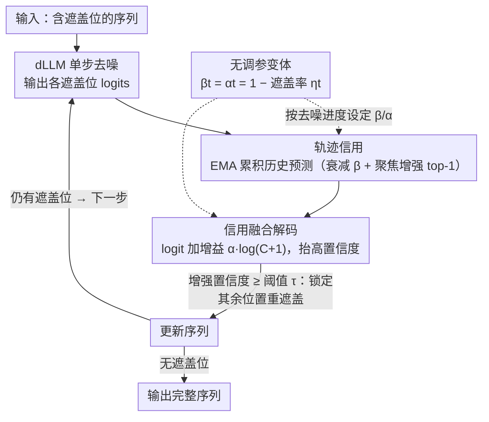

# CreditDecoding: Accelerating Parallel Decoding in Diffusion Large Language Models with Trace Credit

**会议**: ACL 2026  
**arXiv**: [2510.06133](https://arxiv.org/abs/2510.06133)  
**代码**: 无  
**领域**: 图像复原  
**关键词**: 扩散语言模型, 并行解码, 轨迹信用, 推理加速, 置信度增强

## 一句话总结

本文提出 CreditDecoding，一种无需训练的并行解码加速方法，通过累积 token 级历史证据（轨迹信用）来增强正确但置信度不足的 token，在 LLaDA-8B-Instruct 上实现最高 5.48 倍加速且准确率提升 0.48。

## 研究背景与动机

**领域现状**：扩散大语言模型（dLLMs）通过迭代去噪生成文本，支持双向注意力和并行 token 预测。现有并行解码方案在每步仅确认高置信度位置，将其他位置重新遮盖等待后续细化。

**现有痛点**：(1) 计算冗余——模型往往在实际解码前很多步就已预测出正确 token，但因置信度不够而反复重新遮盖和预测；(2) 历史无关决策——每步解码独立于前几步预测，未利用 token 的历史一致性信号，暂时的误预测可能导致稳定 token 置信度波动。

**核心矛盾**：正确的 token 因为置信度暂时不足而被反复重新遮盖，造成大量冗余计算；但直接降低解码阈值又会引入错误解码。

**本文目标**：设计一种利用历史预测一致性的机制，安全地提前解码正确 token，减少冗余迭代。

**切入角度**：分析去噪轨迹发现 token 的置信度展现出时间一致性——正确 token 的置信度在多步中持续上升，这提供了可利用的先验信息。

**核心 idea**：轨迹信用 = 跨步骤累积的历史 logits，作为先验与当前 logits 融合，使正确但低置信度的 token 提前越过解码阈值。

## 方法详解

### 整体框架
CreditDecoding 不改动 dLLM 权重，只在标准并行解码外面套一层 token 级"信用记账"。dLLM 每步去噪都会对所有被遮盖位置给出一份 logits，标准做法只确认其中置信度过阈值 $\tau$ 的位置、其余重新遮盖；CreditDecoding 则把每个位置在历史各步上的 logits 持续累积成"轨迹信用"，再把这份信用以对数增益的形式加回当前 logits，让那些一直被预测对、只是单步置信度不够的 token 提前越过阈值被锁定。整个过程随去噪迭代推进，把"早就预测对、却被反复重遮"的冗余计算压缩掉。

### 关键设计

**1. 轨迹信用（Trace Credit）：用 EMA 累积的历史预测量化一个 token 被持续预测为正确的可信度**

单步置信度噪声大、早期普遍偏低，但作者对去噪轨迹的分析发现：正确 token 的置信度在多步中呈现稳定上升的时间一致性，这条趋势本身就是可利用的先验。于是对每个位置 $i$ 和候选 token $v$，用一条 EMA 式规则维护一个非负的信用分数 $C_t^{i,v}$：

$$C_t^{i,v} = \begin{cases} \beta\, C_{t+1}^{i,v} + (p_t^{i,v})^{\gamma}, & v = \tilde{x}_t^{i} \\ \beta\, C_{t+1}^{i,v}, & \text{其他} \end{cases}$$

它由两股力量平衡：**全局衰减**——系数 $\beta\in(0,1)$ 让旧证据随步数遗忘，抑制早期的置信度抖动；**聚焦增强**——每步只给当前贪心预测出的 top-1 token $\tilde{x}_t^{i}$ 追加一份增量 $(p_t^{i,v})^{\gamma}$（$\gamma\in(0,1)$ 是上调低置信值的凹变换）。这样信用只会累积在沿轨迹持续排第一的 token 上，而非偶发的尖峰，从而用历史一致性替代单帧置信度来做提前解码的依据。

**2. 信用融合解码：把历史信用以对数增益注入当前 logits，使正确 token 更早跨过解码阈值**

每步把信用融进当前 logits 得到锐化后的分布：$\hat{l}_t^{i,v} = l_t^{i,v} + \alpha \cdot \log(C_t^{i,v}+1)$，其中 $\alpha>0$ 控制先验强度；在概率域上这等价于对 $p_t^{i,v}$ 乘一个增益，再过 softmax 得到增强后的置信度 $\hat{s}_t^{i}$。持续被预测对的 token 信用越攒越高、有效增益随之增大，于是更早越过阈值 $\tau$ 被锁定解码，把"早就预测对、却被反复重遮"的步数省掉。为何要用累积信用而非瞬时概率来推增益？附录推导给出让 token 跨过阈值所需的最小增益 $X_{\min} = \frac{\tau}{1-\tau} \cdot (\frac{1}{p_t^{i,v}} - 1)$——它对瞬时概率 $p_t^{i,v}$ 高度敏感，单帧波动就可能把错误 token 也推过阈值；改用历史累积的信用，增益更平滑稳健，在"提前解码"和"不引入错误"之间取得平衡。

**3. 无调参变体：把衰减/融合系数耦合到去噪进度，开箱即用**

融合强度 $\alpha$、衰减 $\beta$ 的最优值随数据集变化，逐任务手调成本高。无调参变体改用一条步自适应调度：令 $\gamma=1$、并把 $\beta_t = \alpha_t = 1-\eta_t$ 直接绑定到当前步的遮盖率 $\eta_t$——早期遮盖多、置信度不可靠时压低信用权重，随去噪推进遮盖率下降、预测趋稳，信用强度自动增大。这样它就能作为通用加速插件直接挂到现成 dLLM 上，免去"换个 benchmark 就要重新搜参"的成本。

### 损失函数 / 训练策略
CreditDecoding 是完全无训练的推理时方法，仅修改解码策略，不涉及任何参数更新。它与 KV 缓存、算子融合等现有优化正交，可叠加使用以获得更大加速。

## 实验关键数据

### 主实验

**LLaDA-8B-Instruct 在 8 个基准上的表现**

| 方法 | 加速比 | 准确率变化 | 说明 |
|------|--------|-----------|------|
| 标准并行解码 | 1× | 基线 | 阈值控制 |
| Fast-dLLM | ~3× | 略降 | 自适应步数 |
| **CreditDecoding** | **5.48×** | **+0.48** | 历史信用增强 |
| CreditDecoding + KV缓存 | 更高 | +0.48 | 正交叠加 |

### 消融实验

| 组件 | 效果 | 说明 |
|------|------|------|
| 无信用（纯阈值） | 基线 | 标准并行解码 |
| 仅当前步信用 | 轻微加速 | 无累积效果 |
| 完整轨迹信用 | 最大加速 | 历史累积关键 |
| 不同 dLLM 架构 | 均有效 | 方法通用性强 |

### 关键发现

- CreditDecoding 在知识、推理和代码三类基准上均实现加速且不损害准确率
- 加速效果随去噪步数增加而更显著——步数越多冗余越大
- 方法在 LLaDA、Dream 等不同 dLLM 架构上均有效
- 与 KV 缓存、算子融合等优化正交，可叠加获得更大加速
- 可扩展到长上下文场景

## 亮点与洞察

- "早期预测、晚期解码"的冗余分析揭示了 dLLM 推理的核心瓶颈
- 轨迹信用是对 token 预测时间一致性的优雅利用——简单的历史累积就能显著加速
- 无训练+正交的特性使其成为即插即用的实用工具

## 局限与展望

- 信用累积在极短序列或极少步数场景中可能无法积累足够信号
- 信用融合的线性增益假设可能不是所有场景的最优选择
- 仅在离散 token 的扩散模型上验证，对连续扩散模型的适用性未探索

## 相关工作与启发

- **vs 标准阈值解码**: 阈值解码忽略历史信息，CreditDecoding 利用时间一致性加速
- **vs Fast-dLLM**: Fast-dLLM 调整步数调度，CreditDecoding 从 token 置信度层面优化
- **vs KV 缓存**: KV 缓存优化计算开销，CreditDecoding 减少冗余步数，两者正交

## 评分

- 新颖性: ⭐⭐⭐⭐ 轨迹信用概念直观有效，对 dLLM 推理有独特洞察
- 实验充分度: ⭐⭐⭐⭐⭐ 四种模型、八个基准、多种消融、正交性验证
- 写作质量: ⭐⭐⭐⭐ 分析清晰，可视化直观
- 价值: ⭐⭐⭐⭐⭐ 为 dLLM 推理加速提供了实用且通用的解决方案

<!-- RELATED:START -->

## 相关论文

- [\[ACL 2026\] Breaking Block Boundaries: Anchor-based History-stable Decoding for Diffusion Large Language Models](breaking_block_boundaries_anchor-based_history-stable_decoding_for_diffusion_lar.md)
- [\[ICML 2026\] dLLM-Cache: Accelerating Diffusion Large Language Models with Adaptive Caching](../../ICML2026/llm_efficiency/dllm-cache_accelerating_diffusion_large_language_models_with_adaptive_caching.md)
- [\[ACL 2026\] Lizard: An Efficient Linearization Framework for Large Language Models](lizard_an_efficient_linearization_framework_for_large_language_models.md)
- [\[ACL 2026\] Are Large Language Models Economically Viable for Industry Deployment?](are_large_language_models_economically_viable_for_industry_deployment.md)
- [\[ACL 2026\] Tandem: Riding Together with Large and Small Language Models for Efficient Reasoning](tandem_riding_together_with_large_and_small_language_models_for_efficient_reason.md)

<!-- RELATED:END -->
