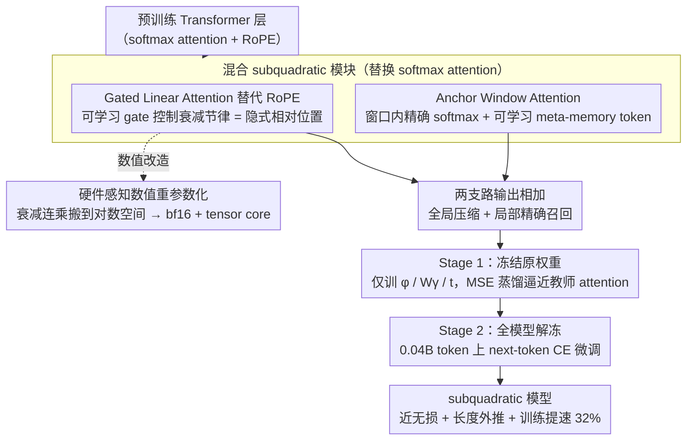

# Lizard: An Efficient Linearization Framework for Large Language Models

**会议**: ACL 2026  
**arXiv**: [2507.09025](https://arxiv.org/abs/2507.09025)  
**代码**: 待确认（Adobe Research × University of Oregon）  
**领域**: LLM 效率 / 线性注意 / 模型压缩  
**关键词**: 线性化、Gated Linear Attention、长上下文外推、teacher-student、tensor core

## 一句话总结
Lizard 用一个"Gated Linear Attention（全局压缩）+ Anchor Window Attention（局部精度）+ 可学习 gate 替代 RoPE"的混合 subquadratic 注意力替换预训练 Transformer 的 softmax attention，只用 0.04B token 蒸馏就能在 5-shot MMLU 上把现有 linearization 方法甩开 9.4–24.5 分，并配套一个 tensor-core 友好的训练算法把吞吐量提升 32%。

## 研究背景与动机
**领域现状**：解决 softmax attention 的 $O(L^2)$ 复杂度大致有两条路——(a) 从头预训练线性/状态空间模型（Mamba、RWKV、Griffin），(b) 拿现成 Transformer 做 *linearization*（把 attention 模块直接换成 subquadratic 形式），代表是 LoLCATs、Liger、SUPRA、Mamba2-LLaMA。

**现有痛点**：从头训需要数万亿 token 预算，且 in-context learning 和 retrieval 类任务系统性掉点（Transformer 比 Mamba/Mamba-2 在同设置下 5-shot MMLU 高 15 分）。linearization 路线开销小，但同样问题严重：LoLCATs 比 teacher 在 MMLU 上掉 13.8 分、Liger 掉 21.9 分；而且因为继承了 RoPE，模型长度外推能力被钉死。

**核心矛盾**：现有 linearization 方法死守"教师模型架构不能动"，结果两个根本设计缺陷无法绕开——(1) 没有自适应记忆控制（LoLCATs 直接没 gate，Liger 把 gate 钉死成无参 pooling，形成信息瓶颈）；(2) 固定 RoPE 位置编码切断了 recurrent 形式天然的外推能力。

**本文目标**：在 student 端只加少量可学习模块（feature map $\phi$、gate $W_\gamma$、meta-memory token $t$），换取近无损的教师性能 + 真正的长上下文外推 + 可被现代 tensor core 加速的训练流程。

**切入角度**：观察到 GLA 类 gated recurrent 的衰减模式本身就能编码相对位置，那 RoPE 就是可以丢掉的；又观察到全局 GLA 在精确 local attention 上不如 sliding window，于是把两者并联，各管一块。

**核心 idea**：用"GLA（全局压缩 + 可学习 gate 替代 RoPE）+ 局部 Anchor Window Attention（含 meta-memory token 修补 attention sink）"的混合，并对 GLA 做数值重参数化使其能在 bf16 + tensor core 上跑。

## 方法详解

### 整体框架
Lizard 把预训练 Transformer 每一层的标准 softmax attention 整体替换成一个混合的 subquadratic 模块，再用两阶段蒸馏把教师能力迁移过来。该模块由两条并联支路构成：全局支路是 Gated Linear Attention（GLA），以 $O(Ld^2)$ 复杂度、常量内存推理和数据相关的衰减承担长程压缩，并直接顶替 RoPE 做位置编码；局部支路是 Anchor Window Attention，在固定窗口内做精确 softmax attention 并拼入若干可学习 meta-memory token 修补 attention sink。训练先冻结其余权重、只学新增模块去逼近教师 attention 输出（Stage 1），再解冻整体用语言建模 loss 在仅 0.04B token 上端到端微调（Stage 2），让新架构与原模型的 MLP/embedding 重新协同。

### 关键设计

**1. Gated Linear Attention 替代 RoPE 做位置编码：让位置信息从硬编码的旋转角变成数据驱动的遗忘节律**

RoPE 是 linearization 模型长度外推失败的元凶，而 LoLCATs 干脆没有 gate、Liger 把 gate 钉死成无参 pooling，又各自缺记忆控制或形成信息瓶颈。Lizard 把传统线性注意力的递推改成带门控的形式 $\mathbf{h}_i = \gamma_i \odot \mathbf{h}_{i-1} + \phi(\mathbf{k}_i)\mathbf{v}_i^\top$，输出 $\mathbf{y}_i = \phi(\mathbf{q}_i)^\top \mathbf{h}_i$，其中可学习、token-dependent 的 gate $\gamma_i$ 由 $W_\gamma$ 计算，逐维控制 hidden state 的衰减节律。这个衰减模式本身就编码了相对位置——既然递推的遗忘强度能感知"多久以前"，教师里的 RoPE 模块就可以直接丢弃，从而同时拿回自适应记忆控制和真正的长度外推能力。

**2. Anchor Window Attention（局部精度 + meta-memory token）：在最近窗口里保精确召回，并用可学习锚稳住长序列**

纯 linear attention 把历史压进固定大小的状态，在 needle-in-haystack 这类精细召回任务上注定吃亏，因此局部支路在最近 $W$ 个 token 内保留精确 softmax attention：$\text{Attn}_{\text{local}}(\mathbf{q}_i) = \text{softmax}([\mathbf{q}_i^\top T;\ \mathbf{q}_i^\top \mathbf{k}_{i-W:i}]) \cdot [V_T;\ \mathbf{v}_{i-W:i}]$。式中 $T = [t_1,\dots,t_M]$ 是拼到 key/value 序列前的可学习 meta-memory token，让每个 query 始终能 attend 到这组全局锚。它实际上把 StreamingLLM 观察到的"前几个 token 总被注意"的 attention sink 现象显式建模成可学习模块，从而在长序列推理时稳住数值与注意力分布。

**3. 硬件感知数值重参数化：把衰减连乘搬到对数空间，让 GLA 能在 bf16 + tensor core 上训练**

GLA 的衰减乘积 $\prod \gamma$ 在 bf16/fp16 下会指数级下溢或上溢，现有实现为了数值稳定只能退回 fp32，白白丢掉 tensor core 加速。Lizard 把递推改写到对数空间累加 $\log \mathbf{h}_i = \log \mathbf{h}_{i-1} + \log \gamma_i + \dots$，使中间态始终落在 tensor core 支持的精度区间内，于是训练得以用 bf16 + tensor core，吞吐提升约 32%。这条改进在精度上零损失、纯赚工程红利，直接决定了把现有大模型转 subquadratic 这件事能否大规模、低成本地落地。

### 损失函数 / 训练策略
- Stage 1：MSE 蒸馏 $\mathcal{L}_1 = \sum_\ell \|\mathbf{y}_\ell^{\text{Lizard}} - \mathbf{y}_\ell^{\text{teacher}}\|_2^2$，仅训新加模块（$\phi$、$W_\gamma$、$t$）；
- Stage 2：标准 next-token cross-entropy，全模型微调；
- 总训练预算 0.04B token（对比 Mamba2-LLaMA-3-8B 的 20B 是 500× 少），相当于消费级硬件可行。

## 实验关键数据

### 主实验
LM-eval-harness 标准短上下文基准（节选自 Table 1，所有数字是 acc/acc_norm，token 数单位 B）：

| 模型 | 训练 token (B) | MMLU (5-shot) | ARC-c | Hella. | Avg |
|------|----------------|---------------|-------|--------|-----|
| LLaMA-3-8B (teacher) | 15000 | **66.6** | 53.3 | 79.1 | 73.1 |
| Mamba-7B (from scratch) | 1200 | 33.3 | 46.7 | 77.9 | 71.0 |
| Mistral-7B-LoLCATs | 0.04 | 51.4 | 54.9 | 80.7 | 74.5 |
| LLaMA-3-8B-LoLCATs | 0.04 | 52.8 | 54.9 | 79.7 | 74.2 |
| Liger-GLA-Llama-3-8B | 0.02 | 43.4 | 52.5 | 76.3 | 72.4 |
| Mamba2-LLaMA-3-8B | 20 | 43.2 | 48.0 | 70.8 | 65.6 |
| **Mistral-7B-Lizard (ours)** | 0.04 | **60.8** | 55.8 | 79.8 | 74.5 |
| **LLaMA-3-8B-Lizard (ours)** | 0.04 | **61.2** | 56.7 | 79.3 | **74.6** |

Lizard 把 5-shot MMLU 从 LoLCATs 的 52.8 拉到 61.2（+8.4），距离 teacher 66.6 只差 5.4 分；与 Liger 比 +17.8 分。混合保留 50% softmax attention 层时进一步达到 65.1，几乎 = teacher 66.6。

### 消融实验（作者论文中的关键架构对照，按 5-shot MMLU 计）

| 配置 | MMLU (5-shot) | 说明 |
|------|---------------|------|
| Full Lizard | 61.2 | 完整 GLA + Anchor Window + meta-memory + 重参数化 |
| w/o learnable gate（退化为 LoLCATs 式） | ~52.8 | 去掉自适应记忆控制，性能掉到 LoLCATs 水平 |
| w/o meta-memory tokens | 显著下降 | 长上下文 needle-in-haystack 任务退化 |
| w/o tensor-core 重参数化 | 61 附近 | 精度不变但训练吞吐降 ~32% |
| 50% softmax / 50% Lizard 混合 | 65.1 | 接近 teacher 的 66.6 |

### 关键发现
- "可学习 gate"是 Lizard vs LoLCATs/Liger 拉开 9–18 分差距的根本——记忆控制比 feature map 选择更重要。
- 数据驱动 gate 替代 RoPE 让 Lizard 在 *Unbounded* 类目下能外推到训练时未见过的长度，而 LoLCATs/Liger 等 Bounded 方法做不到。
- 0.04B token 预算就能恢复 92% 的 teacher MMLU，意味着把现有大模型转 subquadratic 的边际成本可以忽略不计。
- 硬件感知改进的 32% 吞吐提升不影响精度，纯工程红利，对开源社区复现非常友好。

## 亮点与洞察
- "GLA 的衰减本来就是位置编码"这一观察直接砍掉 RoPE，是少有的"少做事反而效果更好"的设计。可以迁移到其它需要外推的 recurrent 架构。
- meta-memory token 实际上是 StreamingLLM "attention sink" 现象的显式可学习版本，把一个经验观察工程化为模块设计，思路漂亮。
- "用 0.04B token 蒸馏出接近 teacher 的 subquadratic 模型"基本宣告了 from-scratch 训 Mamba/RWKV 在 short-context QA 上的路线性价比不高；linearization + 适当架构补丁才是更经济的方向。
- 把数值稳定性问题作为一等公民处理（占论文一节），这对 GLA 类研究是稀缺的工程贡献。

## 局限与展望
- 实验主要在 7B–8B 规模，对 70B+ teacher 是否仍能用 0.04B token 蒸出近似性能尚未验证。
- 主表是短上下文标准基准；论文 claim 的 "associative recall" 优势虽有图但缺少完整的 needle-in-haystack / long-context QA 数字对照。
- 用 50% 混合时已经几乎追平 teacher，反过来也说明 pure-Lizard 在最 hard 的 reasoning（高 MMLU 分项）上仍未完全恢复，"线性 + 局部 window" 的容量上限可能就在那。
- 自己想到：把 GLA gate 跟 MoE router 联动可能进一步提升记忆效率，是个值得跟进的方向。

## 相关工作与启发
- **vs LoLCATs**：都做 linearization，但 LoLCATs 没 gate、强行保留教师架构；Lizard 加可学习 gate，MMLU +8.4。
- **vs Liger**：Liger 有 gate 但参数化成固定 pooling，形成信息瓶颈；Lizard 用真正可学习的 $W_\gamma$，MMLU +17.8。
- **vs Mamba2-LLaMA-3-8B**：用 20B token 跨架构蒸馏，但因为继承 RoPE 不能外推、MMLU 只到 43.2；Lizard 用 1/500 的 token、MMLU 高 18 分。
- **vs SUPRA**：早期线性化方案，无学习 gate、有 attention 等价性问题；Lizard 全方位胜出。

## 评分
- 新颖性: ⭐⭐⭐⭐ 把 "GLA 衰减 ≈ 位置编码" 这一观察工程化的同时打包了 tensor-core 友好的训练算法，组合创新强。
- 实验充分度: ⭐⭐⭐⭐ 主表覆盖 8 个 baseline、两个 teacher 家族；长上下文与消融部分相对偏简，主要靠正文叙述。
- 写作质量: ⭐⭐⭐⭐ 动机和设计 trade-off 讲得很清楚，公式推导紧凑。
- 价值: ⭐⭐⭐⭐⭐ 0.04B token 蒸出近 teacher 性能 + 32% 训练加速，对实际部署 long-context LLM 极具吸引力。

<!-- RELATED:START -->

## 相关论文

- [\[ACL 2026\] Tandem: Riding Together with Large and Small Language Models for Efficient Reasoning](tandem_riding_together_with_large_and_small_language_models_for_efficient_reason.md)
- [\[ACL 2026\] Are Large Language Models Economically Viable for Industry Deployment?](are_large_language_models_economically_viable_for_industry_deployment.md)
- [\[ACL 2026\] CreditDecoding: Accelerating Parallel Decoding in Diffusion Large Language Models with Trace Credit](creditdecoding_accelerating_parallel_decoding_in_diffusion_large_language_models.md)
- [\[ACL 2026\] Breaking Block Boundaries: Anchor-based History-stable Decoding for Diffusion Large Language Models](breaking_block_boundaries_anchor-based_history-stable_decoding_for_diffusion_lar.md)
- [\[ICLR 2026\] DND: Boosting Large Language Models with Dynamic Nested Depth](../../ICLR2026/llm_efficiency/dnd_boosting_large_language_models_with_dynamic_nested_depth.md)

<!-- RELATED:END -->
