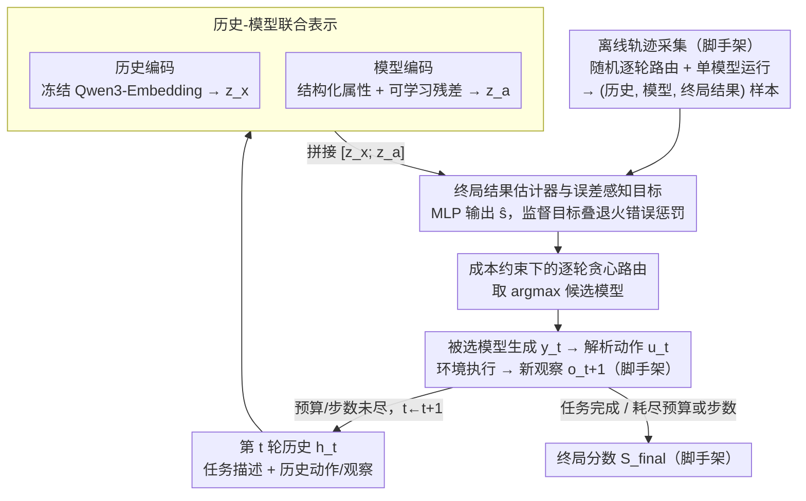

# MTRouter: Cost-Aware Multi-Turn LLM Routing with History-Model Joint Embeddings

**会议**: ACL 2026  
**arXiv**: [2604.23530](https://arxiv.org/abs/2604.23530)  
**代码**: https://github.com/ZhangYiqun018/MTRouter  
**领域**: LLM路由 / Agent / NLP  
**关键词**: 多轮LLM路由、成本感知推理、历史-模型联合嵌入、离线轨迹学习、工具使用Agent

## 一句话总结
MTRouter把多轮Agent中的“每一轮该调用哪个LLM”建模为成本约束下的逐轮路由问题，通过历史-模型联合嵌入预测候选模型对最终任务结果的贡献，在ScienceWorld和HLE上同时提升任务表现并显著降低总调用成本。

## 研究背景与动机
**领域现状**：LLM正在从单次问答走向多轮、长时程、带工具调用的Agent任务，例如科学环境交互、复杂检索推理、代码与网页操作。这类任务往往不是一次模型调用就能完成，而是需要模型持续观察环境、规划下一步、调用工具、修正错误并提交答案。

**现有痛点**：如果全程使用GPT-5、Claude Opus这类高能力模型，任务成功率较高，但多轮上下文会不断变长，推理成本会快速累计；如果全程使用便宜模型，常规工具调用可能够用，但关键规划轮或错误恢复轮容易失败。单轮路由方法通常只在episode开始时选择一个模型，之后整段轨迹都固定使用它，因此无法适应“前期规划、中期探索、后期验证”这些阶段性差异。

**核心矛盾**：多轮任务的难点不只是判断当前输入难不难，而是判断“当前历史状态下，选择某个模型是否会影响最终结果”。一次看似局部的格式错误、无效动作或错误搜索可能在后续被修复，也可能让整个episode走偏；路由器如果只对当前错误做反射式升级，就会频繁切换模型、破坏缓存、增加成本，却未必提高最终成功率。

**本文目标**：作者希望在固定每个episode成本预算和最大轮数的约束下，逐轮选择候选模型，使最终任务得分或准确率最大化。这个目标分成三件事：表示当前交互历史，表示不同模型的成本与能力特征，学习一个能从离线轨迹中预测终局收益的轻量路由器。

**切入角度**：论文的核心观察是，多轮路由的监督信号天然存在于历史轨迹中：每个episode最终都有终局分数，轨迹中也能检测出格式错误、工具错误、无效动作等中间事件。与其让一个大LLM用提示词临时判断是否换模型，不如从这些日志里学习“历史状态 + 候选模型”到最终结果的映射。

**核心 idea**：用历史-模型联合嵌入学习一个终局结果估计器，在每一轮选择预测最终收益最高的模型，而不是用固定模型或反应式规则完成整段多轮任务。

## 方法详解
MTRouter的设计可以理解为给Agent外面套一层“调度器”。Agent本身仍然按环境要求输出动作或工具调用；MTRouter不改写任务逻辑，而是在每一轮模型调用前，根据当前历史和候选模型池决定要把这一轮交给哪个LLM。

### 整体框架
一个episode由多轮交互组成。第`t`轮时，路由器看到历史`h_t`，选择模型`a_t`，被选模型根据历史生成输出`y_t`，解析器把输出转成可执行动作`u_t`，环境执行后返回新观察`o_{t+1}`。episode在任务完成、达到最大轮数或耗尽成本预算时结束，环境给出终局分数`S_final`。

训练阶段，作者先收集离线轨迹：一部分来自每轮随机选择模型的random router，另一部分来自单模型整段运行的轨迹。每个轨迹都被拆成很多“历史-模型-终局结果”训练样本。模型学习的是一个标量函数`\hat{s}_\theta(h_t, a)`，表示在当前历史下选择候选模型`a`时对最终结果的预期贡献。

推理阶段，MTRouter先把当前历史编码一次，再把它和每个候选模型的嵌入拼接，批量打分所有候选模型，选择`argmax_a \hat{s}_\theta(h_t, a)`。整个过程受每个episode的成本上限和最大步数限制，成本由输入输出token和模型价格计算。

### 关键设计

**1. 历史-模型联合表示：让路由决策同时看见“现在处于什么状态”和“候选模型是什么”**

单轮路由只看 query 或只看模型价格，但多轮 Agent 里同一段历史对不同模型的意义并不一样——便宜模型足以处理格式化或简单查询，遇到复杂规划或 Python 推理却可能崩；同一个高价模型也未必每轮都划算。MTRouter 因此把两侧都编码进决策。历史 $h_t$ 由任务描述、之前的动作和观察序列组成，实现上保留任务块，并在 8192 token 预算内保留最近上下文、优先截断更旧的内容，再经过冻结的 Qwen3-Embedding-0.6B 编码成 1024 维向量 $z_x$。

模型侧则用“结构化属性 + 可学习残差”双通道编码：属性包含上下文长度、知识截止时间、输入输出价格等显式信息，残差嵌入则捕捉元数据解释不了的模型行为（比如某模型在 search 上格外稳）。两段拼接投影后得到模型向量 $z_a$，最终用 $[z_x; z_a]$ 喂给结果估计器。这样估计器学到的不是“哪个模型整体更强”，而是“这个历史状态下该交给谁”。

**2. 终局结果估计器与误差感知目标：用退火式错误惩罚把粗糙的终局分数变成可学的逐轮信号**

复杂 Agent 环境通常没有可靠的密集奖励，只有 episode 结束时的终局分数 $S_{final}$；但若每轮都只拿这个终局分数当标签，信号太粗，区分不出“早期可恢复的小错”和“后期把整局带偏的破坏性错误”。估计器本身是一个轻量 MLP，输入联合嵌入、输出标量 $\hat{s}_\theta(h_t, a)$，而它的监督目标在终局分数上叠了一层从当前轮到结束的误差惩罚：

$$\tilde{S}_t = S_{final} - \sum_{i=t}^{T-1}\rho_i$$

其中 $\rho_i$ 由该轮是否出错、错误严重程度和进度权重共同决定，进度权重随轮数增加而变大，所以越靠后的错误扣得越狠。这样估计器既保持终局任务导向，又能给每一轮提供更细的反馈，且不会把所有局部错误都当成“必须马上换模型”的信号。

**3. 成本约束下的逐轮贪心路由：不显式罚成本，靠预算执行环境把浪费自然反映进终局表现**

目标是在固定预算内把高价模型用在真正值得的轮次、把便宜模型分给低风险或其擅长的操作。MTRouter 没有在训练目标里再加一项显式成本惩罚——因为轨迹本就是在每 episode 成本预算和最大轮数约束下跑出来的，浪费高价调用或空耗轮次会直接体现在终局得分下降和预算提前耗尽上。推理时每轮只取 $\arg\max_a \hat{s}_\theta(h_t, a)$，并在预算或步数用尽时让 episode 停止。比起“出错就升级”的反射式规则，这种方式更稳，路由器还能学到非显式分工：ScienceWorld 前期多用 GPT-5 做规划、后期多用 GPT-OSS 处理查询命令；HLE 中 DeepSeek 更适合 search、GPT-5 更适合 python、Kimi 更适合 browse。

### 损失函数 / 训练策略
训练数据来自两个来源：随机逐轮路由提供模型选择覆盖度，单模型运行提供稳定的模型行为锚点。两类数据合计包含1291个训练实例、29693条轨迹和515221个turn，一次性采集成本约1620美元。

损失函数为均方误差：对每条轨迹第`t`轮的样本`(h_t^{(k)}, a_t^{(k)})`，以误差调整后的目标`y_t^{(k)} = \tilde{S}_t^{(k)}`监督估计器，最小化`\sum_{k,t}(\hat{s}_\theta(h_t^{(k)}, a_t^{(k)}) - y_t^{(k)})^2`。优化器使用AdamW，学习率`1e-3`，weight decay为0.01，cosine annealing，训练100 epoch并用patience=3早停，batch size为64。模型残差嵌入带`L2`正则，避免路由器只记住训练轨迹中的模型ID偏好。

实验中的候选模型池包含6个模型，覆盖约20倍价格差异：GPT-5、DeepSeek-V3.2、MiniMax-M2、Kimi-K2、Gemini-2.5-Flash-Lite和GPT-OSS-120B。ScienceWorld最大50步，HLE最大30步，两者每个episode成本上限都是2美元。

## 实验关键数据

### 主实验
论文在ScienceWorld和Humanity's Last Exam两个多轮任务上评估，分别报告ID test和OOD split。ScienceWorld是文本交互式科学环境，终局分数范围为`[-100, 100]`；HLE是长上下文、多工具学科推理任务，指标为准确率。OOD划分不是随机重采样，而是保留完整任务类型或学科类别作为语义分布外测试。

| 数据集 / Split | 指标 | MTRouter | GPT-5 | Router-R1 | 相对GPT-5变化 |
|--------|------|------|----------|----------|------|
| ScienceWorld Test | Score / Cost | 53.8 / $5.7 | 48.4 / $13.9 | 42.1 / $12.6 | +5.4分，省58.7%成本 |
| ScienceWorld OOD | Score / Cost | 9.9 / $16.3 | 4.9 / $47.6 | 2.1 / $21.0 | +5.0分，省65.8%成本 |
| HLE Test | Acc / Cost | 26.0% / $35.0 | 25.1% / $61.8 | 24.2% / $51.9 | +0.9点，省43.4%成本 |
| HLE OOD | Acc / Cost | 38.6% / $31.2 | 34.8% / $65.3 | 35.1% / $60.7 | +3.8点，省52.3%成本 |

这些结果说明，MTRouter不是单纯牺牲能力换成本。它在ScienceWorld Test上甚至超过GPT-5全程调用，成本却不到一半；在HLE上，准确率和GPT-5相当或更高，同时显著降低总成本。相比多轮RL路由基线Router-R1，MTRouter在四个split上都更便宜，且表现也更好。

### 消融实验

| 配置 | ScienceWorld Score | HLE Acc. | 说明 |
|------|---------|---------|------|
| MTRouter完整模型 | 53.8 ± 3.2 | 26.0 ± 2.3 | 历史-模型联合嵌入、MLP估计器、随机路由数据、误差惩罚都启用 |
| Ridge替代MLP | 49.1 ± 3.5 | 23.4 ± 2.2 | 线性模型表达力不足，说明收益不只是来自手工特征 |
| 去掉Random-Router数据 | 47.2 ± 4.1 | 22.6 ± 2.1 | 缺少逐轮模型选择覆盖后，估计器更难学习跨模型偏好 |
| 去掉误差惩罚 | 48.5 ± 3.6 | 23.8 ± 2.1 | 只用终局分数会让每轮监督太粗，错误恢复模式学得较弱 |
| 去掉路由历史 | 44.6 ± 3.8 | 21.3 ± 2.0 | 路由器只看当前轮，无法利用长时程上下文 |
| 硬编码模型编码器 | 41.3 ± 4.4 | 19.7 ± 2.1 | 仅靠固定属性难以捕捉模型实际行为差异 |

### 预算与模型池分析

| 分析项 | 配置 | ScienceWorld | HLE | 关键结论 |
|------|------|------|------|------|
| 预算敏感性 | 0.5×B / 1.0×B / 2.0×B | 45.2 / 53.8 / 55.6 | 20.6 / 26.0 / 27.3 | 放宽预算会提升表现，但从1×到2×收益变小 |
| 模型池规模 | 2模型 / 6模型 / 8模型 | 50.6 / 53.8 / 54.1 | 25.4 / 26.0 / 25.8 | 6模型已能覆盖主要能力-成本互补，继续扩池收益有限 |
| 历史长度 | 2048 / 4096 / 8192 / 16384 tokens | 49.3 / 52.1 / 53.8 / 53.5 | 23.8 / 25.3 / 26.0 / 26.2 | 8192基本足够，继续加长上下文收益很小 |

### 关键发现
- MTRouter成功的关键不是“频繁切换模型”。在成功episode中，它比Router-R1用更少的模型切换完成任务；ScienceWorld上大约5次切换即可成功，而Router-R1约20次。
- MTRouter对瞬时错误更有耐心。出错后它在ScienceWorld上约90.2%的时间、HLE上约80.9%的时间保持当前模型，明显高于Router-R1的38.3%和66.4%，但下一轮恢复概率更高，说明它学到的是“哪些错误可恢复”，不是盲目忽略错误。
- 路由行为呈现模型专长分工。HLE中DeepSeek在search上过度代表，GPT-5在python上过度代表，Kimi在browse上过度代表；ScienceWorld中MiniMax偏向观察类动作，Gemini偏向物体交互，GPT-OSS偏向查询命令。
- 学到的模型嵌入在t-SNE中能区分模型身份并形成成本层级结构，说明模型编码器确实捕捉了能力-价格关系，而不是只记忆一个固定排序。

## 亮点与洞察
- 这篇论文把LLM routing从“选择哪个模型回答这个query”推进到“在一个长轨迹的每一轮选择哪个模型”。这个视角更贴近Agent真实部署，因为成本和错误通常是沿着整段交互累积的。
- 误差感知终局目标很实用。作者没有强行设计复杂的dense reward，而是用终局分数作为主监督，再用错误严重度和发生进度做轻量修正，既保留最终任务导向，又给每一轮提供更可学的信号。
- 模型编码不是只塞价格表，而是把结构化属性和可学习残差结合起来。这让路由器既知道“哪个模型贵、上下文多长”，也能从轨迹中学到“哪个模型在某类工具或动作上更可靠”。
- 分析部分比很多routing论文更有说服力。作者没有只报Pareto曲线，而是解释了为什么成本下降：少做低价值切换、对可恢复错误更稳定、形成模型-工具专长分工。
- 这个框架可以迁移到其他Agent系统。只要系统能记录历史、候选模型、终局结果和部分错误类型，就可以训练类似的outcome estimator，用在代码Agent、浏览器Agent或科研Agent的逐轮模型调度上。

## 局限与展望
- 离线轨迹采集成本仍然较高。论文中训练集采集一次约1620美元，且只覆盖1291个训练实例；如果模型池、任务域或工具集频繁变化，需要重新采集或增量更新，成本会成为主要瓶颈。
- 当前方法缺少在线适应。MTRouter在训练后固定使用，遇到新的工具错误、模型版本变化或任务分布快速变化时，不能像在线RL那样即时调整策略。
- 逐轮切换模型可能损失prompt caching和KV缓存收益。虽然MTRouter比Router-R1切换更少，但跨模型切换仍然需要重新处理长历史，在真实API延迟和缓存计费下可能有额外开销。
- 评估只覆盖两个多轮benchmark。ScienceWorld和HLE具有代表性，但还不能证明方法对软件工程、网页操作、多模态Agent或真实企业工作流同样稳定。
- 结果估计器是逐轮贪心选择最高预测收益，没有显式规划后续路由序列。未来可以把预算剩余、缓存状态和未来不确定性纳入更全局的决策模型。

## 相关工作与启发
- **vs FrugalGPT**: FrugalGPT通过从便宜模型到昂贵模型的级联调用降低单次问答成本，核心是置信度触发升级；MTRouter面对的是多轮Agent轨迹，重点不是一次回答是否置信，而是当前模型选择对终局结果的长程影响。
- **vs EmbedLLM / RouterDC**: EmbedLLM和RouterDC学习query与模型之间的匹配表示，但主要用于单轮或episode级路由；MTRouter显式编码累计交互历史，并允许每个turn重新选择模型。
- **vs Avengers / AvengersPro**: Avengers系列强调把多个小模型组合成更强的单轮系统，追求性能-效率Pareto；MTRouter的贡献在于长时程任务中的动态资源分配，尤其关注错误恢复和模型切换行为。
- **vs Router-R1**: Router-R1用LLM式路由器和强化学习学习多轮路由，表达力强但路由本身更重，也更容易在错误后反应式切换；MTRouter用轻量outcome estimator从离线轨迹监督中学习，表现更稳、成本更低。
- **vs ReAct / Toolformer / ToolLLM**: 这些工作主要让LLM学会如何调用工具；MTRouter不改变工具使用范式，而是在工具Agent外层决定每轮由哪个LLM执行，因此可以作为现有tool-use框架的成本控制层。

## 评分
- 新颖性: ⭐⭐⭐⭐☆ 把多轮LLM路由形式化为历史-模型联合结果估计，方向清晰且比单轮路由更贴近Agent部署，但核心训练目标仍是相对直接的监督学习。
- 实验充分度: ⭐⭐⭐⭐⭐ 主实验、OOD、消融、预算、模型池、历史长度和行为分析都比较完整，尤其是切换与专长分析支撑了机制解释。
- 写作质量: ⭐⭐⭐⭐☆ 论文结构清楚，方法和实验表格信息密集；部分公式和表格在arXiv HTML文本中略显拥挤，但不影响理解主线。
- 价值: ⭐⭐⭐⭐⭐ 对真实LLM系统很有工程价值，提供了一条比“全程大模型”或“简单便宜优先”更可控的多轮成本优化路线。

<!-- RELATED:START -->

## 相关论文

- [\[ACL 2026\] Task-Aware LLM Routing with Multi-Level Task-Profile-Guided Data Synthesis for Cold-Start Scenarios](task-aware_llm_routing_with_multi-level_task-profile-guided_data_synthesis_for_c.md)
- [\[ICLR 2026\] Did You Check the Right Pocket? Cost-Sensitive Store Routing for Memory-Augmented Agents](../../ICLR2026/llm_efficiency/did_you_check_the_right_pocket_cost-sensitive_store_routing_for_memory-augmented.md)
- [\[ACL 2026\] Breaking Block Boundaries: Anchor-based History-stable Decoding for Diffusion Large Language Models](breaking_block_boundaries_anchor-based_history-stable_decoding_for_diffusion_lar.md)
- [\[NeurIPS 2025\] Efficient Training-Free Online Routing for High-Volume Multi-LLM Serving](../../NeurIPS2025/llm_efficiency/efficient_training-free_online_routing_for_high-volume_multi-llm_serving.md)
- [\[ACL 2026\] Understanding LLM Performance Degradation in Multi-Instance Processing: The Roles of Instance Count and Context Length](understanding_llm_performance_degradation_in_multi-instance_processing_the_roles.md)

<!-- RELATED:END -->
