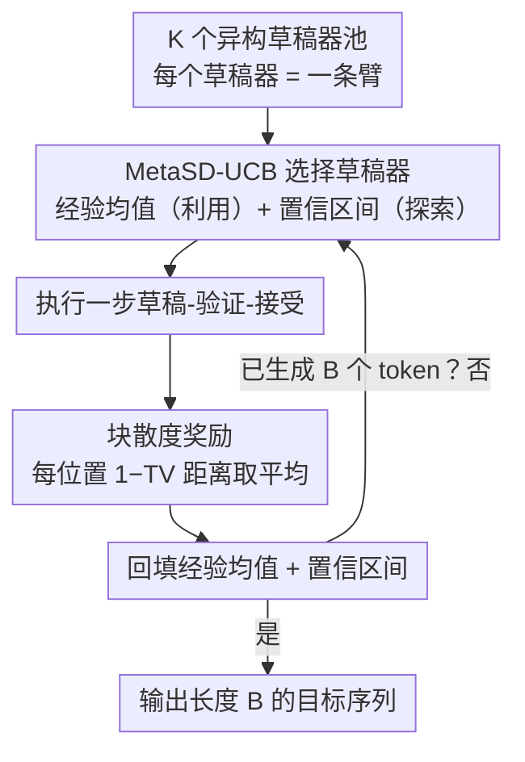

# Multi-Drafter Speculative Decoding with Alignment Feedback

**会议**: ACL 2026 Findings  
**arXiv**: [2604.05417](https://arxiv.org/abs/2604.05417)  
**代码**: 有  
**领域**: LLM效率  
**关键词**: 推测解码, 多臂赌博机, 多草稿器, 对齐反馈, 推理加速

## 一句话总结

本文提出 MetaSD，一个将多个异构草稿器整合到推测解码中的统一框架，将草稿器选择建模为多臂赌博机问题，通过块散度（Block Divergence）奖励信号动态选择与目标 LLM 最对齐的草稿器，在黑盒和白盒配置下一致优于单草稿器方法。

## 研究背景与动机

**领域现状**：推测解码（Speculative Decoding）通过小模型（草稿器）预测未来 token、大模型并行验证来加速 LLM 推理。现有方法通过架构改进（EAGLE、Medusa）、知识蒸馏和树搜索验证等提高了接受率。

**现有痛点**：现有方法几乎全部依赖单一草稿器，但单个草稿器通常针对特定任务/领域训练，在分布外输入或动态用户查询上表现不佳。随着"专家模型集成"趋势的兴起（类似 LLM routing），单草稿器的局限变得更加突出。

**核心矛盾**：不同任务需要不同的草稿器，但在推理时无法提前知道哪个草稿器最适合当前输入。手动切换草稿器不可行，需要一个能自动适应的动态选择机制。

**本文目标**：设计一个多草稿器框架，能在推理过程中动态选择最优草稿器。

**切入角度**：推测解码天然提供了"对齐反馈"——草稿器预测与目标模型预测之间的匹配程度可以作为实时反馈信号。这与多臂赌博机问题完美对应：每个草稿器是一个臂，对齐反馈是奖励信号。

**核心 idea**：将多草稿器推测解码建模为多臂赌博机问题，提出块散度（Block Divergence）作为奖励信号（比传统的块效率更信息丰富、方差更低），用 UCB 算法动态平衡探索和利用来选择草稿器。

## 方法详解

### 整体框架

MetaSD 维护一个含 $K$ 个异构草稿器的池子，要解决的问题是：推理时无法预知哪个草稿器最适合当前输入，却又必须实时挑出与目标模型最对齐的那一个。它把这个选择问题套进多臂赌博机框架——每个草稿器是一条臂，推测解码本身产生的"对齐反馈"是奖励信号，整套机制以停止时间遗憾（stopping-time regret）为优化目标。每一轮里，UCB 算法先根据历史经验选出一个草稿器执行一步草稿-验证-接受，再用接受结果算出块散度奖励、回填该草稿器的经验均值与置信区间；如此循环，直到生成长度为 $B$ 的目标序列。这样选择策略会随着观测的累积自动收敛到最优草稿器。

> 优化目标：停止时间遗憾——在固定生成 $B$ 个 token 的前提下，最小化总轮次数与"预知最优草稿器"策略之差，驱动上述循环尽快收敛到最优臂。

### 关键设计

**1. 块散度奖励：把二值的接受信号换成连续的对齐度量**

赌博机要快速识别最优臂，奖励信号越干净越好，而传统的"块效率"（一个草稿块里被接受的 token 数）是个离散计数，把丰富的分布匹配信息压成了少数几个整数，方差大、区分度低。MetaSD 改用块散度（Block Divergence）：在草稿块的每个位置上计算目标模型与草稿器概率分布的 TV 距离，再取平均，$r_{i,t}^{BD} = \frac{1}{N_{max}} \sum_{j=0}^{N_{max}-1} \big(1 - d_{TV}(p^{l(t)+j}, q_i^{l(t)+j})\big)$。这样每个位置都贡献一份连续的对齐信息，避免了"接受/拒绝"二值化带来的信息损失。

为什么这更好，论文用反馈信号强度给出了量化解释：定义 $R(r_i) = \frac{\Delta_i^2}{\max(\text{Var}[r_i], \text{Var}[r_{i^*}])}$（臂间均值差的平方除以方差），证明在大多数情形下 BD 的反馈信号都强于块效率。信号越强，赌博机就能用更少的探索更准地认出最优草稿器；实测也印证了 BD 的均值差更大、方差更低。

**2. 停止时间遗憾：为推测解码量身定做的优化目标**

标准赌博机的遗憾是"最大化累积奖励"，但它并不直接对应推测解码的效率——这里真正在意的是生成固定 $B$ 个 token 要跑多少轮，而轮次数本身是随机的、由草稿器质量决定。于是 MetaSD 把目标改写成停止时间遗憾 $\text{Reg}(\pi, B) = \mathbb{E}[\tau(\pi, B)] - \mathbb{E}[\tau(\pi^*, B)]$，即自己的总轮次数与最优策略之差。

这个目标看似换了一套语言，论文却用引理证明它等价于"最大化每轮接受的 token 数"，与推测解码加速的初衷完全一致，从而把推测解码的实际诉求干净地翻译成了一个可分析的赌博机问题。

**3. MetaSD-UCB：在探索与利用间动态权衡地挑草稿器**

有了奖励和目标，剩下的就是选择规则。MetaSD 用 UCB：每轮选 $a_t = \arg\max_{i \in [K]} \hat{\mu}_{i,t} + \beta \sqrt{\frac{2 \ln t}{n_i}}$，第一项是经验均值奖励、第二项是置信区间宽度——前者偏向当前看起来最好的草稿器（利用），后者奖励被尝试次数少的草稿器（探索）。初始化阶段每个草稿器各试一次，之后全程按这条规则走。

UCB 在标准随机赌博机里本就是近最优的，MetaSD 的贡献在于把它搬进推测解码这个非标准设定后仍给出了严格的理论保证：在停止时间遗憾目标下达到 $O(\ln B)$ 的遗憾上界，意味着随着序列变长，探索非最优草稿器的代价只以对数速度增长。

### 损失函数 / 训练策略

完全免训练，MetaSD 是纯推理时算法。池中的草稿器可以是任意预训练模型，框架同时支持黑盒（独立草稿器）和白盒（复用目标 LLM 潜在表示的 EAGLE 草稿器）两种配置。

## 实验关键数据

### 黑盒推测解码加速比

| 任务 | 最优单草稿器 | MetaSD-UCB |
|------|-------------|------------|
| Code | 2.437 | 2.300 |
| Translation | 2.076 | 1.587 |
| Summary | 2.133 | 1.971 |
| QA | 1.960 | 1.711 |
| Math | 2.454 | 2.280 |

### 白盒推测解码加速比（EAGLE 草稿器）

| 任务 | 最优单草稿器 | MetaSD-UCB |
|------|-------------|------------|
| Code | 3.934 | 3.724 |
| Translation | 2.496 | 2.318 |
| Summary | 3.382 | 3.057 |
| QA | 2.916 | 2.641 |
| Math | 3.903 | 3.520 |

### 关键发现
- MetaSD-UCB 在不知道任务类型的情况下，自动选择接近最优专家草稿器的性能水平
- 相比随机选择（Rand）和静态集成，MetaSD-UCB 大幅提升，说明动态选择有效
- BD 奖励的均值差异更大、方差更低，使 UCB 能更快收敛到最优草稿器
- 框架天然处理查询间的非平稳性（每个查询重新初始化），也可扩展到查询内非平稳性
- 无需任何额外训练，即插即用

## 亮点与洞察
- **推测解码 + 多臂赌博机的结合**非常自然：对齐反馈天然提供奖励信号，无需额外设计。这种建模方式将在线决策理论引入 LLM 推理加速
- **块散度 vs 块效率的理论分析**很深入：从反馈信号强度的角度证明 BD 优于 BE，这个分析框架可推广到其他需要设计奖励的场景
- **停止时间遗憾**作为新的优化目标很有意义：揭示了标准 MAB 遗憾在推测解码中不直接适用，需要专门设计

## 局限与展望
- MetaSD 的加速比总是略低于"预知最优草稿器"的理想上界，因为需要花费部分轮次探索非最优草稿器
- 草稿器切换有 KV-cache 重新计算的开销，虽然可以用 Sequential Halving 缓解
- 需要能计算草稿器输出分布（而非只返回采样 token），对纯黑盒 API 不适用
- 实验中草稿器数量为 5 个，更大规模的草稿器池可能需要更高效的探索策略

## 相关工作与启发
- **vs 标准推测解码**: 标准方法用单一草稿器，MetaSD 扩展到多草稿器池并动态选择
- **vs LLM Routing**: LLM routing 在模型间路由查询，MetaSD 在草稿器间路由推测解码步骤，粒度更细
- **vs Hou et al. (2025) 并发工作**: 都用 MAB 做推测解码，但 MetaSD 引入了 BD 奖励和更强的实例依赖遗憾上界

## 评分
- 新颖性: ⭐⭐⭐⭐ 多草稿器推测解码的 MAB 建模自然且优雅，BD 奖励设计有理论深度
- 实验充分度: ⭐⭐⭐⭐ 覆盖黑盒/白盒、多任务、多语言、非平稳环境
- 写作质量: ⭐⭐⭐⭐⭐ 理论分析严谨，实验和理论相互验证
- 价值: ⭐⭐⭐⭐ 为多草稿器推测解码提供了理论最优的选择算法

<!-- RELATED:START -->

## 相关论文

- [\[ACL 2026\] Speculative Verification: Exploiting Information Gain to Refine Speculative Decoding](speculative_verification_exploiting_information_gain_to_refine_speculative_decod.md)
- [\[ACL 2026\] RACER: Retrieval-Augmented Contextual Rapid Speculative Decoding](racer_retrieval-augmented_contextual_rapid_speculative_decoding.md)
- [\[ACL 2026\] TokenTiming: A Dynamic Alignment Method for Universal Speculative Decoding Model Pairs](tokentiming_a_dynamic_alignment_method_for_universal_speculative_decoding_model_.md)
- [\[NeurIPS 2025\] OmniDraft: A Cross-Vocabulary Online Adaptive Drafter for On-Device Speculative Decoding](../../NeurIPS2025/llm_efficiency/omnidraft_a_cross-vocabulary_online_adaptive_drafter_for_on-device_speculative_d.md)
- [\[CVPR 2026\] ParallelVLM: Lossless Video-LLM Acceleration with Visual Alignment Aware Parallel Speculative Decoding](../../CVPR2026/llm_efficiency/parallelvlm_lossless_video-llm_acceleration_with_visual_alignment_aware_parallel.md)

<!-- RELATED:END -->
