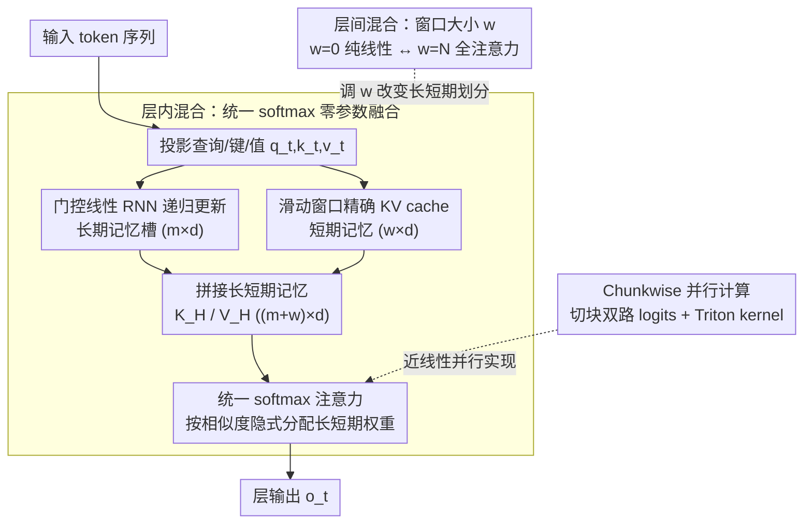

# Native Hybrid Attention for Efficient Sequence Modeling

**会议**: ACL 2026  
**arXiv**: [2510.07019](https://arxiv.org/abs/2510.07019)  
**代码**: [GitHub](https://github.com/JusenD/NHA)  
**领域**: LLM效率 / 注意力机制  
**关键词**: 混合注意力, 线性注意力, 滑动窗口, 长短期记忆融合, 高效序列建模

## 一句话总结

本文提出 Native Hybrid Attention (NHA)，将线性 RNN 的长期记忆槽与滑动窗口的短期精确 token 拼接后通过单次 softmax 注意力统一处理，实现层内和层间混合的原生统一——无需额外融合参数即可动态分配长短期注意力权重，在 recall 密集和常识推理任务上超越 Transformer 和其他混合基线。

## 研究背景与动机

**领域现状**：Transformer 的自注意力机制 $O(n^2)$ 复杂度限制了长序列处理。研究社区沿两条路径发展：(1) 稀疏注意力（如滑动窗口 SWA）在局部窗口内计算 softmax；(2) 线性序列模型（如 Mamba、GLA、GSA）将全序列压缩为固定大小状态实现 $O(n)$ 效率。

**现有痛点**：(1) SWA 无法捕获窗口外的 token，线性模型的极端压缩常丢失精确 token 信息——两者优缺互补；(2) 现有层内混合方案（如 MesaNet、Titans）分别计算线性注意力和局部 softmax，然后通过加权求和融合——需要额外融合参数且权重固定；(3) 现有层间混合方案（如 Jamba）堆叠不同类型的层——需要管理异构模块和对齐，且层类型选择需要昂贵的搜索。

**核心矛盾**：纯线性模型无法在固定大小记忆中完美保留无限信息（理论不可能），但像 Transformer 那样在每层每 token 维护完整 KV cache 又过于昂贵且非必需——需要在信息保留和计算效率间找到更优的平衡点。

**本文目标**：设计一种原生统一的混合注意力机制，同时实现：(1) 层内融合——无需额外参数地动态分配长短期注意力；(2) 层间混合——仅通过调整窗口大小超参数实现灵活配置。

**切入角度**：将线性 RNN 的记忆槽表示为 $m \times d$ 的 KV 格式（与 SWA 的 KV cache 格式一致），使两者可以直接拼接后由统一的 softmax 处理——softmax 本身就能学习动态分配注意力权重。

**核心 idea**：长期记忆（RNN 压缩）和短期记忆（滑动窗口精确 token）在 KV 维度上天然兼容——将它们拼接后用一次 softmax 统一处理，实现了零额外参数的上下文相关融合。

## 方法详解

### 整体框架

NHA 的核心洞察是：线性 RNN 的压缩记忆和滑动窗口的精确 KV cache，本质上都能写成 $m \times d$ 的 KV 格式，于是它们可以直接拼在一起、交给同一次 softmax 去处理，而不必像以往那样分别算完再加权融合。具体到每一层，NHA 同时维护两种记忆：长期记忆 $K^{long}_t, V^{long}_t \in \mathbb{R}^{m \times d}$ 由门控 RNN 递归更新、把窗口外的全部历史压进固定大小的槽位；短期记忆 $K^{short}_t, V^{short}_t \in \mathbb{R}^{w \times d}$ 则是窗口内 token 的精确 KV cache。两者拼成 $K^H_t \in \mathbb{R}^{(m+w) \times d}$ 后过一次 softmax 注意力得到输出。更妙的是，只要调节窗口大小 $w$ 就能让同一套架构在"纯线性 RNN（$w=0$）—混合—全注意力（$w=N$）"之间连续滑动，层内融合与层间混合就此统一在一个机制里。

### 关键设计

**1. 层内混合——用统一 softmax 实现零参数的长短期融合**

线性模型把全序列压成固定状态会丢失精确 token，滑动窗口又看不到窗口外的内容，二者优缺互补，但以往的层内混合（如 MesaNet、Titans）是分别算出线性注意力和局部 softmax 再加权求和——既要额外的融合参数，权重还往往是固定的。NHA 的做法是先用门控线性 RNN 递归更新长期记忆 $K^{long}_t = \text{Diag}(\alpha_t) K^{long}_{t-1} + (1-\alpha_t) \otimes k_t$，再把它和短期窗口 KV cache 拼起来送进同一次 softmax：$o_t = \text{softmax}(\frac{q_t (K^H_t)^T}{\sqrt{d}}) V^H_t$。

关键在于，softmax 的归一化天然就在"分配注意力"——长期记忆实际获得的注意力比例 $\omega_L = \frac{\sum_{i \in long} \exp(q_t k_i^\intercal)}{\sum_{i \in long} \exp(q_t k_i^\intercal) + \sum_{j \in short} \exp(q_t k_j^\intercal)}$ 完全由查询与所有 key 的相似度决定，于是融合变成了逐 token、逐 head 的上下文相关加权，无需任何额外参数，且梯度自然把长短期记忆的学习耦合在一起。实现上靠 token shift 保证只有滑出窗口的 token 才去更新长期记忆，窗口内用 RoPE 编码位置、长期记忆则不加位置编码。

**2. 层间混合——只靠窗口大小一个超参数切换层的行为**

以往的层间混合（如 Jamba）是把不同类型的层堆在一起，既要管理异构模块间的对齐，又得花大代价搜索每层用什么类型。NHA 让所有层共享完全相同的架构，行为差异全部由各层的滑动窗口 $w$ 决定：$w=0$ 是纯线性 RNN 层，$w=N$ 是全注意力层，中间则是混合层。

这种"二元性"带来一个实用红利——因为切换不需要改架构、不需要重训练，同一个模型在推理时就能通过调窗口大小零成本地搜索精度-速度配置，把昂贵的层类型搜索变成了几乎免费的推理时旋钮。

**3. Chunkwise 并行计算——在近线性复杂度下榨干 GPU 并行度**

统一 softmax 虽然优雅，但若逐 token 递归就吃不到 GPU 的并行红利。NHA 把序列切成大小为 $C$ 的块，块内并行算两路 logits：线性通道通过累积/反向门控乘积 $\mathcal{A}$ 得到，滑动窗口通道则是偏移窗口的标准注意力；两路拼接后统一过 softmax，最后再分别从线性记忆分支和滑动窗口分支聚合值向量。整套流程用 Triton kernel 实现。

这样既保住了近线性的计算复杂度，又把块内运算交给 GPU 并行，长序列上 NHA 的速度与 GSA 持平，远好于 FlashAttention 的二次增长。

### 损失函数 / 训练策略

标准语言建模交叉熵损失。340M 模型在 15B token 上训练，1.3B 模型在 100B token 上训练；把预训练 LLM 混合化时，用 SlimPajama 10B token 微调即可。

## 实验关键数据

### 主实验

**1.3B 模型性能对比（100B tokens）**

| 模型 | 常识推理 Avg↑ | 召回密集 Avg↑ | Wiki ppl↓ |
|------|-------------|-------------|----------|
| Trans++ | 50.71 | 37.31 | 17.61 |
| GSA | 51.79 | 32.05 | 16.69 |
| GSA-H（+Transformer层） | 50.76 | 44.99 | 16.22 |
| GDN-H | 52.54 | 44.88 | 16.02 |
| **NHA** | **52.89** | **46.43** | 16.16 |

### 预训练 LLM 混合化

| 模型 | 全注意力层数 | 常识推理 Avg↑ | 召回密集 Avg↑ |
|------|-----------|-------------|-------------|
| Llama-3-8B | 32 | 71.30 | 60.08 |
| NHA-Llama-3-8B | 4 | 70.31 | 57.64 |
| Zamba2-7B | 9 | 71.50 | 54.56 |
| StripedHyena-7B | 16 | 68.10 | 57.59 |

### 关键发现

- NHA 在 1.3B 规模上常识推理和召回密集任务均达到最优，超越所有纯线性和混合基线
- 预训练 LLM 混合化：NHA-Llama-3-8B 仅用 4 层全注意力 + 10B token 微调，召回密集任务 57.64 超越 16 层全注意力的 StripedHyena（57.59）
- RULER 长上下文评估中 NHA 展现最强外推能力——2K 训练长度外推到 8K 时 Hotpot 任务 24.8 远超其他混合模型
- 推理时架构搜索：通过在 Layer 11 插入全局窗口，4 层全注意力的 NHA 可以匹配 12 层基线的性能——优化层的位置比数量更重要
- NHA 收缩为纯 Transformer 时性能竟然超过从头训练的 Transformer——说明混合训练具有正则化效果

## 亮点与洞察

- 统一 softmax 融合是核心创新——将融合从显式参数学习降级为 softmax 的隐式分配，既简化了设计又增强了上下文适应性。梯度分析证明统一 softmax 自然耦合长短期记忆的梯度流
- NHA 的"架构二元性"非常实用——同一模型可以在推理时零成本切换不同效率-精度配置，适合异构部署场景
- "优化全注意力层的位置比数量更重要"这一发现对混合架构设计有直接指导意义

## 局限与展望

- 预训练 LLM 混合化时受限于 10B token 微调预算和 2K 训练上下文，MMLU 等知识密集基准有一定掉点
- 长期记忆槽数 $m$ 的选择对性能有影响，当前固定为 32/64，未探索自适应槽数
- Triton kernel 实现目前仅支持训练，推理时的 RNN 模式 kernel 还需进一步优化
- 未在 128K+ 超长上下文场景下验证效果

## 相关工作与启发

- **vs Titans/MesaNet**: 这些层内混合方案分别计算两种注意力再加权融合，NHA 用统一 softmax 实现零参数融合——更简洁且上下文自适应
- **vs Jamba/StripedHyena**: 这些层间混合方案堆叠异构层，NHA 用统一架构 + 窗口大小调节实现——支持推理时零成本搜索
- **vs Atlas**: Atlas 的窗口范围等价于 NHA 的滑动窗口，但 Atlas 的 KV 联合更新无法引入 softmax 操作

## 评分

- 新颖性: ⭐⭐⭐⭐⭐ 统一 softmax 融合 + 架构二元性是优雅的设计
- 实验充分度: ⭐⭐⭐⭐⭐ 从头预训练 + LLM混合化 + RULER长上下文 + 推理时搜索 + 消融
- 写作质量: ⭐⭐⭐⭐⭐ 渐进式三层架构设计讲解清晰，数学形式化严谨
- 价值: ⭐⭐⭐⭐⭐ 为高效 LLM 架构提供了统一且实用的混合方案

<!-- RELATED:START -->

## 相关论文

- [\[ICLR 2026\] RACE Attention: A Strictly Linear-Time Attention for Long-Sequence Training](../../ICLR2026/llm_efficiency/race_attention_a_strictly_linear-time_attention_for_long-sequence_training.md)
- [\[ACL 2026\] CoMeT: Collaborative Memory Transformer for Efficient Long Context Modeling](comet_collaborative_memory_transformer_for_efficient_long_context_modeling.md)
- [\[CVPR 2025\] LOCORE: Image Re-ranking with Long-Context Sequence Modeling](../../CVPR2025/llm_efficiency/locore_image_re-ranking_with_long-context_sequence_modeling.md)
- [\[ACL 2025\] Native Sparse Attention: Hardware-Aligned and Natively Trainable Sparse Attention](../../ACL2025/llm_efficiency/native_sparse_attention.md)
- [\[ICML 2025\] Efficient Length-Generalizable Attention via Causal Retrieval for Long-Context Language Modeling](../../ICML2025/llm_efficiency/efficient_length-generalizable_attention_via_causal_retrieval_for_long-context_l.md)

<!-- RELATED:END -->
