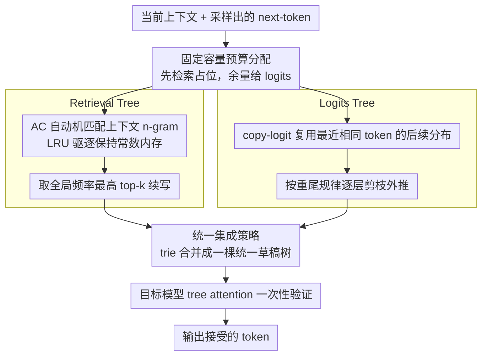

# RACER: Retrieval-Augmented Contextual Rapid Speculative Decoding

**会议**: ACL 2026  
**arXiv**: [2604.14885](https://arxiv.org/abs/2604.14885)  
**代码**: [https://github.com/hkr04/RACER](https://github.com/hkr04/RACER)  
**领域**: 信息检索  
**关键词**: 推测解码, 检索增强, 训练无关, AC自动机, 推理加速

## 一句话总结

RACER 提出了一种无需训练的推测解码方法，将基于检索的精确模式匹配与基于 logits 的未来预测统一起来，通过 copy-logit 策略构建 Logits Tree、LRU 驱逐的 AC 自动机构建 Retrieval Tree，在多个基准上实现了超过 2 倍的推理加速。

## 研究背景与动机

**领域现状**：LLM 的自回归解码每步只生成一个 token，推理延迟随序列长度线性增长。推测解码（Speculative Decoding）通过"猜测-验证"策略在不牺牲输出质量的前提下并行验证多个 token，是最有前景的加速方案之一。

**现有痛点**：现有免训练方法存在两类问题：(1) 基于检索的方法（如 PLD、REST）依赖精确 token 匹配，当上下文中不存在匹配续写时完全失效；(2) 基于 logits 的方法（如 Token Recycling）缺乏结构化引导，预测范围窄且质量次优。两类方法各有优势但相互割裂。

**核心矛盾**：检索提供"已见信息"（精确但稀疏），logits 提供"未见信息"（灵活但缺乏锚点）。两者互补但现有方法未能有效融合。

**本文目标**：设计一个轻量级、即插即用的无训练推测解码方法，统一检索和 logits 两种信号源。

**切入角度**：作者发现 copy-logit 策略（复用上下文中相同 token 最近出现位置的 logits）比 last-logit 策略有更高的接受率且分布更尖锐（rank-1 占比超 50%），这为构建高效的 logits 草稿树提供了基础。

**核心 idea**：用 AC 自动机维护上下文中的 n-gram 模式作为结构化检索锚点，用 copy-logit 构建逐层剪枝的 logits 草稿树进行灵活外推，两者在固定容量下动态分配预算并通过 trie 合并成统一草稿树。

## 方法详解

### 整体框架

RACER 想把两类互补但割裂的免训练信号缝到一棵草稿树里：检索提供"已见信息"（精确但稀疏），logits 提供"未见信息"（灵活但缺锚点）。每个解码步里，它先用 AC 自动机在当前上下文中找出匹配的 n-gram 模式，从频率最高的续写取出检索候选；再把剩下的草稿预算交给 Logits Tree，用 copy-logit 做基于广度优先的外推展开；最后把这两棵树通过 trie 合并成一棵统一草稿树，交给目标模型用 tree attention 一次性验证。检索负责把住"近距离重复模式"这个锚，logits 负责在锚的引导下灵活外推，两者在固定容量下动态分配预算。

### 关键设计

**1. Logits Tree：用 copy-logit 复用上下文内的分布，再按重尾规律逐层剪枝**

逐 token 解码慢，是因为每步只产一个 token，而基于 logits 的免训练方法（如 Token Recycling）虽然能多猜几个，却缺结构引导、预测范围窄。RACER 的关键观察是 copy-logit 策略：对当前采样出的 next-token $x_t$，回头找上下文里最近一次出现 $x_i = x_t$ 的位置 $i$，直接复用它后面的 logits $\mathbf{z}_{i+1}$ 来近似 $\mathbf{z}_{t+1}$。这背后的假设是"相同 token 在相似上下文里有相似的语义延续"，比单纯复用上一步 logits 准得多——实测 copy-logit 的 MAT 达 1.87（last-logit 仅 1.57），且 rank-1 接受率超过 50%、分布更尖锐。

正因为接受率随深度快速衰减，RACER 给草稿树设计了递减的广度分配 $b_{child(i,j)} = \max(1, \lfloor b_i / 2^{j+[i\neq 0]} \rfloor)$：首层铺得最宽、深层逐步收窄，把有限的草稿预算花在最可能被接受的浅层节点上。

**2. Retrieval Tree：用带 LRU 驱逐的 AC 自动机做固定内存的在线模式检索**

检索候选需要从不断增长的生成上下文里高效抽取重复 n-gram，但 suffix array、suffix automaton 都随上下文长度线性膨胀、且无法淘汰过时状态。RACER 改用 Aho-Corasick 自动机维护上下文中出现过的 n-gram（最大长度 10），并设最大节点容量（10,000）、配 LRU 驱逐淘汰最久未用的叶节点，从而把内存钉在常数级。匹配时取所有深度 $\geq 2$ 的边界节点，从其子树里挑全局频率最高的 top-k 续写作为检索候选；失败链则在 prefill 阶段末尾惰性重建。

选 AC 自动机还有个额外好处：它的失败链天然能把"部分匹配"也利用起来，丰富草稿的多样性，而这正是 suffix 结构难以低成本提供的。

**3. 统一集成策略：固定容量下先检索后 logits，用 trie 合并成一棵树**

两类信号要在同一个草稿预算里共存，就得有分配规则。RACER 的策略是优先分配给检索候选（结构可靠但稀疏），把剩余容量留给 Logits Tree 做广度优先展开，最后两者经 trie-based union 合并为统一草稿树，由目标模型在 tree attention 下一次性验证。

这种"检索作锚、logits 外推"的次序不是随意的：近距离重复模式提供的尖锐预测，能给 logits 分布指明方向，减少推测展开中逐层累积的误差，因此让检索先占位、再用 logits 填补，比两者平行竞争更稳。

### 损失函数 / 训练策略

RACER 完全无需训练。默认超参数：Logits Tree 最大广度 8，Retrieval Tree 最大 10,000 节点、n-gram 长度 10，每步草稿容量 64；采用贪心解码，batch size 为 1。

## 实验关键数据

### 主实验

| 模型 | 方法 | Spec-Bench 加速 | HumanEval 加速 | MGSM-ZH 加速 | 平均加速 |
|------|------|----------------|---------------|--------------|---------|
| Vicuna-7B | PLD | 1.50× | 1.40× | 2.27× | 1.87× |
| Vicuna-7B | LogitSpec | 1.77× | 1.66× | 2.67× | 2.03× |
| Vicuna-7B | Token Recycling | 2.06× | 2.17× | 2.30× | 2.18× |
| Vicuna-7B | **RACER** | **2.21×** | **2.29×** | **2.77×** | **2.42×** |
| Vicuna-33B | **RACER** | **2.20×** | **2.58×** | **2.77×** | **2.52×** |
| Qwen3-8B | EAGLE-3 | 2.14× | 2.44× | 0.86× | 1.81× |
| Qwen3-8B | **RACER** | **2.13×** | 2.24× | **2.26×** | **2.21×** |

### 消融实验

| 配置 | Spec-Bench MAT | HumanEval MAT | 说明 |
|------|---------------|---------------|------|
| RACER (完整) | 3.00 | 3.11 | 检索+logits 完整集成 |
| 仅 Logits Tree | ~2.76 | ~2.83 | 无检索引导，接近 Token Recycling |
| 仅 Retrieval Tree | ~1.82 | ~2.06 | 无 logits 外推，接近 REST |

### 关键发现

- RACER 在所有免训练方法中一致最优，平均加速比达 2.42×-2.52×
- 对比 EAGLE-3（需额外草稿模型），RACER 在 MAT 上略低但在实际加速比上持平甚至更优，因为无额外模型开销
- EAGLE-3 在中文推理（MGSM-ZH）上失效（加速 <1×），暴露了模型级方法对训练数据分布的敏感性，RACER 则稳定加速
- copy-logit 比 last-logit 的 MAT 高 0.3（1.87 vs 1.57），rank-1 接受率超 50%
- 方法对超参数不敏感，具有良好的鲁棒性

## 亮点与洞察

- copy-logit 策略是一个精巧的观察——相同 token 在不同位置的后续 logits 分布具有高度相似性。这个"上下文内 logits 复用"的思路简单但有效，适用于任何自回归模型
- 用 AC 自动机替代 suffix array 的选择很巧妙：失败链本身就提供了模式泛化能力，LRU 驱逐保证了固定内存开销。这个数据结构选择值得在其他需要在线模式匹配的场景借鉴
- "检索作为结构引导而非独立生成器"的定位——检索信号不是直接生成候选，而是为 logits 预测提供锚点和方向，这种融合哲学比简单组合更优雅

## 局限与展望

- 仅在 batch size=1 和贪心解码下评估，大 batch 和采样解码场景待验证
- AC 自动机的节点容量（10K）和 n-gram 长度（10）是固定的，自适应调节可能进一步提升性能
- 未探索与 model-based 方法的组合潜力
- 在非英文语言上的优势是否源于基于检索的语言无关性，值得深入分析

## 相关工作与启发

- **vs Token Recycling**: TR 仅用 top-k 邻接矩阵展开草稿树但无检索引导。RACER 通过 AC 自动机提供的结构锚点使 logits 展开更精准，平均多接受 0.4 个 token
- **vs EAGLE-3**: EAGLE-3 需要额外训练草稿模型，MAT 更高但实际加速比不一定更优。RACER 的零训练零额外内存优势使其更适合即插即用部署

## 评分

- 新颖性: ⭐⭐⭐⭐ 检索+logits 的统一视角新颖，copy-logit 和 LRU-AC 自动机设计精巧
- 实验充分度: ⭐⭐⭐⭐⭐ 覆盖多种模型规模（7B-33B）、多类任务、多语言，消融和分析充分
- 写作质量: ⭐⭐⭐⭐ 方法描述清晰，图示直观
- 价值: ⭐⭐⭐⭐ 提供了实用的免训练推理加速方案，即插即用部署价值高

<!-- RELATED:START -->

## 相关论文

- [\[ACL 2026\] Speculative Verification: Exploiting Information Gain to Refine Speculative Decoding](speculative_verification_exploiting_information_gain_to_refine_speculative_decod.md)
- [\[ACL 2026\] Multi-Drafter Speculative Decoding with Alignment Feedback](multi-drafter_speculative_decoding_with_alignment_feedback.md)
- [\[ACL 2026\] TokenTiming: A Dynamic Alignment Method for Universal Speculative Decoding Model Pairs](tokentiming_a_dynamic_alignment_method_for_universal_speculative_decoding_model_.md)
- [\[ACL 2025\] SAM Decoding: Speculative Decoding via Suffix Automaton](../../ACL2025/llm_efficiency/sam_decoding_speculative_decoding_via_suffix_automaton.md)
- [\[NeurIPS 2025\] 3-Model Speculative Decoding (PyramidSD)](../../NeurIPS2025/llm_efficiency/3model_speculative_decoding.md)

<!-- RELATED:END -->
