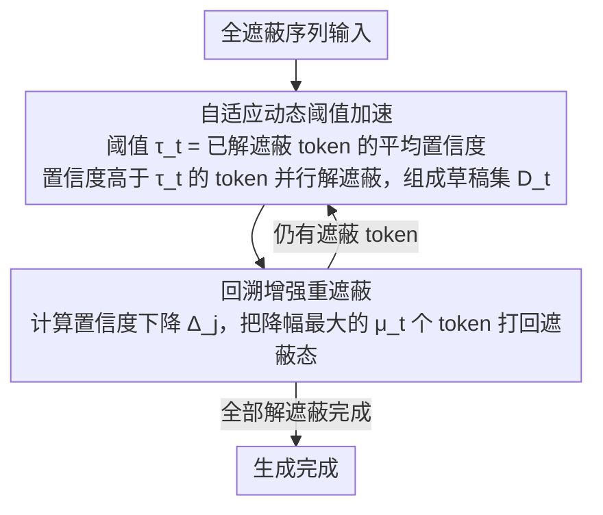

# Saber: Efficient Sampling with Adaptive Acceleration and Backtracking Enhanced Remasking for DLMs

**会议**: ACL 2026  
**arXiv**: [2510.18165](https://arxiv.org/abs/2510.18165)  
**代码**: [GitHub](https://github.com/zhaoyMa/Saber)  
**领域**: LLM效率  
**关键词**: 扩散语言模型, 自适应采样, 回溯重遮蔽, 代码生成加速, 速度-质量权衡

## 一句话总结

本文提出 Saber，一个面向扩散语言模型（DLM）的免训练采样算法，通过自适应加速（根据已建立的上下文动态调整并行解码量）和回溯增强重遮蔽（撤销被新上下文证伪的 token）两种策略，在代码生成上平均提升 Pass@1 1.9% 的同时实现 251.4% 的推理加速。

## 研究背景与动机

**领域现状**：DLM（如 LLaDA、Dream）通过迭代去遮蔽实现并行生成，是自回归模型的有力替代。但在代码生成等结构约束强的任务上，减少采样步数会导致 Pass@1 灾难性暴跌（甚至超过 60%）。

**现有痛点**：(1) 静态加速策略（固定 token 数或置信度阈值）对简单阶段太保守、对复杂阶段太激进；(2) DLM 的解码是不可逆的——一旦 token 被解遮蔽就无法撤销，早期错误会永久锁定并传播。

**核心矛盾**：并行生成的速度优势 vs 错误传播导致的质量崩溃——需要同时解决非均匀难度和错误累积两个问题。

**本文目标**：设计一种能自适应调整并行度且允许自我修正的 DLM 采样方法。

**切入角度**：两个关键洞察——(1) 生成难度随上下文建立而递减（置信度单调上升）；(2) 已生成 token 的置信度会随新上下文变化（可能从高变低）。

**核心 idea**：自适应阈值 + 回溯重遮蔽——早期谨慎（少量解遮蔽）+后期激进（大量并行），同时允许撤销"后悔"的 token。

## 方法详解

### 整体框架

Saber 不改动 DLM 的权重和架构，而是把标准的"逐步去遮蔽"采样循环改造成一个带反悔能力的两阶段过程。每一步先做自适应加速——根据当前已建立的上下文动态决定这一步能并行解遮蔽多少个新 token；再做回溯重遮蔽——回头检查那些已经定下来的 token 是否被新上下文证伪，把最可疑的几个重新打回遮蔽态。如此一路迭代，输入的全遮蔽序列在"早期谨慎、后期激进、随时可撤销"的节奏下被逐步填满，既享受并行带来的步数压缩，又避免早期错误被永久锁死。

### 关键设计

**1. 自适应动态阈值加速：让并行度随上下文自然升档**

静态加速策略的死穴在于用一个固定的 token 数或置信度阈值贯穿全程，对刚起步、上下文稀疏的阶段过于激进，对接近收尾、信息充分的阶段又过于保守。Saber 的做法是把阈值绑定到生成进度本身：第 $t$ 步的阈值取已解遮蔽 token 的平均解遮蔽时置信度 $\tau_t = \frac{1}{|\mathcal{U}_{t-1}|} \sum_{j \in \mathcal{U}_{t-1}} c_j^{\text{unmask}}$，凡是当前置信度超过 $\tau_t$ 的遮蔽 token 都被纳入这一步的草稿集 $\mathcal{D}_t$ 一并解遮蔽。

由于生成难度随上下文建立而单调下降、模型置信度随之上升，$\tau_t$ 会自然地水涨船高：早期均值低、门槛松但能过关的 token 少，于是只敢解遮蔽最确定的几个；后期均值高、整体置信普遍偏高，门槛虽抬升却放行了大量 token，实现激进并行。整个"谨慎→激进"的升档过程无需手工调度，完全由模型自身的置信度信号驱动。

**2. 回溯增强重遮蔽：给不可逆的解码装上后悔药**

传统 DLM 采样的另一处硬伤是解码不可逆——token 一旦被解遮蔽就钉死在那里，早期的一个错误会污染其后所有步骤的上下文并不断传播放大。Saber 在每步加速之后追加一次回溯：对每个已解遮蔽 token 计算它在新上下文下相对上一步的置信度下降 $\Delta_j = c_j^{t-1} - c_j^t$，挑出下降最剧烈的若干个重新打回遮蔽态，留待后续在更充分的上下文里重新决策。

撤销的数量 $\mu_t = \max(1, \lfloor |\mathcal{D}_t| / \mu \rfloor)$ 与当前步的激进程度成正比——这一步并行解遮蔽得越多，回头校验、允许反悔的额度也越大，让激进加速和自我修正始终保持匹配。正是这套机制把"一旦决定不可撤销"的限制打破，从根本上掐断了错误传播链条。

**3. 无训练即插即用：只动采样、不动模型**

Saber 的全部逻辑都发生在采样过程的 token 选择与撤销环节，不触碰模型权重、不改架构、不需任何重新训练。这一选择使它与"改进 DLM 训练"这条研究路线完全正交——任何现成的 DLM（LLaDA、Dream 等）都能直接套上 Saber 获得加速与质量收益，而不必为适配额外付出训练成本。

### 损失函数 / 训练策略

免训练方法。在 LLaDA-8B-Instruct 上实验，温度 0，生成长度 256 token。

## 实验关键数据

### 主实验

**代码生成 Pass@1 和推理速度**

| 方法 | HumanEval Pass@1 | MBPP Pass@1 | 平均步数 | 相对加速 |
|------|----------------|------------|---------|---------|
| Confidence (标准) | 43.29 | 42.86 | 256 | 1.0x |
| Fast-dLLM | 38.54 | 38.95 | ~80 | ~3.2x |
| Saber | **45.12** | **44.76** | ~72 | ~3.5x |

### 消融实验

| 配置 | HumanEval Pass@1 | 说明 |
|------|----------------|------|
| Saber (完整) | 45.12 | 完整模型 |
| w/o 回溯 | 42.68 | 去掉回溯，质量下降 |
| w/o 自适应 | 43.89 | 去掉自适应，速度下降 |
| 固定阈值 | 40.12 | 静态阈值最差 |

### 关键发现

- Saber 同时提升质量（+1.9% Pass@1）和速度（251.4% 加速）——打破了 DLM 的速度-质量权衡
- 回溯机制是质量提升的主要来源——允许模型修正早期错误避免了级联失败
- 自适应加速是速度提升的主要来源——后期阶段大量并行解遮蔽
- Saber 在不同 DLM（LLaDA、Dream）上均有效——模型无关性

## 亮点与洞察

- "谨慎→激进"的自适应策略非常直觉且有效——上下文越丰富模型越自信，应该允许更多并行
- 回溯重遮蔽是 DLM 领域的重要创新——打破了"一旦决定不可撤销"的限制
- 两个策略协同作用——自适应加速允许激进并行，回溯机制确保激进不会导致灾难

## 局限与展望

- 回溯增加了每步的计算开销（需要重新评估已解遮蔽 token 的置信度）
- 超参数 $\mu$（回溯比例）需要调优
- 仅在代码生成上验证，自然语言生成的效果未知
- DLM 整体仍落后于 ARM，Saber 只是缩小了差距

## 相关工作与启发

- **vs Fast-dLLM**: 固定阈值加速，Saber 用动态阈值更精确
- **vs ReMDM**: 分阶段重遮蔽，Saber 逐步回溯更细粒度
- **vs ARM Speculative Decoding**: 解决不同问题——ARM 加速单token生成，Saber 优化DLM的并行解遮蔽

## 评分

- 新颖性: ⭐⭐⭐⭐ 自适应+回溯的组合在DLM领域是首创
- 实验充分度: ⭐⭐⭐⭐⭐ 5个代码基准+多DLM+详细消融
- 写作质量: ⭐⭐⭐⭐ 动机分析清晰，算法伪代码完整
- 价值: ⭐⭐⭐⭐ 对DLM实用化有显著推进

<!-- RELATED:START -->

## 相关论文

- [\[ICML 2026\] TEAM: Temporal-Spatial Consistency Guided Expert Activation for MoE Diffusion Language Model Acceleration](../../ICML2026/llm_efficiency/team_temporal-spatial_consistency_guided_expert_activation_for_moe_diffusion_lan.md)
- [\[ACL 2026\] SpecBound: Adaptive Bounded Self-Speculation with Layer-wise Confidence Calibration](specbound_adaptive_bounded_self-speculation_with_layer-wise_confidence_calibrati.md)
- [\[ICML 2026\] dLLM-Cache: Accelerating Diffusion Large Language Models with Adaptive Caching](../../ICML2026/llm_efficiency/dllm-cache_accelerating_diffusion_large_language_models_with_adaptive_caching.md)
- [\[CVPR 2026\] ParallelVLM: Lossless Video-LLM Acceleration with Visual Alignment Aware Parallel Speculative Decoding](../../CVPR2026/llm_efficiency/parallelvlm_lossless_video-llm_acceleration_with_visual_alignment_aware_parallel.md)
- [\[ACL 2025\] DIVE into MoE: Diversity-Enhanced Reconstruction of Large Language Models from Dense into Mixture-of-Experts](../../ACL2025/llm_efficiency/dive_moe_reconstruction.md)

<!-- RELATED:END -->
