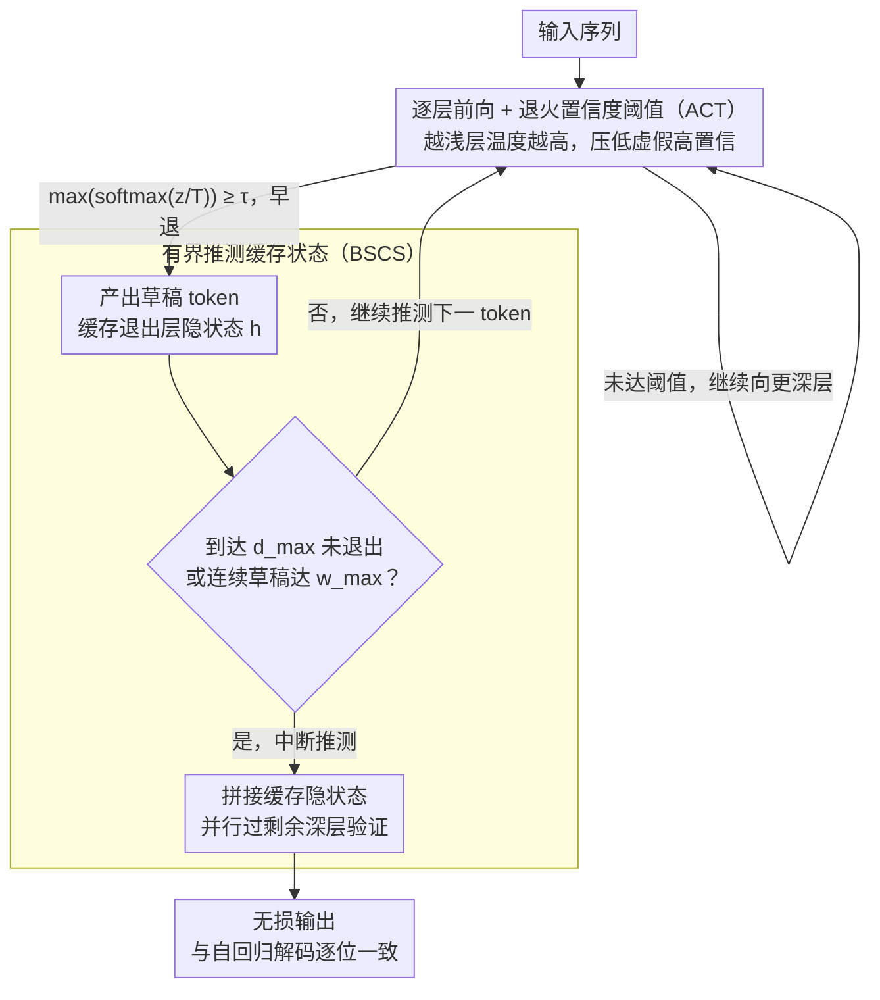

# SpecBound: Adaptive Bounded Self-Speculation with Layer-wise Confidence Calibration

**会议**: ACL 2026  
**arXiv**: [2604.12247](https://arxiv.org/abs/2604.12247)  
**代码**: [GitHub](https://github.com/ictnlp/SpecBound)  
**领域**: LLM效率  
**关键词**: 推测解码、自草稿、早退机制、置信度校准、推理加速

## 一句话总结
提出 SpecBound 自草稿推测解码框架，通过逐层温度退火抑制浅层虚假高置信度预测，并设计有界推测算法自适应控制草稿的深度和宽度，在保持输出无损的同时实现最高 2.33× 的推理加速。

## 研究背景与动机

**领域现状**：推测解码（Speculative Decoding）是加速 LLM 自回归推理的重要方法，其核心思想是"猜测-验证"：先用轻量方式快速生成候选 token，再用完整模型并行验证。现有方法分为独立草稿模型（需额外训练/存储）和自草稿方法（利用模型自身）。

**现有痛点**：自草稿方法中的"早退"策略（early exit）虽然不需要额外模型，但加速效果有限。作者通过可视化中间层计算发现两个关键问题：(1) 浅层经常对错误 token 表现出虚假的高置信度，导致错误的早退决策；(2) 少数困难 token 需要深层计算，但批量验证机制迫使所有 token 都通过深层，造成大量冗余计算。

**核心矛盾**：预训练损失函数只监督最终层输出，浅层没有直接优化信号，因此浅层的置信度不可靠。同时，token 级别的解码难度高度异构——大部分 token 在浅层就能正确预测，但少数困难 token 拖累了整个序列。

**本文目标**：设计一种既能可靠判断早退时机、又能自适应处理异构难度的自草稿框架，实现无损加速。

**切入角度**：对浅层置信度进行"降温"校准（越浅的层温度越高，使虚假高置信被压低），并将推测过程从无界逐 token 模式改为有界块级流水线。

**核心 idea**：温度退火早退（ACT）抑制浅层虚假信心 + 有界推测缓存状态算法（BSCS）同时限制草稿深度和宽度，一旦遇到困难 token 立即中断并并行验证。

## 方法详解

### 整体框架

SpecBound 是一个自草稿推测解码框架：它不引入任何独立草稿模型，而是让基座 LLM 自己一边逐层前向、一边在中间层"提前交卷"生成草稿 token。输入序列进入模型后，每个 token 在中间层都会被检查是否满足退出条件——满足就早退并产出一个草稿 token，不满足就继续往深层传播。一旦某个 token 顶到最大深度 $d_{\max}$ 仍退不出（说明它是困难 token），或者连续草稿长度累积到 $w_{\max}$，就中断推测，把所有缓存下来的中间隐状态并行送进剩余深层做一次性验证。如此"浅层快猜、困难即停、批量验证"地循环，既压缩了大部分简单 token 的计算深度，又保证最终每个 token 都走完全部层、输出与原始自回归解码逐位一致。

### 关键设计

**1. 退火置信度阈值（ACT）：给浅层的虚假自信降温**

作者可视化中间层计算时发现，浅层经常对错误 token 表现出虚假的高置信度，从而触发错误的早退——根因在于预训练损失只监督最终层，浅层从未获得直接优化信号，置信度天然不可靠。ACT 的对策是按层深做温度退火：第 $\ell$ 层的温度设为 $T_\ell = 1 + \alpha(1 - \ell/L)$，越浅的层温度越高、softmax 被拉得越平，越深的层温度越趋近 1、保持原始分布。退出条件相应改写为 $\max(\text{softmax}(\mathbf{z}^{(\ell)}/T_\ell)) \geq \tau$。

高温把浅层那些被夸大的置信度系统性地压低，使错误 token 更难越过门槛、更难触发过早退出，而深层因为温度近 1 几乎不受影响。这是一种近乎零成本的校准——只需一次标量乘法，不动任何模型参数，也不改变最终层的输出分布。

**2. 有界推测缓存状态（BSCS）：双边界止损 + 缓存隐状态统一验证**

token 级别的解码难度高度异构：大多数 token 在浅层就能猜对，少数困难 token 却要靠深层计算，而批量验证机制会迫使所有 token 陪着困难 token 一路走到底，造成大量冗余。BSCS 为推测同时设两个边界——最大深度 $d_{\max}$ 和最大宽度 $w_{\max}$。任何 token 一旦到达 $d_{\max}$ 仍未退出，立即判定为困难 token 并中断推测；而连续 $w_{\max}$ 个 token 成功退出时也强制触发一次验证，防止长草稿累积误差导致整段被拒。这等于把推测从"无界逐 token 硬猜"改成"有界块级流水线"，避免一个困难 token 拖垮整条序列。

止损只是前半步——早退会让不同 token 停在不同层深、隐状态参差不齐，BSCS 名字里的"缓存状态"正是为收拾这种错位而设。每当 token $t_i$ 在第 $\ell$ 层退出，就把该位置的隐状态 $\mathbf{h}_i^{(\ell)}$ 写入缓存；触发验证时再把所有缓存状态拼接起来并行送进剩余深层补完计算。正是这层"缓存—对齐—补算"保证了每个输出 token 最终都经过完整的层计算，从而支撑 SpecBound 的无损输出承诺：简单 token 快速穿过浅层、困难 token 及时止损，两类 token 最终都通过同一次并行验证统一收口。

### 损失函数 / 训练策略

基座模型参数完全冻结，仅为中间层训练轻量级 LM head（用于早退决策）。使用 68K ShareGPT 多轮对话数据，AdamW 优化器，学习率 $3 \times 10^{-5}$，20 个 epoch，约2小时（4×H800）。

## 实验关键数据

### 主实验

| 模型 | 方法 | 平均CR | 整体加速 |
|------|------|--------|---------|
| Vicuna-7B | Lookahead | - | 1.35× |
| Vicuna-7B | Medusa | - | 1.71× |
| Vicuna-7B | REST | - | 1.47× |
| Vicuna-7B | Kangaroo | - | 1.50× |
| Vicuna-7B | SpecBound (本文) | 3.78+ | **2.15×** |
| Vicuna-13B | Medusa | - | 1.81× |
| Vicuna-13B | SpecBound (本文) | 4.09+ | **2.16×** |
| CodeLlama-7B | Medusa | - | 1.70× |
| CodeLlama-7B | SpecBound (本文) | 3.63+ | **1.93×** |
| CodeLlama-13B | SpecBound (本文) | 3.49+ | **2.33×** |

### 消融实验

| 配置 | 加速效果 | 说明 |
|------|---------|------|
| SpecBound (完整) | 最佳 | ACT + BSCS 完整组合 |
| w/o ACT (去掉温度退火) | 显著下降 | 浅层虚假退出增多，草稿质量下降 |
| w/o 深度边界 $d_{\max}$ | 下降 | 困难 token 浪费深层计算 |
| w/o 宽度边界 $w_{\max}$ | 下降 | 长草稿累积误差导致验证失败率增高 |

### 关键发现
- **翻译任务加速最显著**（最高 2.94×），因为翻译中大量 token 是可预测的功能词
- **13B 模型比 7B 获益更多**：即使 CR 相似，更深的模型通过早退节省的层更多，加速比更高
- **温度退火效果明显**：去掉 ACT 后加速显著下降，因为虚假退出导致大量草稿被拒绝
- 方法支持温度采样（$T=0.3$），加速仅有轻微下降

## 亮点与洞察
- **温度退火思路巧妙简洁**：仅用一个线性温度调度 $T_\ell = 1 + \alpha(1-\ell/L)$ 就有效校准了浅层置信度，计算开销几乎为零，且不改变最终层的输出分布
- **有界推测的设计哲学**：将"宁可少猜不猜错"的原则工程化——碰到困难 token 果断止损比硬猜到底更高效。这个思路可以推广到其他投机计算场景
- **无损保证**：通过确保每个 token 最终都经过所有层的完整计算，输出与原始自回归解码完全一致

## 局限与展望
- 需要为每个中间层训练额外的 LM head，虽然轻量但仍是额外开销
- $d_{\max}$ 和 $w_{\max}$ 的最优值依赖于任务特性，需要针对性调参
- 未在更大模型（如 70B+）上验证，不确定是否更大模型有更强的浅层预测能力
- 当前温度退火是线性调度，未探索更复杂的非线性或自适应调度策略

## 相关工作与启发
- **vs Medusa (Cai et al. 2023)**: Medusa 使用额外的多头并行预测，需要训练额外参数；SpecBound 利用模型自身的中间层做早退，更轻量。Medusa 在某些模型上仍有优势（如 CodeLlama-13B 的1.81× vs 本文部分任务）
- **vs AdaDecode (Wei et al. 2025)**: AdaDecode 也使用中间层早退但缺乏置信度校准和有界推测。SpecBound 通过 ACT 和 BSCS 显著提升了加速比
- **vs Kangaroo (Liu et al. 2024)**: Kangaroo 用独立的小模型做草稿，加速上限受限于小模型质量。SpecBound 的自草稿策略避免了模型选择问题

## 评分
- 新颖性: ⭐⭐⭐⭐ 温度退火校准和有界推测的组合设计很有新意
- 实验充分度: ⭐⭐⭐⭐ 多模型、多任务、完整消融和参数敏感性分析
- 写作质量: ⭐⭐⭐⭐ 可视化驱动的问题分析很直观
- 价值: ⭐⭐⭐⭐ 实用的无损加速方案，代码开源

<!-- RELATED:START -->

## 相关论文

- [\[ICML 2026\] KnapSpec: Self-Speculative Decoding via Adaptive Layer Selection as a Knapsack Problem](../../ICML2026/llm_efficiency/knapspec_self-speculative_decoding_via_adaptive_layer_selection_as_a_knapsack_pr.md)
- [\[ACL 2026\] RACER: Retrieval-Augmented Contextual Rapid Speculative Decoding](racer_retrieval-augmented_contextual_rapid_speculative_decoding.md)
- [\[ACL 2026\] Multi-Drafter Speculative Decoding with Alignment Feedback](multi-drafter_speculative_decoding_with_alignment_feedback.md)
- [\[ACL 2026\] Speculative Verification: Exploiting Information Gain to Refine Speculative Decoding](speculative_verification_exploiting_information_gain_to_refine_speculative_decod.md)
- [\[ACL 2025\] CLaSp: In-Context Layer Skip for Self-Speculative Decoding](../../ACL2025/llm_efficiency/clasp_self_speculative_decoding.md)

<!-- RELATED:END -->
