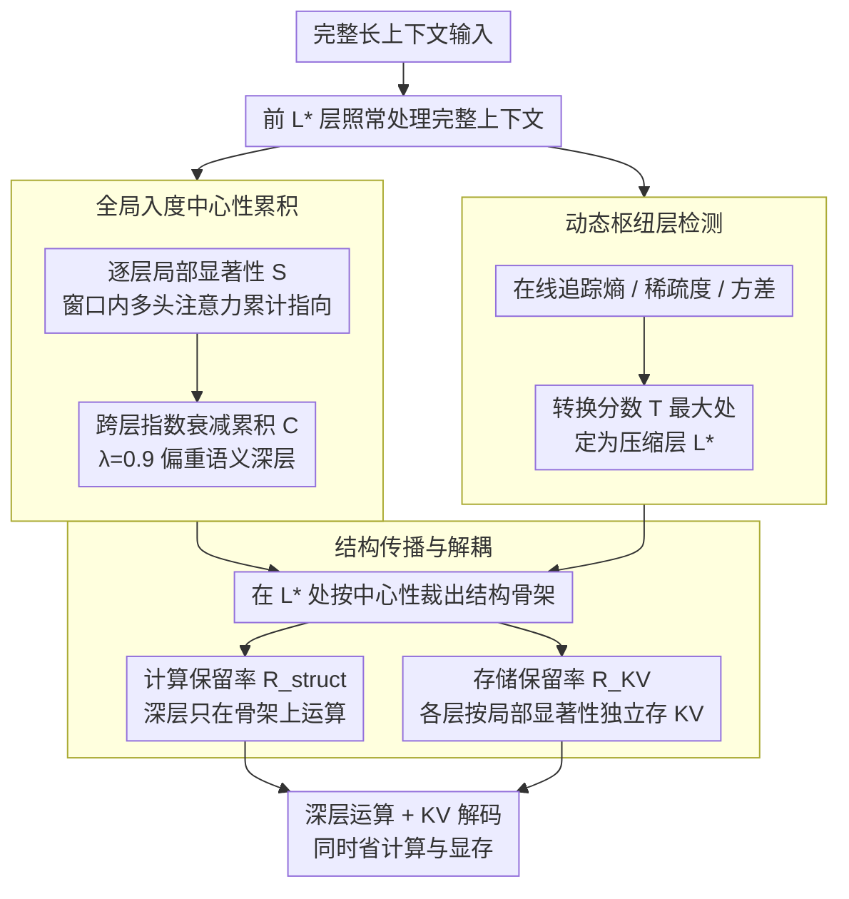

# StructKV: Preserving the Structural Skeleton for Scalable Long-Context Inference

**会议**: ACL 2026 Findings  
**arXiv**: [2604.06746](https://arxiv.org/abs/2604.06746)  
**代码**: 无  
**领域**: 模型效率 / KV Cache 压缩  
**关键词**: KV Cache压缩, 长上下文推理, 全局入度中心性, 动态枢纽层检测, 结构性传播

## 一句话总结

本文提出 StructKV，一个结构感知的 KV Cache 压缩框架，通过全局入度中心性（Global In-Degree Centrality）跨层累积注意力模式识别全局信息枢纽，动态枢纽层检测（Dynamic Pivot Detection）自适应定位最优压缩层，以及结构传播与解耦（Structural Propagation & Decoupling）分离计算预算和存储预算，在 LongBench 和 RULER 上以 60% prefill + 10% KV 实现了接近全上下文的性能。

## 研究背景与动机

**领域现状**：LLM 上下文窗口已扩展到百万 token 以上，但推理效率面临双重瓶颈：prefill 阶段 $O(N^2)$ 的注意力计算复杂度和 decoding 阶段 KV cache 的线性内存增长。现有方法通常只解决其中一个阶段的问题。

**现有痛点**：(1) Decoding-only 方法（StreamingLLM、SnapKV）只压缩 KV cache 不减少 prefill 计算；(2) Prefill-aware 方法（GemFilter、FastKV）依赖单层注意力快照的局部显著性来选择 token，但某些 token 在选定层暂时"休眠"却在全局具有关键结构重要性；(3) FastKV 使用固定的 pruning 层（如 Layer 15），这个超参数对不同模型架构/深度不通用。

**核心矛盾**：局部显著性（single-layer snapshot）≠ 结构重要性（cross-layer semantic role）。一个 token 可能在特定层注意力很低但在整个网络深度中承担着信息枢纽的角色。一旦被局部快照方法丢弃，这些信息将永久丢失。

**本文目标**：设计一个结构感知的压缩框架，识别上下文的"结构骨架"，即使 token 在局部不显著也能被保留。

**切入角度**：token 的真正重要性由其在网络深度中的累积贡献定义——这可以用图论中的入度中心性来形式化。

**核心 idea**：跨层累积注意力分数形成全局入度中心性，用信息论指标自适应检测注意力稳定的"相变"层作为压缩点，并将计算保留率和存储保留率解耦以分别优化 prefill 速度和 decoding 内存。

## 方法详解

### 整体框架

StructKV 想同时拆掉长上下文推理的两个瓶颈：prefill 阶段 $O(N^2)$ 的注意力计算和 decoding 阶段线性增长的 KV cache。它的做法是先让前 $L^*$ 层照常处理完整上下文，并在这一过程中跨层累积每个 token 的「全局入度中心性」；当一个自动检测器判定注意力分布发生「相变」时，就在最优层 $L^*$ 用这份中心性把上下文裁成一副紧凑的「结构骨架」，并把计算预算和存储预算解耦成两个独立旋钮；此后的深层只在这副骨架上运算，从而在不丢失全局枢纽 token 的前提下同时省下计算和显存。

### 关键设计

**1. 全局入度中心性累积：用跨层贡献而非单层快照判断 token 是否重要**

现有 prefill-aware 方法（如 GemFilter、FastKV）只看某一层的注意力快照来挑 token，问题是有些 token 在被检查的那一层恰好「休眠」，却在整个网络深度里承担着信息枢纽的角色，一旦在这一层被丢弃就永久消失。StructKV 把这件事形式化为图论里的入度中心性：在每层 $l$ 先算局部显著性 $\mathcal{S}_j^{(l)} = \sum_{g=1}^{G}\left(\frac{1}{w}\sum_{t=N-w}^{N}\sum_{h\in\mathcal{H}_g} a_{t,j}^{(l,h)}\right)$（窗口内多头注意力对 token $j$ 的累计指向），再沿层做指数衰减累积 $\mathcal{C}_j = \sum_{l=0}^{L^*}\lambda^{(L^*-l)}\cdot\mathcal{S}_j^{(l)}$。衰减因子 $\lambda=0.9$ 让靠近 $L^*$ 的语义层权重更高，于是一个在多个早期层反复被指向的 token，即便在某层暂时沉默，也能凭累积分数稳稳留在骨架里。

**2. 动态枢纽层检测：让模型自己决定在哪一层压缩**

固定压缩层是个不通用的超参数——FastKV 把它钉死在 Layer 15，但实验显示最优层会随模型深度漂移（Qwen-2.5-7B 在 Layer 12，32B 在 Layer 28）。StructKV 改成在线追踪三个反映注意力「从广泛探索转向聚焦提取」的信号：注意力熵 $\mathcal{H}_l$（分布不确定性）、稀疏度 $\rho_l$（top-k 累积概率质量）、方差 $\mathcal{V}_l$（可区分性）。把它们的归一化梯度加权成转换分数 $\mathcal{T}_l = w_1\cdot\bar{\nabla}(-\mathcal{H}_l) + w_2\cdot\bar{\nabla}(\rho_l) + w_3\cdot\bar{\nabla}(\mathcal{V}_l)$，相变最剧烈处即压缩点 $L^* = \arg\max_l \mathcal{T}_l + 1$。这样压缩时机变成一次自动发现，而非手工调参，跨架构直接迁移。

**3. 结构传播与解耦：把「算得快」和「存得少」拆成两个旋钮**

耦合设置下用同一个保留率同时控制计算和存储，激进压缩会让精度直接崩塌（10% 保留率只剩 45.3 分）。StructKV 的关键观察是这两件事本不该共享预算：决定深层只在哪些 token 上运算的是计算保留率 $R_{struct}$，决定 KV cache 存哪些 token 的是存储保留率 $R_{KV}$。于是它在 $L^*$ 层用全局中心性选出结构骨架 $\mathcal{I}_{struct} = \text{top-k}(\mathcal{C}, N\cdot R_{struct})\cup\mathcal{I}_{win}$ 供深层计算，而 KV cache 独立地按各层局部显著性选 $\mathcal{I}_{KV}^{(l)} = \text{top-k}(\mathcal{S}^{(l)}, N\cdot R_{KV})\cup\mathcal{I}_{win}$。把 $R_{struct}$ 放宽到远大于 $R_{KV}$（如 $20\%$ vs $10\%$），就能在几乎不增加显存的情况下回收 +13.8 分，落进高保真的安全区。

整个流程免训练（training-free），只在推理时生效。默认参数：窗口 $w=8$，衰减 $\lambda=0.9$，转换权重 $\{w_1, w_2, w_3\}=\{0.2, 0.3, 0.5\}$，$R_{struct}=20\%$，$R_{KV}=10\%$。

## 实验关键数据

### 主实验

**LongBench（LLaMA-3.1-8B-Instruct，16 个子任务平均）**

| 方法 | Prefill | KV | 平均分 |
|------|---------|-----|-------|
| Full-context | 100% | 100% | 49.33 |
| StreamingLLM | 100% | 10% | 41.59 |
| SnapKV | 100% | 10% | 46.92 |
| GemFilter | 60% | 10% | 40.40 |
| FastKV | 60% | 10% | 47.59 |
| **StructKV** | **60%** | **10%** | **48.61** |
| **StructKV** | **60%** | **20%** | **48.97** |

**RULER（LLaMA-3.1-8B-Instruct，检索基准）**

| 方法 | 8K | 16K | 32K | 64K | 128K | 平均 |
|------|-----|------|------|------|-------|------|
| Full-context | 90.1 | 95.0 | 83.4 | 85.5 | 76.3 | 86.0 |
| SnapKV | 75.6 | 76.8 | 72.9 | 75.0 | 67.7 | 73.6 |
| FastKV | 77.8 | 77.3 | 77.2 | 77.4 | 68.2 | 75.6 |
| **StructKV** | **81.3** | **82.5** | **81.8** | **81.5** | **73.6** | **80.1** |

### 消融实验

**衰减因子 $\lambda$ 敏感性（LongBench，10% KV）**

| $\lambda$ | 平均分 | 变化 |
|-----------|-------|------|
| 0.50 | 47.41 | -1.20 |
| 0.80 | 48.35 | -0.26 |
| **0.90** | **48.61** | **Ref** |
| 0.95 | 48.42 | -0.19 |
| 1.00 | 48.03 | -0.58 |

### 关键发现

- StructKV 在 128K 超长上下文下恢复了 FastKV 的大部分性能损失（73.6 vs 68.2），验证了全局累积对抗"休眠 token 丢失"的有效性
- 动态枢纽层在不同模型架构间自适应（Qwen-7B: L12, 14B: ~L20, 32B: L28），消除了手动调参需求
- 解耦策略是关键：$R_{struct}=20\%, R_{KV}=10\%$ 比耦合 10% 提升 +13.8 分
- GlobalScoreAccumulator + DynamicPivotDetector 额外开销仅 ~35ms（<2.5%），可忽略
- 隐藏状态保真度分析：StructKV 在所有层保持 >95% 的注意力质量恢复率，而 FastKV 在深层下降至 ~85%

## 亮点与洞察

- "局部显著性 ≠ 结构重要性"是核心洞察，全局入度中心性提供了优雅的形式化
- 动态相变检测将压缩时机从人工调参转为自动发现，具有很好的实用价值
- 计算/存储解耦是一个简单但强大的设计——打破了"要快就要少存"的隐含假设

## 局限与展望

- 实验验证上限为 128K token，百万级 token 的结构骨架稳定性未验证
- 仅在标准稠密 Transformer 上测试，对 MoE 或 SSM 架构的适用性未知
- 动态检测依赖特定聚合操作，在内存带宽受限的硬件上可能需要优化

## 相关工作与启发

- **vs FastKV**: FastKV 用固定层的局部快照选择 token；StructKV 跨层累积+自动检测压缩层，在 128K 时性能差距明显
- **vs SnapKV**: SnapKV 仅优化 decoding 不加速 prefill；StructKV 同时优化两个阶段
- **vs GemFilter**: GemFilter 碎片化上下文导致低保真度（~75-80%）；StructKV 保持 >95%

## 评分

- 新颖性: ⭐⭐⭐⭐ 全局入度中心性+动态相变检测+解耦策略的组合有创新性
- 实验充分度: ⭐⭐⭐⭐⭐ LongBench+RULER+多模型系列+详尽消融+开销分析+保真度分析
- 写作质量: ⭐⭐⭐⭐ 方法描述清晰，公式推导完整
- 价值: ⭐⭐⭐⭐ 为长上下文推理提供了更鲁棒的压缩方案，实用性强

<!-- RELATED:START -->

## 相关论文

- [\[ICLR 2026\] LycheeDecode: Accelerating Long-Context LLM Inference via Hybrid-Head Sparse Decoding](../../ICLR2026/llm_efficiency/lycheedecode_accelerating_long-context_llm_inference_via_hybrid-head_sparse_deco.md)
- [\[ICML 2026\] OBCache: Optimal Brain KV Cache Pruning for Efficient Long-Context LLM Inference](../../ICML2026/llm_efficiency/obcache_optimal_brain_kv_cache_pruning_for_efficient_long-context_llm_inference.md)
- [\[ICML 2026\] Training-Inference Consistent Segmented Execution for Long-Context LLMs](../../ICML2026/llm_efficiency/training-inference_consistent_segmented_execution_for_long-context_llms.md)
- [\[ACL 2025\] Squeezed Attention: Accelerating Long Context Length LLM Inference](../../ACL2025/llm_efficiency/squeezed_attention_accelerating_long_context_length_llm_inference.md)
- [\[AAAI 2026\] Connectivity-Guided Sparsification of 2-FWL GNNs Preserving Full Expressivity](../../AAAI2026/llm_efficiency/connectivity-guided_sparsification_of_2-fwl_gnns_preserving_full_expressivity_wi.md)

<!-- RELATED:END -->
