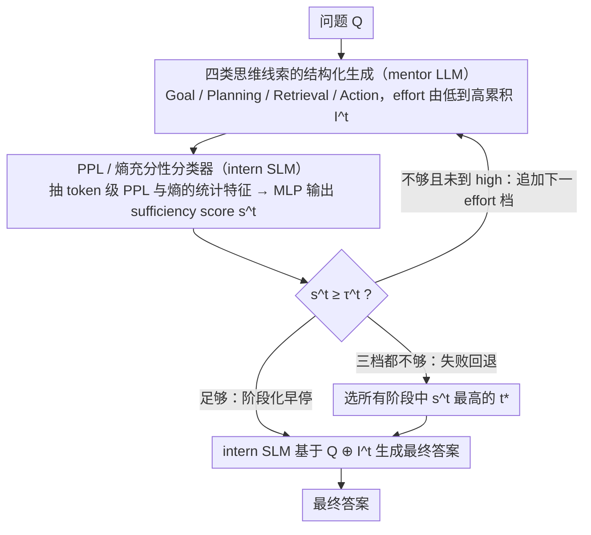

# Tandem: Riding Together with Large and Small Language Models for Efficient Reasoning

**会议**: ACL2026 Findings  
**arXiv**: [2604.23623](https://arxiv.org/abs/2604.23623)  
**代码**: https://github.com/Applied-Machine-Learning-Lab/ACL2026_Tandem  
**领域**: LLM推理 / 模型协作 / 推理效率  
**关键词**: 大小模型协作, 结构化思维提示, 推理加速, 不确定性判断, 成本感知路由

## 一句话总结
Tandem 让大模型只生成 Goal / Planning / Retrieval / Action 四类短思维线索，再由小模型用困惑度和熵判断线索是否足够并完成答案，在 MATH、GSM8K 和 HumanEval 上用约 60% 的计算成本达到或超过单独大模型推理效果。

## 研究背景与动机
**领域现状**：LLM 推理已经从简单回答走向显式 thinking paradigm，典型模型会先展开长链路思考，再生成最终答案。这样的思维外显让复杂数学、科学推理和代码生成的可解释性更强，也让模型在难题上更稳。

**现有痛点**：显式思考的主要成本来自生成长度。论文指出 thinking 模型的 reasoning trace 往往比常规输出长 5 到 10 倍，真实部署时会带来延迟和 API 费用压力。已有做法例如 reinforcement fine-tuning 让大模型少想一点，但它需要改动大模型权重，对闭源 API 模型不可用，还可能伤害通用能力。

**核心矛盾**：高质量推理需要大模型的抽象规划与关键洞察，但完整 reasoning chain 里包含大量探索、解释和重复步骤。也就是说，真正昂贵的不是“得到关键思路”，而是让大模型把完整解题过程写完。

**本文目标**：作者希望在不训练或修改 mentor LLM 的前提下，把大模型的思维能力压缩成轻量指导，让更便宜的小模型接手执行，同时为不同难度题目动态决定需要多少大模型指导。

**切入角度**：论文采用 mentor-intern 类比：大模型像导师，负责给目标、计划、检索知识和关键动作；小模型像实习生，负责根据这些线索完成具体推理。是否继续问导师，不由固定 token budget 决定，而由小模型处理当前线索时的分布不确定性决定。

**核心 idea**：把大模型长思考拆成阶段化的结构化 insight，并用小模型的 PPL / entropy 特征训练 sufficiency classifier，判断何时停止大模型生成并让小模型完成答案。

## 方法详解
Tandem 的方法重点不是让两个模型互相辩论，也不是在多个模型之间做一次性 query routing，而是把一次推理拆成“指导生成”和“答案完成”两个角色。大模型只产出越来越详细的思维线索，小模型一边读线索一边判断自己能否完成任务；只要判断当前线索足够，大模型就提前停止，剩余推理由小模型完成。

### 整体框架
给定问题 $Q$，mentor LLM 按三个 effort level 逐步生成 reasoning insights。每个阶段都包含四类信息：Goal 说明最终目标，Planning 给出解题策略，Retrieval 提取相关事实或知识，Action 给出关键计算或逻辑动作。

第 $t$ 个阶段新增 insight 记为 $\Delta I^t$，累计线索为 $I^t = I^{t-1} \oplus \Delta I^t$。在每个阶段后，intern SLM 读取 $Q \oplus I^t$，抽取 token-level perplexity 和 entropy 的统计特征，再交给 MLP classifier 输出 sufficiency score $s^t$。

如果 $s^t$ 超过当前阶段阈值 $\tau^t$，系统停止 LLM 继续生成，让 SLM 基于 $Q \oplus I^t$ 输出最终答案。若三个阶段都不被判为足够，系统不盲目使用最后阶段，而是选择所有阶段中 sufficiency score 最高的 $t^*$，再用对应 insight 完成回答。

这个流程有两个细节值得注意。第一，LLM 的 insight 本身被 prompt 约束为结构化内容，而不是未经处理的原始长链路思考。第二，classifier 的输入来自 SLM 的分布状态，因此它判断的是“这个小模型在这些线索下是否有把握”，而不是泛泛地估计题目难度。

### 关键设计

**1. 四类思维线索的结构化生成：把大模型冗长的 chain-of-thought 压成小模型啃得动的高层骨架**

直接把大模型完整思维链喂给小模型既不经济，也常常超出小模型的理解能力——里面塞满了试错、解释和重复步骤。作者借鉴认知模块化和 LLM agent 的问答流程，把每个阶段的 insight 固定拆成四类：Goal 让小模型明确要解什么，Planning 给出子问题分解和路线，Retrieval 补充必要的事实知识，Action 则提供关键运算或逻辑步骤。三个 effort level 都覆盖这四类信息，只是深度和 token budget 逐级加大。

这样保留的是“为什么这样解”的解题骨架，砍掉的是大量试错和解释性冗余，让小模型拿到的指导比普通提示更强、又比完整思维链短得多。

**2. 基于 PPL / entropy 的 sufficiency classifier：用小模型自己的不确定性，而不是题目难度来决定还要不要问大模型**

固定的低/中/高 thinking budget 会浪费简单题，也可能不够啃难题；而且同一条 insight 对强 SLM 可能足够、对弱 SLM 还差口气，按题目难度统一切档并不合理。Tandem 改用小模型自身的分布状态当信号：SLM 处理 $Q \oplus I^t$ 时会对每个 token 产生预测分布，论文计算每个 token 的 PPL 和 entropy，再取均值、标准差、中位数、最大值、最小值、25/75 分位数，以及末 20 个 token 与前 20 个 token 的趋势差，喂给一个 MLP 输出 sufficiency score $s^t$。

直觉很直接：如果当前线索真能帮小模型形成稳定预测，entropy 会更低、分布统计也更像“可解”的样本。因为输入来自 SLM 的分布，分类器判断的就是“这个小模型在这些线索下有没有把握”，而非泛泛地估计题目难不难——这把资源分配和具体执行模型的能力绑在了一起。

**3. 阶段化早停与失败回退：在 LLM cascade 和全程大模型之间做细粒度折中**

许多题只需要目标澄清或简单规划，继续让大模型写出 action 细节纯属浪费成本；另一些题虽然需要更长指导，但最终答案仍可由小模型生成。Tandem 因此让 LLM 先生成 low effort insight，classifier 判够就立即停，让 SLM 基于 $Q \oplus I^t$ 出答案；不够再追加 medium、还不够再 high。

关键在回退逻辑：若三个阶段都没过阈值 $\tau^t$，系统不会机械地采用最长的那条线索，而是回头选所有阶段里 sufficiency score 最高的 $t^*$ 来完成回答。这让 Tandem 既不是单次 query 路由，也不是全程大模型接管，而是按题目难度动态决定“到底需要多少大模型指导”。

### 损失函数 / 训练策略
Tandem 不训练 mentor LLM，也不需要 fine-tune intern SLM 的主生成能力。需要训练的是 sufficiency classifier：在训练集上，对于每个题目和每个 effort level，若 SLM 在当前 insight 下答对，则标记为 sufficient，否则标记为 insufficient。

分类器采用两层 MLP，隐藏层为 64 和 32，ReLU 激活，dropout 为 0.3，Adam 学习率 $10^{-4}$，最多训练 3 个 epoch，并用验证集 early stopping。每个 effort level 的阈值 $\tau^t$ 通过 0.05 到 0.95 的网格搜索确定。

实验中的 LLM 包括 DeepSeek-R1-Distill-Qwen-32B、Qwen3-32B、GPT-4o-mini 和 gpt-oss-120b，SLM 包括 DeepSeek-7B、Qwen3-8B 等。主要数据集为 MATH、GSM8K，并用 HumanEval 检验跨领域代码生成迁移。

## 实验关键数据

### 主实验
MATH 主表显示，在 DeepSeek-32B 作为 mentor、DeepSeek-7B 作为 intern 时，Tandem 同时超过单独 32B 和固定高 effort 协作，并显著降低 TFLOPs 成本。

| 方法 | MATH 平均准确率 | 平均生成长度 | 计算成本 TFLOPs | 相对 32B 成本 | 主要结论 |
|------|----------------|--------------|-----------------|---------------|----------|
| 7B 单模型 | 77.14 | 2,732 | 38.25 | 22.7% | 成本低但复杂题能力不足 |
| 32B 单模型 | 80.90 | 2,630 | 168.35 | 100% | 强基线，但完整思考很贵 |
| 7B+32B low | 78.74 | 2,735 | 44.76 | 26.6% | 指导太短，收益有限 |
| 7B+32B medium | 80.36 | 2,853 | 71.96 | 42.7% | 接近 32B，但仍略低 |
| 7B+32B high | 83.18 | 2,930 | 104.62 | 62.1% | 固定长指导能提升准确率 |
| Tandem | 83.46 | 2,916 | 99.72 | 59.2% | 准确率最高，成本约降 41% |

跨模型族实验说明 insight 格式不是只适配同一家模型。DeepSeek-7B 读取 Qwen3-32B insight 在 MATH 上达到 79.96，明显超过 DeepSeek-7B 自身的 76.92，也超过 Qwen3-32B 的 69.50；在 GSM8K 上，多数组合也超过单独 SLM。

| SLM + LLM | MATH Acc. | MATH Cost | GSM8K Acc. | GSM8K Cost | 观察 |
|-----------|-----------|-----------|------------|------------|------|
| Qwen3-8B 单模型 | 60.86 | 51.15 | 89.61 | 31.86 | 弱 SLM 成本适中但数学能力不足 |
| Qwen3-32B 单模型 | 69.50 | 193.41 | 94.01 | 104.00 | Qwen3-32B 在 MATH 不如 DeepSeek 推理模型 |
| DeepSeek-7B 单模型 | 76.92 | 37.25 | 87.11 | 15.74 | 数学能力强，GSM8K 略弱 |
| DeepSeek-32B 单模型 | 80.76 | 163.84 | 94.47 | 67.14 | 强 mentor 基线 |
| DeepSeek-7B + Qwen3-32B | 79.96 | 58.06 | 94.62 | 76.87 | 跨族 insight 能被利用 |
| DeepSeek-7B + DeepSeek-32B | 83.34 | 97.95 | 95.45 | 52.66 | 同族且能力差适中时最好 |

### 消融实验
论文从 model size、API mentor、跨领域迁移和效率 baseline 比较 Tandem 的稳定性。

| 分析维度 | 对比设置 | 关键结果 | 含义 |
|----------|----------|----------|------|
| 模型规模 | DeepSeek Counting & Probability | 7B+32B high 达 82.49，高于 7B 的 75.95；14B+32B 只从 79.96 到 80.38 | 能力差过小收益有限，过大则弱 SLM 无法消化指导 |
| API mentor | DeepSeek-7B + GPT-oss-120B | Algebra 95.79，Counting 86.71，Geometry 84.55，均超过两侧单模型 | 不需要访问大模型权重，适合闭源 API 场景 |
| 跨领域迁移 | MATH classifier 直接用于 HumanEval | Tandem 85.37，高于 7B+32B high 的 83.54，SLM 为 65.24，LLM 为 89.02 | PPL / entropy sufficiency 特征有一定 domain-agnostic 性 |
| 效率 baseline | MATH 上对比 Budget Forcing 与 LLM Cascade | Tandem 83.46 / 99.72 TFLOPs；Budget Forcing 82.18 / 108.74；Cascade 82.60 / 95.33 | Tandem 比固定截断更准，比一次性路由更细 |

### 关键发现
- Tandem 的最大收益来自“动态选择需要多少指导”，不是简单地让 32B 多写一点或少写一点；它在固定 high effort 已经较强的基础上继续提升准确率并降低成本。
- 结构化 insight 对跨模型族有可迁移性，但 SLM 不能太弱。1.5B 模型即使得到 32B 指导也无法接近 32B 单模型，说明协作的瓶颈会从 mentor 的推理能力转移到 intern 的执行理解能力。
- API 实验很实用：GPT-oss-120B 作为远程 mentor 时，局部科目成本甚至低于单独 API 调用，因为它只输出短 insight，后续长回答由本地 7B 完成。
- HumanEval 结果说明 sufficiency classifier 学到的并不只是数学题特征，而是“小模型读完当前指导后是否稳定”的分布模式。

## 亮点与洞察
- 论文把大模型推理效率问题从“如何让大模型少想”改写成“哪些思维内容必须由大模型提供”。这个问题重构很重要，因为它避免了训练大模型，也自然兼容闭源 API。
- Goal / Planning / Retrieval / Action 四类 insight 比普通 hint 更可控。它既不是完整 CoT 泄露，也不是一句提示，而是把解题所需的认知模块显式拆开，方便小模型接力执行。
- sufficiency classifier 使用的是小模型自身分布特征，因此具有个体化含义。相同题目、相同 insight，对不同 SLM 的“足够性”可以不同，这比用题目难度或大模型置信度做路由更贴近实际执行。
- Tandem 给“模型协作”提供了一个轻量范式：协作不一定要多轮 debate，也不一定要 ensemble 多个完整答案；只要角色划分正确，短指导加本地执行就能产生很高性价比。

## 局限与展望
- 论文主要覆盖数学推理和 HumanEval 代码生成，尚未充分验证开放域问答、常识推理、长上下文检索增强和多轮任务规划等场景。
- sufficiency classifier 仍然需要带正确性标签的训练数据。虽然跨领域迁移表现不错，但至少需要一个源领域训练集，低资源任务上如何冷启动仍是问题。
- 当前是固定 mentor-intern 两模型结构，没有动态选择 mentor、intern 或多个专家模型。复杂产品场景中，不同题目可能需要不同导师或验证者。
- 方法默认 insight 本身是可靠的。若 mentor LLM 给出的 Retrieval 或 Action 存在事实错误，小模型可能会被高置信度地带偏；未来可以引入 verifier 或反事实检查机制。

## 相关工作与启发
- **vs Budget Forcing**: Budget Forcing 直接截断大模型思考，省成本但可能切断关键步骤。Tandem 让大模型输出结构化短 insight，再由小模型完成，因而不是简单压缩长度，而是改变角色分工。
- **vs LLM Cascade / FrugalGPT**: Cascade 通常一次性决定用小模型还是大模型，粒度是 query-level。Tandem 的决策发生在 reasoning stage 之间，同一题可以先用少量大模型指导，不够再追加。
- **vs speculative decoding**: speculative decoding 让小模型加速大模型 token 生成，本质仍以大模型输出为准。Tandem 则让小模型生成最终答案，大模型只提供高层指导，两者节省的成本来源不同。
- **vs 多智能体辩论**: Debate 或 role-based collaboration 往往增加多轮通信成本。Tandem 的通信对象是短 insight，协作更像生产系统中的导师提示和执行者接力。

## 评分
- 新颖性: ⭐⭐⭐⭐☆ 把长推理压缩为结构化 insight 并用 SLM 不确定性做阶段早停，想法简洁且切中部署成本问题。
- 实验充分度: ⭐⭐⭐⭐☆ 覆盖 MATH、GSM8K、HumanEval、多模型族和 API mentor；开放域复杂任务还需要更多验证。
- 写作质量: ⭐⭐⭐⭐☆ 方法主线清楚，实验问题按 RQ 展开，成本定义也较透明。
- 价值: ⭐⭐⭐⭐⭐ 对 LLM 推理服务降本很有工程价值，也为大小模型协作提供了可复用的系统设计。

<!-- RELATED:START -->

## 相关论文

- [\[ACL 2026\] Lizard: An Efficient Linearization Framework for Large Language Models](lizard_an_efficient_linearization_framework_for_large_language_models.md)
- [\[ACL 2026\] CreditDecoding: Accelerating Parallel Decoding in Diffusion Large Language Models with Trace Credit](creditdecoding_accelerating_parallel_decoding_in_diffusion_large_language_models.md)
- [\[ACL 2026\] Are Large Language Models Economically Viable for Industry Deployment?](are_large_language_models_economically_viable_for_industry_deployment.md)
- [\[ACL 2026\] Breaking Block Boundaries: Anchor-based History-stable Decoding for Diffusion Large Language Models](breaking_block_boundaries_anchor-based_history-stable_decoding_for_diffusion_lar.md)
- [\[ICML 2026\] dLLM-Cache: Accelerating Diffusion Large Language Models with Adaptive Caching](../../ICML2026/llm_efficiency/dllm-cache_accelerating_diffusion_large_language_models_with_adaptive_caching.md)

<!-- RELATED:END -->
