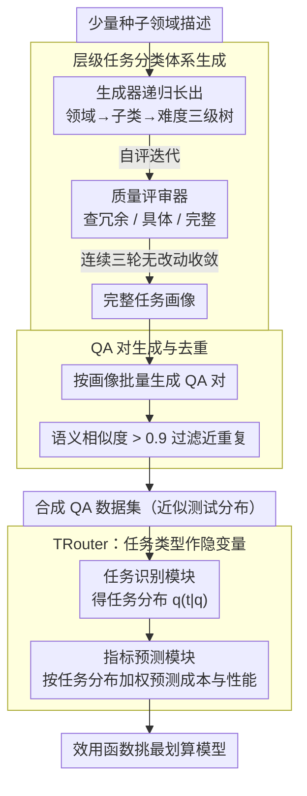

# Task-Aware LLM Routing with Multi-Level Task-Profile-Guided Data Synthesis for Cold-Start Scenarios

**会议**: ACL 2026  
**arXiv**: [2604.09377](https://arxiv.org/abs/2604.09377)  
**代码**: [GitHub](https://github.com/less-and-less-bugs/ColdStartLLMRouter)  
**领域**: LLM评测  
**关键词**: LLM路由, 冷启动, 数据合成, 任务感知, 成本-性能权衡

## 一句话总结
提出多层级任务画像引导的数据合成框架解决 LLM 路由的冷启动问题，并设计 TRouter——一种将任务类型作为隐变量的路由方法，通过变分推断建模查询-成本-性能关系，在冷启动和域内设置下均实现有效路由。

## 研究背景与动机

**领域现状**：LLM 路由旨在为每个用户查询从候选模型池中选择最优模型，以平衡性能和成本。主流方法分为分类式（直接预测最佳模型）和回归式（预测成本与性能后最大化效用函数）两类，通常需要在域内训练数据上训练小型路由器（如 BERT）。

**现有痛点**：(1) 现实部署中经常面临冷启动场景——没有域内标注数据用于训练路由器；(2) 预训练路由器在跨域测试时泛化能力差，甚至不如简单的规则基线（Adaptive LLM）；(3) 直接用 LLM 做模型选择也不可靠，因为难以准确表征每个候选模型的能力边界。

**核心矛盾**：LLM 路由依赖标注数据，但冷启动场景下无法获取；同时域外分布偏移使得跨域训练的路由器失效。

**本文目标**：(1) 设计无需人工标注的数据合成方法来近似测试时的查询分布；(2) 构建能感知任务类型的路由器以增强跨域鲁棒性。

**切入角度**：观察到 LLM 的成本和性能与任务类别和难度内在关联——不同类型/难度的任务对模型的要求差异显著。基于此，可以用层级化的任务分类体系来组织合成数据，并在路由中利用隐式任务类型信息。

**核心 idea**：用层级任务分类法（领域→子类→难度）引导合成数据生成，将任务类型建模为隐变量融入回归式路由框架。

## 方法详解

### 整体框架
本文面对的是 LLM 路由的冷启动困境：没有域内标注数据时，预训练路由器跨域泛化很差，直接用 LLM 选模型又难以刻画候选模型的能力边界。解法是把「造数据」和「学路由」串成一条链——先用多层级任务画像引导的数据合成框架，从少量种子领域描述出发迭代搭出「领域→子类→难度」三级任务分类体系，并按画像批量生成去重后的 QA 对来近似测试分布；再把同一套任务类型当作隐变量喂给 TRouter，让它通过变分推断联合建模性能与成本的条件分布，推理时按效用函数挑出最划算的模型。

### 关键设计

**1. 层级任务分类体系生成：用「生成—自评」循环把少量种子扩成完整任务树**

合成数据要近似真实测试分布，就得先有一套足够细、足够全的任务划分。Task Type Generator 以父类描述为条件提示递归生成子类型（每个子类含名称、定义、示例），逐层长出「领域→子类→难度」三级结构，让采样既能细粒度控制又能高效覆盖。但纯生成容易出现冗余或漏项，于是 Task Type Quality Evaluator 对每一批子类型做自我评审，逐项检查冗余性、具体性和完整性并迭代修正，直到连续三轮无改动才收敛。用 GPT-4.1 跑完整条流程，最终得到 10 个领域、103 个子类、447 个难度节点、共 17,880 个 QA 对。

**2. QA 对生成与去重：让训练数据多样且不重复**

有了任务画像（当前任务类型加上其父类型的描述）后，Question-Answer Pair Generator 以画像为条件批量产出 QA 对，每个画像目标 40 对、batch=8。多样性的敌人是近重复样本，因此每生成一批都用 sentence-transformer 算新旧 QA 对的语义相似度，把最大相似度 $>0.9$ 的近重复项过滤掉，再继续迭代直到画像配额填满。这一步保证合成集既贴近真实测试分布的覆盖面，又不会因冗余样本拖累路由器训练。

**3. TRouter：把任务类型作为隐变量解耦查询与指标**

直接从查询特征预测成本/性能，容易被表面词汇特征带偏，跨域就失效。TRouter 引入隐式任务类型 $t$，把评估指标的条件分布拆成 $p(h|q,m)=\sum_t p(h|t,m)\cdot p(t|q)$。Task Recognition Module 把查询和所有任务类型描述编码拼接后过 MLP+softmax，得到任务分布 $q_\phi(t|q)$，并用交叉熵约束它与先验的 KL 散度；Metric Prediction Module 则对每个「指标-模型」对，用这份任务分布加权各类型的预测值作为最终预测，以 MSE 训练。推理时按效用函数 $U(m,q)=\mu_r\cdot r(m,q)-\mu_c\cdot c(m,q)$ 在性能与成本间挑最优模型。任务类型这层中间表示把任务语义从查询表面特征里剥离出来，正是跨域鲁棒性的来源。

总损失为 $\mathcal{L} = \mathcal{L}_{CE} + \frac{1}{|\mathcal{M}||\mathcal{H}|}\sum_m\sum_h \mathcal{L}_{MSE}^{h,m}$，其中交叉熵项对应 ELBO 的 KL 项、MSE 项对应重构项。查询和任务类型用 all-MiniLM-L6-v2 编码并映射到 256 维；冷启动设置下每类型仅用 30 条训练 + 10 条验证 QA 对。

## 实验关键数据

### 主实验

| 设置 | 方法 | Cost-first Utility | Balanced Utility | Perf-first Utility | Utility Sum |
|------|------|---------------------|-------------------|---------------------|-------------|
| 冷启动 | Adaptive LLM | 0.0217 | 0.1809 | 0.2887 | 0.4913 |
| 冷启动 | RouterDC⋆ | 0.0197 | 0.1490 | 0.2989 | 0.4676 |
| 冷启动 | Ours▲ (GPT-4.1合成) | **0.0355** | **0.1811** | 0.3108 | **0.5274** |
| 冷启动 | Ours∙ (Gemini合成) | 0.0352 | 0.1809 | **0.3221** | **0.5382** |
| 域内 | MetricRouter | 0.0442 | 0.1911 | 0.3388 | 0.5741 |
| 域内 | Ours▲ | **0.0518** | **0.1949** | 0.3447 | **0.5914** |

### 消融实验

| 配置 | Utility Sum | 说明 |
|------|-------------|------|
| TRouter (完整) | 0.5382 | 完整模型（Gemini合成） |
| w/o 任务类型变量 | ~0.52 | 退化为标准回归路由 |
| w/o 数据合成 | 0.4913 | 退化为规则基线 |
| w/o 质量评审器 | ~0.51 | 分类体系质量下降 |

### 关键发现
- 冷启动场景下 TRouter 的 Utility Sum 超越所有基线，甚至接近域内方法的性能
- 合成框架在用 GPT-4.1 和 Gemini-2.5-flash 两种 LLM 时均有效，验证了通用性
- 域内设置下 TRouter 同样优于 MetricRouter 等回归基线，证明任务类型建模的增益不限于冷启动
- 传统的跨域训练路由器（RouterDC⋆、MetricRouter⋆）在冷启动下表现不佳，有的甚至不如 Adaptive LLM 规则基线

## 亮点与洞察
- **任务类型作为隐变量的设计非常精巧**：将任务分类体系从数据合成阶段延伸到路由建模阶段，实现"合成数据→路由先验"的闭环。这比简单用合成数据训练标准路由器多了一层结构化归纳偏置
- **冷启动问题的定义和解决思路可迁移**：数据合成框架的核心思想（用层级分类引导生成多样化样本）适用于任何缺乏标注数据的模型选择/调度场景
- **变分推断框架使路由器同时获得解释性**：任务分布 $q_\phi(t|q)$ 不仅用于预测，还能告诉用户"这个查询属于什么类型的任务"，增强了路由决策的可解释性

## 局限与展望
- 合成数据仍依赖强大的 LLM（GPT-4.1 或 Gemini），在这些模型不可用的场景下适用性受限
- 任务分类体系的种子领域需要手动指定（6 个→扩展到 10 个），对新领域的自适应能力未验证
- 实验中候选模型池较小（6 个开源 + 5 个商用），更大规模模型池下的路由效率和可扩展性有待验证
- 未讨论路由延迟——实际部署中路由器本身的推理时间是否会抵消模型选择带来的效率增益

## 相关工作与启发
- **vs GraphRouter**: GraphRouter 将路由建模为异构图上的边预测，TRouter 用隐式任务类型变量更简洁，且在冷启动下优势明显
- **vs MetricRouter**: 同为回归式路由，MetricRouter 直接从查询嵌入预测指标，TRouter 额外引入任务类型分解，在域内和冷启动下均更优
- **vs 自适应规则基线**: Adaptive LLM 仅根据用户成本容忍度线性选择模型，在冷启动下反而比多数学习型方法更稳健，凸显了冷启动问题的严重性

## 评分
- 新颖性: ⭐⭐⭐⭐ 冷启动问题定义有价值，数据合成+隐变量路由的结合设计巧妙
- 实验充分度: ⭐⭐⭐⭐ 覆盖冷启动和域内两种设置，多 LLM 池验证，但消融实验可更详细
- 写作质量: ⭐⭐⭐⭐ 理论推导清晰，框架图直观，问题定义明确
- 价值: ⭐⭐⭐⭐ 冷启动路由是实际部署中的真实痛点，合成框架有良好的通用性

<!-- RELATED:START -->

## 相关论文

- [\[ACL 2026\] MTRouter: Cost-Aware Multi-Turn LLM Routing with History-Model Joint Embeddings](mtrouter_cost-aware_multi-turn_llm_routing_with_history-model_joint_embeddings.md)
- [\[NeurIPS 2025\] Efficient Training-Free Online Routing for High-Volume Multi-LLM Serving](../../NeurIPS2025/llm_efficiency/efficient_training-free_online_routing_for_high-volume_multi-llm_serving.md)
- [\[AAAI 2026\] Resource Efficient Sleep Staging via Multi-Level Masking and Prompt Learning](../../AAAI2026/llm_efficiency/resource_efficient_sleep_staging_via_multi-level_masking_and_prompt_learning.md)
- [\[ICML 2026\] Fast-dLLM++: Fréchet Profile Decoding for Faster Diffusion LLM Inference](../../ICML2026/llm_efficiency/fast-dllm_fréchet_profile_decoding_for_faster_diffusion_llm_inference.md)
- [\[ACL 2026\] Understanding LLM Performance Degradation in Multi-Instance Processing: The Roles of Instance Count and Context Length](understanding_llm_performance_degradation_in_multi-instance_processing_the_roles.md)

<!-- RELATED:END -->
