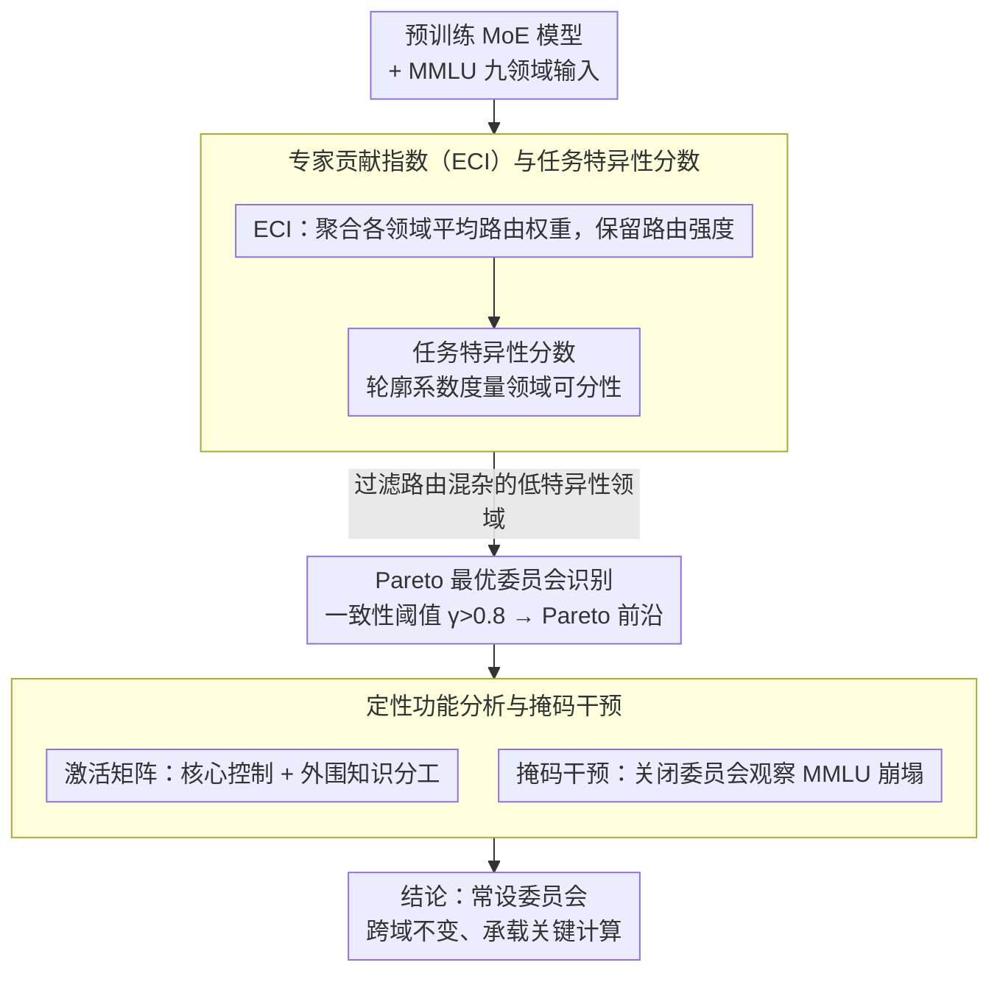

# 专业化的幻觉：揭示混合专家模型中的"常设委员会"

**会议**: ACL2026  
**arXiv**: [2601.03425](https://arxiv.org/abs/2601.03425)  
**代码**: https://github.com/The-FinAI/CommitteeAudit  
**领域**: 模型压缩 / LLM效率  
**关键词**: 混合专家模型, 路由分析, 专家专业化, 模型可解释性, 稀疏计算

## 一句话总结
通过引入 CommitteeAudit 框架，作者发现 MoE 模型中存在一个"常设委员会"——一个紧凑的、持久的专家组合，在不同领域始终被激活并占据大部分路由权重，这与广泛假设的领域特定专业化形成鲜明对比，揭示了稀疏计算内在的集中化结构。

## 研究背景与动机

**领域现状**：混合专家（MoE）模型已成为扩展大语言模型的主要方向。通过"分治"策略——将不同领域的输入路由到专业化的专家，理论上可以实现条件计算，同时避免推理延迟的线性增长。DeepSeek 等最新架构甚至引入了共享专家层，试图通过架构隔离来强制非共享专家的专业化。

**现有痛点**：然而，先前关于表示坍缩（representation collapse）的研究警告，路由网络的优化动力频繁与"专家专业化"的理想相悖。更关键的是，即使在有共享专家的架构中，路由后的专家也表现出大量的跨领域重叠——这不是优化失败，而是这些专家保持活跃和功能有效的前提下仍然拒绝专业化。

**核心矛盾**：MoE 模型训练中广泛采用的负载均衡损失函数（如 load-balancing auxiliary loss）旨在鼓励专家均匀使用，防止专家"死亡"。但如果模型的自然优化路径实际上趋向于中央化计算——一个"常设委员会"主导所有领域的推理——那么这类损失函数反而是在与模型的内在倾向对抗。

**本文目标**：在群体层面（而非个别专家）分析 MoE 的路由组织，确认是否存在领域不变的专家连接体，以及这些连接体如何跨深度和架构演化。

**核心 idea**：从个别专家统计转向"委员会"级的结构分析——用 Pareto 最优性和稳定性诊断来量化专家组的组织方式，而不是孤立地分析激活频率。

## 方法详解

### 整体框架
CommitteeAudit 想验证一件反直觉的事：MoE 真的把不同领域分给了「专业化」的专家吗，还是存在一个跨领域始终在岗的「常设委员会」？为此它设计了一个事后分析流程——先从预训练 MoE 模型提取任务级路由特征，用 Jaccard 相似度和 Gini 系数量化路由的重叠度与集中度；再判断各领域路由的任务特异性，过滤掉路由混杂的任务；最后在特异性足够高的领域上做 Pareto 优化，识别出那些跨域持续占据 Top-k、且排名稳定的专家组，并用激活矩阵和掩码干预验证它们是否真的承载关键计算。

### 关键设计

**1. 专家贡献指数（ECI）与任务特异性分数：从单次路由聚合到领域级模式**

要谈「委员会」就得先有一个能跨样本、跨领域稳定刻画专家重要性的量。ECI 把专家 $i$ 在层 $\ell$ 处理领域 $\tau$ 的平均路由权重定义为 $c_{i,\tau}^{(\ell)} = \mathbf{E}_{x\in\mathcal{D}_\tau}[G^{(\ell)}(x)_i]$，相比单纯的激活频率，它保留了路由器偏好的「强度」信息。任务特异性则用基于轮廓系数的指标 $S_\ell(\tau) = \frac{1}{|\mathcal{D}_\tau|}\sum_{x_i}\frac{b_i - a_i}{\max(a_i, b_i)}$ 度量（$a_i$ 为同领域距离、$b_i$ 为异域最近距离）。这两个量把个别路由行为桥接到领域级模式，后续的委员会分析只在特异性足够高的领域上进行，避免被路由混杂的任务污染。

**2. Pareto 最优委员会识别：同时要求排名靠前与跨域稳定**

一个合格的「委员会成员」应当既在多领域被频繁重用，又在各领域里的使用模式保持一致——单看频率会混进跨域不稳定的专家，单看方差又会选中排名很低但稳定的专家。CommitteeAudit 先用一致性阈值 $\gamma > 0.8$ 筛掉那些进入 Top-k 的领域占比不足 $80\%$ 的专家，再在剩余候选上画 Pareto 曲线 $\{(\mu_i, \sigma_i): \mu_i = \mathbf{E}_\tau[R(i,\tau)],\ \sigma_i = \mathrm{Var}_\tau[R(i,\tau)]\}$，自动挑出「高平均排名、低跨域排名方差」的最优权衡点。用 Pareto 前沿代替硬阈值，正好同时回避了上述两种偏置。

**3. 定性功能分析与掩码干预：排除「高频统计巧合」的嫌疑**

光统计出一个稳定专家组还不够，得证明它真的在干活。一方面，激活矩阵记录哪些 token 在至少三个不同领域里始终激活同一委员会专家——结果发现抽象推理词（"Which"、"What"、"Suppose"）和高频结构词（"the"、"a"、"in"）都被路由到相同的委员会专家，而领域特定术语则分散到外围专家，呈现「核心控制 + 外围知识」的分工。另一方面，掩码试验关闭委员会专家的路由权重并重新正规化，观察 MMLU 上的崩塌幅度：正确率从 0.39 跌到 0.03–0.12，「无答案」率从 3% 飙到 36%–38%。定性与定量证据互相印证，坐实了常设委员会承载真实计算角色，而非频率统计上的偶然。

## 实验关键数据

### 主实验：常设委员会的存在与稳定性

在三个不同规模和架构的 MoE 模型（OLMoE-1B-7B、DeepSeek-V2-Lite、Qwen3-30B-A3B）上，使用 MMLU 的九个语义领域进行实验。

| 指标 | 统计量 | OLMoE | DeepSeek-V2-Lite | Qwen3-30B-A3B |
|------|--------|-------|----------------|--------------|
| Jaccard 相似度 | 最大值 | 1.0 | 1.0 | 1.0 |
|  | 最小值 | 0.7963 | 0.7103 | 0.5300 |
|  | 整体平均 | 0.8735 | 0.8670 | 0.8670 |
| Gini 系数 | 最大值 | 0.9082 | 0.9360 | 0.9605 |
|  | 最小值 | 0.8814 | 0.9092 | 0.9405 |
|  | 整体平均 | 0.8957 | 0.9207 | 0.9465 |

**解读**：高 Jaccard 值表明即使在不同领域间，模型仍激活几乎相同的 Top-k 专家集合。Gini 系数 >0.88 表示路由权重被少数专家垄断，更大的专家池（Qwen3 的 128 个）并未缓解这种集中化，反而加剧了 Gini 值。

### 常设委员会的规模与贡献

| 模型 | 阶段 | 层 | 委员会成员数 | 平均排名 $\mu$ | 排名方差 $\sigma^2$ | ECI 覆盖率 | 相对影响密度 |
|------|------|-----|-----------|--------------|----------------|-----------|----------|
| DeepSeek-V2-Lite | 浅层 | 3 | 4 | 3.36 | 1.81 | 66.3% | 29.5× |
|  | 中层 | 11 | 3 | 3.15 | 1.98 | 60.7% | 31.4× |
|  | 深层 | 19 | 4 | 3.11 | 0.76 | 70.5% | 35.8× |
| OLMoE | 浅层 | 2 | 3 | 3.41 | 2.15 | 43.9% | 15.9× |
|  | 中层 | 8 | 2 | 3.28 | 0.49 | 29.7% | 13.1× |
|  | 深层 | 16 | 3 | 3.19 | 1.52 | 44.0% | 16.0× |

**解读**：委员会大小恒定在 2-5 个成员，却占据 60%-70% 的路由权重。即使在高达 128 个专家的 Qwen3 中，委员会仍然只有 3-5 人。相对影响密度（每个委员会成员相对于均匀分配基线的倍数）—— DeepSeek 深层达到 35.8 倍，说明计算密度极高。

### 掩码干预实验

| 掩码层阶段 | 层号 | 正确率 | 错误率 | 无答案率 |
|-----------|------|--------|--------|---------|
| 基线（无掩码） | — | 0.39 | 0.58 | 0.03 |
| 浅层 | 2 | 0.12 | 0.52 | 0.36 |
| 中层 | 10 | 0.09 | 0.55 | 0.36 |
| 深层 | 26 | 0.03 | 0.59 | 0.38 |

**解读**：关闭任何一层的委员会都导致性能急剧下降。深层掩码最为致命（正确率降至 3%），说明底层的推理骨架高度依赖委员会的稳定支撑。

## 亮点与洞察

- **打破"专业化"假设**：直接挑战 MoE 设计哲学的核心假设。即使在显式分离共享专家的架构中（如 DeepSeek），路由后的"专业化"专家仍然形成隐藏的常设委员会。集中化计算不是架构选择，而是**稀疏路由的内在必然**。
- **负载均衡的悖论**：标准的 load-balancing 损失试图强制均匀使用所有专家，但如果模型的自然最优路径就是中央化的，这些损失函数实际上是在惩罚模型的内在倾向，可能是**限制训练效率和性能的源头**。
- **核心与外围分工**：定性分析揭示了一种精细的劳动分工——委员会成员充当推理控制器和语法骨架，而外围专家则按需处理领域知识。这种模式在 DeepSeek 和 Qwen3 间表现一致，暗示这可能是**稀疏计算的通用属性**。
- **跨架构的普遍性**：从 E=64 的 OLMoE 到 E=128 的 Qwen3，从完全路由到混合共享的设计，常设委员会现象都稳定出现，说明这不是某个特定架构的 bug，而是系统级现象。

## 局限与展望

**现有局限**：

- 实验覆盖有限：只评估了三个 MoE 模型，未涵盖层级路由、动态路由等更复杂的设计。
- 因果性不完全：掩码试验虽然提供了干预证据，但仍未进行系统的对照（如随机掩码、频率匹配掩码的对比）。
- 评估范围有限：主要在 MMLU 领域级别分析，对多步推理、编程、工具调用等场景的泛化能力未知。
- 忽视动态学习：CommitteeAudit 是事后分析，未追踪常设委员会**何时如何**在训练中浮现。

**具体改进思路**：

- 设计感知路由目标：不是强制均匀使用，而是**显式鼓励核心-外围分工**——例如为不同专家设置不同的目标使用率。
- 扩展到训练过程：监控从随机初始化到收敛的整个过程中常设委员会的形成。
- 跨更多架构和数据集验证：特别是包含长上下文、多语言、代码等挑战性场景的数据集。

## 相关工作与启发

- **vs 个别专家专业化分析**（Lo et al. 2025; Olson et al. 2025）：这些工作专注单个专家的语义路由或激活模式，难以捕捉专家间的**共同作用结构**。本文的群体视角弥补了这一空隙。
- **vs 超级专家发现**（Su et al. 2025）：虽然都关注高频专家，但超级专家工作强调的是单个专家的 Pareto 分布，本文则揭示了这些高频专家形成的**稳定连接体**及其跨域不变性。
- **vs 表示坍缩研究**（Chi et al. 2022）：表示坍缩强调优化失败导致的冗余，本文发现的集中化是**优化成功**的产物——专家并非死亡，而是积极地参与计算。
- **启发**：未来 MoE 设计应当从"如何强制多样化"转向"如何与模型的自然结构对齐"，设计既尊重这种核心-外围分工又能赋予外围专家有意义任务的架构。

## 评分

- **新颖性**: ⭐⭐⭐⭐⭐ 从个别专家转向群体层面的分析是 MoE 可解释性的重要范式转变，挑战了"专业化"的核心假设。
- **实验充分度**: ⭐⭐⭐⭐ 三个模型、多个评估指标（Jaccard、Gini、掩码）以及定性案例研究充分支撑主要发现，但对更复杂架构和训练动态的覆盖不足。
- **写作质量**: ⭐⭐⭐⭐⭐ 逻辑清晰，表述精确，问题设定明确，论证有力。
- **价值**: ⭐⭐⭐⭐⭐ 对 MoE 模型的设计和优化有直接启发，特别是对负载均衡目标函数的反思，以及对稀疏计算内在特性的揭示，具有实质性影响。

<!-- RELATED:START -->

## 相关论文

- [\[ACL 2026\] Understanding LLM Performance Degradation in Multi-Instance Processing: The Roles of Instance Count and Context Length](understanding_llm_performance_degradation_in_multi-instance_processing_the_roles.md)
- [\[ACL 2026\] TokenTiming: A Dynamic Alignment Method for Universal Speculative Decoding Model Pairs](tokentiming_a_dynamic_alignment_method_for_universal_speculative_decoding_model_.md)
- [\[ACL 2026\] BOSCH: Black-Box Binary Optimization for Short-Context Attention-Head Selection in LLMs](bosch_black-box_binary_optimization_for_short-context_attention-head_selection_i.md)
- [\[ACL 2026\] Saber: Efficient Sampling with Adaptive Acceleration and Backtracking Enhanced Remasking for DLMs](saber_an_efficient_sampling_with_adaptive_acceleration_and_backtracking_enhanced.md)
- [\[ACL 2026\] MTRouter: Cost-Aware Multi-Turn LLM Routing with History-Model Joint Embeddings](mtrouter_cost-aware_multi-turn_llm_routing_with_history-model_joint_embeddings.md)

<!-- RELATED:END -->
