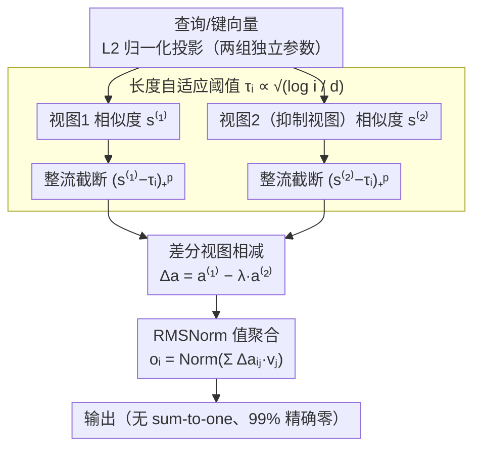

# 阈值差分注意力：无 Sink、超稀疏且非分散的长上下文注意力

**会议**: ACL 2026  
**arXiv**: [2601.12145](https://arxiv.org/abs/2601.12145)  
**代码**: https://github.com/snap-research/TDA  
**领域**: LLM 效率  
**关键词**: 注意力机制, 长上下文, 稀疏注意力, 差分注意力, 极值理论

## 一句话总结
TDA 通过结合长度自适应阈值和差分抑制视图，实现无注意力 Sink、99% 精确稀疏、且性能竞争力的长上下文 Transformer 注意力。

## 研究背景与动机

**领域现状**：自注意力机制因其可微分性和向量化实现效率，已成为 Transformer 的核心。然而，Softmax 注意力在处理长序列时面临根本性的结构限制，主要表现为两类病态现象。

**现有痛点**：Softmax 的 sum-to-one 约束强制模型在无关标记上分配非零概率质量来满足归一化需求，产生注意力 Sink 现象；同时，随着序列长度增长，概率质量逐渐稀释，导致模型对显著标记的关注度下降。虽然基于投影的稀疏方法（如 Entmax）能产生精确零点，但计算代价高昂；而非归一化的整流激活（如 ReLA）虽然高效，却因噪声累积而在长上下文下性能退化。

**核心矛盾**：现有方法无法同时实现三个目标：（1）精确稀疏性和计算效率，（2）无注意力 Sink，（3）长上下文鲁棒性。稀疏方法通常仍强制 sum-to-one 约束，因此无法根本解决 Sink 问题；而整流方法虽然解决了 Sink，但固定阈值在长序列下无法控制噪声增长。

**本文目标**：设计一个 drop-in 替代 Softmax 的注意力机制，同时满足无 Sink、超稀疏、长上下文鲁棒三大需求，且计算开销不超过标准方法。

**切入角度**：从极值理论出发，观察到在高维中，无关查询-键对的点积最大值随序列长度增长而增长（极值效应）。因此可以采用与上下文长度相关的自适应阈值来抑制这些虚假匹配。同时借鉴差分 Transformer 的思想，通过计算抑制性视图与激励性视图的差，进一步消除共模噪声。

**核心 idea**：用长度自适应阈值过滤极值噪声，再用差分视图相消虚假匹配，从而获得无 Sink 的稀疏注意力。

## 方法详解

### 整体框架

TDA 是一个 drop-in 替换 Softmax 的注意力算子，目标是在不依赖 sum-to-one 归一化的前提下，让每一行注意力既稀疏又无 Sink。它分两层叠加构建：底层从整流注意力出发，把固定阈值换成随上下文长度增长的自适应阈值（称为 TRA），先把"序列越长、虚假点积极值越大"这件事压住；上层再叠一个差分构造，用两个独立视图相减消掉共模噪声（得到完整的 TDA）。一行查询向量进来后，依次经过 L2 归一化的投影、与所有历史键计算点积并减去长度阈值做整流截断、最后把被选中的值向量加权求和并经 RMSNorm 输出——整条链路里没有任何一步强制权重和为 1。

### 关键设计

**1. 长度自适应阈值：让截断门槛随 $\log i$ 一起涨**

固定阈值在长序列上必然失效，因为高维中无关查询-键对点积的最大值会随候选数量增长而抬升（极值效应），一个能在短序列上滤掉噪声的常数门槛，到了长序列就会放进越来越多的虚假匹配。TDA 直接用极值理论给阈值定参数化形式：在 sub-Gaussian 假设下虚假点积的最大值应满足 $\tau_i \sim \sqrt{2\log(i/\kappa)/d}$，于是作者把行级阈值写成 $\tau_i := \beta\sqrt{2\log((i+1)/\kappa)/d}$，其中 $i$ 是查询位置、$\beta>0$ 是可学习缩放标量、$\kappa>0$ 控制每行允许的虚假幸存者期望数。截断后的权重为 $\mathbf{a}_{ij} = (\mathbf{s}_{ij} - \tau_i)_+^p$，其中 $(x)_+ = \max(x,0)$、$p \geq 1$ 为幂次。

这个随 $\log i$ 缓慢增长的门槛恰好抵消极值随长度的抬升，从而把噪声控制做成对序列长度稳定的——论文的 Theorem 4.3 证明它保证每行虚假幸存者期望为 $O(1)$，与序列长度无关。这正是 ReLA 这类固定阈值整流方法在长上下文下退化的根因，也是 TDA "非分散"的来源。

**2. 差分视图构造：用两个独立视图相消偶发的高幅噪声**

单个视图即便已把每行虚假幸存者压到 $O(1)$，仍会偶发个别幅度很高的噪声穿过阈值。TDA 借鉴差分 Transformer 的思路再加一层保险：维护两组独立投影参数 $\{(\mathbf{q}^{(t)}, \mathbf{k}^{(t)})\}_{t \in \{1,2\}}$，各自计算相似度并套同一个长度阈值得到 $\mathbf{a}_{ij}^{(t)} = (\mathbf{s}_{ij}^{(t)} - \tau_i)_+^p$，最终权重取两视图之差 $\Delta\mathbf{a}_{ij} = \mathbf{a}_{ij}^{(1)} - \lambda\mathbf{a}_{ij}^{(2)}$，$\lambda \in (0,1)$ 是可学习的抑制强度。

关键观察是：一个虚高的相似度往往源于两个视图共享的非信息性结构，而第二个（抑制）视图正是被训练来捕捉这类非选择性激发的，相减就把共模成分抵消掉。在独立性假设下，同一对标记在两个视图中同时越过阈值的概率从 $O(1)$ 进一步衰减为 $O(1/(i+1))$（Theorem 4.6），随长度渐近消失。这一步还顺带把注意力权重变成有符号的，比纯正权重多了一份表达能力。

**3. RMSNorm 值聚合：在 99% 稀疏下稳住输出**

值聚合写作 $\mathbf{o}_i := \mathrm{Norm}(\sum_{j=1}^{i}\Delta\mathbf{a}_{ij}\mathbf{v}_j)$，这里的 Norm 用 RMSNorm（按激活的根均方值归一化），替代了 Softmax 里行随机归一化的角色。之所以不用标准的均值-方差归一化，是因为 TDA 的权重有 99% 是精确零，一旦活跃权重很少，均值-方差的分母会过小而数值不稳；RMSNorm 只看激活幅度、不依赖均值和方差，对这种极端稀疏的权重分布更鲁棒，正好补上"丢掉 sum-to-one 之后谁来稳定尺度"这个缺口。

### 损失函数 / 训练策略

论文在 FineWebEdu-10B 上从头预训练 GPT-2-162M。核心超参为 $\kappa=1$（虚假幸存者控制）、$\beta=1$（阈值缩放）、$p=2$（幂次）；学习率用线性预热 + 余弦衰减，最大 $10^{-3}$、最小 $10^{-4}$，权重衰减 0.1。扩展到长上下文时采用 NTK 感知的 RoPE 缩放并额外微调 500 步。

## 实验关键数据

### 标准语言建模

| 方法 | 验证损失 | HellaSwag | ARC-Easy | ARC-Challenge | OpenBookQA | PIQA | Winogrande | 稀疏性 |
|------|---------|----------|----------|---------------|-----------|------|-----------|--------|
| Softmax | 3.1196 | 0.345 | 0.526 | 0.223 | 0.180 | 0.641 | 0.490 | 0% |
| Gated Softmax | 3.1489 | 0.330 | 0.474 | 0.194 | 0.162 | 0.620 | 0.500 | 0% |
| Entmax | 3.1941 | 0.342 | 0.508 | 0.194 | 0.198 | 0.632 | 0.523 | 43% |
| ReLA | 3.1657 | 0.329 | 0.512 | 0.226 | 0.194 | 0.634 | 0.509 | 94% |
| Diff Softmax | 3.1941 | 0.336 | 0.509 | 0.225 | 0.178 | 0.648 | 0.514 | 0% |
| Dex | 3.1349 | 0.339 | 0.492 | 0.215 | 0.172 | 0.640 | 0.519 | 0% |
| **TDA** | **3.1190** | 0.337 | 0.524 | 0.220 | 0.216 | 0.628 | 0.489 | **99%** |

TDA 在验证损失上达到最低（3.1190），同时实现 99% 的精确零权重稀疏性，远超其他方法。性能上与基线 Softmax 相当甚至更优。

### 长上下文 SCROLLS 评估

| 方法 | QMSum | SummScreenFD | GovReport | Qasper |
|------|-------|--------------|-----------|--------|
| Softmax | 10.29 | 7.25 | 3.78 | 8.82 |
| Entmax | 11.52 | 10.16 | 4.24 | 11.54 |
| ReLA | 11.20 | 9.14 | 4.42 | 10.77 |
| **TDA** | 11.46 | 9.13 | 5.24 | 11.41 |

TDA 在长上下文 SCROLLS 基准上性能竞争力强，与 Entmax 不相上下但避免了投影方法的计算开销。

### 关键发现

- **注意力 Sink 消除**：第一个标记的 Sink 比率 $\mathrm{gSinkRatio}(1)$ 随序列长度增长保持在均匀分布基线水平，而 Softmax 急剧上升。差分视图的抑制行为对"the"这类高频虚词进行广泛抑制，而对"quick""brown"等内容词保留查询相关的选择性。
- **深度依赖的稀疏性分布**：早期层和后期层高度稀疏（零权重率接近 100%），中间层保持约 50% 活跃度。这与中间层产生更强的查询-键对齐这一认知一致。
- **超参数鲁棒性**：$p=2$ 达到最优；$p=1$ 因移除非线性而明显下降，$p \geq 3$ 梯度方差增大；$\beta=1.0$ 性能最优，在 0.5-1.0 范围内表现稳定。
- **Passkey 检索**：在 4000 标记长度上，TDA 正确率 15% 超过 Softmax 的 6%，在多针检索（2 个和 4 个针）中优势更明显。

## 亮点与洞察

- **理论与实践的优雅结合**：基于 sub-Gaussian 极值理论推导的 $\sqrt{\log i / d}$ 阈值缩放不仅具有坚实的数学基础，也在实验中表现出显著效果。Theorem 4.3 保证每行虚假幸存者期望为 $O(1)$ 独立于序列长度，Theorem 4.6 进一步证明共识虚假幸存者期望衰减为 $O(1/(i+1))$。
- **差分策略的精巧应用**：与其他整流方法不同，TDA 巧妙地复用差分 Transformer 的思想，但通过对两个单独的阈值视图进行差分而非对 Softmax 视图差分，避免了 dense Softmax 的计算代价，同时获得有符号权重的表达性优势。
- **从极值理论到注意力设计的创意跨越**：使用极值统计中的标准技巧（高维中最大值的对数增长）来直接指导注意力阈值的参数化，这种跨学科洞察鲜有在注意力设计中出现。

## 局限与展望

**作者承认的局限**：实验主要在小规模模型（GPT-2-162M）上进行，在多亿参数规模上的表现仍待验证。极度激进的阈值可能导致某些"死头"现象，即某个注意力头在所有位置都无幸存者。

**自己发现的局限**：（1）理论分析中 sub-Gaussian 假设虽在实验上得到经验验证，但对于高度非线性的 Transformer 隐状态分布，这一近似的紧密程度仍不完全清楚；（2）两个视图的独立性假设在训练过程中可能部分破坏（交叉视图相关性从 0.0752 升至 0.1231），长期影响未知；（3）Passkey 检索 4000 标记长度上 15% 的绝对准确率仍有提升空间。

**具体改进思路**：（1）探索层级或头级的自适应阈值调度；（2）在更大规模（十亿参数级）模型上验证 TDA 的可扩展性；（3）与其他长上下文方法（如分块注意力、内存机制）结合。

## 相关工作与启发

- **vs 整流注意力 (ReLA)**：ReLA 通过去掉 sum-to-one 约束天然消除 Sink，但因缺乏长度感知导致噪声累积；TDA 保留整流激活的稀疏性优势，但通过 $\sqrt{\log i / d}$ 阈值和差分视图主动控制噪声。
- **vs 投影稀疏方法 (Entmax)**：Entmax 通过迭代投影实现稀疏但计算代价高（排序开销），且仍然施加 sum-to-one 约束；TDA 通过阈值截断实现 $O(1)$ 虚假幸存者且无归一化约束。
- **vs 长度自适应 Softmax (SSMax)**：SSMax 通过缩放点积来适应长度但仍使用 Softmax；TDA 从结构层面改造注意力机制，从根本上改变了权重分布的性质。

## 评分

- 新颖性: ⭐⭐⭐⭐⭐ 极值理论与注意力设计的首次结合，长度自适应阈值构想新颖。
- 实验充分度: ⭐⭐⭐⭐ 涵盖标准 LM、长上下文、Passkey、超参敏感性和效率分析，实验设计完整；但小规模模型限制了说服力。
- 写作质量: ⭐⭐⭐⭐ 论文逻辑清晰，从问题陈述到理论推导再到实验验证环节流畅。
- 价值: ⭐⭐⭐⭐⭐ 直接解决 Transformer 长上下文的根本瓶颈，99% 稀疏性带来实际效率收益，开源 Triton kernel 便于采纳。

<!-- RELATED:START -->

## 相关论文

- [\[ICLR 2026\] Understanding and Improving Length Generalization in Hierarchical Sparse Attention Models](../../ICLR2026/llm_efficiency/understanding_and_improving_length_generalization_in_hierarchical_sparse_attenti.md)
- [\[ACL 2026\] CoMeT: Collaborative Memory Transformer for Efficient Long Context Modeling](comet_collaborative_memory_transformer_for_efficient_long_context_modeling.md)
- [\[ACL 2026\] Lizard: An Efficient Linearization Framework for Large Language Models](lizard_an_efficient_linearization_framework_for_large_language_models.md)
- [\[ACL 2026\] Understanding LLM Performance Degradation in Multi-Instance Processing: The Roles of Instance Count and Context Length](understanding_llm_performance_degradation_in_multi-instance_processing_the_roles.md)
- [\[ACL 2026\] Native Hybrid Attention for Efficient Sequence Modeling](native_hybrid_attention_for_efficient_sequence_modeling.md)

<!-- RELATED:END -->
