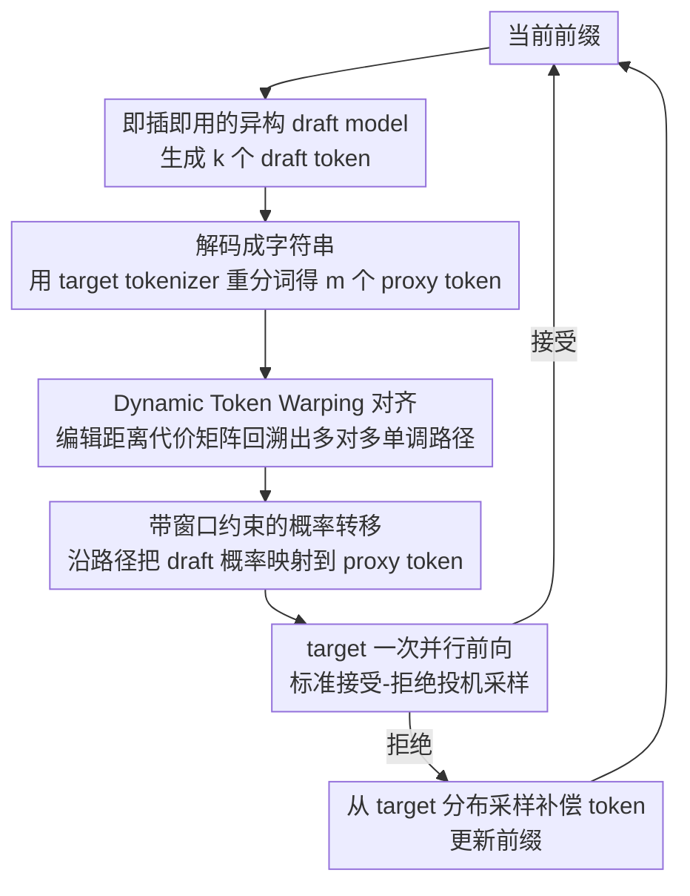

# TokenTiming: A Dynamic Alignment Method for Universal Speculative Decoding Model Pairs

**会议**: ACL2026  
**arXiv**: [2510.15545](https://arxiv.org/abs/2510.15545)  
**代码**: 待确认  
**领域**: 时间序列 / LLM推理加速  
**关键词**: 投机解码, 异构词表, 动态时间规整, 推理加速, 概率映射

## 一句话总结
TokenTiming 把草稿模型生成的 token 序列重新编码到目标 tokenizer 空间，再用动态时间规整构造多对多 token 对齐，从而让不同词表的现成小模型也能作为投机解码 draft model，并在多个 14B-70B 目标模型上取得最高 1.57x 的异构投机解码加速。

## 研究背景与动机
**领域现状**：投机解码已经是大模型推理加速中很实用的一类方法：小 draft model 先快速提出多个候选 token，大 target model 一次前向并行验证这些候选，若候选分布与目标分布足够接近，就能在不改变最终生成分布的前提下减少目标模型调用次数。

**现有痛点**：标准投机解码默认 draft model 和 target model 使用同一套词表，否则 draft token 的概率无法直接拿来与 target token 的概率做接受-拒绝采样。现实中这非常苛刻，因为很多强模型拥有独立 tokenizer；即使同一模型家族的小版本词表相同，小模型也可能仍然太大，无法提供足够的加速收益。若为每个目标模型重新训练 Medusa/EAGLE 式 draft head，又会带来额外训练成本和模型切换成本。

**核心矛盾**：投机解码的“无损”性质依赖概率分布级别的严格校正，但异构 tokenizer 把同一字符串切成不同粒度的 token。已有 TLI 只在词表交集上转移概率，遇到交集外 token 时容易退化为不完整校正；SLEM 能做字符串匹配却不能支持概率采样。也就是说，通用性和无损验证之间存在直接冲突。

**本文目标**：作者希望在不训练、不改模型、不要求共享词表的情况下，让任意现成小模型都能作为 draft model；同时要保留投机采样的分布一致性，并让额外对齐开销足够小，不能把加速收益吃掉。

**切入角度**：论文观察到异构 tokenizer 的问题本质上像两条“时间轴”上的序列对齐：draft token 序列和 target 重新分词后的 proxy token 序列长度不同、局部粒度不同，但它们描述的是同一段字符串。动态时间规整（DTW）正擅长在不同长度序列之间寻找单调、多对多的最小代价路径。

**核心 idea**：用 DTW 在 draft token 与 target proxy token 之间建立动态对齐路径，再沿路径把 draft 概率转移到 target token 上，用这个映射后的概率执行标准投机采样。

## 方法详解

### 整体框架
TokenTiming 是一个纯推理时算法。每一轮解码从当前前缀开始，draft model 先生成长度为 $k$ 的 draft token 序列；系统把这些 draft token 解码成字符串，再用 target tokenizer 重新分词，得到 proxy target token 序列。由于两边 tokenizer 不同，draft 序列长度 $k$ 和 proxy 序列长度 $m$ 通常不一样，局部 token 边界也不对齐。

随后，TokenTiming 对这两条 token 序列运行 Dynamic Token Warping，得到一条单调对齐路径。路径中的节点可能是一对一、一对多或多对一关系，正好覆盖“Scaling”在一个 tokenizer 里是单 token、在另一个 tokenizer 里是多个子 token 的情况。最后，算法根据这条路径把 draft 侧概率映射到 proxy target token 上，target model 对 proxy 序列做一次并行前向，按标准投机采样规则逐 token 接受或拒绝；一旦拒绝，就从 target 分布中采样补偿 token 并更新前缀。

### 关键设计

**1. Dynamic Token Warping 对齐：把“词表交集匹配”换成沿字符串序列的多对多动态对齐**

异构 tokenizer 的麻烦在于同一段字符串被切成不同粒度、不同位置的 token，draft 序列长度 $k$ 和 proxy 序列长度 $m$ 往往不等。已有 TLI 只在词表交集上转移概率，交集外 token 一律失效；TokenTiming 转而把这件事当作两条序列的对齐问题来解。算法构造累计代价矩阵 $C$，局部距离主要用 Levenshtein 编辑距离，每个位置取来自上、左、左上的最小累计代价，最后从终点回溯出最优路径 $\pi^*$。

这条路径不是看 token 是否相同，而是按字符串相似性和序列顺序共同决定的动态对齐，节点可以是一对一、一对多或多对一——正好覆盖“Scaling”在一个 tokenizer 里是单 token、在另一个里被拆成多个子 token 的情况。因为异构分词的错位通常是局部且单调的，DTW 能在保持顺序的前提下容纳局部拉伸或压缩，处理 BPE、WordPiece 这类粒度差异比 TLI 自然得多。

**2. 带窗口约束的概率转移：让标准投机采样公式在映射后的 draft 概率上照常成立**

无损投机解码的关键不是让 token 字符串看起来一致，而是要给接受-拒绝校正一个合理的 draft 概率。对齐路径给出了 draft token block 与 target token block 的对应关系，TokenTiming 沿路径把 draft 侧概率分配到 proxy target token 上；验证时仍沿用标准接受概率

$$\min\left(1,\ \frac{q(t_j)}{p(t_j)}\right)$$

其中 $q$ 来自 target model、$p$ 来自映射后的 draft 分布。为了不让 DTW 的对齐开销吃掉加速收益，作者加入 Sakoe-Chiba Band，只在 $|i-j| \leq w$ 的带状区域内搜索，把复杂度从 $O(km)$ 降到 $O(w\max(k,m))$。窗口约束利用了“分词错位通常不会无限漂移”这一事实，用很小的代价换来更稳定的概率映射，也避免过远位置的 token 互相干扰。

**3. 即插即用的异构 draft model：把 tokenizer 差异全部塞进每轮 Draft-Verify 之间的轻量对齐里**

投机解码真正难落地的不是算法形式，而是“为每个 target 找一个又小又同词表的 draft”。TokenTiming 让 target model 和 draft model 的权重都不动，所有 tokenizer 差异都在重分词 + DTW 对齐 + 概率映射这几步里处理掉。于是 draft model 可以从 68M 的 Vicuna 到 350M 的 OPT、再到 0.5B/0.6B 的 Qwen 自由接入，目标模型也能覆盖 dense、distilled 和 MoE 架构。一旦异构词表不再是硬约束，系统就能优先按速度、能力和部署条件挑选 draft model，而不必为每个 target 重训一套 Medusa/EAGLE 式 draft head。

### 损失函数 / 训练策略
TokenTiming 不训练模型，也不引入新参数。它只在推理时增加重分词、DTW 对齐和概率映射三个步骤。实验中作者比较了不同窗口宽度 $w=4,8,16,\infty$，发现合适的局部窗口（如 $w=8$）比无限制对齐更有利，因为它既减少开销，也避免概率映射被过远位置的 token 扭曲。论文还报告 TokenTiming 单轮阻塞开销约 663 微秒，占整体运行时间约 0.1%-0.5%，远小于吞吐提升带来的收益。

## 实验关键数据

### 主实验
作者在 Spec-Bench 上评估 25 组 target/draft 模型组合，任务覆盖数学、代码、翻译、摘要和问答。下表摘出几个代表性组合，数值为论文表 1 中的 TPS、接受率和相对 AR 的 speedup。

| 目标模型 | Draft 模型 | TLI TPS | TokenTiming TPS | TLI 接受率 | TokenTiming 接受率 | TLI 加速 | TokenTiming 加速 |
|----------|------------|---------|-----------------|------------|--------------------|----------|------------------|
| DeepSeek-R1-Distill-Llama-70B | Qwen2.5-0.5B | 15.68 | 19.26 | 0.34 | 0.40 | 1.07x | 1.31x |
| DeepSeek-R1-Distill-Llama-70B | OPT-350M | 16.03 | 21.35 | 0.19 | 0.31 | 1.09x | 1.45x |
| Qwen3-32B | Qwen3-0.6B | 19.16 | 24.78 | 0.43 | 0.42 | 1.21x | 1.57x |
| Phi-4 | Qwen2.5-0.5B | 17.64 | 35.58 | 0.19 | 0.39 | 0.76x | 1.54x |

从这些结果看，TokenTiming 的收益不只来自某一个模型家族。在词表重合度较低的 OPT/Vicuna draft 上，它仍然能给出可用的加速；在 Qwen3-32B、Phi-4 这类目标模型上，DTW 对齐明显扩大了 TLI 原本利用不了的 token 概率空间。

### 消融实验
论文还按任务类别比较了 TLI 与 TokenTiming 的加速。下表保留几组代表性结果，展示该方法在不同生成任务上的稳定性。

| 目标 / Draft | 数学 TLI→Ours | 代码 TLI→Ours | 翻译 TLI→Ours | 摘要 TLI→Ours | QA TLI→Ours |
|--------------|---------------|---------------|---------------|---------------|-------------|
| DeepSeek-R1-70B / Qwen2.5-0.5B | 1.03x→1.48x | 1.05x→1.34x | 1.62x→2.54x | 0.94x→1.07x | 0.99x→1.08x |
| Qwen3-32B / Qwen2.5-0.5B | 1.44x→2.53x | 1.29x→1.80x | 1.91x→2.49x | 1.41x→1.28x | 1.01x→1.13x |
| Phi-4 / Qwen2.5-0.5B | 0.90x→1.57x | 0.94x→1.60x | 0.67x→1.31x | 0.71x→1.55x | 0.76x→1.55x |

另一个重要分析是与同词表 SOTA 的距离：在 7B target 上，EAGLE-3 达到 2.58x，而 TLI 最高约 1.32x，TokenTiming-OPT-350M 提升到 1.80x；在 33B target 上，TokenTiming-OPT-350M 达到 2.27x，已经超过 Medusa 的 1.71x 和 EAGLE-1 的 2.21x，距离 EAGLE-3 的 2.71x 只差 0.44x。

### 关键发现
- DTW 的价值在异构词表场景最明显：当词表交集不足以覆盖 draft 输出时，TLI 会失去很多可校正概率，而 TokenTiming 仍能沿字符串序列建立可用映射。
- 窗口约束不是单纯为了省时间。论文发现 $w=8$ 相比无限制对齐反而更好，说明过宽的对齐会引入不稳定的远距离 token 映射。
- 方法需要排除重复生成造成的虚高速度。作者从主分析中剔除了约 15% 的病态重复样本，避免“重复 token 太好预测”把接受率和 speedup 人为抬高。

## 亮点与洞察
- 把 tokenizer mismatch 重新表述为序列时间轴对齐非常巧妙。它绕开了“词表交集”这个离散硬条件，转而利用字符串层面的单调结构，让概率转移有了连续的桥。
- 方法的工程姿态很实用：不训练、不改模型、不绑定同一模型家族，只在推理时做轻量对齐。对于真实推理服务来说，这比为每个目标模型维护专用 draft head 更容易部署。
- 论文对“无损”问题的处理比简单字符串匹配更严肃。TokenTiming 不是只生成看起来相同的文本，而是把映射后的 draft 概率放回标准投机采样接受规则中，尽量保留目标模型分布一致性。

## 局限与展望
- 论文承认当前概率转移近似偏 one-hot，主要直接转移 top-1 token 概率，尚未充分利用 draft 分布中更多候选 token 的概率质量。
- DTW 的距离基于字符/编辑距离，而不是语义距离。对中英文混排、Unicode 特殊符号、形态变化丰富语言，字符相似不一定等价于合理的 token 概率对应。
- 实验虽然覆盖多种任务和模型，但仍主要评估离线 benchmark；在真实服务中的 batch 调度、KV cache 管理、多用户延迟尾部等系统因素还需要进一步验证。
- 未来可以探索语义感知或 tokenizer-aware 的距离函数，也可以把概率分配从“路径上直接赋值”扩展为局部 soft alignment，进一步降低错配风险。

## 相关工作与启发
- **vs TLI**: TLI 在 draft/target 词表交集上转移概率，优点是简单，但交集外 token 处理不完整；TokenTiming 用 DTW 构造完整 token 路径，因此能处理词表交集很小的 draft model。
- **vs RDK**: RDK 通过矩阵把 draft 分布重分配到 target 分布，思路更接近全局词表映射；TokenTiming 更偏在线序列对齐，依赖当前生成字符串，因此不需要预先学习或构造大规模词表转换矩阵。
- **vs Medusa / EAGLE**: Medusa 和 EAGLE 通过附加 draft head 或专门训练获得强加速，但通常绑定 target model；TokenTiming 加速上仍有差距，却换来了跨模型即插即用能力。

## 评分
- 新颖性: ⭐⭐⭐⭐☆ 用 DTW 解决异构 tokenizer 投机解码很自然但切入点漂亮，核心贡献在问题重表述和概率映射落地。
- 实验充分度: ⭐⭐⭐⭐☆ 模型组合、任务类型和窗口分析都比较完整，但真实 serving 场景评估还可以更强。
- 写作质量: ⭐⭐⭐⭐☆ 主线清楚，图示直观；部分表格排版和概率映射细节还可以更精炼。
- 价值: ⭐⭐⭐⭐⭐ 异构 draft model 是投机解码部署的关键瓶颈，这篇论文给出了低成本、可落地的通用化路径。

<!-- RELATED:START -->

## 相关论文

- [\[ACL 2026\] Multi-Drafter Speculative Decoding with Alignment Feedback](multi-drafter_speculative_decoding_with_alignment_feedback.md)
- [\[CVPR 2026\] ParallelVLM: Lossless Video-LLM Acceleration with Visual Alignment Aware Parallel Speculative Decoding](../../CVPR2026/llm_efficiency/parallelvlm_lossless_video-llm_acceleration_with_visual_alignment_aware_parallel.md)
- [\[NeurIPS 2025\] 3-Model Speculative Decoding (PyramidSD)](../../NeurIPS2025/llm_efficiency/3model_speculative_decoding.md)
- [\[ACL 2026\] Speculative Verification: Exploiting Information Gain to Refine Speculative Decoding](speculative_verification_exploiting_information_gain_to_refine_speculative_decod.md)
- [\[ACL 2026\] RACER: Retrieval-Augmented Contextual Rapid Speculative Decoding](racer_retrieval-augmented_contextual_rapid_speculative_decoding.md)

<!-- RELATED:END -->
