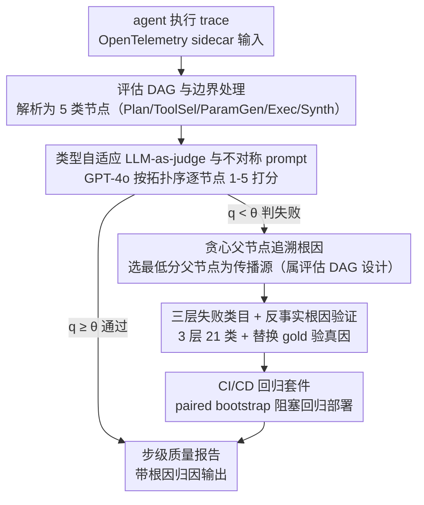

# AgentEval: DAG-Structured Step-Level Evaluation for Agentic Workflows with Error Propagation Tracking

**会议**: ACL 2026  
**arXiv**: [2604.23581](https://arxiv.org/abs/2604.23581)  
**代码**: https://github.com/bettyguo/AgentEval (有)  
**领域**: LLM Agent 评测 / 软件工程  
**关键词**: agent evaluation, DAG, LLM-as-judge, root cause analysis, regression detection

## 一句话总结
AgentEval 把 agent 执行轨迹建模成「评估 DAG」，对每个节点用 GPT-4o 判官按 5 类节点类型打分并按贪心父节点策略追溯根因，配合 21 类失败类目与 CI/CD 集成；相对端到端评估在 450 条生产 trace 上 failure detection recall 提升 2.17×（0.41→0.89），人类一致性 $\kappa=0.84$，根因准确率 72%（接近人类上限 81%），4 个月试点把根因定位中位数时间从 4.2 小时缩到 22 分钟。

## 研究背景与动机

**领域现状**：62% 的组织在试 agent，23% 已经在 scaling 部署。但 agent 评测主要靠端到端结果（任务是否完成）或人工抽看 trace，前者会掩盖中间错误，后者不可扩展。Gartner 预测到 2027 年 40% 的 agent 项目会因为缺乏系统评估而被砍。

**现有痛点**：(1) 端到端评估只看终态，错误是从哪一步开始、传到哪一步、是不是 cascade，都看不见；(2) AgentBench/SWE-bench/WebArena 等静态 benchmark 是「能力」评测而非「部署」基础设施，没法做持续监控、回归检测、CI/CD；(3) LangSmith/Phoenix/AgentOps 等可观测工具有 trace 视图但没有正式的依赖建模、错误传播追踪与根因归因；(4) Process supervision 文献证明评中间步比只评结果好，但都是用于训练（PRM），没人把它做成推理时的工程基础设施。

**核心矛盾**：agent 工作流本质是 DAG，错误会沿依赖链复合放大（论文实测 63% 的步级失败是上游传播过来的）；但工业评测要么停在端到端，要么是与 DAG 结构脱节的扁平步评。

**本文目标**：(1) 形式化 agent 执行为 DAG；(2) 给每类节点定可校准的步级质量度量；(3) 提供从失败到根因的自动归因；(4) 把以上能力集成进 CI/CD 做回归检测。

**切入角度**：把软件工程里的 spectrum-based fault localization 思想搬到 agent trace，并用 LLM-as-judge 替换硬规则做语义评分，用对比 ablation 把「DAG 结构」这一变量单独剥离出来量化。

**核心 idea**：「不是端到端测能跑通，也不是扁平评每步质量，而是用 DAG 显式跟踪每个失败是上游传过来的还是局部产生的，并按依赖关系给出可执行的根因。」

## 方法详解

### 整体框架
AgentEval 是一套与 OpenTelemetry 兼容的 sidecar 评估服务，输入是一条 agent 执行 trace、输出是带根因归因的步级质量报告。一条 trace 进来后先被解析成「评估 DAG」$\mathcal{G}=(V,E,\tau,\mathcal{M})$，其中节点类型 $\tau$ 取自 5 元集 $\{\text{Plan, ToolSel, ParamGen, Exec, Synth}\}$，每类节点各配一组指标；接着 GPT-4o 判官按拓扑序逐节点用 1-5 rubric 打分，失败节点沿依赖链追溯到根因；再把失败映射到 3 层 21 类的失败类目供事后聚类；最后这套能力封进 CI/CD 回归套件，用配对显著性检验阻塞有回归的部署。整条链路把软件工程里的 spectrum-based fault localization 思想搬到 agent trace，用 LLM-as-judge 替换硬规则做语义评分。

### 关键设计

**1. 评估 DAG 与三类边界处理：让每个失败带上可追溯的依赖上下文**

扁平步评的盲区在于看不到「step3 的 context truncation 把后面全带歪」这种 cascade，而完整的 causal inference 又太重。AgentEval 取一个工程友好的折中：trace 拓扑排序后逐节点评估，节点 $v_i$ 的上下文 $c_i$ 只聚合父节点 $\mathrm{pa}(v_i)$ 的输出而不含父节点的判官分数（避免判官对上游「附议」）。一旦 $q(v_i)<\theta_{\tau(v_i)}$ 判失败，若多个父节点也低于阈值，就按贪心策略选最低分父节点 $v_j^*=\arg\min_{v_j\in\mathrm{pa}(v_i)}q(v_j)$ 作为传播源，否则标为 root cause。

这个贪心「往最近邻找」的选择经过了实测检验：pilot 中 72% 的归因离真实根因 ≤1 跳、91% ≤2 跳，远低于随机分配 2.8 跳的期望；论文还对比了 full-path-min 策略（RCA 高 3 pp 但误归因翻倍），说明对工程师而言「最近邻」比「全局最优」更有用。工程上还有三类边界处理：同时维护 schema-defined DAG（预期结构）与 trace-inferred DAG（实际结构），把两者偏差当质量信号（偏差 trace 失败率是符合的 2.1×）；约 12% 的非 DAG trace 用 retry loop unroll + 时间戳分支重建；剩下 0.8% 实在重建不了才回退到扁平评估。

**2. 类型自适应的 LLM-as-judge 与不对称 prompt：一个判官评异构 5 类步、还不被上游带跑**

5 种步类型异构度很高——Plan 看完整性+可行性，ToolSel 看选择准确性+相关性，ParamGen 看类型/取值/完备性，Exec 看成功率+结果有效性，Synth 看忠实度+完整度+连贯性——所以判官（GPT-4o, $T{=}0$）对每类步切换不同指标集，且必须与 agent（Claude 3.5 Sonnet / Llama 3 70B）跨模型家族以避免循环偏置。Prompt 用不对称设计：Plan 节点对照原始 user query 打分（因为它是把 query 翻译成结构的源头），其余节点只对照上游传来的本地上下文打分、不再重判原 query。

不对称的意义在于责任归属——「优雅处理了上游 bug 的下游步」不会被罚，「放大上游 bug 的下游步」才会被罚，从而避免一个上游 bug 在下游被复算成 N 个 root cause，把根因数稳定在真正起源那一步。校准用 5 个跨分数段的 anchor 做 stratified few-shot 锚定而非迭代调 prompt。这套设计还顺带让成本可控：因为「验证一个 tool 选择是否合理」比「自己选 tool」简单，所以判官可以比 agent 弱，GPT-4o-mini 跑下来约 \$0.02/trace。

**3. 三层失败类目 + 反事实根因验证：既能语义化分类，又能证明归因是真因**

失败被映射到 3 层、9 个 L2、21 个 L3 子类（如 Planning/Execution/Integration → Context loss/Output hallucination/Premature termination → Truncation/Fabrication 等）。这套类目从 523 条独立开发 trace（与 450 条评测 trace 完全 disjoint）经 3 人独立 affinity diagramming 共识构建，锁定后只用评测集验证覆盖度，避免数据泄漏。

光有高 detection recall 不能证明归因正确，所以论文加了反事实验证：对 30 条失败 trace，把被标为 root cause 的步替换成 gold reference 输出后重跑下游，87%（26/30）的情况下游分数确实回升（平均 +2.3 分），直接回答了「修了它真能修好下游吗」。这也解释了 DAG 为何强于 flat——Context loss 的下游放大因子高达 3.2×，传播放大效应正是依赖建模能捕捉、扁平评估会漏掉的部分。

### 损失函数 / 训练策略
AgentEval 是推理时框架、无训练损失。各类型阈值 $\theta_\tau$ 分别校准；回归检测用 paired bootstrap（$p<0.05$、10000 resample）叠加历史 2σ 的双阈值告警；progressive evaluation 先用 10 条 smoke test（<5 min）门控，通过后再跑完整套件（100+ 条、<1h），整体节省约 80% 评测成本。

## 实验关键数据

### 主实验
450 条生产 trace（CS/DA/DP 三个 workflow 各 150）+ 150 条人评子集（987 步标注），与 3 个基线比较：

| 方法 | FDRec ↑ | FPR ↓ | HA ($\kappa$) ↑ | RCA ↑ |
|------|---------|-------|-----------------|-------|
| E2E Only | 0.41 | 0.08 | 0.52 | N/A |
| Flat Step | 0.67 | 0.15 | 0.71 | 0.38 |
| Rule-Based (47 条) | 0.58 | 0.05 | 0.63 | 0.45 |
| **AgentEval** | **0.89** | 0.07 | **0.84** | **0.72** |

FDRec 计算的是「人标 195 个失败步里有多少被检出」，AgentEval 相对 E2E 提升 2.17×，相对 Flat Step（除 DAG 外完全相同）提升 +22 pp，独立量化了 DAG 结构的贡献。

### 消融实验
Four 个组件的影响（去除某项后的指标）：

| 配置 | FDRec ↑ | HA ↑ | RCA ↑ | 说明 |
|------|---------|------|-------|------|
| Full AgentEval | 0.89 | 0.84 | 0.72 | 完整框架 |
| −DAG 结构 | 0.67 | 0.71 | 0.38 | 最大降幅（−22 pp / −34 pp）|
| −LLM-as-judge（换规则）| 0.62 | 0.66 | 0.51 | 第二大降幅 |
| −失败类目 | 0.82 | 0.79 | 0.54 | 主要伤 RCA（−18 pp）|
| −Calibration anchors | 0.85 | 0.76 | 0.68 | 主要伤 $\kappa$（−8 pp）|

### 关键发现
- DAG 结构是单一最关键组件——FDRec 与 RCA 一同最大降幅说明依赖建模不仅检出更多失败，还能告诉你失败是哪儿起源。
- 工作流越长 DAG 越占优：≤3 步时仅 +15 pp FDRec，≥6 步时 +28 pp，符合「错误放大」假说。
- 跨基准泛化好：在 τ-bench（120 trace）和 SWE-bench（80 trace）上无须改 taxonomy，FDRec ≥0.78，但 RCA 下降 14-20 pp，说明检测可迁移、归因依赖领域 taxonomy 扩展。
- 4 个月真实试点（18 个工程师）：检出 23 个上线前回归（8 个真、12 个边界、3 个误报），CS-Agent 失败率从 31% 降到 18%（修了一个 context truncation bug），DA-Agent 参数错误率从 27% 降到 11%。

## 亮点与洞察
- 把「DAG-as-evaluation-structure」与「LLM-as-judge」结合是工程上的关键 unlock——前者解决了「错误传播看不见」，后者解决了「rule 太脆」。
- Counterfactual root cause validation（替换为 gold 后看下游是否回升）是 RCA 类工作里最有说服力的验证范式，可迁移到 process supervision、reasoning chain debug、code agent 等任意有依赖链的任务。
- 「判官不必比 agent 强」这一观察反直觉但实用——动态调度 cheaper judge 来跑大规模评测可在不牺牲 detection 的前提下大幅压成本。

## 局限与展望
- 主要适用于以顺序 + 中度分支的 tool-calling agent；非 DAG 比例 >60% 时（如多 agent collaboration、长 reasoning loop、Tree-of-Thought）优势 <5 pp。
- 核心实验在单组织（CS/DA/DP）上完成，外部基准（τ-bench/SWE-bench）虽证明可迁移，但 RCA 仍依赖领域 taxonomy。
- LLM-as-judge 有模型相关偏置，虽跨家族评估缓解但未消除；RCA 是贪心启发式而非形式 causal inference。
- 试点中 baseline 4.2 小时（survey）vs 22 分钟（log）的测量工具不同，绝对值需谨慎，但方向性改进一致。

## 相关工作与启发
- **vs Process Supervision (Lightman 2024, Uesato 2022)**: 都强调中间步评估，但他们是用 PRM 做 RL training reward；AgentEval 把它做成推理时的部署基础设施 + 可持续监控。
- **vs LangSmith/Phoenix/AgentOps**: 这些工具有 trace 视图但缺乏正式 DAG 依赖建模、错误传播追踪与根因归因，AgentEval 是首个把这三者整合并量化收益的开源框架。
- **vs Spectrum-based Fault Localization (Jones 2005)**: 借用其根因思想但用 LLM-as-judge 替换硬规则做语义打分，且贪心策略经过反事实验证。

## 评分
- 新颖性: ⭐⭐⭐⭐ 整合点多但单点都有先例（process supervision、LLM judge、SBFL）；亮点是 DAG-as-evaluation-structure 的系统化与反事实验证。
- 实验充分度: ⭐⭐⭐⭐⭐ 450 trace + 4 模型判官 + 跨基准 + 4 个月试点 + 反事实验证 + 架构边界分析，少见的完整。
- 写作质量: ⭐⭐⭐⭐ 数据透明度高（CI、$\kappa$、RCA strategy 对比），caveat 主动说明。
- 价值: ⭐⭐⭐⭐⭐ 直接解决 agent 产品化痛点，已有 4 个月真实部署证据，代码开源。

<!-- RELATED:START -->

## 相关论文

- [\[ACL 2026\] TaxPraBen: A Scalable Benchmark for Structured Evaluation of LLMs in Chinese Real-World Tax Practice](taxpraben_a_scalable_benchmark_for_structured_evaluation_of_llms_in_chinese_real.md)
- [\[ACL 2026\] MultiFileTest: A Multi-File-Level LLM Unit Test Generation Benchmark and Impact of Error Fixing Mechanisms](multifiletest_a_multi-file-level_llm_unit_test_generation_benchmark_and_impact_o.md)
- [\[ACL 2026\] HoWToBench: Holistic Evaluation for LLM's Capability in Human-level Writing using Tree of Writing](howtobench_holistic_evaluation_for_llms_capability_in_human-level_writing_using_.md)
- [\[ICML 2026\] Beyond Trajectory-Level Attribution: Graph-Based Credit Assignment for Agentic Reinforcement Learning](../../ICML2026/llm_evaluation/beyond_trajectory-level_attribution_graph-based_credit_assignment_for_agentic_re.md)
- [\[ICLR 2026\] Talk, Evaluate, Diagnose: User-aware Agent Evaluation with Automated Error Analysis](../../ICLR2026/llm_evaluation/talk_evaluate_diagnose_user-aware_agent_evaluation_with_automated_error_analysis.md)

<!-- RELATED:END -->
