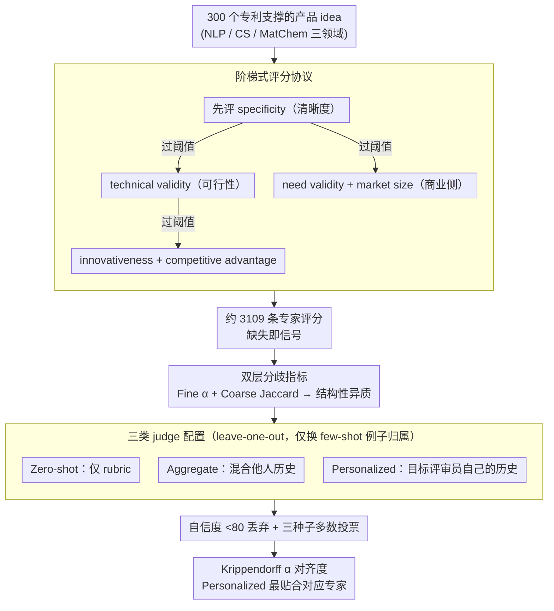

# Aggregate vs. Personalized Judges in Business Idea Evaluation: Evidence from Expert Disagreement

**会议**: ACL 2026 Oral  
**arXiv**: [2604.22517](https://arxiv.org/abs/2604.22517)  
**代码**: 无  
**领域**: LLM 评测  
**关键词**: LLM-as-a-Judge, 商业 idea 评估, 专家分歧, 个性化评判, 多维评分

## 一句话总结
针对商业 idea 评估中专家系统性分歧的现实，构建了 3000 个个体专家评分的 PBIG-DATA 数据集，并实证证明在该领域"个性化 judge（条件于目标评审员历史）"比"汇总 judge（条件于多评审员混合历史）"更贴合专家行为，挑战了"用 pooled labels 当唯一 ground truth"的常见假设。

## 研究背景与动机

**领域现状**：LLM-as-a-Judge 已成为大规模评估生成质量的主流方案，常见做法是把多位评审员的标签 pool 起来当作单一 ground truth，让 judge 模型去逼近这个 pooled signal。

**现有痛点**：在商业 idea 评估这种需要多维（可行性、新颖性、差异化、市场潜力等）判断的场景下，即便用同一份 rubric，不同背景（技术 vs 商业）的专家往往给出系统性不同的分数。把这种分歧当作"标注噪声"再 pool 平均，会抹掉真正的异质标准。

**核心矛盾**：标准 LLM-as-a-Judge 假设"一个 idea 有唯一正确分数"，但实证发现商业 idea 评估根本不存在这样的单一标准——评审员之间细粒度序数评分 Krippendorff's α 接近 0 甚至负数，却在"挑出强 idea"的粗粒度选择上一致性更高。

**本文目标**：用一个真实多评审员数据集量化分歧本质，并测试 judge 设计的两个对立选项——汇总型 vs 个性化型——谁更适合反映这种多元化的专家判断。

**切入角度**：把 idea 评估看成 pluralistic 评估问题，承认"评审员个体内部一致但彼此异质"，那么相比强行收敛到共识，给每个评审员"配一个 judge"可能才是正确建模。

**核心 idea**：用 PBIG-DATA 实证刻画专家分歧结构，比较 zero-shot、aggregate、personalized 三种 judge 配置，证明 personalized judge 在多模型尺寸下都更贴合对应评审员。

## 方法详解

### 整体框架

整篇工作要回答的问题是：在专家系统性分歧的商业 idea 评估里，judge 该向「共识」收敛还是向「个体」对齐。为此它分两步走。第一步是数据构建——围绕 300 个基于专利、由 LLM 生成的产品 idea（覆盖 NLP/CS/MatChem 三领域），让每个 idea 由 4-12 名领域专家在 6 个维度上按阶梯式协议打分，最终得到约 3,109 条评分，并用双层指标刻画分歧到底是噪声还是结构。第二步是 judge 评估——在同一份数据和 leave-one-out 协议下，把 zero-shot、aggregate、personalized 三种 judge 配置摆在一起，唯一的变量是 few-shot 例子的评审员归属，再用 Krippendorff's α 比对 judge 预测与对应专家标注的对齐度。

### 关键设计

**1. PBIG-DATA 多维 + 阶梯式评分协议：把「该评哪些维度、用什么尺度、何时跳过」写进数据本身**

商业评审里「这个 idea 太模糊以至于谈不上可行性」是常态，强迫专家给劣质 idea 也打满 6 个维度只会引入噪声，所以协议把「缺失」当成评估流程的一部分而非缺陷。6 个维度各用匹配自身自然粒度的尺度：specificity / technical validity / competitive advantage 用 1-4，innovativeness 用 1-5（多一档区分「惊艳但不颠覆」），need validity / market size 用 0-3（0 表示「不是 B2B 产品」的类别排除）。

阶梯筛选规则是逐层放行：先打 specificity，过阈值才评 technical validity，再过阈值才评 innovativeness 和 competitive advantage；need validity / market size 也仅在 specificity 过阈值时才评。这样一来低质 idea 不会被硬塞进下游维度，留下的评分都是「值得评」的，缺失本身也成了一个信号。

**2. 分歧量化的双层指标（Fine vs Coarse）：分开看序数分数和强 idea 选择**

如果只用一个指标，「分歧大」既可能是纯噪声、也可能是结构性异质，无法区分。论文因此把 agreement 拆成两层：Fine-grained agreement 用 Krippendorff's α 衡量序数评分的一致性；Coarse agreement 则看「各评审员各自中位数以上的 idea 集合」之间的 Jaccard 相似度（仅在两两评审员有 ≥10 条共评 idea 时才计算）。

两层一起看才能揭示真相：细粒度上分歧很大、粗粒度上却仍有共识，说明每个评审员有自己稳定但彼此不同的标准，而非随机乱打。这个「细粒度低、粗粒度高」的组合正是后续支持 personalized judge 的实证基础——既然分歧是结构性的，那为每个评审员配一个 judge 就比强行收敛到平均更合理。

**3. 三类 judge 配置对比设计：只动评审员条件这一个变量，隔离「target signal 假设」**

要严格回答「汇总 vs 个性化哪个对」，必须让例子数量、领域、采样逻辑全部对齐，只改 few-shot 例子的评审员归属。于是三种配置被设计成：(a) Zero-shot judge 只给 rubric 和指令、不看任何专家历史；(b) Aggregate judge 的 few-shot 例子取自「非目标评审员」的混合历史（同领域、同维度、不同专利），代表 pooled-label 假设；(c) Personalized judge 的 few-shot 例子专门取自「目标评审员自己」的历史，代表多元化假设。后两者的唯一差别就是例子归属，保证对比公平。

为降低预测噪声，judge 同时输出 0-100 的自信度，沿用 Dong et al. 2024 的做法把自信度 <80 的预测丢掉，并用三个随机种子做多数投票。这套控制变量的安排是结论可信的关键——任何 personalized 优于 aggregate 的差距都只能归因到「向单一评审员对齐」这一件事上。

### 损失函数 / 训练策略

无训练。所有 judge 都用 Qwen3-Instruct 系列（4B / 30B-A3B / 30B-A3B-Thinking / 235B-A22B）以及 GPT-5 mini 直接做 few-shot prompting，主要变量是 few-shot 例子的数量（0 / 1 / 2 / 5 / 10）和归属（target evaluator vs 非 target）。

## 实验关键数据

### 主实验（专家分歧结构）

| 维度 | Fine α (NLP) | Fine α (CS) | Fine α (Mat) | Coarse Jaccard (NLP) | Coarse Jaccard (Mat) |
|------|------------|------------|------------|--------------------|---------------------|
| Specificity | 0.06 | -0.11 | 0.04 | 0.45 | 0.45 |
| Technical validity | -0.03 | -0.40 | -0.28 | 0.50 | 0.42 |
| Innovativeness | 0.33 | 0.47 | 0.46 | 0.71 | 0.54 |
| Competitive advantage | -0.08 | 0.24 | -0.02 | 0.71 | 0.46 |
| Need validity | -0.23 | 0.02 | 0.05 | – | 0.89 |
| Market size | 0.48 | -0.31 | 0.08 | – | 0.57 |

细粒度 α 多数维度接近 0 甚至负数，粗粒度 Jaccard 显著更高（0.4-0.9），说明分歧是"标度不同但偏好结构相似"的结构性异质。

### Judge 对齐度对比

数据集：PBIG-DATA 六维度 × 三领域；指标：judge 预测 vs 对应专家标注的 Krippendorff's α。

| Judge 配置 | 与对应评审员对齐度 | 趋势随 few-shot 数量 |
|-----------|------------------|-------------------|
| Zero-shot judge | 基线（低） | 不变 |
| Aggregate judge | 中等 | 略提升后趋平 |
| **Personalized judge** | **最高** | 随 shot 数增加单调改善 |

模型越大，Personalized vs Aggregate 的差距越明显（在 4B → 30B → 235B 上 gap 拉大）。

### 关键发现
- 在所有维度和模型尺寸上，personalized judge 都比 aggregate judge 更贴合对应评审员，且差距随模型容量放大。
- Aggregate judge 通常比 zero-shot 好，说明给 LLM 一些专家示例总归有用；但 pool 起来的示例提供的"目标信号"是模糊的，不及指向单一评审员的示例。
- 评审员之间的 agreement 仅在 personalized 条件下才与 judge-generated reasoning 的相似度正相关——这间接证明 personalized judge 学到的是"评审员特定的推理风格"，而非通用判据。

## 亮点与洞察
- 把"分歧 = 噪声"的默认假设直接拎出来质疑，并用数据集 + 实验给出有力反例——这种 problematizing 方法论本身就是贡献。
- 双层 agreement 指标（fine + coarse）是优雅的诊断工具：能区分"完全噪声"（两层都低）vs"结构性分歧"（细粒度低、粗粒度高），适合任何主观评估场景。
- 阶梯筛选协议巧妙避免了"为了完整性强行给劣质 idea 打满分"的噪声源，缺失作为信号而非缺陷。
- Leave-one-out + 严格控制变量的实验设计很扎实——personalized 和 aggregate 在 shot 数、领域、维度、模型上都对齐，只换评审员归属，结论可信。

## 局限与展望
- 数据规模偏小（300 idea / 3109 评分），每位评审员的历史最多几十条，是否足以让 LLM 真正学会"评审员风格"存疑。
- 仅测了 Qwen3 系列 + GPT-5 mini，对 Claude/Gemini 等的迁移性未验证。
- 只关注 idea 评估这一具体任务，结论能否推广到其他主观任务（翻译、写作、伦理判断）仍待检验。
- 个性化 judge 在实际部署中需要为每位评审员维护历史，存储/隐私成本不可忽视。

## 相关工作与启发
- **vs Dong et al. 2024 (personalized judging)**: 该工作首次提出 personalized judging 思路，本文把它放进系统性低 agreement 的极端场景下严格验证，发现差距更明显。
- **vs Hämäläinen & Alnajjar 2021**: 早期 NLG 评估文献承认低 agreement，但多是"叹气式"承认；本文把这种异质性转化为具体的 judge 设计选择。
- **vs Si et al. 2025**: 该工作记录了 NLP researcher 评估 LLM idea 时的分歧，本文进一步追问"那 judge 该怎么建模这种分歧"。

## 评分
- 新颖性: ⭐⭐⭐⭐ 把"分歧是噪声"的默认假设问题化并实证反驳，方法论层面的贡献
- 实验充分度: ⭐⭐⭐⭐ 跨 6 维度 × 3 领域 × 4 模型尺寸，控制变量严谨
- 写作质量: ⭐⭐⭐⭐ 动机递进清晰，分歧诊断与 judge 设计的逻辑链条紧凑
- 价值: ⭐⭐⭐⭐ 对所有 multi-rater 评测系统都有方法论启示

<!-- RELATED:START -->

## 相关论文

- [\[ACL 2026\] Stability vs. Manipulability: Evaluating Robustness Under Post-Decision Interaction in LLM Judges](stability_vs_manipulability_evaluating_robustness_under_post-decision_interactio.md)
- [\[ACL 2026\] Teaching Language Models to Forecast Research Success Through Comparative Idea Evaluation](teaching_language_models_to_forecast_research_success_through_comparative_idea_e.md)
- [\[ACL 2026\] K-MetBench: A Multi-Dimensional Benchmark for Fine-Grained Evaluation of Expert Reasoning, Locality, and Multimodality in Meteorology](k-metbench_a_multi-dimensional_benchmark_for_fine-grained_evaluation_of_expert_r.md)
- [\[ACL 2026\] Personalized Benchmarking: Evaluating LLMs by Individual Preferences](personalized_benchmarking_evaluating_llms_by_individual_preferences.md)
- [\[ACL 2026\] BizCompass: Benchmarking the Reasoning Capabilities of LLMs in Business Knowledge and Applications](bizcompass_benchmarking_the_reasoning_capabilities_of_llms_in_business_knowledge.md)

<!-- RELATED:END -->
