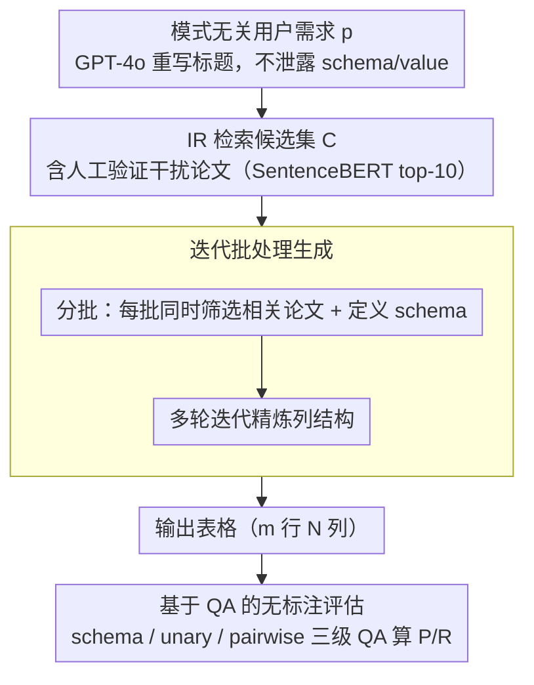

# arXiv2Table: Toward Realistic Benchmarking and Evaluation for LLM-Based Literature-Review Table Generation

**会议**: ACL 2026  
**arXiv**: [2504.10284](https://arxiv.org/abs/2504.10284)  
**代码**: [GitHub](https://github.com/JHU-CLSP/arXiv2Table)  
**领域**: 模型压缩  
**关键词**: 文献综述表格生成, 基准评估, LLM, 干扰论文, QA评估

## 一句话总结

提出 arXiv2Table 基准（1,957 张表、7,158 篇论文），通过引入干扰论文、模式无关的用户需求和基于 QA 的无标注评估框架，实现更真实的 LLM 文献综述表格生成评估，并提出迭代批处理生成方法。

## 研究背景与动机

**领域现状**: 文献综述表格是科研中组织和比较论文的重要工具。近年来 LLM 被用于自动生成此类表格，通常流程为：给定预选论文集和表格标题，由 LLM 生成表格的 schema（列名）和 values（单元格值）。

**现有痛点**: (1) 现有方法假设所有输入论文都相关，但实际中存在大量语义相关但不属于表格的干扰论文；(2) 使用 ground-truth 表格标题作为生成目标，标题往往过于简短且可能泄露 schema/value 信息，导致评估偏差；(3) 评估依赖静态语义嵌入或昂贵的人工标注，无法捕捉细粒度差异。

**核心矛盾**: 现有任务定义和评估协议过于理想化，与真实文献综述工作流严重脱节，阻碍了生成方法的实际应用。

**本文目标**: 构建更真实的文献综述表格生成基准和评估框架，模拟真实场景中的噪声和用户需求。

**切入角度**: 三管齐下——引入人工验证的干扰论文、重写模式无关的用户需求、设计基于 QA 的自动评估。

**核心 idea**: 将文献综述表格生成任务分解为论文检索(T1)→论文筛选(T2)→表格归纳(T3)三个子任务，并在每个环节引入真实噪声。

## 方法详解

### 整体框架

arXiv2Table 检验 LLM 在贴近真实工作流的条件下生成文献综述表格的能力，把任务拆成论文检索(T1)→论文筛选(T2)→表格归纳(T3)三个子任务，并在每个环节注入真实噪声。具体地，给定用户需求 $p$，先由 IR 引擎检索含干扰论文的候选集 $C$，再由 LLM 筛出相关子集 $R \subseteq C$，最后生成 $m$ 行 $N$ 列的表格；表格质量则通过 LLM 合成的 QA 对来衡量信息覆盖度。基准整体含 1,957 张表、7,158 篇论文。

### 关键设计

**1. 模式无关用户需求构造：用自包含的需求替代会泄露答案的原始标题**

原始表格标题往往过于简短（如"Performance comparison of different approaches"），既无法独立理解、又可能直接泄露 gold schema 或 value，让评测虚高。本文用 GPT-4o 把标题重写成自包含、目标导向且不泄露 schema/value 的用户需求，再配合自动泄露检查和人工抽检把关。重写后用户需求与 schema 的重叠从 5.2% 降到 0.7%，生成目标因此更贴近真实场景里用户的实际诉求。

**2. 人工验证干扰论文：往候选集里掺入真实检索会遇到的噪声**

现有方法默认所有输入论文都相关，但真实检索的精确率和召回率都很低，必然混入大量语义相关却不属于该表的干扰论文。本文用 SentenceBERT 按语义相似度检索 top-10 干扰论文，再由具备计算机科学研究经验的标注团队做二元判断验证（IAA = 94%，Fleiss' $\kappa$ = 0.73）。这样 LLM 必须先具备从噪声里筛出真正相关论文的能力，才能完成后续表格生成。

**3. 迭代批处理生成：分批筛选与定义 schema，绕开上下文窗口和 schema 不一致**

这一步对应任务里的论文筛选(T2)与表格归纳(T3)。单次处理所有候选论文会撑爆上下文窗口，逐篇处理又会让 schema 不一致、表格稀疏。本文把输入论文分批，每批内同时进行论文筛选与 schema 定义，再经多轮迭代反复精炼列结构。这种边筛边建 schema 的方式既绕开了上下文长度限制，又保证了跨批次的 schema 一致性，在论文筛选 F1 上比基线提升 7+ 个点。

**4. 基于 QA 的无标注评估框架：把表格质量拆成可问答的细粒度维度**

生成表格如何打分？语义嵌入抓不住上下文特定的差异，人工标注又贵且不可扩展。本文从 ground-truth 表格合成三类 QA 对——schema 级、单元格级（unary value）、单元格关系级（pairwise value），用生成表格去回答这些问题算 recall，反向操作算 precision。如此无需额外标注，就能从 schema、单元格、单元格关系三个维度系统衡量表格的信息覆盖度，且与人类专家判断高度一致。

## 实验关键数据

### 主实验

| 模型 | 方法 | Paper F1 | Schema F1 | Unary F1 | Pairwise F1 | Avg |
|------|------|----------|-----------|----------|-------------|-----|
| LLaMA-3.3-70B | Newman et al. | 60.9 | 38.3 | 37.8 | 29.8 | 35.3 |
| LLaMA-3.3-70B | Ours | **67.9** | **47.7** | **51.1** | **41.0** | **46.6** |
| Mistral-Large-123B | Newman et al. | - | 33.8 | - | - | - |

### 消融实验

| 配置 | 变化 |
|------|------|
| Baseline 1（一步生成） | 上下文窗口溢出，效果差 |
| Baseline 2（逐篇处理） | Schema 不一致，表格稀疏 |
| Newman et al.（两阶段） | Schema 仅基于摘要，遗漏细节 |
| + COT 增强 | 对强基线和本文方法有轻微提升 |

### 关键发现

- 本文迭代方法在论文筛选和表格生成两方面均显著优于所有基线
- 绝对分数仍然较低（Avg ~47），凸显任务的高难度
- LLM 在大规模语料中检索相关论文的能力很弱（pilot study 验证）
- QA 评估与人类专家判断高度一致（cross-evaluator 验证）

## 亮点与洞察

- 首次引入干扰论文和模式无关用户需求，使文献表格生成评估接近真实场景
- QA-based 评估框架无需额外标注，从三个维度（schema、unary、pairwise）系统衡量表格质量
- 用户需求 vs 标题的泄露分析（Table 1）令人信服：用户需求与 schema 重叠从 5.2% 降至 0.7%
- 迭代批处理方法在论文选择 F1 上提升 7+ 个点

## 局限与展望

- 每张表仅收集一个用户需求，多样化需求有待探索
- QA 评估依赖 GPT-4o，可能引入模型偏差
- 未考虑表格中的数值精确匹配
- 迭代方法的计算成本随轮数增加
- 未来可扩展至跨领域和多语言场景

## 相关工作与启发

- ArxivDigesTables（Newman et al., 2024）：原始数据源和两阶段基线
- 文本到表格生成：sequence-to-sequence 和 QA-based 方法
- 科学表格相关数据集：TableBank、SciGen、SciTabQA
- 本文的干扰论文设计可启发其他信息抽取和综述自动化任务

## 评分

- 新颖性: ⭐⭐⭐⭐ 首次系统引入干扰论文和真实用户需求
- 实验充分度: ⭐⭐⭐⭐ 五个 LLM、多种基线、人类验证
- 写作质量: ⭐⭐⭐⭐⭐ 任务定义清晰，动机论证充分
- 价值: ⭐⭐⭐⭐ 对文献综述自动化有实际指导意义

<!-- RELATED:START -->

## 相关论文

- [\[ACL 2025\] RealHiTBench: A Comprehensive Realistic Hierarchical Table Benchmark for Evaluating LLM-Based Table Analysis](../../ACL2025/llm_evaluation/realhitbench_a_comprehensive_realistic_hierarchical_table_benchmark_for_evaluati.md)
- [\[ACL 2026\] Comprehensiveness Metrics for Automatic Evaluation of Factual Recall in Text Generation](comprehensiveness_metrics_for_automatic_evaluation_of_factual_recall_in_text_gen.md)
- [\[ACL 2026\] Minos: A Multimodal Evaluation Model for Bidirectional Generation Between Image and Text](minos_a_multimodal_evaluation_model_for_bidirectional_generation_between_image_a.md)
- [\[ACL 2026\] AJ-Bench: Benchmarking Agent-as-a-Judge for Environment-Aware Evaluation](aj-bench_benchmarking_agent-as-a-judge_for_environment-aware_evaluation.md)
- [\[ACL 2026\] IF-RewardBench: Benchmarking Judge Models for Instruction-Following Evaluation](if-rewardbench_benchmarking_judge_models_for_instruction-following_evaluation.md)

<!-- RELATED:END -->
