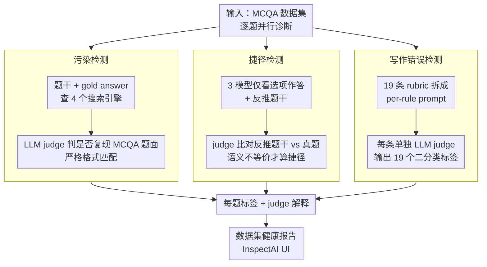

# BenchMarker: An Education-Inspired Toolkit for Highlighting Flaws in Multiple-Choice Benchmarks

**会议**: ACL 2026  
**arXiv**: [2602.06221](https://arxiv.org/abs/2602.06221)  
**代码**: https://github.com/nbalepur/BenchMarker  
**领域**: LLM 评测 / Benchmark 质检  
**关键词**: MCQA, benchmark 审计, LLM-as-judge, 写作错误, 数据污染, 捷径检测

## 一句话总结
本文借鉴教育学界对多选题（MCQ）的成熟质检框架，构造 BenchMarker 工具用 LLM 判官从「污染（contamination）+ 捷径（shortcuts）+ 写作错误（writing errors）」三个维度审计 12 个主流 NLP MCQA benchmark，发现 TruthfulQA 47% 题目能直接在网上搜到、HellaSwag 100% 违反多条写作规则，并实证证明这些缺陷会显著拉高/压低 LLM 准确率甚至改变模型排名。

## 研究背景与动机

**领域现状**：从 MMLU 到 HellaSwag 再到 SGPQA，NLP 评测越来越依赖 MCQA（多选题问答）—— 它的优势在于易自动评分、贴近人类考试形式。但在作者对 39 个 MCQA 数据集的调研中，23% 完全不报告任何质量控制。

**现有痛点**：
1. **数据污染**：题目原文出现在 LLM 训练数据/网络上，模型靠"背"而非"会"
2. **捷径**：题目设计有破绽，模型仅看 choices（不看 question）就能猜对，类似学生靠"消除法"
3. **写作错误**：语法/结构/distractor 质量问题让题目本身就有误导

教育学界几十年来已经把 MCQ 质检做成标准化流程（Haladyna & Downing 1989 等），但 NLP 几乎不引入。

**核心矛盾**：NLP 想用 MCQA 评估"理解-召回-推理"能力，但缺陷数据集让评分混入了与目标能力无关的噪声（construct validity 受损）。

**本文目标**：(a) 把教育学的 MCQ 质检标准迁移到 NLP 数据集；(b) 用 LLM-as-judge 把整个过程自动化；(c) 量化每类缺陷对 LLM 准确率和排名的影响，证明缺陷数据集的危害不是"理论上"的。

**切入角度**：教育学 + LLM-as-judge 的跨界融合 —— 教育学提供 19 条 Item-Writing Flaws rubric（Tarrant 2006），LLM 提供大规模自动评分能力。

**核心 idea**：BenchMarker = LLM judge × 三类教育学指标（污染 / 捷径 / 写作错误），8042 条人工标注用于校准 judge 可靠性，再用此工具系统审计 12 个 NLP benchmark 并量化缺陷的实际影响。

## 方法详解

### 整体框架

BenchMarker 把一个 MCQA 数据集作为输入，对其中每道题并行跑三条独立的诊断流水线——污染、捷径、写作错误，每条都以 LLM judge 为核心，最终给每题输出一组二分类标签加判官解释。三条结果既能按题保留供人工 review，也能聚合到数据集层面得到"这个 benchmark 有多少题被污染 / 有捷径 / 违反写作规则"的健康报告，整套封装在 InspectAI 里提供 UI。其设计灵魂是把教育学几十年沉淀的 MCQ 质检标准（item-writing rubric、partial-input 诊断）翻译成可大规模自动执行的 LLM 评分协议。

### 关键设计

**1. 污染检测：web-search 代理 + 严格格式匹配。** LLM 的预训练数据是私有的，无法直接核对某题是否被"背"过，本文用公开网络作为可观察代理。把题干 $q$ 与 gold answer $a$ 联合查询 Google/Bing/DuckDuckGo/Brave 四个搜索引擎，再把 top-K 结果交给 LLM judge 判定该题是否被"完整或几乎完整地复现"。关键在于匹配标准很严：若网页只是含有答案对应的知识点、却没有 MCQA 的题面格式，就不算污染——因为它不会让模型记住"这道题选哪个"。这既比单纯 token-overlap 更准确，又避免把"考察通用常识"误判成污染，与人类教师查重的直觉一致。

**2. 捷径检测：partial-input 答题 + 反推题干二级过滤。** 目标是识别那些不看题干、只凭 choices 就能稳定答对的题。做法是取 GPT-5 / Gemini Pro / Claude 三个 choices-only 准确率较高的模型，让它们既（1）仅用选项作答，又（2）反推可能的原始题干，再由一个 LLM judge 判断反推出的题干与真题是否语义等价。只有当三模型都答对、且反推题干与真题对不上时才标记为捷径。这层"反推题干"二级过滤是关键：纯 choices-only accuracy 会把"善意推断"（比如从某个 distractor 推断整题在讲回收）也误算成捷径，加上这层判断后只保留教育学定义的 meta-strategy guessing——真正利用题目破绽的猜测。

**3. 写作错误：19 条 rubric 拆成 per-rule LLM judge。** 借用 Tarrant (2006) 的 19 条 Item-Writing Flaws rubric（覆盖 clarity / format / give-away / misleading 四大类，如"避免 mostly 这类模糊词""distractor 必须 plausible""避免 none-of-the-above"），对每道题逐条判定是否违反，输出 19 个二分类标签。实现上不把规则合并成一个大 prompt，而是每条规则单发一条 prompt（含规则名、定义、3 个违反例、3 个合规例）。拆开是因为合并会让 LLM 陷入多任务认知负载，而 per-rule + few-shot 是 LLM-as-judge 最稳的形态（Kim et al. 2024）；选 Tarrant 而非 Haladyna，则是因为它剔除了"avoid trivial material"这类过于主观、LLM 难以一致判断的规则。

### 损失函数 / 训练策略

无训练，纯 inference 评测工具。Judge 用 GPT-5 / Gemini 2.5 Pro / Claude 4.5 Sonnet 等闭源模型在 default sampling 下运行，统一请求结构化 JSON 输出，便于解析与聚合。

## 实验关键数据

### Judge 可靠性（vs 人工标注 8042 条）

| Judge | Shortcut Acc/F1/κ | Writing-NLP Acc/F1/κ | Writing-Edu Acc/F1/κ |
|---|---|---|---|
| Gemini 2.5 Pro | 0.70 / 0.69 / 0.43 | 0.82 / 0.66 / 0.53 | 0.86 / 0.39 / 0.33 |
| GPT-5 | **0.82 / 0.75 / 0.61** | 0.81 / 0.63 / 0.50 | 0.87 / 0.37 / 0.30 |
| Claude 4.5 Sonnet | 0.81 / 0.75 / 0.59 | 0.79 / 0.63 / 0.48 | 0.83 / 0.36 / 0.28 |
| SAQUET (heuristic+GPT-5) | – | 弱于 GPT-5 alone | 弱于 GPT-5 alone |

GPT-5 在 shortcut 检测 κ=0.61（substantial agreement），writing error 在 in-domain NLP 题目上 κ=0.50（moderate），可作为可信判官。

### 12 数据集审计（节选）

| Benchmark | 创建方式 | 污染率 | 捷径率 | 至少违反 1 条写作规则 |
|---|---|---|---|---|
| TruthfulQA | author-written | **47%** | 中 | 高 |
| HellaSwag | model-generated | 中 | 中 | **100%（至少 2 条）** |
| ScholarIQA | – | 中 | **21%** | 中 |
| MMLU | student exams | 低 | 低 | 较低 |
| ARC | student exams | 低 | 低 | 较低 |

学生考试出身的数据集（MMLU/ARC/AQuA/SAT）质量最好；crowdworker（CQA/OBQA/PIQA/SIQA/QASC）和自动生成（HellaSwag）类问题最多。

### 关键发现
- **污染会显著抬高 LLM 准确率**：污染子集 vs 干净子集，LLM 准确率显著抬高，模型其实在"背答案"
- **写作错误会压低准确率并改变模型排名**：移除带写作错误的题目后，LLM 排序变化超过 random 重排，意味着选择部署模型的决策会被错题污染
- **修复方案也会引入新缺陷**：MMLU-Pro 用 LLM 改写 distractor 想压低准确率，结果引入 implausible distractor 和 >1 个正确答案的问题——说明修复需要可重复、自动化的检测工具迭代
- **NLP 与教育学的写作错误重合度高**：clarity（清晰度）和 distractor quality 在两个领域都是 top issue，这两个领域应该合作

## 亮点与洞察
- **跨学科借力**：教育学几十年的 MCQ 质检经验 + 现代 LLM-as-judge 是绝佳组合，这套方法论可推广到其他评测形式（如 open-ended QA 的 rubric 评分）
- **三轴诊断比单一污染检测更全面**：以往工作只查污染（如 ContaminationCheck），本文证明捷径和写作错误的影响同样大甚至更严重（改变排名）；评测健康度是多维问题
- **可重复自动化的修复闭环**：MMLU-Pro 教训说明"一次性人工修复"治标不治本；BenchMarker 把质检变成可重复 pipeline，让"benchmark 维护" 像 "代码维护"一样有 CI

## 局限与展望
- **作者承认**：LLM judge 在 writing error 上 F1 偏低（0.39-0.66），尤其 out-of-domain 学生题；只检测题内缺陷，不查 saturation / diversity 等 global issue
- **个人发现**：19 条规则有些不适合长 context 题（如长 question stem 规则），future work 应做动态 rule selection；GPT-5 作判官在它自己的 benchmark 上可能有偏向（self-preference bias）
- **改进思路**：可加入 distractor difficulty 校准（教育学有 item-response-theory）；可拓展到开放式 QA 的 grading rubric；可联动 dataset CI 做"贡献新题需 BenchMarker 通过"流程

## 相关工作与启发
- **vs Li et al. 2024b（污染检测）**：本文复用其 web-search 模板但扩展到 4 个搜索引擎 + 3 个 LLM judge 多数投票，更鲁棒
- **vs Balepur et al. 2024b（partial-input shortcut）**：本文在其基础上加 "反推 question" 二级 filter，区分"问题捷径"和"善意推断"
- **vs SAQUET（writing error toolkit）**：SAQUET 优化在学生考试题（OOD for NLP），BenchMarker 在 NLP 题上 outperform SAQUET，且提供 InspectAI 集成

## 评分
- 新颖性: ⭐⭐⭐⭐ 教育学+LLM judge 的跨界融合，shortcut 检测的 "反推 question" 设计独到
- 实验充分度: ⭐⭐⭐⭐⭐ 23 模型 × 6 搜索 API × 13 数据集 × 8042 人工标注，覆盖面非常充分
- 写作质量: ⭐⭐⭐⭐⭐ 教育学动机讲得清晰，三轴框架自然
- 价值: ⭐⭐⭐⭐⭐ 工具开源 + 揭示 TruthfulQA/HellaSwag 等流行 benchmark 的根本性缺陷，影响后续所有 LLM 评测设计

<!-- RELATED:START -->

## 相关论文

- [\[ACL 2025\] WiCkeD: A Simple Method to Make Multiple Choice Benchmarks More Challenging](../../ACL2025/llm_evaluation/wicked_a_simple_method_to_make_multiple_choice_benchmarks_more_challenging.md)
- [\[ACL 2026\] Beyond the Singular: Revealing the Value of Multiple Generations in Benchmark Evaluation](beyond_the_singular_revealing_the_value_of_multiple_generations_in_benchmark_eva.md)
- [\[ACL 2026\] SPENCE: A Syntactic Probe for Detecting Contamination in NL2SQL Benchmarks](spence_a_syntactic_probe_for_detecting_contamination_in_nl2sql_benchmarks.md)
- [\[ACL 2026\] Beyond Static Benchmarks: Synthesizing Harmful Content via Persona-based Simulation for Robust Evaluation](beyond_static_benchmarks_synthesizing_harmful_content_via_persona-based_simulati.md)
- [\[ACL 2025\] Right Answer, Wrong Score: Uncovering the Inconsistencies of LLM Evaluation in Multiple-Choice QA](../../ACL2025/llm_evaluation/right_answer_wrong_score_uncovering_the_inconsistencies_of_llm_evaluation_in_mul.md)

<!-- RELATED:END -->
