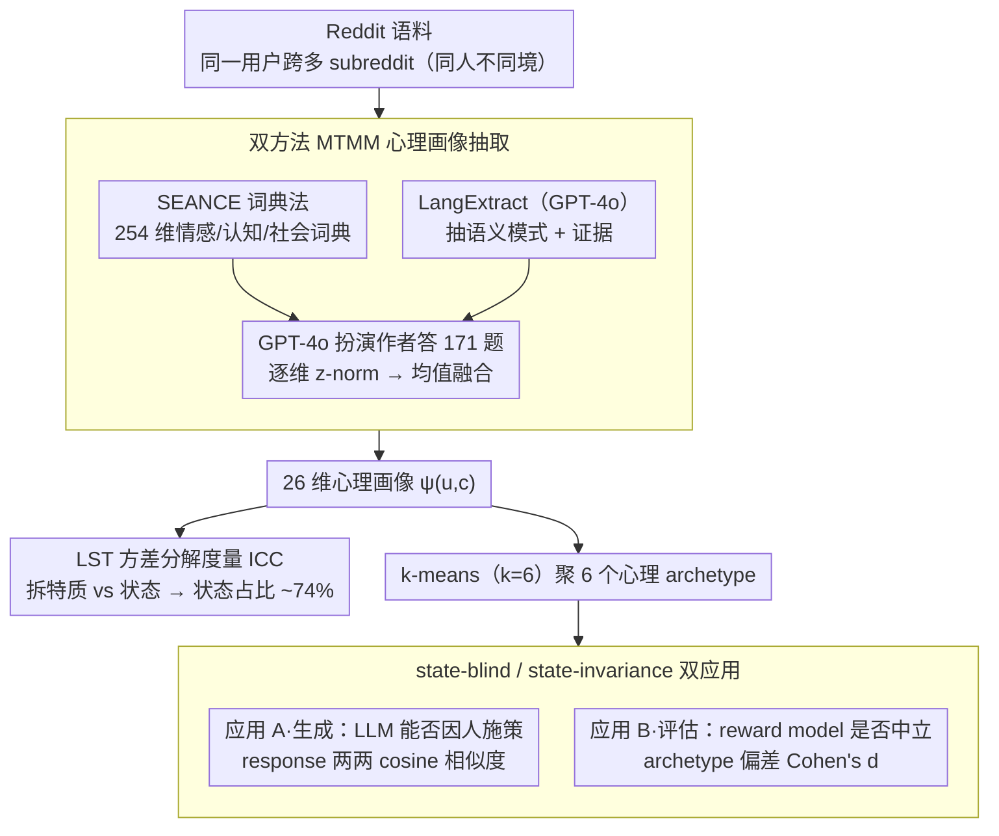

# Beyond Fixed Psychological Personas: State Beats Trait, but Language Models are State-Blind

**会议**: ACL 2026 Findings  
**arXiv**: [2601.15395](https://arxiv.org/abs/2601.15395)  
**代码**: <https://huggingface.co/datasets/tonyeh/chameleon-dataset>（数据集）  
**领域**: LLM 对齐 / 角色扮演 / RLHF / 心理学  
**关键词**: Latent State-Trait、persona、reward model、RLHF、state-blind

## 一句话总结
构建覆盖 1667 用户 × 多 subreddit 上下文的 Chameleon 心理画像数据集，用 ICC 分解证明 72-74% 心理变异来自「状态（情境）」而非「特质（人格）」，进一步揭示 LLM 几乎对状态视而不见、reward model 反应到状态却方向相反——RLHF 因此盲目继承了奖励模型的状态偏好。

## 研究背景与动机

**领域现状**：现有 persona 数据集（PersonaChat、PANDORA、LaMP、PERSONA）把每个用户的心理画像当成一个固定 vector，所有上下文共用。RLHF 训练时也假设「同一用户偏好稳定」，奖励模型只看 response 不看 user 状态。

**现有痛点**：心理学几十年的 Latent State-Trait (LST) 理论早就说，人的行为既反映稳定特质 $\tau$ 也反映情境状态 $\sigma$——同一个 John 在 r/SuicideWatch 焦虑求助和在 r/personalfinance 冷静规划时心理表达完全不同。固定 persona 把这种「同一个人在不同语境下的差异」当噪声平均掉了。

**核心矛盾**：如果实际心理变异中状态占大头，那么所有基于固定 persona 的对齐方法（包括 RLHF）都在根本上错估了用户多样性的结构。但这只是猜想，没人在 NLP 里量化过状态/特质比例。

**本文目标**：(1) 用真实文本数据测量 state/trait 方差比例；(2) 检验当前 LLM 在生成时是否能感知用户状态；(3) 检验 reward model 在评估时是否对状态保持「公平不变」。

**切入角度**：Reddit 提供了同一用户在多个 subreddit 的发帖记录——subreddit 就是天然的「上下文」。在同一用户身上跨 subreddit 抽取心理画像，就能用 intraclass correlation (ICC) 分解 within-person 和 between-person 方差。

**核心 idea**：把心理学的 LST 框架引入 NLP，用 Chameleon 数据集做 state/trait 方差分解，再用两项下游实验暴露 LLM 和 reward model 在 state 维度的失败模式。

## 方法详解

### 整体框架

本文要回答"用户心理画像到底有多少是稳定特质、多少是随情境波动的状态"，并据此检验 LLM 与 reward model 在状态维度的行为。整条链路是：先从 Reddit 语料构造 Chameleon 数据集，利用"同一用户在多个 subreddit 发帖"这一天然的"同人不同境"结构；再对每条 post 跑一套双方法心理画像抽取流水线，得到 26 维 profile $\psi_{u,c}$；然后一面用 ICC 把这些 profile 的方差分解成特质项与状态项、量化谁占主导，另一面用聚类出的 6 个心理 archetype 在生成端（LLM 能否因人施策）和评估端（reward model 是否对状态保持中立）各做一个下游实验，把"persona 该被怎么用"这一抽象命题落成可测的工程指标。

### 关键设计

**1. 双方法 MTMM 心理画像抽取：交叉验证排除单方法偏置。** 从一条 post 抽 26 维心理量表得分时，单一方法容易被自身偏置吃掉信号，因此走两路并行：(a) SEANCE 词典法基于 254 维情感/认知/社会词典匹配，结果可重现但缺上下文敏感性；(b) LangExtract（GPT-4o）抽取语义模式、支撑证据与解读理由，能捕捉隐含语义但带 LLM 随机性。两路特征各自喂给 GPT-4o 让它"扮演 post 作者"回答 171 个量表条目得到分数，再做逐维 z-norm $\tilde{\psi}^m_i = (\psi^m_i - \mu^m_i)/\sigma^m_i$ 后均值融合 $\psi_{u,c} = \frac{1}{2}(\tilde{\psi}^{lex}_{u,c} + \tilde{\psi}^{sem}_{u,c})$ 得到统一的 26 维画像 $\psi_{u,c}$。之所以要两路，是 MTMM 框架（Campbell & Fiske, 1959）要求同一 trait 跨方法相关（convergent）、不同 trait 不相关（discriminant）；实测 profile 级 mean $r=0.71$、69.9% 的 post 内 $r>0.70$，说明两种迥异方法捕捉到的是同一心理结构，抽取结果可信而非方法 artifact。

**2. LST 方差分解度量 ICC：把心理变异拆成特质与状态。** 心理学的 Latent State-Trait 理论认为一次心理表达同时含稳定特质和情境状态，本文把它形式化为观察模型 $\psi_{u,c} = \tau_u + \sigma_{u,c} + \epsilon_{u,c}$，其中 $\tau_u$ 是人内稳定的特质、$\sigma_{u,c}$ 是情境特定的状态、$\epsilon_{u,c}$ 是误差。用 one-way random effects 模型（把 post 嵌套进用户）估计后，定义一致性系数 $\text{ICC} = \frac{\text{Var}(\tau)}{\text{Var}(\tau) + \text{Var}(\sigma) + \text{Var}(\epsilon)}$ 表示 between-person 方差占比，则 $1-\text{ICC}$（occasion specificity）即 within-person 的状态占比。按惯例 ICC < 0.30 判为 state-dominant 构念，而本文 26 个维度几乎全部落在 0.26–0.28，等于用心理学自己的工具直接量化反驳了"persona 是固定向量"的假设——这套工具心理学早有，但 NLP 从没用它分解过用户画像。

**3. state-blind / state-invariance 双应用：把抽象命题拆成两端工程指标。** 先用 k-means（$k=6$）从 Chameleon 聚出 6 个心理 archetype（Distressed-Vulnerable、Driven-Assertive、Self-Actualized、Supportive-Conventional、Nonconformist-Skeptical、Risk-Seeking-Detached），每个配一段 profile card，再分两端检验。**Application A（生成）**：把 127 道题 × 7 条件（6 archetype + baseline）喂给 GPT-4o / Llama-3.1-8B / Qwen2.5-14B 得 2667 条 response，用 all-mpnet-base-v2 算 pairwise cosine similarity——相似度越低代表模型越能因人施策。**Application B（评估）**：固定一份 reference response（GPT-4o，无 profile），在 ArmoRM / DeBERTa-RM / Skywork-RM 三个 reward model 上配 7 个 archetype 条件打分，用 Cohen's $d$ 衡量 archetype 条件相对 baseline 的偏差，理想应为 0。这一拆分对应一个直观原则——好老师该按学生状态调整说话方式（生成应 state-aware），但评卷老师不该因为学生看起来焦虑就给同一份答卷打不同分（评估应 state-invariant）——恰好映射 LLM pipeline 的生成与评估两个阶段。

### 损失函数 / 训练策略

不训练任何模型，纯数据集 + 评测论文。假设检验用 linear mixed-effects 回归 $\psi_{u,c,i} = \beta_0 + \beta_c \cdot \mathbf{1}[c] + \gamma_u + \epsilon_{u,c}$，其中用户随机截距 $\gamma_u \sim \mathcal{N}(0, \sigma_u^2)$ 吸收人内相关，使 subreddit 效应 $\beta_c$ 的显著性检验在控制个体差异后依然成立。

## 实验关键数据

### 主实验：方差分解（RQ1）

| 抽取方法 | Mean ICC | 范围 | <0.30 的维度 | 状态占比 |
|---------|----------|------|------------|----------|
| SEANCE | 0.26 | 0.25-0.27 | 26/26 | **74%** |
| LangExtract | 0.28 | 0.25-0.31 | 25/26 | **72%** |
| Fused | 0.27 | 0.25-0.30 | 26/26 | **73%** |

两套方法 26 个维度几乎全部 ICC <0.30，状态变异是特质变异的 2-3 倍。94.7% 用户在 3 篇 post 中表现出 ≥2 个 archetype，50.7% 表现出 3 个不同 archetype——同一个人在不同语境下心理画像确实差异显著。

### 消融/对比：Application A（生成多样性）+ Application B（评估一致性）

| 模型 | 平均 similarity（越低越好） | 解读 |
|------|---------------------------|------|
| Llama-3.1-8B | 0.768 | 最敏感（反直觉，最小模型最敏感） |
| GPT-4o | 0.819 | 中等 |
| Qwen2.5-14B | 0.846 | 最不敏感 |

关键发现：跨 archetype ANOVA $F=2.18, p=0.054$ 不显著——模型只能检测「有没有 persona 框架」但无法在不同 archetype 间做出有意义的区分（shallow persona detection）。

| Reward Model | Distressed-Vulnerable ($d$ vs baseline) | Driven-Assertive ($d$ vs baseline) | 方向 |
|--------------|------------------------------------------|-------------------------------------|------|
| ArmoRM-8B | **+0.76** | +0.31 | 奖励 vulnerable |
| DeBERTa-RM | **−1.08** | −1.11 | 惩罚 vulnerable |
| Skywork-8B | **−1.12** | −1.02 | 惩罚 vulnerable |

同一个 Distressed-Vulnerable 用户，ArmoRM 最偏爱、Skywork 最惩罚——三个 reward model 在状态维度反应方向相反，这种任意性会通过 RLHF 直接转化成模型对不同用户的差别对待。

### 关键发现
- 状态占比 ~74% 跨两套独立抽取方法、26 个维度高度一致（SD = 0.02），且子集去掉 subreddit 均值（控制风格混淆）后仍 0.27，排除噪声/风格解释。
- 5 个文献驱动假设全部被两套方法证实——r/SuicideWatch → 高 Neuroticism、低 Competence；r/personalfinance → 高 Security、高 Achievement，等等。
- 「对齐 vs 适应性」权衡：重度 RLHF 的 GPT-4o 反而比小型 Llama-3.1-8B 更难因人施策，alignment training 似乎促成了 mode collapse，让模型在心理灵活性上倒退。
- Vulnerable User Paradox：reward model 不是建模真实用户偏好，而是任意地对 user label 做反应，方向取决于训练数据偶然性而非原则。

## 亮点与洞察
- 把心理学的 LST 理论严格量化进 NLP，是真正用「跨学科」回答了一个跨学科问题——不是包装的 buzzword，是 ICC 数字硬生生证明的。
- Reward model 在 state 维度的方向不一致是个非常震撼的发现，相当于说「同一份代码、同一个测试，用不同公司的代码评审会得出相反的好坏结论」——这直接削弱了 RLHF 训练出的模型一致性的可解释性。
- 「state-aware 生成 + state-invariant 评估」这一对原则借自教学场景，非常直观但又能精准对应 LLM pipeline 的两个阶段，作为框架设计很经济。
- Shallow persona detection 这个观察（模型能检测「有 persona」但不能区分「哪个 persona」）可以解释为什么很多 persona-conditioned generation 看上去「有点 persona 味儿」但其实没真的因人调整。

## 局限与展望
- 从文本抽心理画像是 expressed psychology 而非 ground-truth 内在状态，理想的 criterion validity 应通过 ecological momentary assessment（让真实用户标注当下状态）建立。
- ICC 估计受 small-k design（k=3）影响，between-person 方差可能被高估，74% 状态占比是保守下界。
- Subreddit 作为「context」混合了话题、受众、社区规范三种因素，未来需要解耦。
- 仅 Reddit 单数据源 + 美式英文，跨平台、跨文化泛化尚未验证；archetype 数 k=6 也偏少。

## 相关工作与启发
- **vs PersonaChat / PANDORA**：他们把 persona 视为固定文本/特质 vector，本文证明这个假设忽略了 74% 的心理变异，给整个 persona 范式提供了第一次定量的根本性批评。
- **vs LaMP / PERSONA**：LaMP 用用户历史检索做个性化（隐含偏好稳定），PERSONA 给合成 persona 配固定 Big Five——同样落入 trait-only 框架。Chameleon 通过测量同一用户跨 context 第一次让 state-trait 分解在 NLP 可用。
- **vs reward bias 文献**：Singhal 的 length bias、Sharma 的 sycophancy、Casper 的 RLHF limitations 主要关注响应特征或人口学公平，本文打开了「心理状态公平」这一新维度，且发现的「方向相反」问题比已知偏置更严重。

## 评分
- 新颖性: ⭐⭐⭐⭐⭐ LST 在 NLP 是全新框架，state/trait 量化分解 + state-blind / state-invariance 双原则是非常原创的角度。
- 实验充分度: ⭐⭐⭐⭐ 数据集规模适中（1667 用户 5001 post），两路抽取交叉验证 + 文献驱动假设检验 + 双下游实验组合，论证扎实；但 k=3 post/user 限制 ICC 精度。
- 写作质量: ⭐⭐⭐⭐⭐ John 的例子贯穿全文，把抽象统计概念讲得非常直观；图 1 把生成 + 评估的双重失败压缩在一张图里非常漂亮。
- 价值: ⭐⭐⭐⭐⭐ 直接揭示了 RLHF 训出的模型可能在 vulnerable user 上不知不觉地有相反对待，这对负责任 AI 部署有立竿见影的警示意义；数据集会成为后续 personalization 研究的重要基础。

<!-- RELATED:START -->

## 相关论文

- [\[NeurIPS 2025\] MEMTRACK: Evaluating Long-Term Memory and State Tracking in Multi-Platform Dynamic Agent Environments](../../NeurIPS2025/llm_evaluation/memtrack_evaluating_long-term_memory_and_state_tracking_in_multi-platform_dynami.md)
- [\[ACL 2026\] Beyond the Singular: Revealing the Value of Multiple Generations in Benchmark Evaluation](beyond_the_singular_revealing_the_value_of_multiple_generations_in_benchmark_eva.md)
- [\[ACL 2026\] Beyond Marginal Distributions: A Framework to Evaluate the Representativeness of Demographic-Aligned LLMs](beyond_marginal_distributions_a_framework_to_evaluate_the_representativeness_of_.md)
- [\[ACL 2026\] Teaching Language Models to Forecast Research Success Through Comparative Idea Evaluation](teaching_language_models_to_forecast_research_success_through_comparative_idea_e.md)
- [\[ACL 2026\] EngiBench: A Benchmark for Evaluating Large Language Models on Engineering Problem Solving](engibench_a_benchmark_for_evaluating_large_language_models_on_engineering_proble.md)

<!-- RELATED:END -->
