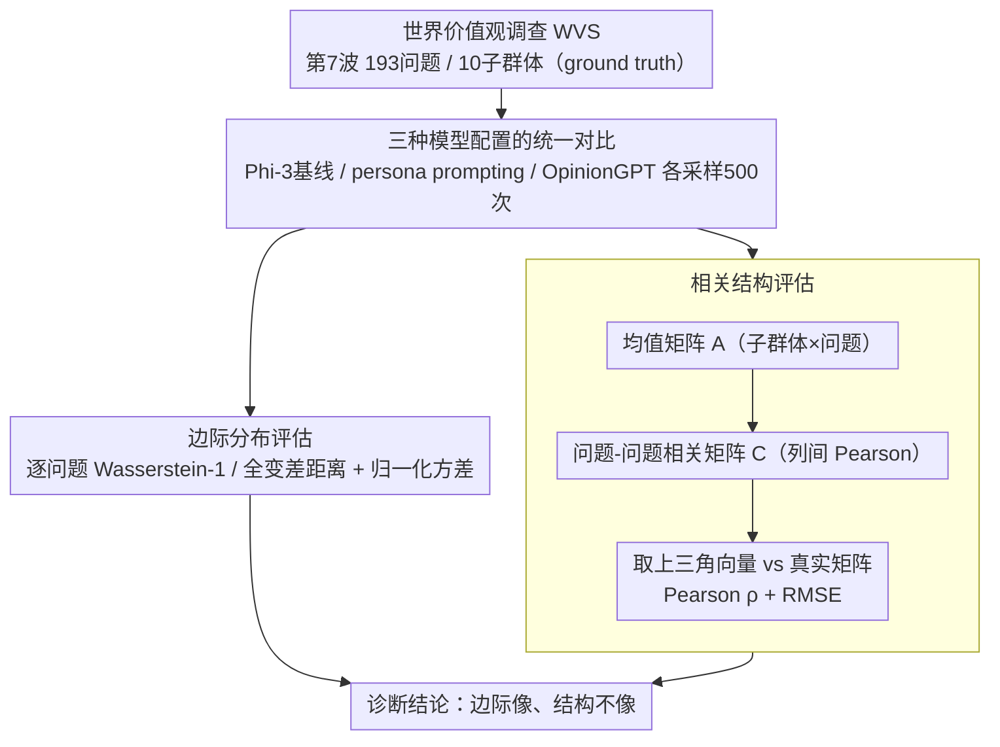

# Beyond Marginal Distributions: A Framework to Evaluate the Representativeness of Demographic-Aligned LLMs

**会议**: ACL 2026 Findings  
**arXiv**: [2601.15755](https://arxiv.org/abs/2601.15755)  
**代码**: [https://github.com/tdw75/beyond-marginal-distributions](https://github.com/tdw75/beyond-marginal-distributions)  
**领域**: LLM对齐  
**关键词**: 人口统计对齐, 相关结构, 边际分布, 价值观调查, 代表性评估

## 一句话总结

本文提出了一种超越边际分布的 LLM 代表性评估框架，通过同时考察边际响应分布和跨问题相关结构来评估人口统计对齐模型，发现虽然微调和 persona prompting 能改善边际分布的近似度，但两者都无法忠实再现人类价值观调查中的多变量相关模式。

## 研究背景与动机

**领域现状**：LLM 越来越多地被用于模拟人类的观点、价值观和信仰，模型的可操控性（steerability）是活跃的研究方向。现有工作通过 persona prompting 或人口统计微调来使模型输出更贴近特定群体。

**现有痛点**：现有评估主要关注**边际响应分布**——独立地比较每个问题的响应分布。这种方式虽然必要，但可能忽略了真实人群中存在的**深层潜在结构**。例如，模型可能单独正确地近似了两项政策的支持率，但未能捕捉到在真实人群中支持一项政策与反对另一项政策之间的高相关性。

**核心矛盾**：社会科学中的文化价值理论（如 Hofstede、Schwartz、Inglehart-Welzel）强调价值观之间的多变量相关模式才是文化维度的核心，但 LLM 对齐评估几乎完全忽略了这一维度。

**本文目标**：(1) 提出同时考察边际分布和相关结构的评估框架；(2) 比较 persona prompting 和人口统计微调两种操控方法在两个维度上的表现。

**切入角度**：利用世界价值观调查（WVS）作为ground truth，从边际分布和问题间相关矩阵两个层面对模型代表性进行诊断。

**核心 idea**：代表性是对齐的一个独立维度，仅依赖边际分布的评估可能掩盖结构性失败，导致对模型代表性的过于乐观的结论。

## 方法详解

### 整体框架

本文把"代表性"诊断拆成两个互补的层面。第一层是边际分布评估：对每个调查问题，单独比较模型模拟出的响应分布与真实人群的响应分布有多近，这也是以往工作的主流做法。第二层是相关结构评估：把若干问题的响应聚成相关矩阵，看模型是否再现了"人群中支持某项政策往往伴随反对另一项政策"这类问题之间的联动结构。框架以世界价值观调查（WVS）为 ground truth，用这两层指标在统一标尺下对比 persona prompting 与人口统计微调两种主流操控方法，从而暴露"边际像、结构不像"的隐蔽失败。

### 关键设计

**1. 边际分布评估：问题逐个对齐的基线层**

这一层衡量模型在单个问题层面的代表性。对每个调查问题 $q$，计算真实分布 $P_s$ 与模拟分布 $P_m$ 之间的距离 $d(P_m(\cdot|q), P_s(\cdot|q))$（用 Wasserstein-1 距离或全变差距离），再对所有问题取平均得到整体不相似度指标 $\mathcal{D}$；同时比较每个问题的归一化方差以诊断响应多样性是坍缩还是被过度放大。设这一层既是为了与 Santurkar、Durmus 等人的现有文献保持可比，也为下一层的相关结构分析提供一个"看起来对齐"的基线参照。

**2. 相关结构评估：问题间联动的结构层**

这一层检查模型是否保留了问题之间的依赖关系。具体分三步：先对每个子群体在每个问题上求平均响应，构成均值矩阵 $A \in \mathbb{R}^{|S| \times |Q|}$；再计算列与列之间的 Pearson 相关系数得到问题—问题相关矩阵 $C \in \mathbb{R}^{|Q| \times |Q|}$；最后取上三角元素拉成向量，用 Pearson 相关和 RMSE 同时比较真实矩阵 $C^{\text{true}}$ 与模拟矩阵 $C^{\text{sim}}$。其中相关系数刻画"哪些问题对倾向于一起变化"的相对结构，RMSE 刻画幅度是否匹配，两者结合才能给出全面诊断。这一层正对应文化价值理论（Hofstede、Schwartz、Inglehart-Welzel）所强调的多变量相关才是文化维度核心的观点。

**3. 三种模型配置的统一对比：让微调与提示在同一标尺下分高下**

为了揭示不同操控策略在两个维度上的差异，本文在同一框架下对比三种配置：未操控的 Phi-3 基线、Phi-3 叠加 persona prompting（覆盖 10 个人口统计子群体）、以及在 Reddit 子群体数据上做人口统计微调的 OpinionGPT（LoRA 适配器）。评估统一采用 WVS 第 7 波的 193 个问题、10 个子群体，每种配置采样 500 次。这样设计的用意是把参数级（微调）与提示级（persona）这两类主流操控方法摆到同一边际/结构标尺上，直接看清它们各自的强项与盲区。

### 损失函数 / 训练策略

本文本身只做评估、不训练模型；被评估的 OpinionGPT 是在 Reddit 特定子群体数据上用 LoRA 适配器微调得到的现成模型。

## 实验关键数据

### 主实验

**问题-问题相关结构（95% 置信区间）**

| 模型 | Pearson ρ | RMSE |
|------|-----------|------|
| OpinionGPT | 0.090 [0.08, 0.10] | 0.638 [0.63, 0.64] |
| Persona Prompting | 0.158 [0.15, 0.17] | 0.679 [0.67, 0.68] |
| 置换零基线 | −0.004 | 0.849 |
| Split-Half 上界 | 0.999 | 0.006 |

**主题-主题相关结构**

| 模型 | Pearson ρ | RMSE |
|------|-----------|------|
| OpinionGPT | −0.018 [-0.02, 0.05] | 0.718 [0.71, 0.73] |
| Persona Prompting | 0.240 [0.21, 0.28] | 0.676 [0.67, 0.69] |

### 消融实验

**边际分布结果**：OpinionGPT 在所有子群体上都减小了边际不相似度，优于 persona prompting。但 persona prompting 在响应多样性上表现更差（倾向于坍缩到刻板印象式的单一响应），而 OpinionGPT 有时过度放大了响应多样性。

### 关键发现

- 边际分布改善≠相关结构改善：OpinionGPT 更好地近似边际分布，但 persona prompting 略好地保留了相关结构——出现了评估维度的"逆转"
- 两种方法在相关结构上都远低于经验上界，表明当前操控技术无法忠实再现人类价值观的多变量结构
- Persona prompting 显著压缩响应多样性，倾向于产生刻板印象式回答
- OpinionGPT 在主题级聚合后相关结构完全丧失（ρ ≈ −0.018），说明微调各子群体适配器可能引入跨群体的表示漂移

## 亮点与洞察

- 评估框架设计精巧，置换零基线和 split-half 上界为指标提供了清晰的参照
- "边际好≠结构好"的发现具有重要的方法论警示意义
- 将社会科学中的文化价值理论引入 LLM 对齐评估，跨学科视角独到
- 揭示了代表性作为对齐独立维度的重要性

## 局限与展望

- 仅使用了 Phi-3 一个基础模型，结论的通用性有限
- WVS 嵌入了西方中心的规范性假设，作为基准并非完全中立
- 仅使用英语评估，未涵盖多语言场景
- 未来可将轨迹式采样（trajectory-based）替代独立采样以构建更精细的相关矩阵

## 相关工作与启发

- 与 Santurkar 等人和 Durmus 等人的边际分布评估工作形成互补
- Münker (2025) 提出了类似的指纹方法，但本文将相关结构明确定位为代表性的必要条件
- 为未来将多变量依赖结构纳入对齐机制提供了理论基础

## 评分

- 新颖性: ⭐⭐⭐⭐ 首次系统性地将相关结构纳入 LLM 代表性评估
- 实验充分度: ⭐⭐⭐⭐ 多维度评估、置信区间、基线对比完善
- 写作质量: ⭐⭐⭐⭐⭐ 框架阐述清晰，问题定义严谨

<!-- RELATED:START -->

## 相关论文

- [\[ACL 2026\] Beyond Reproduction: A Paired-Task Framework for Assessing LLM Comprehension and Creativity in Literary Translation](beyond_reproduction_a_paired-task_framework_for_assessing_llm_comprehension_and_.md)
- [\[ACL 2026\] Large Language Models Are Bad Dice Players: LLMs Struggle to Generate Random Numbers from Statistical Distributions](large_language_models_are_bad_dice_players_llms_struggle_to_generate_random_numb.md)
- [\[AAAI 2026\] Beyond Accuracy: A Cognitive Load Framework for Mapping the Capability Boundaries of Tool-use Agents](../../AAAI2026/llm_evaluation/beyond_accuracy_a_cognitive_load_framework_for_mapping_the_c.md)
- [\[ACL 2026\] Beyond the Singular: Revealing the Value of Multiple Generations in Benchmark Evaluation](beyond_the_singular_revealing_the_value_of_multiple_generations_in_benchmark_eva.md)
- [\[ICLR 2026\] Unpacking Human Preference for LLMs: Demographically Aware Evaluation with the HUMAINE Framework](../../ICLR2026/llm_evaluation/unpacking_human_preference_for_llms_demographically_aware_evaluation_of_long-fo.md)

<!-- RELATED:END -->
