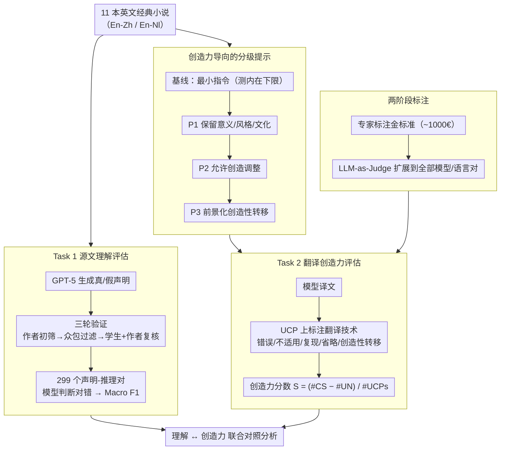

# Beyond Reproduction: A Paired-Task Framework for Assessing LLM Comprehension and Creativity in Literary Translation

**会议**: ACL 2026  
**arXiv**: [2604.18169](https://arxiv.org/abs/2604.18169)  
**代码**: [github](https://github.com/NL2G/Beyond-Reproduction)  
**领域**: LLM Evaluation  
**关键词**: 文学翻译, 翻译创造力, 源文理解, LLM评估, 配对任务框架

## 一句话总结

提出配对任务框架联合评估 LLM 的文学文本理解能力和翻译创造力，基于 11 本英文经典小说对 23 个模型进行大规模测评，发现强理解力并不能转化为人类水平的翻译创造力。

## 研究背景与动机

**领域现状**：LLM 日益用于文学翻译等创造性任务，部分研究甚至宣称达到了人类水平。然而，翻译创造力（translational creativity）在大规模评估中仍被严重忽视。

**现有痛点**：(1) 现有文学翻译评估主要关注准确性和恰当性，几乎完全忽略创造力维度；(2) 关于翻译创造力的研究规模小、成本高，通常仅比较 1-2 个传统 MT 系统；(3) 理解能力通常被孤立研究，而在专业翻译中理解与创造力紧密交织。

**核心矛盾**：LLM 能生成大量流畅、低成本的翻译，但我们对它们如何处理文学文本特有的创造性挑战知之甚少——理解源文是否意味着能做出有创造力的翻译选择？

**本文目标**：构建可扩展的评估框架，联合测量 LLM 的源文理解和创造性翻译能力。

**切入角度**：基于翻译学中的"创造性潜力单元"（UCP）概念，将文本中隐喻、双关、文化典故等需要创造性处理的片段作为评估焦点。

**核心 idea**：设计配对任务——Task 1 通过声明验证评估源文理解，Task 2 通过 UCP 翻译技术标注评估创造性迁移；结合专家标注和 LLM-as-Judge 自动评估，实现大规模可扩展的评估。

## 方法详解

### 整体框架

本文用一对配对任务把文学翻译中"理解"与"创造"两件本应交织的能力拆开来分别测量，再放回一起对照。Task 1 检验源文理解：基于文学批评分析生成的真/假声明，让模型判断对错，考察它能否做出解释性推理而非简单复述。Task 2 检验翻译创造力：在文本里那些隐喻、双关、文化典故等"创造性潜力单元"（UCP）上，标注模型译文采用了哪种处理技术，从而量化它敢不敢做有创造力的翻译选择。整套框架覆盖 11 本英文经典小说、23 个模型、4 种提示策略以及英-中、英-荷两个语言对，并用专家标注加 LLM-as-Judge 两段式把评估规模撑起来。

### 关键设计

**1. Task 1 源文理解评估：用经三轮验证的声明考解释性推理**

这一任务考察的是模型对文学文本的解释性推理，而非释义或事实回忆。本文以 RELIC 数据集的文学批评条目为素材，用 GPT-5 生成候选的真/假声明，再经过一道"三明治"式三轮验证——作者初筛、3 名众包标注者过滤、最后由 2 名训练过的学生加作者复核——最终沉淀出 299 个声明-推理对。之所以要这么重的验证流程，是因为这些声明必须真正依赖对文本的解读才能判断，从而避免模型靠浅层匹配蒙混过关。

**2. Task 2 翻译创造力评估：在 UCP 上量化创造性转移**

这一任务针对文学翻译特有的创造性挑战。本文在每个 UCP（隐喻、双关、文化典故等）上标注译文采用的翻译技术：错误、不适用、复现、省略、或创造性转移（CS），并据此定义创造力分数 $S_{creativity} = (\#CS - \#UN) / \#UCPs$，即创造性转移数量减去不可接受数量后按 UCP 总数归一。由于这类标注高度依赖领域专业知识，本文采用两阶段设计：先做一轮约 1000€ 成本的专家标注奠定金标准，再用 LLM-as-Judge 把标注自动扩展到全部模型与语言对，在评估质量与可扩展性之间取得平衡。

**3. 创造力导向的分级提示：探测内在下限与可激发空间**

为了分清模型的创造力有多少是自带的、有多少能靠提示引导出来，本文设计了一组逐级放开创造自由度的提示：基线提示只给最小指令，用来测量内在的翻译创造力下限；P1 要求保留意义、风格与文化；P2 在此基础上明确允许做选择性的创造调整；P3 进一步把创造性转移技术前景化、鼓励模型大胆发挥。这样从"不引导"到"强引导"的梯度，能直接观察提示工程对翻译创造力究竟有多大撬动作用。

### 损失函数 / 训练策略

本文是评估框架，不涉及模型训练。Task 1 以 Macro F1 衡量声明判断的准确性；Task 2 以创造力分数 $S_{creativity} \in [-1, 1]$ 衡量，+1 表示所有 UCP 都被处理成创造性转移，−1 表示全部不可接受。

## 实验关键数据

### 主实验

| 评估维度 | 人类 | 最佳 LLM | 典型 LLM |
|---------|------|---------|---------|
| Task 1 F1 (全部) | - | 0.94 (Mistral-Large) | 0.85-0.94 |
| Task 1 F1 (困难) | - | ~0.60 (最佳) | 0.42-0.60 |
| 创造力分数 (En-Zh) | 0.246 | 0.167 (Mistral-Large) | -0.10 ~ 0.03 |
| 高可接受+高创造力 (En-Zh) | 21% | 2% | - |

### 消融实验

| 配置 | 关键发现 | 说明 |
|------|---------|------|
| 基线提示 vs P1-P3 | 分数分布高度重叠 | 创造力提示收效甚微 |
| 模型规模 vs Task 1 | $\rho=0.311, p=0.149$ | 规模非强预测因子 |
| Task 1 vs Task 2 | $\rho=0.278, p=0.007$ | 理解与创造力弱相关 |
| En-Zh vs En-Nl | En-Zh 创造力更低 | 语言距离增加翻译难度 |

### 关键发现
- 仅 3 个模型-提示组合的创造力分数超过 0.1，其余在 -0.10 到 0.03 之间；只有 Mistral-Large 接近人类水平（0.167 vs 0.246）
- 人类翻译 77% 的 UCP 被评为高可接受性，38% 中等创造力 + 21% 高创造力；LLM 翻译虽 60% 高可接受性，但仅 2% 达到高创造力
- 创造力提示仅带来微弱和不均匀的效果，对许多系统反而适得其反（产生脱离语境的过度发挥）
- Thinking/推理模式不一致地提升理解性能：Qwen3-235B-Thinking 优于非 Thinking 版，但 Qwen3-30B-Thinking 反而更差

## 亮点与洞察
- 将翻译学中的 UCP/CS 理论操作化为可量化的计算评估指标，是跨学科融合的优秀范例
- 配对任务设计巧妙地将理解和创造联系起来，揭示了两者之间的弱关联关系
- 专家标注 + LLM-as-Judge 的两阶段设计在评估质量和规模之间取得了很好的平衡
- 对"LLM 已达人类翻译水平"的主张提供了有力反驳

## 局限与展望
- 语料主要为 19-20 世纪英文经典文学，可能存在于 LLM 预训练数据中，评估结果可能代表乐观上限
- 未系统探索更高级的提示工程（如多Agent系统、解码调整、微调）
- 标注数据集覆盖语言有限，缺乏低资源语言
- LLM-as-Judge 在系统级比较上可靠，但在片段级标注上仍需谨慎

## 相关工作与启发
- **vs CREAMT 项目**: CREAMT 仅比较 1-2 个传统 MT 系统，本文扩展到 23 个 LLM 的大规模评测
- **vs NoCha/KRISTEVA**: 它们分别聚焦长文本推理和细读理解，本文将理解与翻译创造力联系
- **vs 心理测量创造力测试 (如 Torrance)**: 本文采用任务特定的翻译创造力定义，避免了通用创造力测试跨领域不稳定的问题

## 评分
- 新颖性: ⭐⭐⭐⭐⭐ 首次大规模联合评估 LLM 文学理解与翻译创造力
- 实验充分度: ⭐⭐⭐⭐⭐ 23 模型、4 种提示、2 个语言对、1000€ 人工标注
- 写作质量: ⭐⭐⭐⭐ 框架阐述清晰，理论基础扎实
- 价值: ⭐⭐⭐⭐⭐ 对"LLM 达到人类翻译水平"的主张提供了重要的量化反驳证据

<!-- RELATED:START -->

## 相关论文

- [\[ACL 2026\] Beyond Marginal Distributions: A Framework to Evaluate the Representativeness of Demographic-Aligned LLMs](beyond_marginal_distributions_a_framework_to_evaluate_the_representativeness_of_.md)
- [\[ICML 2026\] Resolution Diagnostics for Paired LLM Evaluation](../../ICML2026/llm_evaluation/resolution_diagnostics_for_paired_llm_evaluation.md)
- [\[ACL 2026\] Multi-Task Reinforcement Learning for Enhanced Multimodal LLM-as-a-Judge](multi-task_reinforcement_learning_for_enhanced_multimodal_llm-as-a-judge.md)
- [\[ACL 2026\] PolicyLLM: Towards Excellent Comprehension of Public Policy for Large Language Models](policyllm_towards_excellent_comprehension_of_public_policy_for_large_language_mo.md)
- [\[ACL 2026\] ResearchBench: Benchmarking LLMs in Scientific Discovery via Inspiration-Based Task Decomposition](researchbench_benchmarking_llms_in_scientific_discovery_via_inspiration-based_ta.md)

<!-- RELATED:END -->
