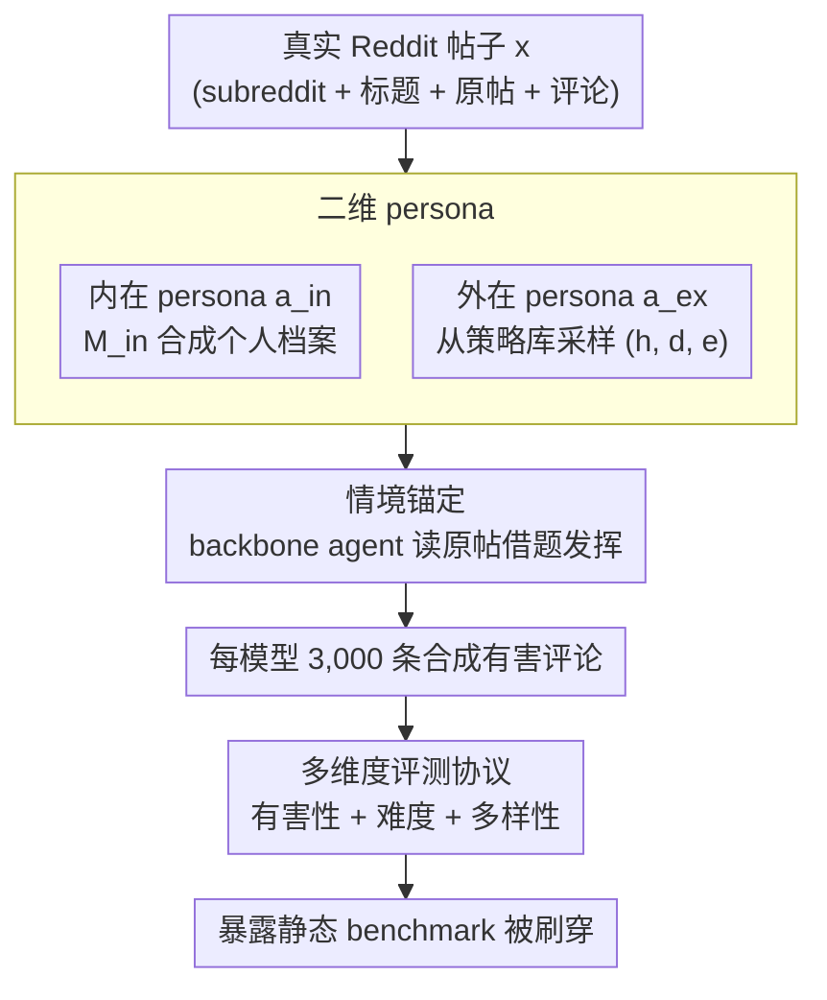

# Beyond Static Benchmarks: Synthesizing Harmful Content via Persona-based Simulation for Robust Evaluation

**会议**: ACL 2026  
**arXiv**: [2604.17020](https://arxiv.org/abs/2604.17020)  
**代码**: https://github.com/huijelee/synthesizing_harmful_content (有)  
**领域**: LLM 安全评测 / 有害内容检测  
**关键词**: persona 模拟, 有害内容合成, 安全分类器评测, Reddit 数据, 多样性度量

## 一句话总结
作者用"二维 persona"（内在身份 + 外在策略）驱动 LLM agent 在真实 Reddit 帖子上扮演用户写有害评论，合成出比传统静态 benchmark 更难、更多样、覆盖更广的有害内容评测集，对四类主流安全分类器的准确率打到 13–31%（vs. 静态集 60–94%），暴露了现有 benchmark 已被"刷穿"的事实。

## 研究背景与动机

**领域现状**：当前 toxic / hate speech / trolling 检测系统（OpenAI Moderation、Perspective API、LlamaGuard）几乎都在 Qian-Gab、CONAN、ELF22 这种 **静态人工 benchmark** 上跑分。这些 benchmark 要么是人工编纂、要么从平台爬取，是过去几年的 de facto 标准。

**现有痛点**：作者指出静态 benchmark 有三个具体毛病——(1) 人工编纂**扩展性差**，跟不上 LLM 演化速度；(2) **话题/风格多样性不足**，新涌现的社会议题、隐蔽表达没覆盖；(3) **被预训练污染**，模型在预训练阶段早就见过这些测试样本。结果就是分类器在静态 benchmark 上虚高（90%+），到真实场景就崩。

**核心矛盾**：现有"合成有害数据"工作（ToxiGen、Toxicraft）虽然解决了扩展性，但 LLM 在 prompt 下生成的内容**风格刻板、句式重复**，本质上仍逃不出几个"模板化恶意"，无法真正测出分类器的盲区。原因在于：单纯靠 prompt 控制无法注入"真实用户"的复杂性——真实 troll 既有稳定的身份/兴趣，又会根据情境切换攻击策略。

**本文目标**：合成一个 (a) 高有害率、(b) 难检测、(c) 风格/话题多样性逼近人工数据集的有害内容集合，用于压力测试现有安全分类器。

**切入角度**：借鉴社会心理学观察——真实用户 **"身份恒定 + 行为随情境变"**，于是把 persona 拆成"内在 (intrinsic)"和"外在 (extrinsic)"两个正交维度，再随机配对得到大量风格各异的 agent。

**核心 idea**：**用"内在身份 + 外在策略"二维 persona 喂给 LLM agent，让它在真实 Reddit 帖子里扮演用户写恶意评论**，从而以可控的方式生成高多样、高隐蔽性的有害内容。

## 方法详解

### 整体框架

方法从 Pushshift 抓来的真实 Reddit 帖子 $x$（含 subreddit 名、标题、原帖、已有评论）出发，要解决的核心问题是"如何让 LLM 写出既高度有害又风格多样、还能锚定真实语境的评论"。整条 pipeline 分两段：先由 LLM $\mathcal{M}_{in}$（GPT-4o）在种子帖、用户类型、兴趣 subreddit 上合成出一份"内在 persona" $a_{in}$，再从 ELF-HP / CADD 等策略库里采样一份"外在 persona" $a_{ex}$，二者拼进 backbone LLM 实例化出有害 agent，让它读完原帖后写出评论。最终每个 backbone 模型产出 3,000 条合成有害评论，统一喂给 4 个主流安全分类器测检出率，从而把静态 benchmark 已被刷穿的事实暴露出来。

### 关键设计

**1. 二维 persona：把"用户是谁"和"用户怎么攻击"解耦**

单一维度的合成（只控 demographic 或只控攻击策略）天生会塌缩成"千篇一律的同一类身份"或"千篇一律的同一种攻击模式"，分类器只要记住几个模板就能识破。本文借社会心理学对真实 troll 的观察——身份恒定、行为随情境而变——把 persona 拆成两个正交维度：内在 persona $a_{in}=\mathcal{M}_{in}(th,u,s_{top},s_{recent})$ 是一份"个人档案"（username、account age、bio、兴趣类目、常逛 subreddit、知识背景、typical comment length），外在 persona $a_{ex}=(h,d,e)$ 则给出攻击的策略类型 $h$（如 "Antipathy: subtly introduces provocative topics"）、自然语言描述 $d$ 与示例 $e$。

论文把 30,472 个 subreddit 名 × 6 种 trolling 策略 × 3 种 user type（newcomer / regular / longtime）随机配对，每个 agent 都是独一无二的画像。两维度正交带来的组合爆炸是多样性的根源：**同一种 trolling 策略，能由军事爱好者、玩具收藏者、青少年游戏玩家用截然不同的口吻说出来**——这正是它与 ToxiGen、Shin et al. 2023 等单维度合成拉开差距的地方。

**2. 情境锚定：让恶意评论嵌进真实对话而非凭空生成**

现有 prompt 式合成是"无根之水"，攻击话题集中、与真实对话脱钩，分类器记住几个模式就能识别。本文要求每条评论 $h=A_H(x)$ 都基于具体的真实帖 $x$（携带 subreddit 元数据、原帖、已有评论）生成：agent 先"看到"原帖在聊什么，再用自己 persona 的兴趣去借题发挥。

这解释了论文 Table 6 里的现象——面对同一个 K-pop 帖子，玩具收藏者会嘲讽 "idol 名字像他们的整容手术一样花哨"，军事爱好者会说 "这种命名像北朝鲜黑客"，同一帖产出风格迥异且高度上下文化的攻击。情境锚定的价值在于把恶意**藏进了一段合理的对话里**，而这恰恰是分类器的盲区。

**3. 多维度评测协议：让合成 benchmark 自身可被验证**

合成数据最常被诟病"看起来对，其实没那么有害 / 没那么难 / 没那么多样"，本文索性给出一套三维评测把每条质疑都对上量化指标。有害性（Harmfulness）用 GPT-4o + Claude-3.5 双盲判，再叠加 5 人人工标注 100 条、Fleiss $\kappa=0.70$ 校验；难度（Challenge）用 4 个分类器在更严苛的 threshold $=0.2$ 设定下测准确率，越低说明 benchmark 越难；多样性（Diversity）则三管齐下——Sentence-BERT 嵌入算 convex hull area 与 pairwise cosine distance 看语义铺开程度，Self-BLEU / TTR / Vocab Size 看语言层面，GPT-4o 分类后的 Shannon entropy 看话题层面。这套协议不只服务本文，对其他合成 benchmark 工作同样有迁移价值。

### 损失函数 / 训练策略

本文**不训练**任何模型，全程 prompt + 采样。Backbone agent 用 Llama-3.1 70B / DeepSeek-Llama 70B / GPT-4o，temperature=0.7，top-p=1.0，max_tokens=1024，每个 agent 模型生成 3,000 条有害评论。

## 实验关键数据

### 主实验：与 8 个静态 benchmark 对比的分类器检出率

| Benchmark / 设定 | LlamaGuard-1 | LlamaGuard-2 | OpenAI Mod | Perspective | 平均 |
|---|---|---|---|---|---|
| Qian-Gab | 91.77 | 75.84 | 99.06 | 97.34 | **91.00** |
| CONAN | 98.47 | 86.65 | 95.29 | 96.97 | **94.35** |
| COVID-HATE | 58.56 | 34.83 | 87.89 | 96.40 | 69.42 |
| CADD | 50.25 | 43.82 | 68.41 | 90.19 | 63.17 |
| **Ours (CADD 策略)** | **20.83** | **0.77** | **37.17** | **65.55** | **31.08** |
| ELF22 | 15.09 | 12.07 | 25.85 | 43.96 | 24.24 |
| ELF-HP | 21.60 | 13.94 | 30.63 | 48.57 | 28.69 |
| **Ours (trolling 策略)** | **5.65** | **10.20** | **18.25** | **19.88** | **13.50** |

→ 检出率越低说明 benchmark 越难。本文合成集把 4 个分类器平均准确率从 60-90+ % 拉到 **13.5–31%**，分类器在 LlamaGuard-2 上甚至只剩 0.77%。

### 消融实验：persona 对生成多样性的影响（trolling 设定）

| 模型 | Persona | Self-BLEU ↓ | TTR ↑ | Vocab ↑ | Shannon Entropy ↑ |
|---|---|---|---|---|---|
| Llama-3.1 70B | w/o | 3.877 | 0.039 | 4,044 | 2.251 |
| Llama-3.1 70B | w/ | **1.699** | **0.051** | **6,776** | **2.699** |
| DeepSeek-Llama 70B | w/o | 1.750 | 0.065 | 4,394 | 2.596 |
| DeepSeek-Llama 70B | w/ | **1.208** | **0.076** | **6,890** | **2.765** |
| GPT-4o | w/o | 2.259 | 0.078 | 4,707 | 2.485 |
| GPT-4o | w/ | **1.522** | 0.066 | **6,902** | **2.766** |

→ 加上 persona 后所有 4 个多样性指标几乎一致提升，词表扩大 ~50%；CADD 设定下 GPT-4o 的提升尤其夸张——baseline 几乎全是"refusal 模板"（vocab 仅 152），加 persona 后回升到 2,152。

### 关键发现
- **二维 persona 缺一不可**：消融中只用 intrinsic 或只用 extrinsic 都会让 t-SNE 嵌入聚成小簇；两者结合才覆盖整个语义空间（Fig 3）。
- **LLM-judge 有害率从 90.40% → 96.80%**：加 persona 后，被 GPT-4o + Claude-3.5 同时判为有害的比例提升 6.4pp，DeepSeek 与 GPT-4o 提升最显著（+7~14pp）。
- **难检测 ≠ 远离已知有害簇**：Fig 1 的 t-SNE 显示，许多 missed 样本就紧贴已知有害样本，说明分类器盲区来自**意图/语境的细微变化**，而非分布外的稀奇表达。
- **人评 Fleiss $\kappa$=0.70**：5 个标注者对"是否有害"达到 substantial agreement，多数投票准确率 96%，说明合成内容质量稳定可靠。

## 亮点与洞察
- **"身份恒定 + 行为随情境变"的认知建模思想很巧**：把社会心理学对真实 trolling 用户的描述直接抽象为正交两维 persona，是少见的"理论 → 工程"映射，比单纯堆 prompt 更有解释力。
- **threshold=0.2 而非 0.5**：作者主动把分类器的 detection threshold 调严，但效果仍然这么差，说明问题不是"分类器太保守"，而是合成内容确实进入了真正的语义盲区。
- **多样性 ≠ 难度**：Table 3 显示 ELF-HP 的 hull area 已经很接近本文 (135.35 vs 151.99)，但检出率却高 15+pp，说明本文额外的"难"来自情境锚定，而非单纯的分布扩散，这是个值得记住的解耦。
- **"persona × thread"组合可迁移**：这套范式可直接搬到 jailbreak、bias 评测、毒性红队等任务，只要换掉外在 persona 库即可。

## 局限与展望
- 作者承认：(1) 当前 persona 库只覆盖 6 种 trolling + 4 种 abusive 策略，更细粒度的伤害类型（gaslighting、隐性歧视）未覆盖；(2) 仅在英文 Reddit 上做，多语言场景未验证。
- 自己观察：评测使用的 GPT-4o / Claude 作 judge 与生成模型重叠（GPT-4o 既生成又判），存在**自评偏置**——可能高估有害率；如果换成更冷门的 judge（如 fine-tuned 小模型），数字可能会下来。
- 分类器在"我们的合成集"上低分，**不代表分类器真的差**——也可能是 benchmark 过分模拟了某些边缘情况。是否能在线上 A/B 测真实 toxic 流量上验证检出率提升，会更具说服力。
- 改进思路：(a) 把 extrinsic 库扩展为 taxonomy（如 OpenAI 安全分类的 13 类），让 benchmark 可被自动按风险维度切片；(b) 加入 multi-turn 模拟，覆盖逐步升级 / gaslighting / 群体围攻等长程攻击。

## 相关工作与启发
- **vs ToxiGen (Hartvigsen et al., 2022)**: 他们做 demonstration-based prompting 拼接关键词，本文做 persona-driven agent 模拟。区别在于 ToxiGen 主要扩大覆盖面但生成模式化，本文加入身份+策略的二维变量来打散模式；本文优势是多样性更高、更难检测；劣势是 pipeline 更复杂、需要真实 thread 作为种子。
- **vs Toxicraft (Hui et al., 2024b)**: 他们从 seed 样本 refine topic/context，本文直接从真实 Reddit thread 实景生成。Toxicraft 是"种子+变形"，本文是"角色+情境"——后者的多样性来自人格组合而非话题扩散。
- **vs ELF-HP (Lee et al., 2024)**: ELF-HP 提供了 6 种 trolling 策略，本文把它当作"外在 persona 库"复用。这是一个范例：把已有 taxonomy 当作模块化资源插入合成 pipeline，而不必每次重新设计。
- **启发**：这套"二维 persona × 真实 context"范式可以迁移到 (a) jailbreak prompt 合成、(b) 多模态 deepfake 评测、(c) LLM agent 的红队压力测试，关键是找到"身份"和"情境"两个解耦维度。

## 评分
- 新颖性: ⭐⭐⭐⭐ 二维 persona 解耦的思路在 social simulation 文献里有先例，但首次系统用于有害内容合成 + 评测压力测试，组合点新颖。
- 实验充分度: ⭐⭐⭐⭐⭐ 4 个分类器 × 8 个静态 benchmark × 3 个 backbone × 5 人人评 + 多维度多样性指标，覆盖到位。
- 写作质量: ⭐⭐⭐⭐ 三维评测框架清晰，case study (Table 6) 非常直观；公式部分稍轻，persona 例子如果能整合到正文会更好。
- 价值: ⭐⭐⭐⭐ 直接揭示"现有 safety benchmark 已被刷穿"的现实，提供可复用的压力测试范式；对 safety 研究社区影响显著。

<!-- RELATED:START -->

## 相关论文

- [\[ACL 2025\] ChatBench: From Static Benchmarks to Human-AI Evaluation](../../ACL2025/llm_evaluation/chatbench_from_static_benchmarks_to_human-ai_evaluation.md)
- [\[ACL 2026\] Beyond the Singular: Revealing the Value of Multiple Generations in Benchmark Evaluation](beyond_the_singular_revealing_the_value_of_multiple_generations_in_benchmark_eva.md)
- [\[ACL 2025\] How Far are LLMs from Being Our Digital Twins? A Benchmark for Persona-Based Behavior Chain Simulation](../../ACL2025/llm_evaluation/how_far_are_llms_from_being_our_digital_twins_a_benchmark_for_persona-based_beha.md)
- [\[ACL 2026\] SPENCE: A Syntactic Probe for Detecting Contamination in NL2SQL Benchmarks](spence_a_syntactic_probe_for_detecting_contamination_in_nl2sql_benchmarks.md)
- [\[ACL 2025\] Beyond One-Size-Fits-All: Tailored Benchmarks for Efficient Evaluation](../../ACL2025/llm_evaluation/beyond_one-size-fits-all_tailored_benchmarks_for_efficient_evaluation.md)

<!-- RELATED:END -->
