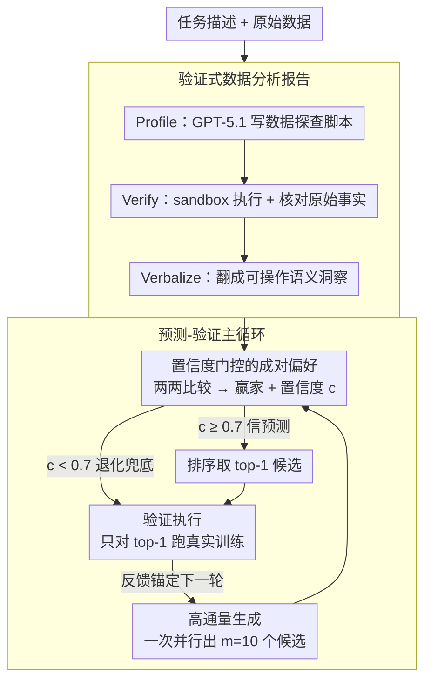

# Can We Predict Before Executing Machine Learning Agents?

**会议**: ACL 2026  
**arXiv**: [2601.05930](https://arxiv.org/abs/2601.05930)  
**代码**: https://github.com/zjunlp/predict-before-execute  
**领域**: LLM Agent / 评测  
**关键词**: ML Agent, World Model, Predict-then-Verify, AutoML, MLE-Bench

## 一句话总结
本文证明 LLM 可作为隐式 "world model"，仅凭 task 描述 + verified data report + 两份代码，就能预测 ML 解的优劣（DeepSeek-V3.2-Thinking 61.5% 准确率）；据此构造 ForeAgent，把 AIDE 的 Generate-Execute-Feedback 循环改成 Predict-then-Verify 循环，在 MLE-Bench 上获得 6× 加速 + 3.2× 搜索空间 + +6% Beat Ratio。

## 研究背景与动机

**领域现状**：MLE-Bench、AutoMind、AIDE 等 ML agent 都遵循"Generate-Execute-Feedback"范式——生成代码、跑训练拿 metric、根据反馈再改。但 MLE-Bench 单次完整训练动辄 9 小时，agent 在 12 小时时间预算内只能尝试少数几个 candidate。

**现有痛点**：(1) Execution Bottleneck——绝大多数计算都浪费在执行 sub-optimal 候选上；(2) 搜索空间窄——以 AIDE 为代表的 tree search 受执行预算限制，平均只能扩 1× 节点；(3) 现有 pruning 方法（Trirat 2025、Kulibaba 2025）多用启发式（如复杂度评分），不可靠，容易剪掉好解。

**核心矛盾**：要让 agent 探索更广的解空间，就必须放弃"每个 candidate 都跑一遍"；但若不跑，怎么知道哪些 candidate 值得跑？人类专家可以通过"心算"——读懂任务和数据后大致判断算法是否合适——LLM 能否做到同样的"mental simulation"？

**本文目标**：(1) 形式化定义"Data-centric Solution Preference"任务并构造大规模评测；(2) 证明 LLM 能否在不执行的前提下可靠预测 ML 解的优劣；(3) 把这种预测能力嵌入 agent，把 Execute 循环改成 Predict-then-Verify 循环。

**切入角度**：借鉴 World Model 思想（Ha & Schmidhuber 2018, Hafner 2024）——RL agent 用学到的环境模型做内部 rollout 代替真实交互。把这个范式迁移到代码执行：用 LLM 学到的"执行先验"做内部 rollout 代替真实训练。

**核心 idea**：把 verified data analysis report（先 profile 数据再让 GPT-5.1 verbalize 成自然语言洞察，如"严重类别不平衡, 不应该用 accuracy"）作为关键上下文，让 LLM 把这种语义信号当作 implicit world model 的输入，pairwise 比较两个解的优劣并给出置信度，置信度高的 candidate 才进入真实执行。

## 方法详解

### 整体框架
本文先把"不执行就预判 ML 解优劣"形式化成 Data-centric Solution Preference 任务并配上评测语料，再把这种预判能力嵌进 agent。语料这一侧，从 AIDE/AutoMind 在 MLE-Bench 上的真实 trajectory 中抽出 1,329 个有效解，经去重、分类、专家采样精选到 895 个实例，两两组合成 18,438 对，并平衡 ground-truth winner 的位置以消除位置偏差。agent 这一侧的 ForeAgent 以 AIDE 的 tree search 为骨架，把 Improvement 阶段从"逐个执行"改成三步：一次性生成 m=10 个候选 → 用置信度 0.7 阈值做 pairwise 筛选 → 只对 top-1 候选做真实执行验证。preference 任务用 Micro-Averaged Accuracy 衡量（Random 基线 50.0%、复杂度启发式 50.8%），agent 则用 Beat Ratio（在 MLE-Bench 上击败多少比例的人类参赛者）衡量。

### 关键设计

**1. 验证式数据分析报告（Verified Data Analysis Report）：把原始数据炼成 LLM 能推理的语义洞察**

LLM 既不擅长直接处理数字，上下文又塞不下原始数据表，于是本文用 Profile-Verify-Verbalize 三步管道把 raw 数据翻译成 LLM 友好的洞察。先让 GPT-5.1 写 Python profile 脚本（如 `df['target'].value_counts()`），再在 sandbox 里执行并人工严格核对输出无运行时错误，得到 raw fact（如 "Target: 0: 0.915, 1: 0.085"），最后由 GPT-5.1 把日志翻成 actionable insight（"Severe class imbalance (Pos: 8.5%). Implication: Accuracy is not a suitable metric; consider using F1-score."）。

消融实验印证了这条链路的价值：Code Only 56.7% → Numerical Stats 59.0% → Verbal Report 61.3%，而故意配错上下文的 Context Mismatch 只有 56.8%。这说明 LLM 不是靠"代码看起来复杂"去猜，而是真的在做"数据语义 × 算法适配"的推理；verbal narrative 比 raw stat 还强，说明模型更像一个被"含义"触发推理跳跃的 rhetorical reasoner。

**2. 置信度门控的成对偏好（Confidence-Gated Pairwise Preference）：让模型只在自信时跳过执行**

预测的输入是 $\mathcal{X}=(I, D_{rep}, \{C_0, C_1\}, \mathcal{P})$，输出是 $\mathcal{Y}=(cot, \hat{y}, c)$，其中 $\hat{y}\in\{0,1\}$ 是预测的赢家、$c\in[0,1]$ 是置信度。ForeAgent 拿 $c=0.7$ 当 gating 阈值：置信度够高才信预测、跳过执行，置信度不足就退化到真实执行兜底。

这套机制能成立的前提是模型不会乱给高置信度。校准实验显示置信度与准确率严格正相关——正因为 calibration 好，filter 才能高效剪枝而不误伤好解；若置信度噪声大，gating 就退化成随机筛选。可靠的自报置信度，正是这个 implicit world model 能被安全部署的关键。

**3. 预测-验证循环（Predict-then-Verify Loop）：把执行从主循环降级为最后的验证环节**

ForeAgent 把 AIDE "执行驱动"的主循环翻转成"预测驱动"，物理执行只用于终点验证，每个 Improvement 步因此从跑 m=10 次降到跑 1 次，立即拿到 m× 量级的加速。具体分三步：High-Volume Generation 并行生成 m=10 个候选（无执行成本，可大幅拓宽搜索宽度）；Confidence-Gated Pairwise Selection 用上面的 implicit world model 两两比较、置信度 ≥0.7 者才进入排序；Verification Execution 只对 top-k=1 的候选做真实执行以锚定反馈。

作者特意把架构设计得保守——只验证 top-1——以防 LLM 偶发误判把整条搜索轨迹带偏；这也意味着报告的 6× 加速、3.2× 搜索宽度与 +6% Beat Ratio 都是下界，更激进的 top-k 策略理论上还能更强。

## 实验关键数据

### 主实验 — Solution Preference 任务（节选 DeepSeek-V3.2-Thinking）

| 维度 | 取值 | Acc (%) |
|------|------|---------|
| Domain | CV | 59.3 |
| Domain | NLP | **66.9** |
| Domain | Data Sci. | 57.4 |
| Difficulty | Easy | **63.9** |
| Difficulty | Medium | 60.4 |
| Difficulty | Hard | 57.0 |
| Algo Era | Traditional | **64.5** |
| Algo Era | Modern | 60.4 |
| Granularity | Cross-Algo | **62.8** |
| Granularity | Self-Comp. | 60.7 |
| Complexity | Low | 62.1 |
| Complexity | High | 59.6 (Complexity Tax) |
| **Avg (全 18,438 pairs)** | | **61.5** |

对比 GPT-5.1：58.8% 全局平均；Random 50.0%；Complexity Heuristic 50.8%。Reasoning 模式（CoT）61.3% vs Direct Answer 55.9%。

### 消融 / 缩放实验

| 实验维度 | 关键结果 |
|----------|----------|
| Input 模态（Figure 3a） | Heuristic 50.8 → Code Only 56.7 → Numerical Stats 59.0 → **Verbal Report 61.3**；Context Mismatch 仅 56.8 |
| Listwise Ranking (Table 3) | Acc@1 在 N=2 时 61.3%，但 N=5 时跌到 31.1%；Spearman ρ≈0.23 |
| Scaling (Qwen 4B → 1T, Figure 3c) | 30B 后基本饱和，1T 也无明显提升；DeepSeek-V3.2 (61.3%) 和 GPT-5.1 (58.8%) 优势来自 reasoning paradigm 而非参数 |
| Validation-Test Gap (Table 4) | 单看 train val metric Acc 72.2%（耗时数小时）；LLM 推理 61.5%（耗时数秒） |

### ForeAgent 在 MLE-Bench 5 个 AI4Science 任务上

| 指标 | AIDE baseline | ForeAgent | 提升 |
|------|---------------|-----------|------|
| 平均 Beat Ratio | base | **+6%** | 显著 |
| 收敛时间 | 12h | 2h (1/6 budget) | **6× 加速** |
| 探索节点数 | 1× | **3.2×** | 搜索面更广 |
| Test Improve Rate | base | +23% | 中间开发阶段也受益 |

含两个 unseen task（Aerial Cactus、Histo. Cancer Detect），证明泛化能力。

### 关键发现
- **LLM 真的能"心算"算法适配**：>10% 超越 random baseline 已统计显著（详细方差小），证明这不是 lucky pattern。
- **Verbal Report 是核心增益来源**：raw stat 不够，必须翻译成"含义"才能触发推理。
- **Cognitive Boundary 存在**：模型对 NLP > CV > Data Sci.；Easy > Hard；Traditional > Modern；Cross-Algo > Self-Comp.；说明对"算法间粗对比"擅长，对"同算法细调"弱。
- **Listwise Ranking 是 weakness**：pairwise 61% → list of 5 仅 31% Acc@1，Spearman 才 0.23。说明 LLM 缺 global discrimination。
- **Parameter Scaling Law 不适用**：从 30B 到 1T 几乎没涨，说明这是 reasoning 架构问题而非规模问题。
- **Complexity Tax**：复杂代码上 Acc 反而掉 4 个点，提示 LLM 在 verbose code 上容易迷失。

## 亮点与洞察
- **把 World Model 范式落到 code/data 上**：之前 World Model 多用于物理仿真，本文是首批把它用作 code-execution prior 的工作之一，且证明不需要新架构，现成的 reasoning LLM 就行。
- **Verified Data Report = LLM-aided benchmark feature engineering**：用 LLM 写 profile 脚本 + LLM verbalize 结果的两步流程，避免 LLM 直接处理数字的弱点，是个值得复用的 prompt engineering pattern。
- **Confidence-Gated Pruning**：自报置信度 + gating 阈值的简单设计就能让 implicit world model 安全部署，无需 RL fine-tune reward model。
- **Validation-Test Gap 视角**：传统 val metric 也只有 72.2% 准确率（因 distribution shift），LLM 61.5% 已经接近且耗时数秒——重新定义了"什么算可靠的 ML feedback signal"。
- **18,438 pairs 数据集对训练 reward model 也有价值**：作者明确说这是 future work，可作为离线 RL agent 的 dense reward 训练源。

## 局限与展望
- 语料覆盖 26 个任务但分布偏 Classification/Regression，长尾科学任务（如 Audio、Tabular Grading）样本少。
- Verified Data Report 在 CV/NLP 等非结构化领域只能用 metadata，缺乏多模态语义 profiling。
- ForeAgent 用保守的 top-1 verify，没探索 top-k / batched verify / 分层 gating 等更激进策略。
- Listwise ranking 弱点没解决，只有 pairwise 能用——这限制了 ForeAgent 在 large candidate pool 上的应用。
- 复杂代码上 Complexity Tax 严重，深度优化场景可能失灵。
- 个人补充：61.5% 准确率意味着 LLM 仍有 ~38.5% 概率剪错；ForeAgent 靠最后的执行 verify 兜底，但若 verify 阶段也错了（如 val metric 误导），就可能形成误差累积。

## 相关工作与启发
- **vs AIDE / AutoMind / MLE-Star**：他们沿用 Generate-Execute-Feedback 全靠真实执行；本文用 implicit world model 把 Execute 推到后面。
- **vs CodeI/O (Li 2025) / CRUXEval (Gu 2024)**：他们测代码 forward execution prediction；本文测的是更高阶的"哪种代码对这份数据更好"。
- **vs Hora (2024) Predicting Test Results**：他对静态 test cases 做预测；本文对 ML training outcome 做预测，难度更大。
- **vs Trirat (2025) AutoML-Agent / Kulibaba (2025) KompeteAI**：他们用复杂度启发式剪枝；本文用 LLM 做语义级 preference 判断，更可靠。

## 评分
- 新颖性: ⭐⭐⭐⭐⭐ 把 world model 范式 + verified data report + pairwise preference 组合到 ML agent 上，是真正新的视角。
- 实验充分度: ⭐⭐⭐⭐⭐ 18,438 pairs 评测 + Qwen 4B–1T scaling + 5 个 MLE-bench 任务 + 多种消融，相当全面。
- 写作质量: ⭐⭐⭐⭐ Figure 1/2 把核心 idea 讲得很清楚，但维度太多（task × difficulty × algo era × granularity × complexity）的表格略难读。
- 价值: ⭐⭐⭐⭐⭐ 6× 加速 + 3.2× 搜索 + +6% Beat Ratio 是可直接落地的工程提升；同时开源 dataset 可作为 reward model 训练数据。

<!-- RELATED:START -->

## 相关论文

- [\[ICML 2026\] HiPER: Hierarchical Reinforcement Learning with Explicit Credit Assignment for Large Language Model Agents](../../ICML2026/llm_evaluation/hiper_hierarchical_reinforcement_learning_with_explicit_credit_assignment_for_la.md)
- [\[ICML 2025\] DataDecide: How to Predict Best Pretraining Data with Small Experiments](../../ICML2025/llm_evaluation/datadecide_how_to_predict_best_pretraining_data_with_small_experiments.md)
- [\[ACL 2026\] Can LLMs Act as Historians? Evaluating Historical Research Capabilities of LLMs via the Chinese Imperial Examination](can_llms_act_as_historians_evaluating_historical_research_capabilities_of_llms_v.md)
- [\[ACL 2026\] Multi-Task Reinforcement Learning for Enhanced Multimodal LLM-as-a-Judge](multi-task_reinforcement_learning_for_enhanced_multimodal_llm-as-a-judge.md)
- [\[ACL 2026\] Enhancing Linguistic Competence of Language Models through Pre-training with Language Learning Tasks](enhancing_linguistic_competence_of_language_models_through_pre-training_with_lan.md)

<!-- RELATED:END -->
