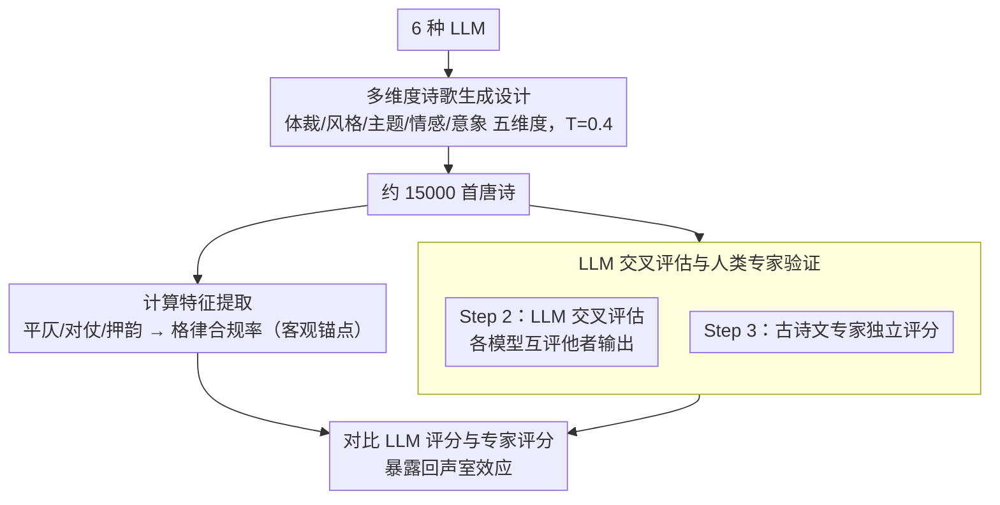

# Capabilities and Evaluation Biases of Large Language Models in Classical Chinese Poetry Generation: A Case Study on Tang Poetry

**会议**: ACL 2026 Findings  
**arXiv**: [2510.15313](https://arxiv.org/abs/2510.15313)  
**代码**: [https://github.com/boleima/Tang-Poetry](https://github.com/boleima/Tang-Poetry)  
**领域**: LLM评测  
**关键词**: 古诗生成, 唐诗, LLM评估偏差, 回声室效应, 人机评估

## 一句话总结

本文提出了一个三步评估框架（计算特征提取 + LLM-as-Judge + 人类专家验证）来系统评估六种 LLM 在唐诗生成上的能力，发现了关键的"回声室"效应：LLM 系统性地高估模仿统计模式但违反格律规则的机器生成诗歌，与人类专家判断显著偏离。

## 研究背景与动机

**领域现状**：LLM 在文本生成（包括创意写作）上展示了令人印象深刻的能力。古典中国诗歌（特别是唐诗）因其严格的韵律、声调约束和深厚的文化内涵，构成了 AI 创造力的极端挑战。

**现有痛点**：(1) LLM 在诗歌生成中仍常出现行间不连贯、意象缺乏原创性、或复现记忆诗句等问题；(2) 传统自动指标（BLEU、ROUGE）无法捕捉韵律、意象和美学价值；(3) LLM-as-Judge 方法可能存在系统性偏差——模型可能膨胀自身输出或与同伴趋同。

**核心矛盾**：诗歌生成需要兼顾结构正确性和美学质量，而当前的自动评估方法无法可靠地衡量这两个维度，特别是在文化敏感的创意任务中。

**本文目标**：建立系统性的 LLM 唐诗生成和评估研究，揭示 LLM 在诗歌生成中的能力边界和评估中的偏差。

**切入角度**：以唐诗为测试平台，设计包含五个维度（体裁、诗人风格、主题、情感、意象）的生成任务，通过三步框架提供多层次评估。

**核心 idea**：LLM 生成的诗歌可能在表面统计特征上接近人类作品，但在严格格律遵守上存在系统性缺陷，而 LLM 评估者无法识别这些缺陷，形成"回声室"。

## 方法详解

### 整体框架
本文围绕"生成—评估"两端搭起一条评测流水线：先让 6 种 LLM 各按五个诗歌维度生成约 2,500 首唐诗（共约 15,000 首），再用三步框架层层评估——Step 1 自动提取计算特征（格律合规率等客观指标），Step 2 让每个模型交叉评估其他模型的输出（LLM-as-Judge），Step 3 由古诗文领域专家对相同样本独立评分。通过对比 LLM 评分与专家评分，定位二者系统性偏离的"回声室"效应。

### 关键设计

**1. 多维度诗歌生成设计：用控制变量把唐诗创作拆成五个可对比的维度**

为了让不同模型、不同维度之间的对比具备科学性，作者把生成任务沿五个维度铺开：体裁（五/七言绝句、律诗）、诗人风格（李白/杜甫/白居易/王维/李商隐）、主题（山水/乡愁/怀古/田园/离别）、情感（悲伤/宁静/豪放/浪漫/喜悦）、意象（风/花/柳/月/雁）。每首诗都用显式提示指定所属维度，并固定温度 $T=0.4$ 以控制生成随机性，从而把"模型能力差异"从"任务设置差异"中干净地分离出来。

**2. 计算特征提取：把唐诗最硬的格律约束变成可客观量化的合规率**

格律是唐诗的硬性门槛，违反平仄、对仗、押韵的诗在专业角度直接不合格，而这恰恰是 LLM 评估者最容易视而不见的维度。Step 1 自动检测平仄格式、对仗与押韵的遵守情况，算出格律合规率——这是整套评估里最客观、最具区分度的指标，也为后面揭示"LLM 裁判忽视格律违反"提供了可量化的锚点。

**3. LLM 交叉评估与人类专家验证：用专家基线照出自动评估的系统性偏差**

Step 2 让每个 LLM 从主题相关性、情感一致性、意象/结构、语言真实性等维度去评其他模型生成的诗，Step 3 再请古诗文专家对同一批样本独立打分。把两套评分摆在一起对比，就暴露出"回声室"效应：LLM 裁判系统性地给模仿了统计模式却违反格律的机器诗打高分，并隐隐偏向自身输出，而人类专家能准确识别格律违反并据此压低评分。诗歌这一兼具文化敏感性与刚性格律约束的场景，恰好成了检验 LLM-as-Judge 可靠性的独特试金石。

### 损失函数 / 训练策略
不涉及任何模型训练。生成统一用温度 $T=0.4$，所有评估（含 LLM 交叉评估与专家验证）均在零样本设置下进行。

## 实验关键数据

### 主实验

**六种 LLM 生成能力分层**

- 第一梯队：Qwen2.5-7B-Instruct（格律合规率最高，整体质量最佳）
- 第二梯队：GLM-4-9B-Chat、DeepSeek-V2-Lite-Chat
- 第三梯队：Baichuan2-7B-Chat、Gemma-2-9B-it、Mistral-7B（中文诗歌能力较弱）

### 消融实验

**"回声室"效应**：LLM 评估者系统性地给机器生成的诗歌打高分，即使这些诗歌违反了严格的格律规则。人类专家则能准确识别格律违反并显著降低评分。LLM 自评分与交叉评分之间存在偏向自身输出的倾向。

### 关键发现

- 以中文为强项的模型（Qwen、GLM、DeepSeek）在唐诗生成上显著优于以英文为主的模型
- LLM 评估者倾向于高估模仿统计模式但违反格律的诗歌——"回声室"效应
- 格律合规率是最有区分度的质量指标，但恰恰是 LLM 评估者最容易忽略的
- 不同维度的生成难度不同，风格模仿比格律遵守更容易

## 亮点与洞察

- 首次系统研究 LLM 在古典中国诗歌生成和评估中的"回声室"效应
- 三步评估框架可推广到其他文化敏感的创意生成任务
- 对 LLM-as-Judge 方法的可靠性敲响了警钟，特别是在需要专业领域知识的评估中
- 数据集和代码开源，可复现性强

## 局限与展望

- 仅评估了 6 种开源模型，未包含商业闭源模型
- 人类评估受限于专家可用性，评估规模有限
- 仅聚焦唐诗，未扩展到其他诗歌形式
- 未来可探索格律感知的微调策略来改善 LLM 的诗歌生成能力

## 相关工作与启发

- 与 LLM-as-Judge 领域的偏差研究（如 Clark 等人的发现）形成诗歌领域的具体验证
- 为中文 NLP 社区提供了重要的创意生成基准
- 格律合规率的自动检测方法可推广到其他有严格形式约束的文本生成任务

## 评分

- 新颖性: ⭐⭐⭐⭐ 首次系统研究 LLM 唐诗生成的回声室效应
- 实验充分度: ⭐⭐⭐⭐ 6 模型 × 5 维度 × 3 步评估的全面设计
- 写作质量: ⭐⭐⭐⭐ 研究设计严谨，图表清晰

<!-- RELATED:START -->

## 相关论文

- [\[ACL 2026\] SciCustom: A Framework for Custom Evaluation of Scientific Capabilities in Large Language Models](scicustom_a_framework_for_custom_evaluation_of_scientific_capabilities_in_large_.md)
- [\[ACL 2026\] Attribution, Citation, and Quotation: A Survey of Evidence-based Text Generation with Large Language Models](attribution_citation_and_quotation_a_survey_of_evidence-based_text_generation_wi.md)
- [\[ACL 2026\] Dynamic Infilling Anchors for Format-Constrained Generation in Diffusion Large Language Models](dynamic_infilling_anchors_for_format-constrained_generation_in_diffusion_large_l.md)
- [\[ACL 2025\] McBE: A Multi-task Chinese Bias Evaluation Benchmark for Large Language Models](../../ACL2025/llm_evaluation/mcbe_a_multi-task_chinese_bias_evaluation_benchmark_for_large_language_models.md)
- [\[ACL 2026\] Exploring the Capability Boundaries of LLMs in Mastering of Chinese Chouxiang Language](exploring_the_capability_boundaries_of_llms_in_mastering_of_chinese_chouxiang_la.md)

<!-- RELATED:END -->
