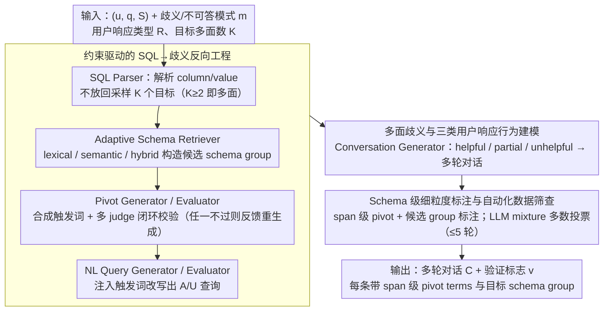

# CLARITY: A Framework and Benchmark for Conversational Language Ambiguity and Unanswerability in Interactive NL2SQL Systems

**会议**: ACL 2026  
**arXiv**: [2604.22313](https://arxiv.org/abs/2604.22313)  
**代码**: 暂无（Oracle 内部框架）  
**领域**: LLM 评测 / 对话式 NL2SQL / 歧义检测  
**关键词**: NL2SQL 评测, 多面歧义, 不可答性, schema 定位, 对话式澄清

## 一句话总结
CLARITY 是 Oracle 提出的首个支持 "**multi-facet 歧义 + 不可答** + 单/多轮对话 + 多种用户澄清行为" 的 NL2SQL 诊断基准，用 SQL→pivot term→改写→对话→筛查的可控 LLM pipeline 把 Spider/BIRD 自动扩展出 ~3 万实例，并通过 schema 级 pivot/group 标注揭示出 SOTA LLM "能检测歧义却定位不到 schema 元素"的失败模式。

## 研究背景与动机

**领域现状**：NL2SQL 已经被部署到工业级查询接口（Oracle、Snowflake 等），但用户查询经常 ambiguous 或 unanswerable。AMBROSIA、AmbiQT、NoisySP、SQUAB 等基准只覆盖单一歧义、单轮；PRACTIQ、MMSQL、BIRD-INTERACT 拓展到多轮但仍假设用户合作、澄清干净，且只给 instance-level 标签（ambiguous/unanswerable 二元）。

**现有痛点**：真实生产环境中——(1) 一条查询常有**多个相互作用的歧义来源**（同时涉及多个 column 和 value）；(2) 用户的澄清回答常常**部分有用、模糊甚至无关**；(3) 系统就算正确检测出"有歧义"，也常**定位错具体 schema 元素**——而既有基准只看 detection rate，掩盖了这种 schema-level 失败。

**核心矛盾**：歧义/不可答的真实分布是 multi-faceted、multi-turn、user-noisy 的，而现有评测假设是 uni-faceted、single-turn、cooperative-user 的。这种 gap 让 "高歧义检测率" 的 NL2SQL 系统在工业部署中依然频繁出错却查不出原因。

**本文目标**：构造一个 (1) 同时覆盖 column 与 value 层、ambiguity 与 unanswerable 4 种 mode，(2) 支持 uni-/multi-facet，(3) 覆盖 helpful/partial/unhelpful 三类用户行为，(4) 提供 span-level pivot term + 候选 schema group 的细粒度元数据 的 NL2SQL 诊断基准——让评测不再停留在"系统知不知道有问题"，而是"系统能否精确指出问题在哪里"。

**切入角度**：从 executable SQL 出发反向工程——SQL 的 column/value 引用结构本身就明确定义了什么是"真实意图"，因此可以用规则解析 + LLM 改写把它定向破坏为 ambiguous/unanswerable 版本，再扩展为对话。这种 constraint-driven 生成保证了既有干净 ground truth、又能控制歧义模式。

**核心 idea**：用 "SQL Parser → Adaptive Schema Retriever → Pivot Term Generator/Evaluator → NL Query Generator/Evaluator → Conversation Generator → Automated Screening" 这一 modular pipeline，把已存在的干净 NL2SQL 数据自动扩展为 schema-grounded 的 ambiguous/unanswerable 多轮交互实例。

## 方法详解

### 整体框架

CLARITY 是一套端到端的 NL2SQL 诊断基准生成框架，目标是把已有的干净 NL2SQL 数据（Spider/BIRD）反向"做脏"成带 schema 级标注的歧义/不可答多轮对话。给定一个三元组 $(u, q, \mathcal{S})$（自然语言查询、SQL、schema）以及指定的歧义/不可答模式 $m$、用户响应类型 $R$、目标多面数 $K$，框架先由 SQL Parser 解析 $q$ 抽出 column/value 并采样 $K$ 个目标，再经 Adaptive Schema Retriever 构造候选 schema group、Pivot Generator/Evaluator 在多 judge 闭环下合成并校验歧义触发词、NL Query Generator/Evaluator 把触发词注入改写出 A/U 查询、Conversation Generator 按响应类型扩成多轮对话，最后由 Automated Data Screening 多数投票筛查，输出对话 $C=\{(r_t, t_t)\}_{t=1}^T$ 与验证标志 $v$。其中模式集合 $M = \{\texttt{col\_amb}, \texttt{val\_amb}, \texttt{col\_unans}, \texttt{val\_unans}\}$，$K=1$ 即 uni-facet、$K\ge 2$ 即 multi-facet；整套流程在 Spider/BIRD 上自动产出约 6.4k/3.5k 单轮与 12.1k/7.2k 多轮实例，每条都带 span 级 pivot terms 与目标 schema group 标注。

### 关键设计

**1. 约束驱动的 SQL→歧义反向工程：让歧义实例天生带干净 ground truth**

纯 LLM 自由生成歧义查询会带来分布偏倚和"歧义定义不精确"的问题，纯模板法又不够自然多样。CLARITY 改从 executable SQL 倒推：SQL 的 column/value 引用结构本身就精确定义了"真实意图"，于是 SQL Parser 把 $q$ 解析成引用的 column 集 $\mathcal{C}$ 与 column-value 对 $(\mathcal{C}, \mathcal{V})$，按 mode 不放回地采样 $K$ 个目标 $\mathcal{T} = \{t_j\}$（不放回是为了避免目标退化为重复）。对每个歧义目标，Adaptive Schema Retriever 构造候选 group $G_j$——lexical 用 token overlap、semantic 用句向量余弦相似度、hybrid 合并两者，并以"先 lexical 识别、再在 lexical-overlap 约束下做 semantic 检索"的两阶段过滤显式区分两类歧义子类；对不可答目标则不建正样本 group，把整个目标空间 $\mathcal{X}_j$ 当作 negative reference。

触发词由 Pivot Generator 在 $(\mathcal{X}_j, G_j)$ 与全局排除集约束下用 LLM 合成，再交 Pivot Evaluator 的多个 LLM judge 校验"符合 mode""与 $G_j$ 兼容（歧义模式）""不在 schema 中"三项布尔约束，任一不过就把错误信息反馈回 Generator 重生成，全员一致通过才放行。这样一来，ground truth 来自可验证的 SQL 解析、触发词由 LLM 在严格约束下自然生成、再用 multi-judge 闭环修正，质量与规模兼得——人工验证显示除 multi val_amb 外各歧义/不可答类别准确率都在 93–100%。

**2. 多面歧义与三类用户响应行为建模：逼近工业现实的脏分布**

工业现实中一条查询常多歧义共存、用户澄清也常常不干净，而既有基准默认 uni-facet + cooperative-user。CLARITY 通过把目标数控制在 $K \ge 2$，让一条查询同时存在两个及以上 A/U 实例（如 column ambiguous 与 value unanswerable 并存），SQL Parser 的不放回采样保证它们不退化成重复。

对话侧则引入三类用户响应 $R \in \{\texttt{helpful}, \texttt{partial}, \texttt{unhelpful}\}$：Conversation Generator 先让 agent 针对触发词 $p_j$ 生成措辞多样的澄清问题，再按 $R$ 模拟用户回答——helpful 给完整正确信息、partial 只解析一部分歧义、unhelpful 给无关或模糊回答；歧义案例最终把澄清结果整合回 $q$ 得到 SQL ground truth，不可答案例则让 agent 显式说明无法执行。partial 与 unhelpful 恰恰是真实失败的主要来源，显式建模它们让多轮评测第一次能量化"用户配合 vs 用户 noisy"下的性能差（Table 5 中 verbose > concise > partial > not）。

**3. Schema 级细粒度标注与自动化数据筛查：把评测从"是不是歧义"升级到"歧义在哪"**

既有基准只给 instance-level 二元标签，于是即便系统检测出"有歧义"，也看不出它是否定位到了正确的 schema 元素。CLARITY 为每个实例附带 span 级触发词 $\{p_j\}$ 与候选 schema target group $\{G_j\}$，并在 Detection Accuracy（是否检测到歧义）之外引入 Match Accuracy（检测到的歧义是否对应正确 schema 元素）这一新指标。

生成完成后，Automated Data Screening 借鉴 Talaei et al. (2024) 针对 A/U 规范设计 test case，用 LLM mixture 多数投票筛查，evaluator 阶段最多迭代 5 轮以防无限重生成。这套 schema-grounded 标注正是 CLARITY 的核心诊断力——实验里几乎所有 LLM 的 DA 都逼近 100%（99.6%/100%），但 MA 在 multi-facet 上掉到 5–20%（Spider M-Col Amb 20.4%、BIRD M-Col Amb 5.4%），暴露出"知道有歧义却说不清歧义落在哪几个 column"这一被 instance-level 标签彻底掩盖的失败模式。

## 实验关键数据

### 主实验（GPT-5 单轮 column ambiguity，Spider few-shot 设置）

| Setting | Uni LEM | Uni SEM | Multi LEM | Multi SEM |
|---------|---------|---------|-----------|-----------|
| Zero-shot | 19.2 | 15.0 | 15.2 | 5.2 |
| Few-shot no-meta (uni 范例) | 56.9 | 42.9 | 55.3 | 13.4 |
| Few-shot no-meta (uni+multi 范例) | 62.7 | 50.3 | 61.4 | 23.4 |
| Few-shot meta (uni 范例) | 60.5 | 53.9 | 67.0 | 60.2 |
| **Few-shot meta (uni+multi 范例)** | **61.3** | **55.8** | **70.1** | **60.1** |

SEM (Strict Exact Match) 衡量"是否枚举出所有正确 SQL 解释"；LEM (Lenient Exact Match) 只要求至少一个正确。Multi-facet 上 zero-shot SEM 仅 5.2%，加入 metadata 后跃升到 60.1%，提升幅度 **+55 个绝对点**，证明 schema-grounded metadata 的诊断与教学价值。

### 多轮 SQL 预测（Spider，5 模型 × A/U mode × 4 conversation type，EA %）

| Model | U-Lex Amb | M-Lex Amb | U-Sem Amb | M-Sem Amb | U-Col Unans | M-Col Unans | U-Val Amb | M-Val Amb | Concise | Verbose | Partial | Not |
|-------|-----------|-----------|-----------|-----------|-------------|-------------|-----------|-----------|---------|---------|---------|-----|
| GPT-4o | 74.2 | 73.2 | 74.2 | 67.2 | 99.0 | 100.0 | 68.3 | 60.6 | 73.1 | 80.5 | 74.6 | 62.6 |
| GPT-4.1 | 75.2 | 73.6 | 81.0 | 73.2 | 95.0 | 99.0 | 75.2 | 66.7 | 68.3 | 82.2 | 78.1 | 71.7 |
| GPT-5 | 73.0 | 71.6 | 77.6 | 69.4 | 83.0 | 93.0 | 78.3 | 70.8 | 62.9 | 79.3 | 77.2 | 70.0 |
| Grok-3 Mini Fast | 78.2 | 75.8 | 82.4 | 77.8 | 86.0 | 94.0 | 76.8 | 65.9 | 64.8 | 81.7 | 79.3 | 75.8 |
| LLaMA-3.3 | 76.8 | 76.8 | 80.6 | 69.8 | 44.0 | 72.0 | 72.6 | 64.9 | 42.3 | 81.3 | 76.5 | 72.8 |

### 歧义检测对比 (AmbiSQL vs AmbiSQL-CT with CLARITY exemplars)

| 数据集 | Mode | DA | MA | DA (+CT) | MA (+CT) |
|--------|------|----|----|----------|----------|
| Spider | U-Col Amb | 99.6 | 57.8 | 99.8 | 62.2 |
| Spider | M-Col Amb | 100.0 | **20.4** | 100.0 | 19.6 |
| BIRD | U-Col Amb | 98.9 | 50.1 | 99.3 | 57.7 |
| BIRD | M-Col Amb | 100.0 | **5.4** | 100.0 | 7.0 |

### 关键发现
- **Detection ≠ Localization**：DA 几乎全 99–100%，但 MA 在 multi-facet column ambiguity 上只有 5.4–20.4%——系统几乎总能"嗅到歧义"，但绝大多数时候**指不准"歧义到底在哪几个 column"**。这是 instance-level 评测完全看不到的失败模式。
- **Multi-facet 难度 >> uni-facet**：GPT-5 多面 SEM 从 zero-shot 5.2% 到加入 metadata 后 60.1%，对比 uni-facet 同样 setting 的 55.8%，说明多面任务对教学信号的依赖更强。
- **Unanswerable 比 ambiguous 容易**：Unans cases EA 普遍 90%+（因为只需输出 null），而 amb cases 在 60–80%，提示模型"判定 unans 容易，资源争议性歧义难"。
- **对话质量主导胜负**：Verbose > Partial > Not（如 GPT-4.1 80–82 vs 71%），LLM 间差异远小于 conversation type 间差异，说明"交互结构"比"模型能力"更影响多轮 NL2SQL 性能。
- **LLM 容易把 lexical 误判为 semantic**：错误分析显示主要错误来自混淆两种 amb 子类——CLARITY 的两阶段 lexical/semantic 分离过滤为研究这一问题提供了精准探针。

## 亮点与洞察
- **首次提出"Detection-Localization gap"作为 NL2SQL 评测核心维度**：MA 指标揭示了既有基准被 DA ~100% 掩盖的真问题，让评测从"能不能感知问题"升级到"能不能精确指出问题位置"，是工业部署最关心的能力。
- **Constraint-driven 反向工程范式**：从 executable SQL 出发倒推 ambiguous/unanswerable 实例的方法学，比"前向合成 + 人工标注"更可控，也比"模板法"更自然。这套 6 模块 pipeline 可被任何"有干净 ground truth、需要合成扰动版"的 benchmark 工作直接复用（如 NL2API、NL2KG、NL2Code）。
- **Multi-judge with feedback loop**：Pivot Evaluator 和 NL Query Evaluator 都是"多 LLM judge 一致通过 + 失败反馈进 generator 重生成"的闭环结构，比单 judge 评分更可靠，是大规模合成 benchmark 质量控制的工程范本。
- **三类用户行为的显式建模 + verbose/concise 维度**：第一次把"用户澄清能力"作为评测变量量化研究，给 conversational NL2SQL 系统的鲁棒性提供了具体诊断坐标——也启发其他对话系统评测（chatbot、agent）引入"用户合作度"维度。

## 局限与展望
- **作者承认**：(1) value-based A/U 评测被 exclude（因为需要把 DB 全部内容暴露给 model 不实际）；(2) Unbounded regeneration 被限制为 5 轮上限，少数极端 case 可能未生成成功；(3) 现实用户行为还有 topic shift、自身 uncertainty 等更复杂模式未覆盖。
- **额外局限**：(1) 整个 pipeline 完全依赖 LLM 生成 + LLM 评估（即使是 multi-judge），仍存在 systematic bias 风险，尤其 multi val_amb 人工验证只有 81.2%；(2) Schema 限定在 Spider/BIRD 两个数据集，没有真正的 Oracle/SAP 等工业 enterprise schema 验证；(3) Conversation Generator 的 partial/unhelpful 模拟基于 prompt 控制，未与真实用户日志对齐。
- **改进思路**：(1) 引入真实工业 query log 校正 user behavior 分布；(2) 把 pipeline 拓展到 NL2Code、NL2API；(3) 用 CLARITY 数据微调 NL2SQL 系统的 schema-level ambiguity resolution head（已展示 few-shot 大幅提升 MA，fine-tune 可能进一步逼近 80%+）；(4) 加入 retrieval-augmented in-context learning 让模型在线访问 schema metadata。

## 相关工作与启发
- **vs AMBROSIA / AmbiQT / NoisySP / SQUAB（单轮单一歧义）**：CLARITY 同时支持 column+value、amb+unans、uni+multi-facet、单轮+多轮，并加 schema-grounded 标注，覆盖维度全面碾压。
- **vs PRACTIQ / MMSQL / BIRD-INTERACT（多轮但 instance-level 标签）**：CLARITY 加入 pivot/group 元数据让 schema-level localization 可评测；并显式建模 helpful/partial/unhelpful 用户行为而非默认 cooperative。
- **vs AmbiSQL（歧义检测方法）**：本文用 CLARITY 数据作为 few-shot exemplars 显著提升 AmbiSQL 在 column amb 上的 MA（Spider 57.8→62.2，BIRD 50.1→57.7，paired t-test $p<0.005$），证明 CLARITY 不仅是评测工具，还是有效的训练/教学数据源。
- **vs OmniSQL / SQLForge / DSQG-Syn（NL2SQL 数据合成）**：它们假设单一 SQL target，不处理 ambiguity；CLARITY 填补了"合成 ambiguity-aware NL2SQL 数据"的空白。

## 评分
- 新颖性: ⭐⭐⭐⭐⭐ 首个支持 multi-facet + multi-turn + 三类用户行为 + schema-grounded 标注的 NL2SQL 诊断基准
- 实验充分度: ⭐⭐⭐⭐ 5 LLM × 4 A/U mode × 4 conversation type 全覆盖 + few-shot 4 setting 对比 + AmbiSQL 检测 + paired t-test + human validation
- 写作质量: ⭐⭐⭐⭐⭐ pipeline 模块化清晰、Table 1 与 SOTA 对比一目了然、Algorithm 1 伪代码完整、definitions 精确
- 价值: ⭐⭐⭐⭐⭐ 直接对接工业 NL2SQL 部署需求，揭示了被现有 benchmark 掩盖的 Detection-Localization gap，推动 NL2SQL 评测范式升级

<!-- RELATED:START -->

## 相关论文

- [\[ACL 2026\] SPENCE: A Syntactic Probe for Detecting Contamination in NL2SQL Benchmarks](spence_a_syntactic_probe_for_detecting_contamination_in_nl2sql_benchmarks.md)
- [\[ACL 2026\] MARCH: Evaluating the Intersection of Ambiguity Interpretation and Multi-hop Inference](march_evaluating_the_intersection_of_ambiguity_interpretation_and_multi-hop_infe.md)
- [\[ACL 2026\] Rethinking Meeting Effectiveness: A Benchmark and Framework for Temporal Fine-grained Automatic Meeting Effectiveness Evaluation](rethinking_meeting_effectiveness_a_benchmark_and_framework_for_temporal_fine-gra.md)
- [\[NeurIPS 2025\] Small Language Models as Compiler Experts: Auto-Parallelization for Heterogeneous Systems](../../NeurIPS2025/llm_evaluation/small_language_models_as_compiler_experts_auto-parallelization_for_heterogeneous.md)
- [\[ACL 2026\] SciCustom: A Framework for Custom Evaluation of Scientific Capabilities in Large Language Models](scicustom_a_framework_for_custom_evaluation_of_scientific_capabilities_in_large_.md)

<!-- RELATED:END -->
