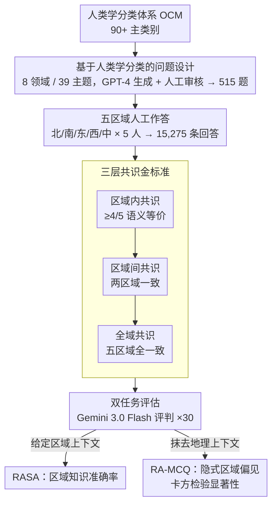

# Common to Whom? Regional Cultural Commonsense and LLM Bias in India

**会议**: ACL 2026  
**arXiv**: [2601.15550](https://arxiv.org/abs/2601.15550)  
**代码**: 无  
**领域**: LLM评测  
**关键词**: 文化常识, 区域偏见, 印度文化多样性, 基准构建, LLM偏见

## 一句话总结

本文构建 Indica，首个评估 LLM 次国家级文化常识的基准，聚焦印度五大区域在八个日常生活领域的文化差异，发现仅 39.4% 的问题在全部五个区域达成共识，且所有 LLM 均表现出地理偏见——过度选择中部和北部印度作为"默认"文化代表。

## 研究背景与动机

**领域现状**：文化常识基准（如 CultureBank、CulturalBench）开始关注跨文化差异，但这些工作将国家视为文化单一体，假设国家内部文化实践统一。

**现有痛点**：(1) 现有基准在国家级别评估文化常识，忽视了次国家级的文化多样性；(2) 印度现有 NLP 基准仅关注教科书和考试中的事实性知识，将印度文化视为单一整体；(3) LLM 可能对文化多样性国家的某些区域存在系统性偏见，但缺乏检测工具。

**核心矛盾**：在印度这样拥有 28 个邦、8 个联邦领地和 22 种官方语言的国家，"文化常识"不可能是全国统一的。然而 LLM 必须在给出某个文化实践时做出区域性选择，这种隐式选择可能反映训练数据中的地理偏见。

**本文目标**：(1) 量化印度文化常识的区域性差异程度；(2) 评估 LLM 在区域特定文化知识上的准确率；(3) 检测 LLM 在缺少地理上下文时的隐式区域偏见。

**切入角度**：基于人类学分类体系（OCM）设计八个日常文化领域，从印度五个区域收集人类标注答案，构建区域特定的文化常识基准。

**核心 idea**：文化常识在多元文化国家中主要是区域性的而非全国性的；LLM 在处理这类知识时表现出系统性地理偏见。

## 方法详解

### 整体框架

Indica 要回答一个被现有文化基准忽略的问题：在印度这种邦、语言、习俗高度多元的国家，"文化常识"到底是全国统一的还是区域性的，LLM 又会不会偏向某些区域。它的构建路径是先基于人类学分类体系（OCM）把日常文化拆成 8 个领域、39 个主题、515 道问题，再到印度北、南、东、西、中五个区域各招募 5 名参与者作答全部问题（共 15,275 条回答），并通过区域内、区域间、全域三层逐级收紧的共识建立金标准。评估端设区域锚定简答（RASA）与区域无关多选（RA-MCQ）双任务，用 Gemini 3.0 Flash 作 LLM 评判者、每题运行 30 次以消除随机性，并以卡方拟合优度检验判定地理偏见的统计显著性。

### 关键设计

**1. 基于人类学分类的问题设计：让题目锚在日常实践而非制度知识上**

要揭示区域差异，题目必须落在人们每天真正会做选择的地方，而不是有全国标准答案的制度性知识。Indica 因此从 OCM 的 90 多个主类别里挑出 8 个贴近日常的领域（人际关系、教育、服饰、饮食、通讯、金融、节日仪式、交通行为），每个领域再选 2–4 个互不重叠的子主题，用 GPT-4 辅助生成题目后再经人工审核。这样既保证问题聚焦日常实践、又有足够多样性去暴露区域间的真实分歧。

**2. 三层共识金标准：用逐级共识区分个人偏好与真实区域实践**

文化问题没有唯一标准答案，金标准必须能滤掉个人口味、只留下真正成规模的区域实践。Indica 因此设三层共识：区域内共识要求某区域至少 4/5 参与者答案语义等价，区域间共识要求两个区域答案完全一致，全域共识要求五个区域答案全部一致；判定时先由 GPT-4o 初步分类语义等价，再由两名人工标注者完整审核。逐级收紧的共识标准保证最终金标准反映的是稳定的区域文化，而非单个受访者的偏好。

**3. 双任务评估：用 RASA 量知识、用 RA-MCQ 量偏见**

知识准确率和隐式偏见是两件事，单一任务测不全。RASA（区域锚定简答）给定区域上下文（如"在南印度……"），考察模型在明确区域时能否生成准确的本地文化知识；RA-MCQ（区域无关多选）则刻意抹掉地理上下文，看模型在没人指定区域时默认倒向哪个区域的实践，从而把训练数据里的隐式地理偏见显形。两个任务一个测"会不会"、一个测"偏不偏"，互补地刻画出 LLM 的文化表征。

## 实验关键数据

### 主实验

**RASA 区域知识准确率（%）**

| 模型 | 北部 | 南部 | 东部 | 西部 | 中部 | 平均 |
|------|------|------|------|------|------|------|
| GPT-4o | ~20 | ~19 | ~15 | ~18 | ~20 | 20.9 |
| Claude 3.5 | ~19 | ~18 | ~14 | ~17 | ~19 | 19.3 |
| 最低模型 | - | - | - | - | - | 13.4 |

### 消融实验

| 分析维度 | 发现 |
|----------|------|
| 全域共识率 | 仅 39.4% 的问题在所有区域达成一致 |
| 领域差异 | 交通行为最高（22.6%），节日仪式最低（1.8%） |
| 区域对偏见 | 北-中最高（68.3%），南-东最低（60.1%） |

### 关键发现

- 仅 39.4% 的问题在所有五个区域有共识答案——文化常识在印度主要是区域性的
- 所有 8 个 LLM 在区域特定问题上准确率仅 13.4%-20.9%，远低于可用水平
- RA-MCQ 揭示所有模型的系统性偏见：中部和北部印度的回答被过度选择（比预期高 30-40%），东部和西部被低估
- 即使在教育等有全国统一课程的领域，区域实践差异仍然显著（仅 13.8% 全域共识）
- 节日仪式领域差异最大（1.8% 全域共识），反映了强烈的区域传统

## 亮点与洞察

- 首次系统性地挑战"国家=文化单一体"的假设，为文化 NLP 研究开辟次国家级维度
- 双任务评估设计（知识准确率 + 隐式偏见）提供了全面的文化表征评估框架
- 基于人类学分类（OCM）的问题设计方法具有通用性，可迁移到任何文化多元国家

## 局限与展望

- 五个区域的划分可能过于粗糙，每个区域内部仍存在显著多样性
- 每个区域仅 5 名参与者，样本量较小
- 金标准建立依赖主观的语义等价判断
- 仅聚焦印度，方法论的跨国家迁移性需验证

## 相关工作与启发

- **vs CultureBank/CulturalBench**: 这些基准在国家级评估文化常识，Indica 首次下沉到次国家级
- **vs 印度 NLP 基准**: 现有印度基准聚焦教科书知识，Indica 聚焦日常文化实践
- **vs CANDLE**: CANDLE 评估国家级文化规范，Indica 揭示国家内部的文化分裂

## 评分

- 新颖性: ⭐⭐⭐⭐⭐ 首个次国家级文化常识基准，视角独特且重要
- 实验充分度: ⭐⭐⭐⭐ 8 个模型、双任务评估、严格的金标准，但样本量较小
- 写作质量: ⭐⭐⭐⭐⭐ 动机引人深思，数据分析详尽
- 价值: ⭐⭐⭐⭐⭐ 对文化 AI 和 LLM 公平性研究有重要启示

<!-- RELATED:START -->

## 相关论文

- [\[ACL 2026\] Fin-Bias: Comprehensive Evaluation for LLM Decision-Making under human bias in Finance Domain](fin-bias_comprehensive_evaluation_for_llm_decision-making_under_human_bias_in_fi.md)
- [\[ACL 2026\] Contrastive Decoding Mitigates Score Range Bias in LLM-as-a-Judge](contrastive_decoding_mitigates_score_range_bias_in_llm-as-a-judge.md)
- [\[AAAI 2026\] Towards a Common Framework for Autoformalization](../../AAAI2026/llm_evaluation/towards_a_common_framework_for_autoformalization.md)
- [\[ICLR 2026\] BiasScope: Towards Automated Detection of Bias in LLM-as-a-Judge Evaluation](../../ICLR2026/llm_evaluation/biasscope_towards_automated_detection_of_bias_in_llm-as-a-judge_evaluation.md)
- [\[ACL 2026\] ReTraceQA: Evaluating Reasoning Traces of Small Language Models in Commonsense Question Answering](retraceqa_evaluating_reasoning_traces_of_small_language_models_in_commonsense_qu.md)

<!-- RELATED:END -->
