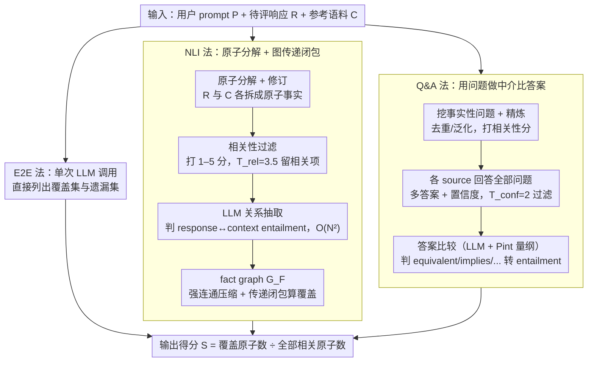

# Comprehensiveness Metrics for Automatic Evaluation of Factual Recall in Text Generation

**会议**: ACL 2026  
**arXiv**: [2510.07926](https://arxiv.org/abs/2510.07926)  
**代码**: 论文未提供（无）  
**领域**: LLM 评测 / 事实性 / 信息覆盖度  
**关键词**: 综合性评测, 事实召回率, NLI 图, 问答比对, 端到端 LLM 评估

## 一句话总结
针对长文本生成中"遗漏关键信息"难以量化的问题，作者提出三种 comprehensiveness 度量——NLI 分解 + 图分析、QA 对比、端到端 LLM 直接识别——以参考语料 $\mathcal{C}$ 为基准计算覆盖率 $S = |\mathcal{A}_{in}| / (|\mathcal{A}_{in}| + |\mathcal{A}_{out}|)$；在 WikiContradict / ConflictBank 上 meta-evaluation 发现最简单的 E2E 方法平均最强（最佳 LMR=0.85），但 Q&A 鲁棒性更好（跨模型 std 仅 0.009 vs E2E 的 0.044），三者各有适用场景。

## 研究背景与动机
**领域现状**：LLM 事实性评测主要做 precision——FActScore / FacTool 等把回答拆成原子事实再逐个核验；少数 recall 工作（如 SAFE 的 $R_K(y) = \min(S(y)/K, 1)$）依赖预设的"应该包含多少个事实" $K$，无法定位具体遗漏内容。

**现有痛点**：(1) precision-only 指标无法识别 LLM 选择性回答、刻意省略关键信息的"半真半假"情况，而医疗、法律等高风险场景中"遗漏"和"幻觉"同样致命；(2) 现有 recall 指标用粗粒度比例不能指出"具体哪条事实漏了"，无法做诊断或实时反馈；(3) 缺少专门评测 comprehensiveness 评测器自身的 meta-benchmark。

**核心矛盾**：要识别"漏掉了什么"，理论上得知道"应该包含哪些原子事实"——但完整事实集无法穷举（每个回答都可能涉及无限多的相关事实）。

**本文目标**：(1) 把 comprehensiveness 评估问题转化成"相对某个参考语料 $\mathcal{C}$ 的覆盖率"，让评测可操作；(2) 设计三种粒度不同的度量并 meta-evaluate 它们的可靠性；(3) 实测主流开源 LLM 在真实 RAG 场景下的 comprehensiveness。

**切入角度**：用现代检索器 + 搜索引擎做参考语料已经足够好，"绝对完备性"的不可达不影响"相对覆盖率"的实用性；评测器内部又可以用 NLI / QA / LLM 直接判断三种粒度的方法。

**核心 idea**：把 comprehensiveness 定义为"响应原子事实集 $\mathcal{A}_R$ 对参考语料原子事实集 $\mathcal{A}_\mathcal{C}$ 中相关项的覆盖率"，并用三种不同复杂度的 pipeline 实现该度量。

## 方法详解

### 整体框架
三种 metric 共享同一套输入输出契约：吃进用户 prompt $P$、待评响应 $R$、参考语料 $\mathcal{C}$，吐出覆盖集 $\mathcal{A}_{in}$、未覆盖集 $\mathcal{A}_{out}$ 和标量得分 $S = |\mathcal{A}_{in}| / (|\mathcal{A}_{in}| + |\mathcal{A}_{out}|)$。差异在于"如何把 $R$ 与 $\mathcal{C}$ 对齐":NLI 法和 Q&A 法在内部额外维护一张 fact graph $G_F$(节点是原子陈述或 QA 对、边是 entailment 关系),既能用传递闭包去重计数,又能进一步导出"未覆盖上下文基" $\mathcal{A}_{basis}$(告诉用户最少需要补哪些事实);E2E 法则把整条 pipeline 折叠进一次 LLM 调用。三者从最重到最轻铺成一条复杂度递减的谱系,正好用来回答"评测器该做多复杂"。

### 关键设计

**1. NLI 法:原子分解 + 图传递闭包算覆盖。** 这条最重的 pipeline 走五个阶段,核心是把"覆盖率"严格落到原子陈述的蕴含关系上。先用 LLM few-shot 把 $R$ 与 $\mathcal{C}$ 的每个文档拆成原子事实,再做原子修订消解代词、拆分连接句("A 写了 X 和 Y" → "A 写了 X" + "A 写了 Y"),接着对每个 context 原子打 1–5 的相关性分并以 $T_{rel} = 3.5$ 过滤掉无关项,只留下"本该被覆盖"的子集。

关键在第四步的关系抽取:它不用专用 NLI 模型而用通用 LLM 判断 response↔context 与 context↔context 之间的 entailment,因为法规、知识密集型陈述对专用 NLI 太难;代价是要遍历 $2|\mathcal{A}_R||\mathcal{A}_\mathcal{C}| + |\mathcal{A}_\mathcal{C}|(|\mathcal{A}_\mathcal{C}|-1)$ 对,复杂度 $O(|\mathcal{A}|^2)$。最后把这些关系组成 fact graph $G_F$,做强连通分量压缩得 $G_C$,凡是参考语料里能从某条响应原子沿 entailment 路径走到的节点都算覆盖,即 $\mathcal{A}_{in} = \{A_i \in \mathcal{V}_C \cap \mathcal{A}_\mathcal{C} \mid \exists A_j \in \mathcal{A}_R,\ \text{path}(A_j, A_i) \in G_F\}$。用图而非逐对计数,是为了让"X 蕴含 Y、Y 蕴含 Z"的传递关系自动闭合、避免重复计分;但抽关系时只看孤立原子、丢了原文上下文,这也埋下了它后来准确率垫底的根因。

**2. Q&A 法:用问题做中介,让答案天然可比。** 与其直接两两比对原子陈述,这条 pipeline 改成"先提问、再比同一问题下的答案"。先从 $R$ 和 $\mathcal{C}$ 各自挖出自包含的事实性问题,做问题精炼(去重、泛化、剔除指代不明并打相关性分),然后让模型在每个 source 上回答全部精炼问题——每题允许多答案或无答案并附置信度,以 $T_{conf} = 2$ 过滤低置信项。答案比较阶段用 LLM 配合 Pint 工具(专门处理物理量单位换算)把两边答案判成 equivalent / first implies second / contradictory / neutral 等关系,再转成 entailment 喂进 fact graph 算 $S$。

这样做的好处是把 NLI 的 $O(N^2)$ 全原子对比对压成只比同一问题下答案的 $O(M \cdot k)$,效率显著更高;而且生成答案时模型能看完整 context,比 NLI 阶段那种孤立原子比对更准——这也解释了它在跨模型稳定性上反超 NLI 与 E2E。Pint 工具则专门补 LLM 在量纲转换上的弱点,是 Q&A 准确率的一块拼图。

**3. E2E 法:一次 LLM 调用直接列出覆盖与遗漏。** 最轻的方案干脆不拆原子、不建图、不做 pairwise 分类,而是把 $(P, \mathcal{C}, R)$ 塞进单个上下文,让模型一步给出 $(\mathcal{A}_{in}, \mathcal{A}_{out}) = \text{CoverageEvaluator}(P, \mathcal{C}, R)$,得分公式与前两者一致。它赌的是现代长上下文 LLM(如 Llama 4 17Bx128E)的推理力已强到"看完原文加答案就能直接列出哪些没覆盖",从而省掉多阶段 pipeline 的级联误差。代价是几乎没有可解释性,且结果高度依赖 evaluator LLM 选择——后文实验里它平均最强却跨模型方差最大,正是这种"把全部信任压在单个模型能力上"的直接后果。

### 损失函数 / 训练策略
本工作不训练任何模型,所有 LLM 调用都用现成开源模型(gpt-oss-20b/120b、Llama 3.3 70B、Llama 4 17Bx128E、Qwen 2.5 72B),温度 0、top-p 1,Llama 4 用 FP8 量化。Pint 工具只对 Llama / Qwen 可用(gpt-oss 推理引擎不支持 tool call)。

## 实验关键数据

### Meta-evaluation 主结果（Label Match Rate, LMR↑）

| Metric × LLM | WikiContradict LMR | ConflictBank LMR | 平均 |
|--------------|-------------------|------------------|------|
| E2E × Llama 4 17Bx128E | — | — | **0.85**（最佳） |
| Q&A × gpt-oss-20b | — | — | **0.81**（最佳跨模型稳定） |
| NLI（所有 LLM） | 显著低于 Q&A 和 E2E | 同左 | — |
| E2E × gpt-oss-120b on ConflictBank | — | 显著低于 Q&A 同模型 | — |

跨模型稳定性：Q&A 方法跨 5 个 LLM 的 LMR std 仅 **0.009**，而 E2E 的 std 达 **0.044**（5× 更敏感于 evaluator LLM 选择）。在 WikiContradict 上 E2E 显著优于 Q&A（除 gpt-oss-120b 外，p < 0.05）；ConflictBank 上结果混合，Q&A 在 3 个 LLM 上显著优于 E2E。

### 人工评测（50 个 WikiContradict 样本）

| Metric | 完全正确输出占比 | 主要错误类型 |
|--------|----------------|-------------|
| NLI | 48.0% | CLASS_ERR（分类错）+ MISS_ATOM + IRR_ATOM |
| Q&A | 66.0% | MISS_ATOM + DUP_ATOM（问题精炼阶段去重不彻底） |
| **E2E** | **88.0%** | CLASS_ERR + MISS_ATOM（少量） |

自动 LMR 判断与人工标注的一致率达 **81.3%**，证明 meta-evaluation 协议本身可靠。

### LLM Comprehensiveness 实测（ELI5 500 题，最佳 evaluator）

| 模型 | Q&A 分数 | E2E 分数 |
|------|---------|---------|
| **gpt-oss-120b** | **0.71**（最高） | **0.83**（最高） |
| Llama 4 17Bx128E | 0.69 | 0.78 |
| gpt-oss-20b | 0.67 | 0.76 |
| Llama 3.3 70B | 0.68 | 0.75 |
| **Qwen 2.5 72B** | **0.66**（最低） | **0.73**（最低） |

Q&A 和 E2E 一致认定 gpt-oss-120b 最综合、Qwen 2.5 72B 最不综合；但 Q&A 绝对分数显著低于 E2E（因为生成更多细粒度问题，分母更大）。

### 关键发现
- **简单粗暴的 E2E 反而平均最强**：在两个 meta-eval 数据集上 E2E 用 Llama 4 17Bx128E 拿到平均最高 LMR=0.85，而最复杂的 NLI 三阶段 pipeline 反而最差。说明"现代长上下文 LLM 一步到位"在很多评测任务上已经够用，pipeline 设计的精细可能反成累赘。
- **但 E2E 跨模型方差是 Q&A 的 5 倍**：选错 evaluator LLM 性能急剧下降（如 gpt-oss-120b 上 E2E 反而比 Q&A 差），说明 E2E 的简洁性是以"高度依赖某个特定 LLM 能力"为代价的。生产中若不确定 evaluator 选择，应优先用 Q&A。
- **NLI 失败的核心原因 = 孤立原子比对丢上下文**：人工错误归类显示 NLI 的 CLASS_ERR 比例最高，证实"两个原子之间的 entailment 需要原文上下文"，纯 NLI 缺这层信息。这对所有"先抽原子再独立分析"的事实性方法都是警示。
- **Q&A 重复原子问题**：问题精炼阶段虽然要求去重，但语义近似问题（如"作者是谁" vs "谁写的"）仍会保留两份，导致部分覆盖率被低估。
- **gpt-oss-120b 最综合**：在 ELI5 上 RAG 场景中表现最好，与社区对 gpt-oss 系列的能力评估一致。

## 亮点与洞察
- **"相对参考语料的覆盖率"绕过完备性不可达问题**：把"应该说什么"的绝对问题转化为"参考语料里说了什么、回答覆盖了多少"的相对问题，让 comprehensiveness 评测变得可操作。这种"用已有数据集定义评测目标"的思路可迁移到任何"完备集不可枚举"的指标（如有用性、安全性）。
- **NLI / Q&A / E2E 三层粒度对比**：清晰展示了"评测器复杂度 vs 准确率"的权衡——最复杂的 NLI 反而最差、最简单的 E2E 平均最好但稳定性最差。提醒研究者"pipeline 越复杂未必越好"，应优先考虑现代 LLM 的端到端能力。
- **Q&A 用 Pint 工具修补量纲比较**：识别到 LLM 在物理量单位转换上的弱点并用专用工具补足，是一种典型的"hybrid neuro-symbolic"评测设计，可推广到任何 LLM 弱项领域。
- **uncovered context basis $\mathcal{A}_{basis}$ 的图论定义**：用 fact graph 的传递闭包定义"最小需补集合"，让评测不仅给分数还能给"应该补充哪些事实"的具体建议，这对实时反馈和模型 fine-tuning 都有用。
- **跨模型 std 0.009 vs 0.044 的对比**：把"评测器鲁棒性"作为与"准确率"并列的指标，是有意义的方法学贡献——任何评测协议都应该报告这两个维度。

## 局限与展望
- 作者承认 NLI 和 Q&A 是计算密集型（NLI 需要 $O(N^2)$ 次 LLM 调用），适用于需要细粒度诊断的场景；E2E 适用于快速大规模评测但牺牲可解释性。
- fact graph 是基于原子的简单结构，无法表达更复杂的事实关系（如条件、量化、否定的复合）；但更复杂的图结构计算成本会爆炸。
- 评测器假设参考语料 $\mathcal{C}$ 是可靠的，但如果 $\mathcal{C}$ 含误导信息，模型可能因不重复错误内容反而被扣分，需用户保证数据源质量。
- 用 LLM 评 LLM 的循环依赖：作者用"评测时只看局部 context、限制 LLM 角色为简单任务"来缓解，但根本无法完全消除。
- 自己发现：阈值 $T_{rel} = 3.5$、$T_{conf} = 2$ 是手设的，对不同领域（如医学 vs 通用）可能需要重新调整，但作者不提供自动调参流程。
- ELI5 实验只用 500 题且仅覆盖 5 个开源模型，缺乏对闭源模型（如 GPT-4 / Claude）的评测，应用面受限。

## 相关工作与启发
- **vs FActScore (Min et al. 2023) / FacTool (Chern et al. 2023)**：这些方法只做 precision（拆原子核验对错），不关心遗漏；本文专门补 recall 维度，二者互补。
- **vs SAFE (Wei et al. 2024) 的 $R_K$ 指标**：SAFE 用预设事实数 $K$ 算粗粒度 recall，不能定位具体遗漏；本文用参考语料 + 三种方法都能输出具体未覆盖事实集合，诊断能力强得多。
- **vs FEQA / QuestEval (Eyal 2019 / Scialom 2021)**：这些 QA-based summarization 一致性指标启发了本文的 Q&A pipeline，但 summarization 评测的源文档固定，本文扩展到多 source RAG 场景。
- **vs Marinescu et al. (2025) FactReasoner**：直接借鉴其原子抽取 + 图分析思路，但 FactReasoner 做 precision，本文反过来做 recall。
- **vs AutoNuggetizer (Pradeep et al. 2025)**：也评 recall 但用固定 "nuggets" 集合，粒度较粗；本文支持灵活粒度且能产出具体未覆盖项。

## 评分
- 新颖性: ⭐⭐⭐⭐ 把 comprehensiveness 显式拆成三层粒度对比并 meta-evaluate 评测器自身，是 factuality 评测领域少见的方法学工作。
- 实验充分度: ⭐⭐⭐⭐ 2 个 meta-eval 数据集 × 5 LLM × 3 metric + 人工评测 + 真实 ELI5 应用 + BCa bootstrap + permutation test，扎实但缺闭源 LLM 评测。
- 写作质量: ⭐⭐⭐⭐⭐ 形式化定义清晰、pipeline 步骤明确、appendix 给出全部 prompt，复现性极佳。
- 价值: ⭐⭐⭐⭐ 给"如何评测 LLM 是否遗漏关键信息"提供了可操作的工具集，且 NLI vs Q&A vs E2E 的对比对其他评测协议设计有方法学启发。

<!-- RELATED:START -->

## 相关论文

- [\[ACL 2026\] Minos: A Multimodal Evaluation Model for Bidirectional Generation Between Image and Text](minos_a_multimodal_evaluation_model_for_bidirectional_generation_between_image_a.md)
- [\[ACL 2026\] Stress Testing Factual Consistency Metrics for Long-Document Summarization](stress_testing_factual_consistency_metrics_for_long-document_summarization.md)
- [\[ACL 2026\] StratMem-Bench: Evaluating Strategic Memory Use in Virtual Character Conversation Beyond Factual Recall](stratmem-bench_evaluating_strategic_memory_use_in_virtual_character_conversation.md)
- [\[ACL 2026\] Attribution, Citation, and Quotation: A Survey of Evidence-based Text Generation with Large Language Models](attribution_citation_and_quotation_a_survey_of_evidence-based_text_generation_wi.md)
- [\[ACL 2026\] VC-Inspector: Advancing Reference-free Evaluation of Video Captions with Factual Analysis](vc-inspector_advancing_reference-free_evaluation_of_video_captions_with_factual_.md)

<!-- RELATED:END -->
