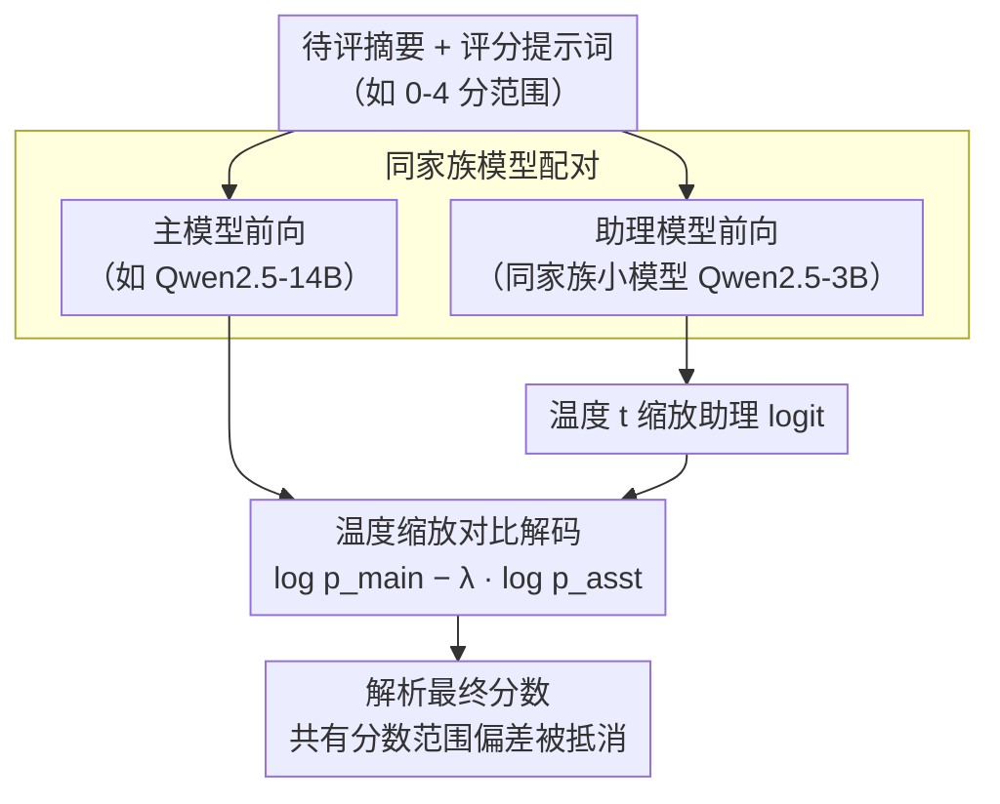

# Contrastive Decoding Mitigates Score Range Bias in LLM-as-a-Judge

**会议**: ACL 2026  
**arXiv**: [2510.18196](https://arxiv.org/abs/2510.18196)  
**代码**: 无  
**领域**: LLM评测  
**关键词**: LLM评判器, 对比解码, 分数范围偏差, 直接评估, 模型家族偏差

## 一句话总结

本文揭示了LLM评判器在直接评估任务中存在**分数范围偏差**（score range bias），即模型输出对预定义分数范围高度敏感，并提出利用**对比解码**（contrastive decoding）方法，通过同一模型家族内相似偏差的相互抵消来缓解该问题，在Spearman相关性上平均实现高达11.3%的相对提升。

## 研究背景与动机

**领域现状**: LLM评判器（LLM-as-a-Judge）已成为评估生态系统中不可或缺的组成部分，被广泛用于直接评估（direct assessment，给输出分配分数）和成对比较（pairwise comparison）两种任务。

**现有痛点**: 已知的LLM评判偏差包括自我增强偏差（self-enhancement bias，偏爱自身输出）和家族增强偏差（family enhancement bias，偏爱同家族模型输出），但是否存在其他隐藏偏差尚未被充分研究。直接评估任务中，LLM评判器与人类标注的相关性一直不如成对比较。

**核心矛盾**: 当使用不同的分数范围（如0-4、1-5、2-6、3-7）时，LLM评判器的输出相关性会发生显著变化，这意味着评估结果不稳定，无法可靠地搜索最优分数范围。

**本文目标**: 揭示并量化LLM评判器中的分数范围偏差，并提出有效的缓解策略。

**切入角度**: 观察到同一模型家族中不同大小的模型编码了相似的分数范围偏差（例如Qwen2.5家族的3B/7B/14B都倾向于输出Score 2），因此可以利用对比解码让这些相似偏差相互抵消。

**核心idea**: 将对比解码技术应用于LLM评判场景，用同家族的小模型作为"助理模型"，从主模型的logit中减去助理模型的logit，从而消除它们共有的分数范围偏差。

## 方法详解

### 整体框架

本文方法基于对比解码（contrastive decoding）框架，核心是对同一份待评摘要同时运行两个**来自同一模型家族**的评判模型——一个主模型（main model）和一个助理模型（assistant model）。由于同家族模型编码了相似的分数范围偏差，把主模型的对数概率减去经温度缩放、再由系数 $\lambda$ 加权的助理模型对数概率，就能让二者共有的偏差相互抵消，把分数分布拉回更贴近人类标注的位置。整个流程无需额外训练，只在解码阶段对首个分数 token 的 logit 做一次相减。

### 关键设计

**1. 同家族模型配对：让共有偏差可被抵消**

方法能成立的前提，是作者观察到分数范围偏差并非随机噪声，而是沿模型家族**系统性地共享**：Llama-3 家族的 3B 与 8B 在 2-6 范围里都偏向打 Score 4，Qwen2.5 家族的 3B/7B/14B 则都偏向打 Score 2，且偏差随模型增大而减弱但不消失。既然主、助理模型来自同一家族、共享同一套范围偏差，那么对比解码里的"相减"就只会抵消这部分**共有的系统性偏差**，而把真正反映摘要质量的信号保留下来。具体配对上，Llama-3 用 8B 作主模型、1B/3B 作助理模型；Qwen2.5 用 7B/14B 作主模型、3B 作助理模型——助理始终选同家族里更小的那个，既廉价又能复用与推测解码（speculative decoding）相同的计算。

**2. 温度缩放的对比解码公式：对齐不同规模模型的 logit**

最终分数由 $\log p_{\text{main}} - \lambda \log p_{\text{asst}}$ 给出，其中 $\lambda$ 控制减除助理模型的强度。相比 Li et al. (2023) 的原始对比解码，本文的关键改动是**在助理模型上引入温度 $t$**，即 $p_{\text{asst}} = e^{e_i/t} / \sum_j e^{e_j/t}$。动机来自作者的 logit 分析：不同规模模型的 logit 量级差异显著（首个 token 的 max logit 在 3B≈25、7B≈30、14B≈34），若直接相减，量级更大的一方会主导结果、让抵消失真；温度 $t$ 把助理模型的 logit 分布拉平到与主模型可比的尺度，相减才真正对齐到"偏差"这一维度上。$\lambda \in \{0.01, 0.1, 0.5, 1.0\}$ 与 $t \in \{0.5, 1.0, 2.0, 3.0, 4.0, 5.0\}$ 通过在 10% 数据构成的开发集上做网格搜索确定，每个模型对与分数范围各自选取最优组合。

## 实验关键数据

### 主实验

| 模型/方法 | 分数范围 | Pearson | Spearman | Kendall |
|---|---|---|---|---|
| Llama 3.1-8B (greedy) | 平均 | 0.346 | 0.334 | 0.290 |
| Contrastive (8B-1B) | 平均 | **0.361** | **0.352** | **0.306** |
| Qwen2.5-14B (greedy) | 平均 | 0.383 | 0.384 | 0.334 |
| Contrastive (14B-3B) | 平均 | **0.424** | **0.433** | **0.376** |

### 消融实验

| 分析维度 | 关键发现 |
|---|---|
| 不同分数范围 (0-4/1-5/2-6/3-7) | Greedy解码在不同范围间相关性波动大（Llama 8B: 0.257~0.372），对比解码更稳定（0.298~0.378） |
| 助理模型选择 (1B vs 3B) | 差异较小，1B略优于3B（Spearman 0.352 vs 0.343） |
| 多维度评估 (coherence/relevance/consistency) | 分数范围偏差在所有维度上都存在，对比解码在多数维度上都有改善 |

### 关键发现

1. **分数范围偏差普遍存在**: 不同模型家族（Llama-3、Qwen-2.5）和不同规模（1B~14B）的模型都表现出分数范围偏差，偏好特定分数值
2. **同家族模型编码相似偏差**: Qwen家族的3B/7B/14B都倾向输出Score 2，偏差随模型增大逐渐减弱但仍然存在
3. **对比解码最大改善在2-6范围**: 这是greedy解码表现最差的范围，对比解码在此范围改善最显著（Llama: Spearman 0.257→0.302）
4. **Qwen-14B对比解码达到最佳效果**: 平均Spearman从0.384提升到0.433，相对改善约12.8%

## 亮点与洞察

1. **问题发现价值高**: 首次系统性地揭示了LLM评判器中的分数范围偏差，这是一个之前被忽视但影响深远的问题
2. **方法简洁有效**: 对比解码不需要额外训练，只需同时运行两个同家族模型，且与推测解码（speculative decoding）可以共享计算开销
3. **偏差可视化清晰**: 通过logit分布图直观展示了不同模型对特定分数的偏好，以及对比解码如何使分数分布更接近人类标注分布
4. **扩展评估空间**: 对比解码使得在标准1-5范围之外搜索最优分数范围成为可能

## 局限与展望

1. **模型规模限制**: 实验仅覆盖到14B参数，更大模型（如70B+）的偏差模式和对比解码效果未知
2. **任务覆盖有限**: 仅在摘要评估任务上验证，其他评估任务（如代码评估、对话评估）的适用性未验证
3. **仅限英语**: 未在多语言场景下测试
4. **推理开销增加**: 需要同时运行两个模型的前向传播，虽然可以通过推测解码共享，但增加了部署复杂度
5. **超参数敏感性**: 每个模型对和分数范围需要单独调参，实际应用中的泛化性有待验证

## 相关工作与启发

1. **G-Eval (Liu et al., 2023)**: 使用GPT-4进行NLG评估的经典工作，本文在其基础上发现了分数范围偏差问题
2. **Family Enhancement Bias (Goel et al., 2025)**: 发现同家族模型互相偏爱的现象，本文巧妙地将这种"家族相似性"用于偏差抵消
3. **Contrastive Decoding (Li et al., 2023)**: 原始对比解码用于开放式文本生成，本文将其迁移到LLM评判场景
4. **Prometheus 2 (Kim et al., 2024)**: 专门训练的评估模型，与本文的免训练方法形成对比

## 评分

- **新颖性**: ⭐⭐⭐⭐ — 首次揭示分数范围偏差并提出对比解码缓解方案，问题发现本身具有重要价值
- **实验充分度**: ⭐⭐⭐ — 覆盖两个模型家族、四个分数范围、三个评估维度，但任务类型单一（仅摘要评估）
- **写作质量**: ⭐⭐⭐⭐ — 论文结构清晰，可视化效果好，偏差分析深入直观
- **价值**: ⭐⭐⭐⭐ — 对LLM-as-a-Judge社区有重要警示意义，方法实用且与现有推理加速技术兼容

<!-- RELATED:START -->

## 相关论文

- [\[ICLR 2026\] BiasScope: Towards Automated Detection of Bias in LLM-as-a-Judge Evaluation](../../ICLR2026/llm_evaluation/biasscope_towards_automated_detection_of_bias_in_llm-as-a-judge_evaluation.md)
- [\[ACL 2026\] When Vision-Language Models Judge Without Seeing: Exposing Informativeness Bias](when_vision-language_models_judge_without_seeing_exposing_informativeness_bias.md)
- [\[ACL 2026\] Common to Whom? Regional Cultural Commonsense and LLM Bias in India](common_to_whom_regional_cultural_commonsense_and_llm_bias_in_india.md)
- [\[ACL 2026\] Fin-Bias: Comprehensive Evaluation for LLM Decision-Making under human bias in Finance Domain](fin-bias_comprehensive_evaluation_for_llm_decision-making_under_human_bias_in_fi.md)
- [\[ACL 2026\] Reasoning Model Is Superior LLM-Judge, Yet Suffers from Biases](reasoning_model_is_superior_llm-judge_yet_suffers_from_biases.md)

<!-- RELATED:END -->
