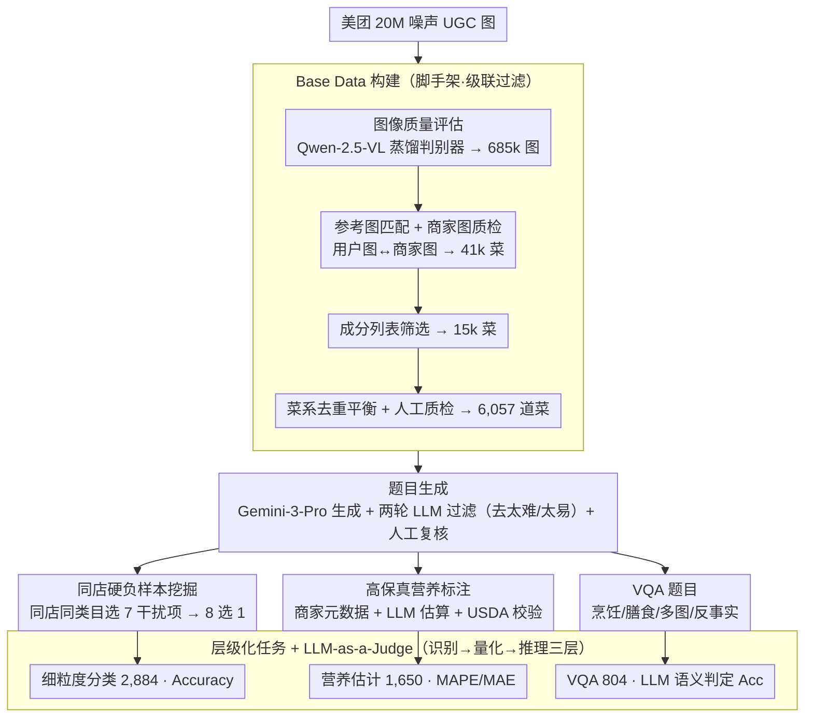

# DiningBench: A Hierarchical Multi-view Benchmark for Perception and Reasoning in the Dietary Domain

**会议**: ACL 2026  
**arXiv**: [2604.10425](https://arxiv.org/abs/2604.10425)  
**代码**: https://huggingface.co/datasets/meituan/DiningBench (有)  
**领域**: 多模态 VLM / 评测基准 / 食品视觉理解  
**关键词**: 食品 benchmark、多视图、细粒度分类、营养估计、VQA

## 一句话总结
作者构建了首个层级化的多视图食品 benchmark DiningBench（3,021 道菜 / 15,928 张图 / 平均 5.27 视图/菜），覆盖「细粒度分类（同店硬负样本）→ 营养估计（4 维回归）→ VQA（推理）」三层认知任务，对 29 个 SOTA VLM 系统评测后发现：现有模型在精细视觉判别和营养量化上严重不足，且 CoT 反而损害纯视觉感知。

## 研究背景与动机

**领域现状**：随着 GPT-4o / Gemini-3 / Qwen-VL 等 VLM 在通用视觉理解上的突飞猛进，食品域 AI（自动饮食日志、智能厨房助手）也随之被寄予厚望，但评测 benchmark 还停留在 Food-101 / UEC-Food / Recipe1M+ / Nutrition5K 这些早期数据集上。

**现有痛点**：作者归纳出 4 大缺陷：(1) **任务过于简单**——多数 benchmark 只做粗粒度分类，没考量营养量化或烹饪推理；(2) **单视图限制**——真实用户拍菜往往从多个角度，但数据集都是单图；(3) **缺少细粒度判别**——distractor 是随机抽的，模型靠语义先验就能猜中；(4) **营养标注不准**——Recipe1M+ 图像质量差，Nutrition5K/FastFood 局限于食堂或快餐连锁标准化场景。

**核心矛盾**：现实世界的菜品有「同店同类目下视觉极其相似」的硬负样本（如 Smoked Salmon Salad vs Fresh Salmon Avocado Salad），又需要从图像反推体积/份量/成分推算营养——这两件事都需要超越「bag-of-features」的精细视觉理解能力，但现有 benchmark 无法暴露这种能力的缺失。

**本文目标**：构造一个能同时考察 (i) 精细判别、(ii) 数值量化、(iii) 高阶推理 的层级化食品 benchmark，且每菜配多视图。

**切入角度**：依托美团（中国最大的本地生活平台）海量真实 UGC 图 + 商家元数据，用 SOTA VLM（Qwen-2.5-VL、Gemini-3-Pro-Preview）做 AI 辅助数据 curation + 严格人工复核，把噪声 20M 图压缩到 3,021 道高质量菜。

**核心 idea**：「同店同类目硬负样本 + 多视图 + 高保真营养标注 + 层级化任务」四位一体，让 benchmark 把当前 VLM 的薄弱环节都暴露出来。

## 方法详解

DiningBench 是一个 benchmark 数据集,「方法」就是数据构造 pipeline + 任务定义 + 评测协议。

### 整体框架
整套 pipeline 要解决的是「如何从噪声海量 UGC 里榨出能暴露 VLM 短板的高质量评测题」。它分两阶段:先做 Base Data 构建,从美团 20M UGC 图依次过图像质量评估(Qwen-2.5-VL-7B 蒸馏自 GPT-4 的判别器)→ 685k 图、参考图匹配(验证用户拍照与商家参考图一致)→ 90k 菜、商家参考图质量验证 → 41k 菜、详细成分列表筛选 → 15k 菜,最后按菜系去重平衡 + 人工质检收敛到 6,057 道菜;再做题目生成,用 Gemini-3-Pro-Preview 生成 hard-negative、营养推理与 VQA 题目,每一步都接两轮 LLM 过滤(一轮去掉「太难无法判断」、一轮去掉「太简单一眼可辨」)并以人工复核收尾。最终落成三个认知层级递增的子集:细粒度分类(2,884)、营养估计(1,650)、VQA(804),分别对应下面三个关键设计。

### 关键设计

**1. 同店硬负样本挖掘:把 fine-grained 这个老问题翻新。** 传统 benchmark 的 distractor 从全类目随机抽,模型靠「这是沙拉不是面条」的类别级先验就能排除大半,SOTA 模型早已饱和。DiningBench 借美团的菜单结构,对每道目标菜用 Gemini-3-Pro-Preview 从**同一家商家的同一菜单类目**下选 7 个视觉/语义最相似的菜当 distractor(目标是 Smoked Salmon Salad,干扰项就是 Salmon Avocado Salad、Tuna Tartare Salad 等),凑成 8 选 1 多项选择。

这些干扰项共享成分、颜色、摆盘,强迫模型放弃 bag-of-features 而去看 cutting style、texture、配料比例这些真正的细粒度线索。构造时再用 Gemini-3-Pro-Preview + Gemini-2.5-Pro 两轮筛选——第一轮剔除「模糊到无法唯一识别 GT」的样本,第二轮剔除「distractor 太容易区分」的简单样本,最后逐样本人工复核。效果上这把 GPT-4o 的准确率压到只有 65.26%(远低于它在其它任务上的表现),证明 fine-grained discriminability 这个瓶颈确实被暴露出来。

**2. 高保真营养标注:商家元数据 + LLM 估算 + USDA 对照三重校验。** Nutrition5K 只覆盖 Google 食堂、FastFood 只覆盖快餐连锁,都难泛化到真实多样化菜品,所以营养这一维要自己重做。每道菜给出 4 维营养向量 $\mathbf{v} = (\text{Cal}, \text{Carb}, \text{Prot}, \text{Fat}) \in \mathbb{R}^4$ 作回归 GT,走双路标注:商家明确给营养信息的菜直接抄(Direct Extraction);缺标但有详细成分加份量的菜,用 Gemini-3-Pro-Preview 对「图 + 成分 + 份量」生成估值(LLM-Assisted Estimation)。

关键在于**所有**估值都要交叉对照 USDA FoodData Central 数据库并经人工系统化校验,prompt 里还特意用 Atwater 系统 $E \approx 4P + 4C + 9F$ 做一致性检查,并明确提示模型「商家常少报热量/油脂、多报蛋白质,发现欺诈就丢弃描述自行估算」。靠这套三重校验,营养标注做到 1,650 道菜的多样化覆盖,热量从 light meal 一直拉到 calorie-dense(均值 670.5 kcal),跨度远大于既有数据集。

**3. 层级化任务 + LLM-as-a-Judge:把认知复杂度拆成可单独诊断的三层。** 三个子集按「识别 → 量化 → 推理」递增,各配匹配的指标,这样研究者能分别定位 VLM 在三个层次上的不同瓶颈。Fine-Grained Classification 用 Accuracy;Nutrition Estimation 用 MAE / RMSE / MAPE,其中 $\mathrm{MAPE}_k = \frac{1}{N}\sum_i |v_{i,k} - \hat{v}_{i,k}| / v_{i,k}$ 在 4 个营养组分上分别算后取平均,比纯 MAE 更直观地反映相对误差。

VQA 因为答案是自然语言,exact-string-match 会误杀语义正确的表述,故改用 LLM-as-a-Judge——让评估器 LLM 对预测与 gold 做语义一致性的二元判定再输出 Acc;该子集覆盖 Cuisine Technique (532)、Dietary Suggestion (219)、Multi-Image Analysis (35)、Counterfactual Reasoning (18) 四类。层级化的价值在于能拆出「推理对、量化错」这种单一 Acc 看不见的现象——例如 Gemini-3-Pro-Preview 在 VQA 上拿 90.42%,但营养估计 MAPE 仍高达 24.45%。

### 损失函数 / 训练策略
不训练模型,只做评测。所有商业模型走官方 API(temperature=0, max_tokens=16,384),开源模型用 vLLM 部署(<8B 单卡 A100,30–38B 两卡,72B 四卡)。Base Data 构造阶段用到知识蒸馏:用 GPT-4 标的小批数据训练 Qwen-2.5-VL-7B 的图像质量评估器和参考匹配器,再用它们做大规模过滤。

## 实验关键数据

### 主实验：29 个 VLM 在 3 个任务上的对比（节选）

| 模型 | Class. ACC↑ | Nutrition Avg MAPE↓ | VQA ACC↑ |
|------|-------------|---------------------|----------|
| **Gemini-3-Flash-Preview** | **81.83** | 25.21 | 88.56 |
| **Gemini-3-Pro-Preview** | 81.55 | **24.45** | **90.42** |
| Gemini-2.5-Pro | 73.51 | 38.21 | 89.93 |
| GPT-5 | 70.18 | 32.17 | 86.94 |
| Claude-Sonnet-4.5 | 54.40 | 42.62 | 83.58 |
| GPT-4o | 65.26 | 42.43 | 80.60 |
| Qwen-2.5-VL-72B | 65.29 | 40.56 | 76.62 |
| Qwen-3-VL-30B-A3B-Instruct | 65.43 | 37.35 | 80.60 |
| Qwen-3-VL-8B-Instruct | 64.15 | 39.24 | 72.76 |
| InternVL-3.5-38B | 54.20 | 46.13 | 72.51 |
| Gemma-3-12B-it | 48.61 | 43.15 | 61.82 |

观察：(i) 即便最强的 Gemini-3-Pro-Preview 在分类上也只有 82%，留下 18% 头绪；(ii) Nutrition 上即便 Gemini-3 也有 24.45% MAPE，开源最强 Qwen-3-VL-30B 仍 37.35%，是最差攻克的任务；(iii) VQA 上 Gemini-3 已接近 90%，相对最容易；(iv) 开源 vs 闭源的差距在 Nutrition 上最大（10+ 点 MAPE），说明营养估计强依赖训练数据规模。

### 消融与分析：多视图数量 + CoT 影响

| 配置 | Classification ACC | Nutrition MAPE | 说明 |
|------|--------------------|-----------------|------|
| 1 view | baseline | baseline | 单图 |
| 2 views | 显著提升 | 显著下降 | 1→2 是「能力跳跃」最大点 |
| 3 views | 小幅提升 | 边际收益 | 大模型继续受益 |
| 4 views | 接近 saturation | 部分小模型 MAPE 恶化 | 信息过载噪声 |
| Large + CoT (Nutrition) | – | **大幅恶化** | 小模型出现「性能塌缩」 |
| Large + CoT (VQA) | – | – | 部分提升部分恶化，不一致 |
| Large + CoT (Class.) | 多数下降 | – | 显式推理反而干扰直接视觉判别 |

### 关键发现
- **「能力跳跃」发生在 1→2 视图**：单视图到双视图带来最大性能跃升（互补角度解决遮挡和歧义），3 视图后边际收益急速递减，4 视图甚至让 7B 量级小模型 MAPE 恶化，说明小模型缺乏 effective 多视图融合机制。
- **CoT 不是银弹**：在纯感知任务（Nutrition Estimation）上多数模型 CoT 后 MAPE 暴涨，小开源模型出现「性能塌缩」；VQA 上则结果混杂。作者推测显式 verbalization 让最终预测与直接视觉证据「解耦」，反而 hallucinate 或 over-rationalize 错误特征。
- **5 大失败模式**：(1) 细粒度判别力不足（依赖「bag-of-features」），(2) 参数化知识偏差（默认输出统计常见菜名而非具体变种，把 Scallion Oil Chicken 误为 Roasted Chicken），(3) 缺乏空间体积推理（2D→3D 推理弱，把开胃菜和主菜当成营养等价），(4) 多视图聚合无效，(5) 推理模型「无限思考循环」（小 thinking 模型遇到视觉不确定时陷入重复生成）。
- **中→英翻译后 Classification 准确率普遍下降**（Qwen-3-VL-8B-Instruct 从 64.15% 跌到 58.56%），但 Nutrition Estimation 在 Gemini-2.5/GPT-4o 系反而提升，说明英语 prompt 触发了更强的数值推理 pathway。
- **质量审计 100% 通过**：3 名 PhD（人文/社科/STEM）独立审计 210 个分层随机样本，全部通过，验证数据质量。

## 亮点与洞察
- **「同店同类目硬负样本」是把 fine-grained 这个老问题翻新的巧妙手法**：传统 ImageNet 风格的随机 distractor 早就被 SOTA 模型饱和，本文借助美团的菜单结构天然提供「视觉极相似 + 语义不同」的对照组，是一个低成本但极有效的数据增强思路，可以迁移到任何垂直域（如医学图像同患者多病灶、电商同 SKU 不同尺码）。
- **AI-assisted 数据构造 + 两轮 LLM 过滤 + 人工最终复核** 形成了一个可复用的「100% 通过率」pipeline 模板：用 Gemini-3-Pro 生成 + Gemini-2.5-Pro 复审 + Qwen-2.5-VL 质量评估 + PhD 三人独立审计，是当前 VLM benchmark 构建的最佳实践范式。
- **「层级化任务 + LLM-as-a-Judge」** 让模型瓶颈一目了然——可以单独诊断「能不能看见 vs 能不能量化 vs 能不能推理」，比单一 Acc 信息量大得多。
- **5 大失败模式**（特别是「参数化知识偏差」和「2D→3D 体积推理缺失」）对后续 VLM 训练目标设计有直接启示——前者需要更强的 visual grounding loss，后者需要 3D-aware pretraining 或显式深度监督。

## 局限与展望
- **中餐偏置**：2,086/3,021 = 69% 是中餐，作者承认这会损害对全球菜系的泛化。
- **LLM-assisted 标注的潜在偏差**：尽管人工复核，Gemini-3 生成的营养估计和 distractor 选择仍可能继承 LLM 的隐性偏差（如对常见菜系熟悉度不均）。
- **VQA 子集偏小**：804 个样本对于 LLM-as-a-Judge 评估的统计显著性偏弱，且 Multi-Image (35) 和 Counterfactual (18) 类目样本量过少，难以下结论。
- **缺乏与传统专门模型的对比**：没对比 Nutrition5K-tuned 的专门模型或细粒度分类的 ConvNet baseline，VLM-vs-专门模型的 trade-off 不清楚。
- **改进方向**：(i) 扩充非中餐数据；(ii) 加入 3D 体积重建任务（论文已提到多视图数据天然适合 NVS / 3D Reconstruction）；(iii) 探索「视觉 grounding loss + CoT」联合训练以解决 CoT 损害感知问题；(iv) 加入与单任务 SOTA 模型的 head-to-head 对比。

## 相关工作与启发
- **vs Food-101 / UEC-Food / Food2K**：传统食品识别只做分类，DiningBench 增加营养量化和推理两层，且每菜多视图。
- **vs Nutrition5K / FastFood**：Nutrition5K 限于 Google 食堂，FastFood 限于快餐连锁；DiningBench 用真实多样化餐厅 UGC，泛化性更强；指标上引入 MAPE 比 Nutrition5K 的纯 MAE 更直观。
- **vs FoodieQA / IndiFoodVQA**：这两者侧重文化推理，DiningBench 用层级化任务把识别和推理分离，更适合诊断式评估。
- **vs MMBench / MME / SEED-Bench**：通用 VLM benchmark 难暴露垂直域 fine-grained 问题，DiningBench 是「领域专用 + 层级化」的范式样本，启示其它垂直域（医学/工业/法律）可仿照构造。
- **vs Recipe1M+**：Recipe1M+ 侧重 image-to-recipe retrieval，DiningBench 侧重视觉理解的多层次能力评估，定位互补。

## 评分
- 新颖性: ⭐⭐⭐⭐ 层级化任务 + 同店硬负样本是较新的组合，但单点创新均有先例
- 实验充分度: ⭐⭐⭐⭐⭐ 29 个模型 × 3 任务 + 多视图消融 + CoT 消融 + 英文版对比 + 5 大失败模式分析，工程量极大
- 写作质量: ⭐⭐⭐⭐ 结构清晰，pipeline 图和表格信息量大；prompt 设计在附录全公开值得称赞
- 价值: ⭐⭐⭐⭐⭐ HuggingFace 公开数据集，对食品域 VLM 研究有直接推动作用；揭示的 5 大失败模式对通用 VLM 设计也有启发

<!-- RELATED:START -->

## 相关论文

- [\[ACL 2026\] ReCoQA: A Benchmark for Tool-Augmented and Multi-Step Reasoning in Real Estate Question and Answering](recoqa_a_benchmark_for_tool-augmented_and_multi-step_reasoning_in_real_estate_qu.md)
- [\[ICML 2026\] Multi$^2$: Hierarchical Multi-Agent Decision-Making with LLM-Based Agents in Interactive Environments](../../ICML2026/llm_evaluation/multi2_hierarchical_multi-agent_decision-making_with_llm-based_agents_in_interac.md)
- [\[ACL 2026\] K-MetBench: A Multi-Dimensional Benchmark for Fine-Grained Evaluation of Expert Reasoning, Locality, and Multimodality in Meteorology](k-metbench_a_multi-dimensional_benchmark_for_fine-grained_evaluation_of_expert_r.md)
- [\[ACL 2025\] KITAB-Bench: A Comprehensive Multi-Domain Benchmark for Arabic OCR and Document Understanding](../../ACL2025/llm_evaluation/kitab-bench_a_comprehensive_multi-domain_benchmark_for_arabic_ocr_and_document_u.md)
- [\[NeurIPS 2025\] BLINK-Twice: You See But Do You Observe? A Reasoning Benchmark on Visual Perception](../../NeurIPS2025/llm_evaluation/blink-twice_you_see_but_do_you_observe_a_reasoning_benchmark_on_visual_perceptio.md)

<!-- RELATED:END -->
