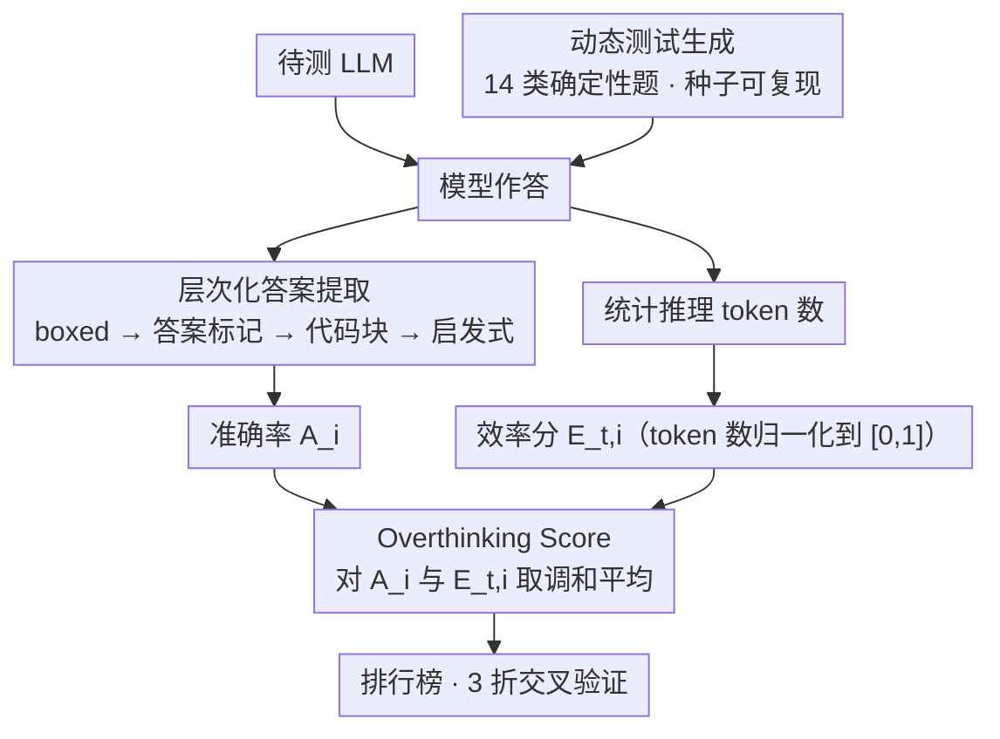

# Do LLMs Overthink Basic Math Reasoning? Benchmarking the Accuracy-Efficiency Tradeoff

**会议**: ACL 2026 Findings  
**arXiv**: [2507.04023](https://arxiv.org/abs/2507.04023)  
**代码**: [GitHub](https://github.com/ctrl-gaurav/LLMThinkBench)  
**领域**: LLM评测  
**关键词**: 过度思考, 基础数学推理, 准确率-效率权衡, 推理token, 基准测试

## 一句话总结

本文提出 LLMThinkBench，一个系统性评估 LLM 基础数学推理效率的基准，引入 Overthinking Score（准确率和 token 效率的调和平均），通过动态生成的 14 个确定性数学任务评估 53 个 LLM，发现推理模型平均生成约 18× 更多 token 但有时准确率更低，且扩展推理预算呈现收益递减。

## 研究背景与动机

**领域现状**：LLM 在复杂数学基准（GSM8K、MATH）上表现出色，推理模型通过推理时扩展（chain-of-thought）进一步提升了性能。然而，这些模型在基础数学运算上的表现和效率尚未系统评估。

**现有痛点**：(1) 在复杂基准上得分 90%+ 的模型在基础加法上可能低于 40%——复杂基准性能无法迁移到基础运算；(2) 推理模型生成过长的推理链来解决简单问题（如 234+567 生成数百 token 解释进位原理），不仅浪费计算资源，有时还降低准确率；(3) 现有评估仅关注准确率，忽略了计算浪费；(4) 静态基准存在数据污染风险；(5) 缺乏联合衡量准确率和效率的指标。

**核心矛盾**：推理模型被训练为"思考更多"以提升性能，但在基础任务上更多思考反而有害——模型将解释（explanation）与理解（understanding）混淆，产生的长文本表面上像推理但实际上不具备问题解决能力。

**本文目标**：(1) 形式化准确率-冗余度权衡；(2) 提出 Overthinking Score 指标；(3) 建立动态生成的评估协议；(4) 大规模实证研究 53 个 LLM 的推理效率。

**切入角度**：聚焦于 14 个确定性基础数学任务（排序、求和、乘法、找最大值等），这些任务有唯一正确答案且计算复杂度已知，可以精确衡量准确率和冗余度之间的关系。

**核心 idea**：更多推理 token ≠ 更好的数学推理——在基础任务上，推理模型的冗余生成不仅浪费计算，还可能因错误累积和自相矛盾而降低准确率。

## 方法详解

### 整体框架

LLMThinkBench 把“基础数学过度思考”这个现象做成一个可量化、可复现的评测闭环。给定一个待测模型，框架先动态生成 14 类确定性基础数学题（排序、求和、乘法、找最大值等，每题都有唯一正确答案、计算复杂度已知），让模型作答；随后一边用层次化提取器从五花八门的输出里抠出最终答案算准确率，一边统计推理 token 数算效率，最后把准确率与效率用 Overthinking Score 融成单一分数。整套逻辑封装成可 pip 安装的开源工具（PyPI: llmthinkbench），支持多后端推理、3 折交叉验证与排行榜，评测覆盖 53 个模型（含基座、指令微调、推理与量化变体）。

### 关键设计

三个设计正好对应评测闭环自上而下的三步：先**动态出题**保证测量可信，再**层次化提取**把答案稳定抠出来，最后用 **Overthinking Score** 把准确率和效率融成一个分数。

**1. 动态测试生成：让数据污染无从下手**

静态基准最大的隐患是题目可能早已混进训练集，于是高分未必代表真能力。LLMThinkBench 改用可复现种子在评测时现场出题：列表长度从 $\{8,16,32,64\}$ 采样，数值从 $\text{Uniform}[-1000,1000]$ 采样，开源模型每折 1000 样本、跑 3 折交叉验证，闭源模型因成本限制取 100 样本，每个模型总共要面对约 42,000 道全新的唯一题。

因为每次评测都是新生成的实例，模型无法靠背题取巧，准确率与效率的测量才有可比性。

**2. 层次化答案提取：从乱糟糟的输出里稳定抠答案**

不同模型的输出格式天差地别，提取不可靠就谈不上公平评分。本文用四级兜底策略：优先抓 `\boxed{}` 内容，其次解析显式答案标记（“The answer is…”），再从代码块或 Markdown 结构里取，最后用任务特定启发式收尾。

这套层层降级的设计在 5000+ 条真实响应上验证成功率达 98.7%，保证了准确率统计不会因为格式噪声而失真。

**3. Overthinking Score：用调和平均把“对”和“省”绑死**

只看准确率会掩盖冗余——一个模型可能答对了但用掉十倍 token。本文先把 token 数归一化成效率分 $E_{t,i} = 1 - \frac{\bar{T}_i - T_{min}}{T_{max} - T_{min}}$，落到 $[0,1]$，再用调和平均 $\mathcal{O}_i = \frac{2 \cdot A_i \cdot E_{t,i}}{A_i + E_{t,i}}$ 把准确率 $A_i$ 和效率 $E_{t,i}$ 揉成一个分数。

关键在于选调和平均而非算术平均：调和平均对不平衡极其苛刻，90% 准确率 + 10% 效率只能拿 0.18，而 60% + 60% 反而拿 0.60；换成算术平均前者还有 0.55，根本区分不出“高效正确”和“冗余正确”。这一选择让指标天然偏向那些既准又省的模型，把过度思考的代价直接写进分数里。

## 实验关键数据

### 主实验

**部分代表性模型的 Overthinking Score 对比**

| 模型 | 参数 | 准确率 | Overthinking Score | 平均输出 Token |
|------|------|--------|-------------------|---------------|
| Phi-4 | 14B | 78.92% | **0.863** | 378.6 |
| Phi-4-reasoning-plus | 14B | 69.54% | 0.234 | 6,780.7 |
| Qwen3-14B | 14B | 86.52% | 0.727 | 3,607.6 |
| Qwen3-0.6B | 0.6B | 49.99% | 0.545 | 3,162.8 |

### 消融实验

**推理预算约束实验（Qwen3 推理模型）**

| 配置 | 准确率 |
|------|--------|
| 全预算 | 72% |
| 1024 token 限制 | 44%（-28%） |
| 推理预算 low→medium→high（GPT-5/o系列） | 准确率增益 ≈ 0 |

**量化实验（Qwen2.5 家族）**

| 配置 | 准确率变化 |
|------|-----------|
| FP16 → 8-bit | 大模型几乎不变 |
| FP16 → 4-bit | 大模型轻微下降，小模型显著下降 |

### 关键发现

- 基础数学悖论：GSM8K 上 95%+ 的模型在本文任务上低于 75%——复杂基准表现不能代表基础数学能力
- 推理模型平均生成 6,780 token vs 标准模型 378 token（18×），但准确率更低（Phi-4-reasoning-plus 69.54% vs Phi-4 78.92%）
- Overthinking Score 揭示了准确率指标掩盖的效率陷阱：Phi-4 得 0.863 远超 Phi-4-reasoning-plus 的 0.234
- token 约束下推理模型"灾难性崩溃"——从 72% 降至 44%，表明推理能力与长链推理深度绑定
- 扩展推理预算收益递减——GPT-5/o 系列从 low 到 high 推理 effort 准确率增益接近零
- 量化保留了基础推理能力，说明过度思考来自训练而非硬件限制

## 亮点与洞察

- Overthinking Score 是一个优雅且有信息量的指标——调和平均的严格惩罚使其能区分"高效正确"和"冗余正确"
- "基础数学悖论"是一个重要发现——挑战了"复杂基准得分高=数学能力强"的假设
- 动态测试生成+开源工具（PyPI 包+排行榜）使结果可复现且易扩展

## 局限与展望

- 仅覆盖 14 个确定性数学任务，未覆盖更复杂的数学推理或非数学领域
- token 效率的归一化依赖于评估集中的全局最大/最小值，可能受极端值影响
- 未分析过度思考的具体模式（如错误累积、自相矛盾的比例）
- 未探索如何训练既准确又高效的推理模型

## 相关工作与启发

- **vs ThoughtTerminator/Self-Braking**: 这些工作提出缓解过度思考的策略，本文提供了量化过度思考的指标——度量是干预的前提
- **vs GSM8K/MATH 基准**: 这些基准侧重准确率，本文补充了效率维度
- **vs Graph of Thoughts/LogicPuzzleRL**: 这些方法增强复杂推理，但未解决基础运算上的过度思考

## 评分

- 新颖性: ⭐⭐⭐⭐ Overthinking Score 是新颖且有用的指标，基础数学悖论是重要发现
- 实验充分度: ⭐⭐⭐⭐⭐ 53 个模型、量化分析、预算约束、动态生成，规模大且全面
- 写作质量: ⭐⭐⭐⭐ 形式化定义严谨，实验叙述清晰
- 价值: ⭐⭐⭐⭐⭐ 为推理模型的效率评估提供了标准化工具和深刻洞察

<!-- RELATED:START -->

## 相关论文

- [\[ACL 2026\] BizCompass: Benchmarking the Reasoning Capabilities of LLMs in Business Knowledge and Applications](bizcompass_benchmarking_the_reasoning_capabilities_of_llms_in_business_knowledge.md)
- [\[ACL 2026\] Challenging the Boundaries of Reasoning: An Olympiad-Level Math Benchmark for Large Language Models](challenging_the_boundaries_of_reasoning_an_olympiad-level_math_benchmark_for_lar.md)
- [\[AAAI 2026\] Do LLMs Really Struggle at NL-FOL Translation? Revealing Their Strengths via a Novel Benchmarking Strategy](../../AAAI2026/llm_evaluation/do_llms_really_struggle_at_nl-fol_translation_revealing_their_strengths_via_a_no.md)
- [\[ACL 2026\] Personalized Benchmarking: Evaluating LLMs by Individual Preferences](personalized_benchmarking_evaluating_llms_by_individual_preferences.md)
- [\[ACL 2026\] ResearchBench: Benchmarking LLMs in Scientific Discovery via Inspiration-Based Task Decomposition](researchbench_benchmarking_llms_in_scientific_discovery_via_inspiration-based_ta.md)

<!-- RELATED:END -->
