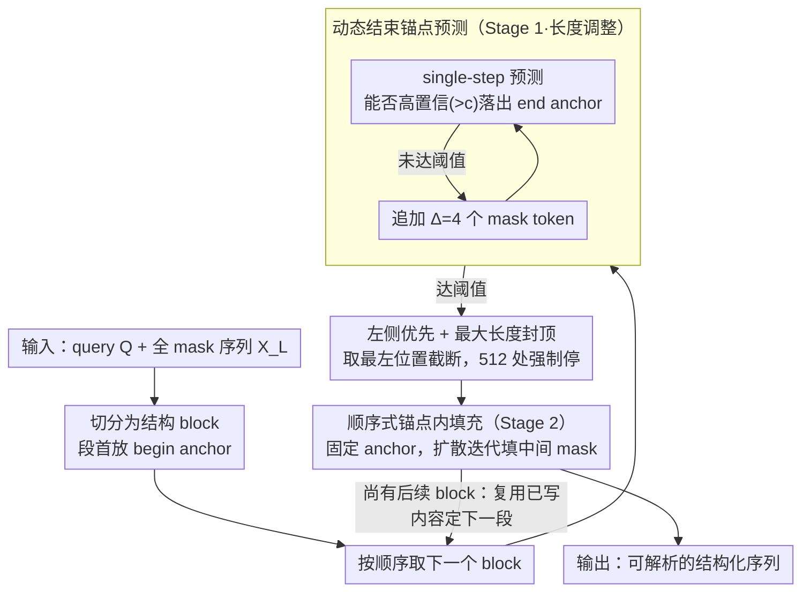

# Dynamic Infilling Anchors for Format-Constrained Generation in Diffusion Large Language Models

**会议**: ACL 2026  
**arXiv**: [2606.04535](https://arxiv.org/abs/2606.04535)  
**代码**: https://github.com/Westlake-AGI-Lab/DIA  
**领域**: 扩散语言模型 / 格式约束生成  
**关键词**: diffusion LLM、格式约束、动态锚点、结构化生成、JSON 生成

## 一句话总结
DIA 是一种无需训练的扩散大语言模型格式约束生成方法，通过先预测结束锚点位置再在锚点间迭代填充，显著提升 reasoning template 和 JSON 输出的格式正确率，并缓解固定锚点导致的截断或冗余。

## 研究背景与动机
**领域现状**：diffusion large language models 与自回归 LLM 不同，使用双向注意力和并行去噪生成，天然可以在初始全 mask 序列中预填某些固定 token。因此，它们看起来很适合做结构化输出，例如 `<think>...</think><answer>...</answer>` 或 parseable JSON。

**现有痛点**：直接把 begin/end anchors 放在固定位置虽然能约束格式，但会把生成空间切成固定长度。如果 reasoning span 太短，模型会提前截断；如果 span 太长，模型会重复或生成冗余内容。prompt 约束、后处理和 constrained decoding 也各有问题：prompt 不稳定，后处理可能破坏语义，严格解码又影响效率和灵活性。

**核心矛盾**：格式约束需要结构边界稳定，但高质量生成需要长度可变。固定模板把这两件事绑定在一起，导致结构正确和语义质量难以兼得。

**本文目标**：作者希望利用 dLLM 对全局 mask 序列和结束位置的感知能力，在不微调模型的情况下动态估计 anchor 位置，让模型先规划每个结构段需要多长，再生成段内内容。

**切入角度**：论文观察到 dLLM 可以通过一两步预测估计 eos 或结束位置。因此，结束锚点不必预先写死，可以通过 single-step prediction 和 confidence threshold 动态寻找。

**核心 idea**：把格式约束生成拆成“长度调整”和“锚点内填充”两个阶段：先反复扩展 mask block 直到模型高置信预测出 end anchor，再固定 anchor 并在边界内完成扩散式内容生成。

## 方法详解

### 整体框架
DIA 面向已经训练好的 diffusion LLM（实验用 Dream-7B），不引入任何新参数，目标是让“先规划结构边界、再填内容”成为解码时的默认行为。给定用户 query $Q$ 和一条全 mask 的目标序列 $X_L$，DIA 先把它切成若干 block $\mathcal{C}=\{C_1,\dots,C_{|\mathcal{B}|}\}$，每个 block 对应一个结构段（如 reasoning 段、answer 段）并在段首放一个 begin anchor。随后每个 block 走两阶段：Stage 1 做 length adjustment，反复扩展 mask 直到模型高置信预测出 end anchor，从而动态定下这一段该多长；Stage 2 固定 anchor，只对中间 mask 做扩散式迭代填充生成段内内容。整个流程 training-free。

### 关键设计

**1. 动态结束锚点预测：让每段自己说该多长**

固定 span 是格式约束的祸根——span 太短模型被迫提前截断，太长又会重复或灌水。DIA 不再写死边界，而是在 block 段首放入 begin anchor 后做一次 single-step prediction，看模型能否在 block 内某个位置以超过阈值 $c$ 的置信度落出 end anchor 或 partial end anchor；若能就认定当前长度足够，若不能就按步长 $\Delta=4$ 追加 mask tokens 再试（GSM8K 的 $c$ 取 0.065、MATH 取 0.05）。

这一招之所以成立，是因为 dLLM 在预训练里已经学到“回答在哪里结束”的先验，DIA 只是把这个先验提前用来规划边界，而不是等内容生成完才发现长度不合适。

**2. 左侧优先 + 最大长度封顶：防止标签反复横跳和无限扩展**

结构化生成最怕模型在同一段里反复开关标签，或者迟迟找不到收尾位置而无限扩展。DIA 用两条规则兜底：当多个位置都满足置信度阈值时，取最靠左的位置作为 end anchor 并截断其后的冗余 mask；若始终找不到有效 anchor，就在最大 block length $M=512$ 处强制停止。

左侧优先给出的是保守边界，宁可短一点也不放任标签乱开；最大长度则为复杂样本兜底，避免长度搜索把延迟拖到失控。

**3. 顺序式锚点内填充：让 answer 长度跟着 reasoning 走**

对 think-answer 这类任务，答案的长度和内容本就依赖前面的推理，如果两个 block 各自独立规划，最终答案很可能和推理脱节。DIA 因此采用顺序处理：先确定并生成 thinking block，再用已经写出的 reasoning 内容去决定 answering block 该多长、写什么；填充过程中 anchors 始终固定，只有中间的 mask tokens 被迭代更新。

### 一个完整示例
以 `<think>...</think><answer>...</answer>` 任务为例：DIA 先在 think 段段首放 `<think>`，每追加 4 个 mask token 就跑一步预测，看能否高置信落出 `</think>`；一旦落出就截断、固定 think 边界，并在边界内做扩散填充写出推理过程；接着把这段推理喂回去，照同样方式为 answer 段定出 `</answer>` 的位置并填出最终答案。这样输出天然是可解析的结构，而每段长度都按内容动态决定。Dream-7B 上 GSM8K/MATH 的 diffusion steps 取 512、max new tokens 分别取 256 与 512。

## 实验关键数据

### 主实验
| 数据集 | 指标 | DIA | 之前方法 | 提升 / 说明 |
|--------|------|------|----------|------|
| GSM8K 0-shot | Format Score | 72.63 | Infilling: 58.83，Base/Instruct: 0.00 | 格式正确率显著提升 |
| GSM8K 0-shot | Accuracy | 46.78 | Infilling: 14.86，Instruct: 15.01，Base: 68.99 | 相比固定 infilling 大幅提升，但低于无格式 Base |
| MATH-500 0-shot | Format Score | 76.82 | Infilling: 29.10，Base/Instruct: 0.00 | 复杂数学场景格式收益最大 |
| MATH-500 0-shot | Accuracy | 20.08 | Infilling: 21.52，Base: 25.14，Instruct: 25.28 | 保持可比但不是最高准确率 |
| WikiBio JSON | Valid JSON / Hallucination | 79.84 / 0.15 | Instruct raw: 52.80 / 4.81，Infilling: 0.01 / 0.00 | 原始匹配和正则提取下结果一致 |

### 消融实验
| 配置 | 关键指标 | 说明 |
|------|---------|------|
| DIA w/o Stage 1, GSM8K | Acc. 10.31，Format 0.00，Latency 14.99 | 去掉 confidence prediction 后格式几乎崩溃 |
| DIA Full, GSM8K | Acc. 47.54，Format 59.67，Latency 25.86 | 附录超参设置下完整方法明显更好 |
| DIA w/o Stage 1, MATH | Acc. 6.73，Format 0.84，Latency 15.33 | 复杂任务更依赖长度规划 |
| DIA Full, MATH | Acc. 20.20，Format 75.62，Latency 29.37 | 完整两阶段方法保留结构边界 |
| GSM8K latency | DIA 26.52 vs Base 10.72 | 动态规划带来额外延迟 |
| MATH latency | DIA 30.62 vs Base 31.71 | 复杂任务上前置长度规划反而减少冗余计算 |

### 关键发现
- 固定 infilling 能部分保留 anchors，但不能保证整体格式正确，也会压低答案质量。GSM8K 上固定 infilling accuracy 只有 14.86，而 DIA 达到 46.78。
- DIA 在 JSON 生成上效果最稳定。WikiBio 中 raw matching 和 regular expression 都得到 79.84% valid JSON，且 hallucination score 只有 0.15%。
- anchor retention 分析显示 DIA 在 GSM8K 和 MATH 上几乎能稳定保留 `<think>`、`</think>`、`<answer>`、`</answer>` 四类 anchors；Base 和 Instruct 模型的结束锚点保留率会严重下降。
- 超参分析表明 $\Delta$ 是格式严格性和推理深度之间的旋钮。较小 $\Delta$ 可能过早截断，格式率高但 accuracy 低；较大 $\Delta$ 给 reasoning 更多空间，但可能降低 format score 或增加 latency。

## 亮点与洞察
- DIA 把格式控制从“事后修 JSON / 事后修标签”提前到“生成前规划边界”，这很符合 diffusion LLM 的双向和并行生成特性。
- 方法 training-free，适合快速部署在已有 dLLM 上；这比为每种输出 schema 微调模型更轻量。
- 论文很清楚地展示了固定 anchor 的本质问题：不是没有结构 token，而是 token 位置刚性导致内容空间不匹配。
- 对结构化 reasoning 的启发是，模型不只需要知道输出什么格式，还需要知道每个格式段应该有多少生成预算。

## 局限与展望
- DIA 仍依赖人工指定 anchors 及其语义角色。对于结构边界本身会动态变化的开放域对话、多轮工具调用或创意写作，手工 anchor 可能不够灵活。
- 长度调整会引入额外推理开销。GSM8K 上 DIA latency 为 26.52，明显高于 Base 10.72，不适合所有实时场景。
- Accuracy 与 format 存在 trade-off。DIA 大幅提升格式正确率，但在 MATH 上 accuracy 低于无格式 Base/Instruct 和固定 infilling。
- 当前评测集中在 reasoning template 和 WikiBio JSON。未来需要验证更复杂 schema、代码、证明、多模态结构化输出和嵌套工具调用。

## 相关工作与启发
- **vs prompt-based constraints**: 仅靠提示词要求输出 JSON 或标签，在长推理中容易丢边界；DIA 直接在初始 mask 序列中控制 anchors，更贴近解码过程。
- **vs post-processing / repair**: 后处理可以修格式，但可能改变语义或丢失 reasoning。DIA 在生成前规划结构，减少后处理依赖。
- **vs constrained decoding**: grammar 或 FSM decoding 约束强但不灵活，DIA 通过动态长度分配保留一定生成自由度。
- **对 diffusion LLM 的启发**: dLLM 的优势不只是并行加速，还包括可以先规划全局结构再填充内容，这可能是区别于 AR LLM 的重要应用方向。

## 评分
- 新颖性: ⭐⭐⭐⭐☆ 动态锚点位置预测很贴合 dLLM 机制，training-free 设计也实用。
- 实验充分度: ⭐⭐⭐⭐☆ 覆盖 GSM8K、MATH、WikiBio、stage ablation、超参和 latency，但任务类型仍偏有限。
- 写作质量: ⭐⭐⭐⭐☆ 动机清晰、算法直观，个别主表和附录表的数值设置不同，需要读者区分实验条件。
- 价值: ⭐⭐⭐⭐☆ 对结构化输出、格式约束 reasoning 和 dLLM 解码设计有较强启发，尤其适合需要 parseable output 的应用。

<!-- RELATED:START -->

## 相关论文

- [\[ACL 2026\] Attribution, Citation, and Quotation: A Survey of Evidence-based Text Generation with Large Language Models](attribution_citation_and_quotation_a_survey_of_evidence-based_text_generation_wi.md)
- [\[ACL 2026\] Capabilities and Evaluation Biases of Large Language Models in Classical Chinese Poetry Generation: A Case Study on Tang Poetry](capabilities_and_evaluation_biases_of_large_language_models_in_classical_chinese.md)
- [\[ACL 2026\] EngiBench: A Benchmark for Evaluating Large Language Models on Engineering Problem Solving](engibench_a_benchmark_for_evaluating_large_language_models_on_engineering_proble.md)
- [\[ACL 2026\] Challenging the Boundaries of Reasoning: An Olympiad-Level Math Benchmark for Large Language Models](challenging_the_boundaries_of_reasoning_an_olympiad-level_math_benchmark_for_lar.md)
- [\[ACL 2026\] E2EDev: Benchmarking Large Language Models in End-to-End Software Development Task](e2edev_benchmarking_large_language_models_in_end-to-end_software_development_tas.md)

<!-- RELATED:END -->
