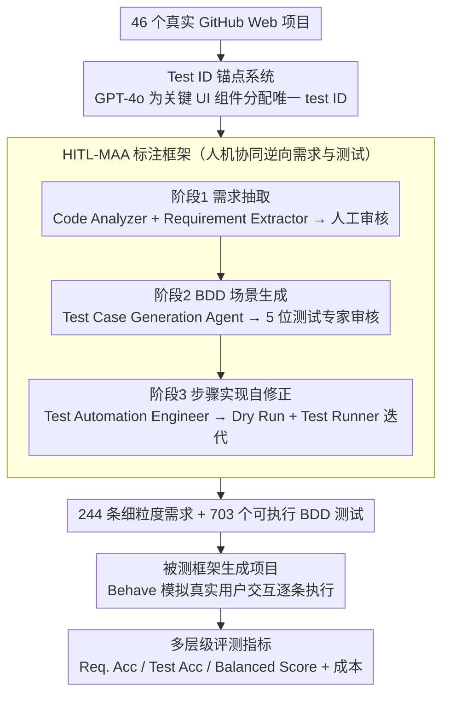

# E2EDev: Benchmarking Large Language Models in End-to-End Software Development Task

**会议**: ACL 2026  
**arXiv**: [2510.14509](https://arxiv.org/abs/2510.14509)  
**代码**: [https://github.com/SCUNLP/E2EDev](https://github.com/SCUNLP/E2EDev)  
**领域**: LLM评测  
**关键词**: 端到端软件开发, 行为驱动开发, 基准评测, 多智能体编码, 需求验证

## 一句话总结

本文提出 E2EDev，一个基于行为驱动开发（BDD）原则的端到端软件开发基准，包含 46 个真实 Web 项目、244 条细粒度需求和 703 个可执行 BDD 测试，评估发现即使最强 LLM（Claude 系列）在需求准确率上也不超过 60%，多智能体框架的复杂交互成本与性能收益不成正比。

## 研究背景与动机

**领域现状**：LLM 驱动的端到端软件开发（E2ESD）正从函数级代码生成走向完整项目自动生成。现有框架分为多智能体方法（ChatDev、MetaGPT）和单智能体方法（GPT-Engineer），但评测体系严重滞后于框架发展。

**现有痛点**：(1) 现有基准（SoftwareDev、SRDD）使用粗粒度的需求描述作为输入，"管理单词"这样的模糊描述无法明确用户到底需要编辑、书签还是删除功能；(2) 评测依赖主观人工评价或启发式指标，缺乏基于软件工程标准的系统方法论，导致跨框架比较不一致、不可靠。

**核心矛盾**：E2ESD 任务需要同时完成高层规划（决定构建什么）和细粒度功能实现（精确满足需求细节），现有基准的模糊需求和不可靠评测使我们无法真正理解框架能力的瓶颈所在。

**本文目标**：(1) 构建细粒度需求规格的 E2ESD 基准；(2) 设计基于 BDD 的自动化评测流水线；(3) 系统分析各框架和 LLM 在 E2ESD 任务上的真实能力和失败模式。

**切入角度**：借鉴软件工程中的行为驱动开发（BDD）原则，用 Given-When-Then 格式的 Gherkin 场景描述来模拟真实用户交互，实现从用户视角验证生成软件是否满足需求。

**核心 idea**：将 E2ESD 评测从模糊的人工打分转变为基于细粒度需求的可执行 BDD 测试，通过模拟真实用户交互来确定性地验证生成代码的需求符合度。

## 方法详解

### 整体框架

E2EDev 把“端到端软件开发”这件模糊难判的事，做成一个可确定性打分的评测闭环。它从 46 个真实 GitHub Web 项目出发，先通过 HITL-MAA（人机协同多智能体标注框架）反向抽出 244 条细粒度用户需求，再为每条需求写出 Gherkin 格式的 BDD 测试场景及对应的 Python 步骤实现；评测时把被测框架生成的项目跑起来，用 Behave 框架模拟真实用户交互逐条执行这些 BDD 测试，从需求级和测试级两个粒度判定生成代码到底有没有满足需求。

### 关键设计

**1. HITL-MAA：人机协同把源码逆向成需求与可执行测试**

纯人工标注 46 个仓库级项目成本太高，纯 LLM 生成又质量不稳。HITL-MAA 用三阶段流水线把繁重的抽取与实现交给 agent、把人力集中在每阶段的关键审核点上。第一阶段，Code Analyzer Agent 解析项目的核心功能与 UI 元素交互，Requirement Extractor Agent 据此生成候选需求，再由人工审核把关准确性；第二阶段，Test Case Generation Agent 为每条需求写出 Gherkin 格式的 BDD 场景，由五位软件测试专家协作审核；第三阶段，Test Automation Engineer Agent 生成 Python 步骤实现，并经 Dry Run Verifier 与 Test Runner 反复迭代自修正。

这套自修正机制让超过 80% 的逻辑错误无需人工干预即可修复，使得“从真实代码逆向出高质量需求与测试”这件原本极费人力的事变得可规模化。

**2. Test ID 锚点系统：给跨项目测试一个稳定的 DOM 落脚点**

不同框架生成的项目 HTML 结构千差万别，测试脚本如果直接靠 DOM 路径定位组件，换个项目就会失效。E2EDev 的做法是在生成需求和测试之前，先用 GPT-4o 为关键 UI 组件分配唯一的 test ID，作为结构不变的锚点。

这样无论底层 DOM 怎么变，BDD 测试都能一致地引用到同一个逻辑组件，保证了同一套需求验证可以公平地施加到所有框架的输出上。

**3. 多层级评测指标：从需求级与测试级双粒度判分并计成本**

只看测试通过率会被测试粒度带偏——某些需求碰巧测试用例多，权重就被放大。E2EDev 因此分两层度量代码有效性：Req. Acc 衡量“完全满足”的需求比例（该需求下所有测试用例都通过才算数），Test Acc 衡量通过的测试比例，Balanced Score 再加权两者以抵消测试数量不均带来的偏差；与此同时，框架还记录 API 费用、碳排放和耗时作为效率维度。

需求级指标比测试级更贴近用户的真实体验：用户关心的是“这个功能到底能不能用”，而不是“多少条测试通过了”。

## 实验关键数据

### 主实验

**不同框架和 LLM 骨干的需求准确率（Req. Acc %）**

| LLM 骨干 | Vanilla LLM | GPT-Engineer | Self-Collab. | MapCoder | ChatDev | MetaGPT |
|---------|------------|-------------|-------------|---------|--------|--------|
| Claude-Haiku 4.5 | 48.69 | **53.75** | 49.01 | 49.61 | 44.73 | 5.39 |
| GPT-4o | 45.95 | **50.83** | 46.83 | 47.70 | 42.71 | 0.00 |
| GPT-4o-mini | **44.82** | 42.13 | 37.90 | 41.30 | 33.16 | 0.00 |
| Qwen-Max | 43.33 | **49.61** | 42.30 | 48.83 | 43.93 | 1.65 |
| Qwen-7B | 22.37 | **24.03** | 20.65 | 11.90 | 10.96 | 0.00 |

### 消融实验

**失败模式分析（人工评估 360 个项目）**

| 失败类型 | 描述 | 主要受影响框架 |
|---------|------|-------------|
| 代码不一致 | 缺失/冲突/空函数 | MetaGPT（44%来源于此） |
| 需求遗漏 | 必需功能未实现 | Vanilla LLM, ChatDev |
| 需求偏差 | 实现逻辑偏离需求 | 所有框架（多智能体改善明显） |
| 细节不匹配 | 基本正确但边缘错误 | Self-Collaboration 最严重 |

### 关键发现

- 即使最强的 Claude-Haiku 4.5 + GPT-Engineer 组合，Req. Acc 也仅 53.75%，说明 E2ESD 仍是巨大挑战
- MetaGPT 在几乎所有 LLM 骨干上接近 0% 成功率，根本原因是智能体间通信崩溃——程序员忽略架构师的文件结构，产品经理重写压缩原始需求
- 多智能体框架的交互成本高昂（ChatDev 平均 15.72 轮对话），但性能收益有限，甚至不如 Vanilla LLM
- Soft Req. Acc 与 Req. Acc 差距超过 25%：模型能实现基本功能但无法处理复杂边缘情况
- 框架对 LLM 骨干能力依赖极强，弱模型上框架反而拖累性能

## 亮点与洞察

- BDD 测试方法论引入 LLM 评测是巧妙的跨领域迁移——将软件工程的成熟实践（Given-When-Then）应用于 AI 生成代码的验证
- HITL-MAA 的迭代自修正机制（Dry Run + Test Runner）解决了 80% 的逻辑错误，展示了 LLM 在标注流水线中的实用价值
- 失败模式分析揭示了多智能体架构的根本问题：信息在智能体间传递时逐层稀释，高层功能保留但细节丢失

## 局限与展望

- 仅覆盖 Web 应用领域，虽然作者论证这是"下界测试"，但桌面/移动/后端应用的挑战可能不同
- 46 个项目规模有限，因为仓库级基准构建成本极高
- 排除了 CI/CD 和深度后端检测，聚焦于浏览器自动化的黑盒测试
- 未来可扩展为持续更新的公共排行榜，支持纵向评估

## 相关工作与启发

- **vs rSDE-Bench**: rSDE-Bench 使用函数级单元测试验证输出，E2EDev 使用 BDD 测试从用户视角验证行为，粒度更贴近真实使用场景
- **vs SoftwareDev/SRDD**: 它们依赖模糊描述和人工评价，E2EDev 提供细粒度需求和自动化确定性评测
- **vs Mle-Bench/GitTaskBench**: 它们分别聚焦 ML 管道和仓库操作，E2EDev 聚焦从需求到可执行项目的完整流程

## 评分

- 新颖性: ⭐⭐⭐⭐ 将 BDD 引入 LLM E2ESD 评测是有意义的创新，但基准构建方法论本身较为直接
- 实验充分度: ⭐⭐⭐⭐⭐ 6 个 LLM 骨干 × 6 个框架，附加人工失败模式分析，非常全面
- 写作质量: ⭐⭐⭐⭐ 结构清晰，图表直观，分析深入
- 价值: ⭐⭐⭐⭐ 填补了 E2ESD 可靠评测的空白，失败模式分析对框架设计有直接指导意义

<!-- RELATED:START -->

## 相关论文

- [\[ACL 2025\] VoxEval: Benchmarking the Knowledge Understanding Capabilities of End-to-End Spoken Language Models](../../ACL2025/llm_evaluation/voxeval_benchmarking_the_knowledge_understanding_capabilities_of_end-to-end_spok.md)
- [\[ACL 2026\] ResearchBench: Benchmarking LLMs in Scientific Discovery via Inspiration-Based Task Decomposition](researchbench_benchmarking_llms_in_scientific_discovery_via_inspiration-based_ta.md)
- [\[ACL 2026\] CUB: Benchmarking Context Utilisation Techniques for Language Models](cub_benchmarking_context_utilisation_techniques_for_language_models.md)
- [\[ACL 2026\] EngiBench: A Benchmark for Evaluating Large Language Models on Engineering Problem Solving](engibench_a_benchmark_for_evaluating_large_language_models_on_engineering_proble.md)
- [\[ACL 2026\] Dynamic Infilling Anchors for Format-Constrained Generation in Diffusion Large Language Models](dynamic_infilling_anchors_for_format-constrained_generation_in_diffusion_large_l.md)

<!-- RELATED:END -->
