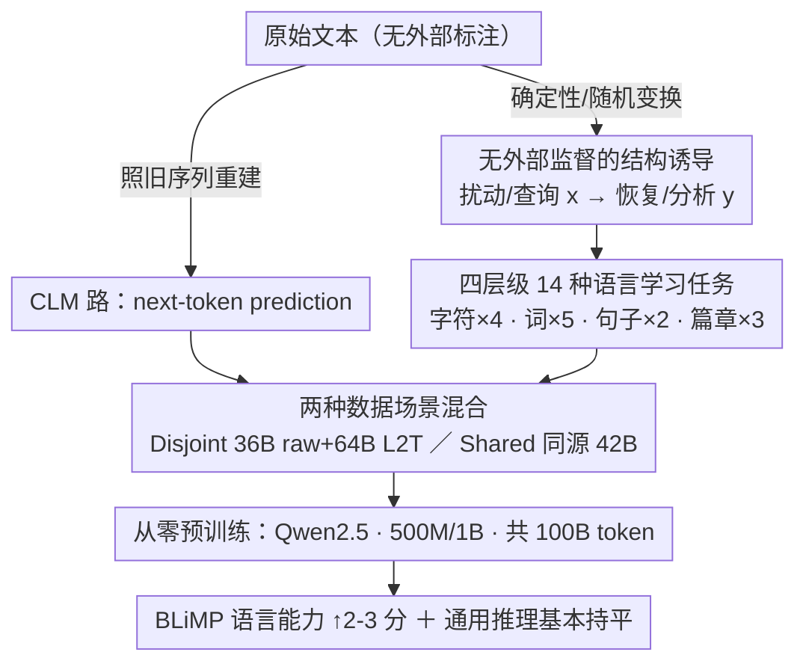

# Enhancing Linguistic Competence of Language Models through Pre-training with Language Learning Tasks

**会议**: ACL 2026  
**arXiv**: [2601.03448](https://arxiv.org/abs/2601.03448)  
**代码**: [https://github.com/gucci-j/l2t](https://github.com/gucci-j/l2t)  
**领域**: LLM评测  
**关键词**: 语言能力, 预训练, 语言学习任务, 语言习得, 结构化刺激

## 一句话总结

L2T 提出了一种预训练框架，将 14 种语言学习任务（字符级→篇章级）与标准 next-token prediction 混合训练，在 500M/1B 参数规模上将 BLiMP 语言能力得分提升 2-3 个百分点并加速其习得过程，同时保持通用推理性能。

## 研究背景与动机

**领域现状**：语言模型通过因果语言建模（CLM）在原始文本上预训练，能学到世界知识和推理能力，但对语言能力（linguistic competence）——理解形态学、句法、语义现象的能力——并未显式优化。

**现有痛点**：
- LM 往往表现为"随机鹦鹉"（stochastic parrots），模仿表面模式而未掌握底层语言结构
- 这类似于人类的死记硬背（rote learning），只复制模式而不理解生成规则
- 现有改进方法通常依赖架构修改或复杂课程设计，增加了工程复杂度

**核心矛盾**：CLM 是单一任务目标，优先学习表面统计特征而非语言结构理解；而人类不是通过单一目标习得语言的，而是通过多任务学习。

**本文目标**：在预训练阶段引入结构化语言学习任务，提升模型的语言能力并加速其习得过程，同时不损害通用推理性能。

**切入角度**：受人类语言习得启发——人类通过纠错、重组、补全等多种任务学语言——将原始文本自动转换为多粒度的结构化输入-输出对，在预训练中提供显式的语言结构刺激。

**核心 idea**：预训练不应只做序列重建（CLM），还应包含需要"提取和重组信息"的多样化语言学习任务，形成结构化脚手架促进语言能力发展。

## 方法详解

### 整体框架

L2T 不改架构、不引外部标注，只在数据层做文章：把原始文本自动改写成 14 种语言学习任务的结构化 (输入, 输出) 对，覆盖字符 / 词 / 句子 / 篇章四个语言粒度，再与标准 CLM 数据混合后从零预训练。原始文本进来，一部分照旧做 next-token prediction，另一部分被确定性 / 随机变换"扰动—查询—恢复"成带结构信号的样本，模型在二者混合的语料上学到的不只是表面统计，还有显式的语言结构。

### 关键设计

**1. 无外部监督的结构诱导：训练信号全部从原始文本自生**

这是整个框架的地基，决定了 L2T 的训练信号从哪来。与需要外部标注的指令微调不同，L2T 的每种任务都是一个确定性或随机化变换，把一段文本自动转成 $(x, y)$ 对：$x$ 是被扰动 / 查询的输入，$y$ 是恢复 / 分析后的输出。结构直接从原始文本里诱导出来，不依赖任何人工标注或外部资源，因此成本低、可随语料规模线性扩展。

**2. 四层级 14 种语言学习任务：把人类学语言的多种练习搬进预训练**

CLM 只做序列重建，模型容易停在表面模式上。L2T 在上述自监督变换之上按语言粒度铺开一组互补任务，每一类都对应人类语言习得里被验证有效的策略。字符级 4 种 (字符计数、掩码字符重建、空格恢复、错别字纠正) 增强形态学意识；词级 5 种 (尾词预测、掩码词重建、随机词纠正、词序重排、token 类型计数) 打破线性序列依赖、逼模型推断结构；句子级 2 种 (无关句删除、句序重排) 需要句间关系理解；篇章级 3 种 (中间填充、后半补全、单词生成文本) 支撑全局连贯与歧义消解。纠错练形态、重排练句法、补全练连贯——多粒度刺激合起来给语言能力搭了结构化脚手架。

**3. 两种数据场景混合：分离"数据多样性"与"结构化刺激"两种增益**

生成的 L2T 样本要和标准 CLM 数据混合后才送进预训练，混合方式本身也是一个受控变量。为了弄清提升究竟来自见到更多文本还是来自任务结构本身，L2T 设了两种配置。Disjoint (数据充足) 把 100B token 劈成两半，一半做 CLM、一半生成 L2T 样本 (约 36B raw + 64B L2T)，测的是"多样数据 + 结构化任务"的合力；Shared (数据受限) 让同一批 42B token 既做 CLM 又生成 L2T、总计 100B token，把"多任务变换 vs 单纯重复暴露"放到同源数据上对照——正对应"多任务学习 vs 死记硬背"这条核心假设。

### 损失函数 / 训练策略

损失在所有 token 上计算，包含 L2T 任务的输入段与输出段。模型采用 Qwen2.5 架构 + Mistral tokenizer (32K 词表)，从零预训练 500M 和 1B 两个规模；总预算固定 100B token，刻意超过 Chinchilla 最优阈值，以便在"充分训练"场景下观察结构化刺激的效果。

## 实验关键数据

### 主实验（语言能力 - BLiMP）

| 规模 | 数据 | Raw | L2T | 提升 |
|------|------|-----|-----|------|
| 500M | Disjoint | 78.6 | **80.2** | +1.6 |
| 500M | Shared | 78.1 | **80.9** | +2.8 |
| 1B | Disjoint | 79.0 | **80.8** | +1.8 |
| 1B | Shared | 78.9 | **81.2** | +2.3 |

### 通用基准

| 规模 | 数据 | Raw avg | L2T avg | 差异 |
|------|------|---------|---------|------|
| 500M | Disjoint | - | - | -0.87 (轻微下降) |
| 1B | Disjoint | - | - | -0.07 (几乎无差) |
| 500M | Shared | - | - | +0.15 (轻微上升) |
| 1B | Shared | - | - | -1.38 (下降，主要在 ARC) |

### 消融实验（单任务分析）

| 任务 | 语言能力 | 说明 |
|------|---------|------|
| 9/14 种任务 | 超越 Raw 基线 | Char Count、Reordering 等提供关键结构脚手架 |
| Space、Masked Char | 低于 Raw 基线 | 单独使用时训练信号不稳定 |
| 组合 L2T | 超越大多数单任务 | 多任务互补，稳健性更好 |

### 关键发现
- Island effects（岛屿效应）改善最显著，+6.9~11.3 分，说明多粒度结构化任务有助于捕捉长距离依赖
- L2T 模型从训练 5B tokens 起就超越 Raw 基线，且优势持续保持——加速了语言能力习得
- Shared 场景下效果更明显（+2.3~2.8 vs +1.6~1.8），说明"结构化刺激"比"重复暴露"更有效
- L2T 还提升了流体推理（RPM +5.4%）和数值能力等更广泛的认知智能

## 亮点与洞察
- "语言模型 = 死记硬背"的类比很有洞察力，L2T 用多任务结构化刺激破解单一 CLM 的表面模式学习问题
- 任务设计有理论支撑：每类任务对应人类语言习得研究中的已知有效策略（纠错→形态学，重排→句法等）
- 无需外部标注、无需架构修改，纯数据层面的干预使得方法高度可扩展
- 即使在相同源文本（Shared）上，多任务变换比重复暴露更有效，这一发现对数据效率研究有重要启示

## 局限与展望
- 仅在 500M 和 1B 规模验证，10B+ 规模的效果未知，大模型可能对 raw 文本比例更敏感
- 基于单次训练运行，统计显著性有限（虽然两种规模 × 两种数据场景的一致性提供了间接证据）
- 任务设计集中在句子级及以下，缺乏篇章级和跨句的更复杂任务
- 1B Shared 场景下通用推理下降 1.38 分，大模型在结构学习和知识巩固间需更好平衡
- 仅在英语上评估，多语言泛化有待验证

## 相关工作与启发
- **vs 标准 CLM 预训练**: L2T 将语言能力提升 2-3 分且加速习得，代价是通用性能轻微下降
- **vs 指令微调**: L2T 在预训练阶段引入结构化信号，不需要外部监督数据
- **vs 课程学习/架构修改**: L2T 仅通过数据变换实现，无需修改模型架构或复杂训练策略

## 评分
- 新颖性: ⭐⭐⭐⭐ 预训练中混合语言学习任务的思路独特，人类语言习得的类比有深度
- 实验充分度: ⭐⭐⭐⭐ 多规模、多数据场景、单任务分析、认知评估，但单次运行是不足
- 写作质量: ⭐⭐⭐⭐⭐ 理论动机→任务设计→实验验证的逻辑链非常完整清晰

<!-- RELATED:START -->

## 相关论文

- [\[NeurIPS 2025\] Exploiting Vocabulary Frequency Imbalance in Language Model Pre-training](../../NeurIPS2025/llm_evaluation/exploiting_vocabulary_frequency_imbalance_in_language_model_pre-training.md)
- [\[ACL 2026\] How Hypocritical Is Your LLM Judge? Listener–Speaker Asymmetries in the Pragmatic Competence of Large Language Models](how_hypocritical_is_your_llm_judge_listener-speaker_asymmetries_in_the_pragmatic.md)
- [\[ACL 2026\] Teaching Language Models to Forecast Research Success Through Comparative Idea Evaluation](teaching_language_models_to_forecast_research_success_through_comparative_idea_e.md)
- [\[ACL 2026\] Evaluating Temporal Consistency in Multi-Turn Language Models](evaluating_temporal_consistency_in_multi-turn_language_models.md)
- [\[ACL 2026\] Beyond Itinerary Planning: A Real-World Benchmark for Multi-Turn and Tool-Using Travel Tasks](beyond_itinerary_planning-a_real-world_benchmark_for_multi-turn_and_tool-using_t.md)

<!-- RELATED:END -->
