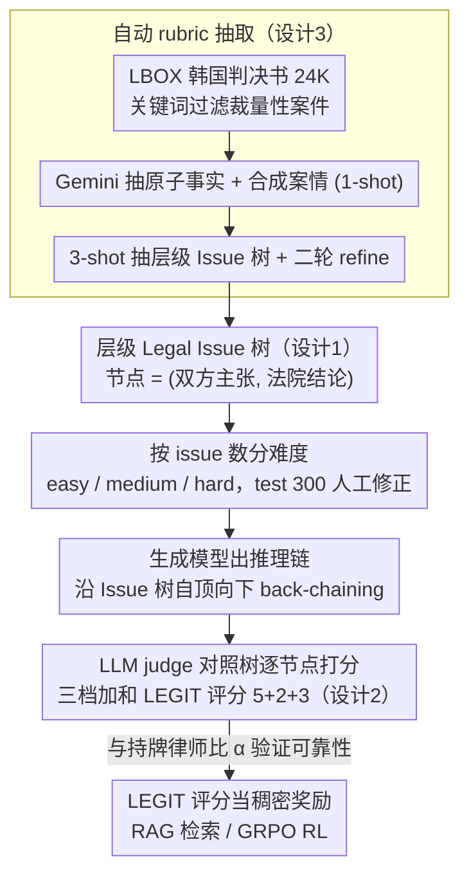

<!-- 由 src/gen_stubs.py 自动生成 -->
# Evaluating Legal Reasoning Traces with Legal Issue Tree Rubrics

**会议**: ACL 2026  
**arXiv**: [2512.01020](https://arxiv.org/abs/2512.01020)  
**代码**: 论文声明全开源（GitHub repo）  
**领域**: LLM 评测 / 法律 / 推理链评估  
**关键词**: legal judgment prediction, issue tree, rubric-based judge, RAG, GRPO

## 一句话总结
LEGIT 把韩国民事/行政判决书自动抽成「层级化的争议点树」当 rubric，让 LLM-as-judge 既能评 "issue coverage" 又能评 "issue correctness"，并据此发现 RAG 与 RL 在法律推理上有互补效应：RAG 全面提升、RL 牺牲覆盖换正确性。

## 研究背景与动机

**领域现状**：LLM-as-a-judge 已成为评估 chain-of-thought 推理链的主流，但绝大多数 benchmark 只关心最终答案对错（math、code）或用粗粒度的 Likert 量表打分。Legal Judgment Prediction (LJP) 这类专家任务上，单看终审判决正确率掩盖了「推理链是否充分覆盖关键法律争议、是否在每个争议点上得到正确结论」这两个法律实务最关心的维度。

**现有痛点**：(1) BigGen-Bench 等手工 rubric 路线规模上不去——专家写 rubric 太贵；(2) Likert 评分跨评测者一致性差，已被多篇工作证实不稳定；(3) 现有 LJP 数据集（CMDL、ECHR、Hwang2022 等）几乎只覆盖刑事或二元判决，对占法院案件 70-84% 的民事/行政案件几乎空白；(4) 即便在 final order 正确的情况下，错过关键争议点或在子问题上推错都会被掩盖。

**核心矛盾**：法律推理本质是**树**——母 issue 由若干子 issue 蕴含，子 issue 由事实+常识推出。把它压成「单标签分类 + 单标量 Likert 评分」直接抹掉了这个结构，evaluator 无从知道究竟是「分解出错」还是「演绎出错」，更没办法用作 RL 奖励的稠密信号。

**本文目标**：(1) 自动从法院判决书里抽取大规模、专家级的法律 issue tree rubric；(2) 验证 rubric-based LLM judge 与持牌律师的一致性；(3) 用 LEGIT 系统刻画 SOTA LLM 在复杂民商案上的失败模式（分解错 vs 演绎错）；(4) 把 rubric 直接当 RL 奖励，看 RAG 与 RL 各自在 issue 树上影响哪部分。

**切入角度**：作者注意到法律推理可被形式化为「back-chaining 沿 issue 树自顶向下」——把这棵树的每个节点（"双方主张 + 法院结论"）抽出来即天然 rubric。判决书本身就是大量自然标注，LLM 抽取 → 二轮 refine → 三档难度划分即可得到 24K 实例。

**核心 idea**：用法律 issue tree 作为「天然可扩展、可对齐人类专家」的 rubric，把单分数评测拆成 {final order, issue coverage, issue correctness} 三档可加和分数（5/2/3），既能稳健打分又能直接作 RL 奖励。

## 方法详解

LEGIT 任务输入：案件事实 + 原告诉求 (purpose of claim)；输出：自由形式推理链 + 最终判决。评测器拿到推理链后，对照 issue tree 逐节点打分，三档加和得 0–10 的 LEGIT score。

### 整体框架

核心思路是把法律推理还原成它本来的形状——一棵 Issue 树（争议点树）——再以这棵树为 rubric 同时做评测和 RL 奖励。数据构建分四步：先从 LBOX 抓韩国 District 法院民事 / 行政判决 24,406 条，用关键词剔除"损害赔偿 / 过失比例 / 慰抚金"等需法官自由裁量的非确定性案件；再用 Gemini-2.0-Flash 抽 atomic 单位事实并合成 coherent 案情 (1-shot)；同模型 3-shot 抽出层级 Issue 树并二轮 refine 提质；最后把每个 issue 转成 coverage / correctness 二元标签按公式累加。难度按 issue 数分 easy / medium / hard，test 集 300 例由作者人工修正。评测流水是 12 个生成模型出推理链 → 10 个 judge 模型对照 Issue 树打分 → 与持牌律师标注比 Krippendorff α。

### 关键设计

**1. 层级化 Legal Issue Tree 作为 rubric：把判决书拆成可逐节点独立判断的争议点树**

判决书的论证天然是层级的，但压成"单标签分类 + 单标量 Likert"就把这个结构抹掉了，evaluator 无从知道究竟是分解出错还是演绎出错。LEGIT 把每份判决抽成一棵节点为「(双方主张, 法院结论)」的树：树根固定为 purpose of claim + 最终判决，分支逐层下钻——例如「保险公司应付钱」←「事件被合同覆盖」←「死亡是 sudden, fortuitous, external」←「死因不属既往病」。LJP 因此等价于沿树自顶向下做 back-chaining，每步对应两个动作：identify 子 issue (decomposition) 与基于事实 + 子结论作判断 (deduction)。树同时编码了"该考虑哪些点"与"每点结论是什么"，evaluator 不必一次性吞下全篇推理链，只在原子节点上做二元判断。

**2. 三档可加和 LEGIT 评分 (5+2+3=10)：一个既能解释失败层、又能直接当 RL 奖励的标量**

一次性 Likert 跨评测者一致性差，也看不出失败发生在哪层。LEGIT 把评分拆成三档相加：**Final order 正确性** (5 分，二元) 最终判决严格匹配则得 5；**Issue coverage** (≤2 分) 设有 $N\geq 1$ 个非根节点，每命中一个得 $2/N$；**Issue correctness** (≤3 分) 每命中且结论正确得 $3/N$。给 final order 最高权重贴合 LJP 任务目标，而 correctness 权重高于 coverage 是因为"答对一个点比仅提到它信息量更大"。这套加和分数既是可解释的 metric，又是稠密、可分解的奖励信号，方便 GRPO 直接拿来当 reward。

**3. 自动 rubric 抽取 + LLM-as-judge 的可靠性闭环：让 24K 规模的 rubric 既可扩展又对齐律师**

手工 rubric (如 BigGen-Bench) 质量高但规模上不去，专家写 rubric 太贵。LEGIT 用 Gemini-2.0-Flash 双轮 refine (第一轮抽、第二轮纠错) 自动抽 issue tree，把专家 rubric 评估推到 24K 实例；再请 7 名持牌韩国律师对 44 题 × 300 issue 双标，计 Krippendorff α 与人类内部一致性；最后用 10 个 judge LLM 评估，比较与人类的 α 以及与 Likert 的两两一致性。结果是人类律师内部 α=0.87、强 LLM judge 与律师 α=0.62–0.74，且 LEGIT 在 LLM 互评一致性上显著高于 Likert——证明结构化 rubric 既压低了 evaluator 的主观波动，又能放心当 RL 训练信号。

### 损失函数 / 训练策略

- **数据构建**：均为 prompt-based + 单 / 三 shot，零额外训练。
- **RL with rubric**：Gemma-3-4B 用 GRPO 在 LEGIT score 上做 RL；训练时 evaluator 用 Gemma-3-27B (与测试时的 Gemini-2.0-Flash 解耦以防过拟)；超参 KL coef 1e-3、lr 1e-6、bs 32、8 rollouts、AdamW、max prompt 2048 / output 4096、early stop 60 步，全程 41.6h (4 卡 A100 训练 + 4 卡 A100 评估)。
- **RAG**：BM25 (k1=1.5, b=0.75，Kiwi 词性过滤)、mContriever (多语 MS-MARCO 检查点，512 token 截断)，以及在 LEGIT train 上微调 Contriever (3 epoch, bs 64, lr 1e-4)。

## 实验关键数据

### 主实验

12 个生成模型在 LEGIT test/300 上的 score（Gemini-2.0-Flash 作 judge）：

| 模型 | LEGIT Score / 10 | 备注 |
|------|------------------|------|
| GPT-4.1 | **5.71** | 最高，但仍远未饱和 |
| Gemini-2.5-Pro | ~5.4 | 闭源大模型集中 5+ |
| o3 | ~5.0 | reasoning 模型 |
| Gemma-3-27B | 4.82 | 最强开源 |
| Gemma-3-4B | 4.02 | base，RL 起点 |
| EXAONE-3.5-7.8B | < 4 | 韩文专项模型偏弱 |

可靠性：律师 vs 律师 Krippendorff α = **0.87**；GPT/Gemini judge vs 律师 α = **0.62–0.74**；Gemma-3-12B α = 0.53，Gemma-3-4B α = 0.20。LEGIT rubric 的 LLM-LLM α 全面高于 Likert（"modular > coarse"）。

### 消融实验

| 改造 | LEGIT (Gemma-3-4B) | Final | Coverage | Correctness |
|------|------|------|------|------|
| Base | 4.02 | – | – | – |
| + BM25 RAG | 4.40 | ↑ | ↑ | ↑ |
| + Contriever RAG | 4.42 | ↑ | ↑ | ↑ |
| + GT citation RAG | ~5.0 | ↑↑ | ↑↑ | ↑↑ |
| + RL (LEGIT reward) | **4.77** | ↑↑ | **↓** | ↑↑ |
| + RL (final-order-only reward) | 4.31 | ↑ | ↓↓ | ↑ |

RL 用 LEGIT 奖励训出来的 Gemma-3-4B 几乎追平 Gemma-3-27B（4.82），且**比直接用 final-order 二元奖励更高**——侧面说明稠密的 rubric reward 比稀疏二元奖励更适合法律推理。

错误归因 (Fig. 7)：父 issue 正确率 vs 子 issue 状况：

| 子 issue 状态 | 父 issue 正确率 |
|---------------|------------------|
| 全部覆盖且正确 | 最高（接近上界） |
| ≥1 子覆盖但错（**deduction error**） | 严重下降 |
| 完全没覆盖子（**decomposition error**） | 同样严重下降 |

### 关键发现

- **SOTA LLM 也远未饱和**：最高 LEGIT 5.71/10，证明现阶段 LLM 在复杂民商法上仍有大空间。
- **错误的两大类**：decomposition（漏分解）与 deduction（推理错），二者均会沿 issue 树自下而上传染至父节点正确率。
- **RAG vs RL 互补**：RAG 三档分都涨（broad exploration），RL 只涨 correctness 但 coverage 下降（policy 学会"少提避免被扣分"）。这与 Fig. 7 的洞察一致：incorrect 比 missing 罚得更狠，于是 policy 倾向跳过模糊 issue。
- **LLM judge 普遍过宽**：与律师比，judge 倾向把"相似但不同的法律概念"算成 covered/correct；小模型反而 stricter 因此 α 更接近律师（巧合，并不代表能力更强）。
- **Rubric 一致性 > Likert**：即便给 Likert 全部判决文本 + 中间档说明，LLM-LLM α 仍显著低于 LEGIT，说明结构化 prompt 才是稳一致性的根本。
- **越深 issue 越难覆盖，但 covered 后越浅 issue 越易错**：揭示推理链失败的 layered 模式。

## 亮点与洞察

- **判决书天然就是 rubric 标注**：把"双方主张 + 法院结论"的层级结构当 ground truth 跳过了手工 rubric 的成本壁垒，将专家 rubric 评估首次推到 24K 规模。这一思想可以迁移到任何「有结构化最终文档」的领域（医学诊疗书、合同审计报告、安全事故调查报告）。
- **三档可加和评分既是 metric 又是 reward**：稀疏二元奖励是 R1 风格 RL 的瓶颈，本文用 issue 级稠密奖励让 4B 模型逼平 27B，证明在结构化推理任务里 rubric reward 比 final-answer reward 更高效。
- **跨 judge 一致性是 rubric 设计的核心指标**：作者把"换 evaluator 是否结果一致"作为 rubric 质量的判据，给所有 LLM-as-judge 设计者提了好的方法论——别只比"与人对齐"，更要比"互相对齐"。
- **RL 会被罚到 risk-averse**：correct > coverage 的权重设计让模型"宁可少说也不要说错"，对评测设计有警示——若任务真的需要全面覆盖，权重应反过来或加 coverage 下界惩罚。
- **judge 偏宽容**：在所有 LLM judge 应用里都应警惕「相似 ≠ 等同」的混淆，特别是法律、医学等术语精确性高的领域。

## 局限与展望

- **仅韩国法系 + 韩语**：可推广到普通法系/其他语种仍是开放问题，但分解/演绎结构应通用。
- **算力代价**：rubric-based 评测调用次数 ∝ issue 数，比 Likert/final-order-only 贵很多；属精确度↔算力 trade-off。
- **未评 citation 准确性**：因为同一案法常有多个 case ID，false negative 过多，作者刻意回避。
- **训练集未人工修正**：仅 50 题人工抽样验证，92% 可答，但仍存在 antecedents 缺失、过度具体化等小错。
- **judge 偏宽容**：会高估 SOTA 性能；要"卡到与律师 α≥0.85"还需 evaluator 模型升级或多 judge 融合。
- **RL coverage 下降**：当下游应用更看重"全面性"（如尽职调查）时会反作用，权重需重设计。

## 相关工作与启发

- **vs BigGen-Bench (Kim et al. 2025b)**：BigGen 手工写题目特定 rubric，质量高但规模受限；LEGIT 用判决书自动抽 rubric，规模 24K 且依然与律师高一致。
- **vs CitaLaw / 法律 RAG (Zhang et al. 2025)**：CitaLaw 关注 citation 质量；本文则把检索作为提升推理覆盖率的手段，并用 issue 树量化效果。
- **vs DeepSeek-R1 final-answer RL (Guo et al. 2025)**：R1 用稀疏二元奖励在 math 取得突破；本文证明结构化 rubric 奖励在专家域反而更高，给 RL 设计者提供反例：稀疏奖励不是万能。
- **vs Rubrics as Rewards (Gunjal et al. 2025)**：思想同源，但 LEGIT 提供了"自动生成 + 跨 judge 验证"的完整闭环，更具可复制性。
- **vs MathDial / Backward Chaining (Kazemi et al. 2023)**：把法律推理形式化为 backward chaining 借鉴了符号推理传统；LEGIT 把它真正用作评测/训练框架。
- **可迁移启发**：将"领域文档天然 rubric → 自动评测 → 直接 RL 奖励"流水搬到医学指南/合规审计/标准答案问答，可大幅降低专家标注成本。

## 评分
- 新颖性: ⭐⭐⭐⭐ 法律推理树作为 rubric 是清晰、可扩展的新思路；三档评分与作为 RL reward 的组合做出了完整闭环；技术单点（GRPO、BM25、Contriever）较常规。
- 实验充分度: ⭐⭐⭐⭐⭐ 12 个生成模型 × 10 个 judge × 7 名律师标注 + Likert 对比 + RAG/RL 消融 + 5 种 retriever + 错误分层，覆盖全面，结论扎实。
- 写作质量: ⭐⭐⭐⭐ 概念定义、图表与附录都很清楚；只是中段实验部分内容密度高，初读需要反复对照。
- 价值: ⭐⭐⭐⭐⭐ 提供 24K 数据集 + 完整 pipeline + 强证据「rubric reward > final-answer reward」对法律 AI 与一般专家推理评测都有显著推动作用。

<!-- RELATED:START -->

## 相关论文

- [\[ACL 2026\] ReTraceQA: Evaluating Reasoning Traces of Small Language Models in Commonsense Question Answering](retraceqa_evaluating_reasoning_traces_of_small_language_models_in_commonsense_qu.md)
- [\[ACL 2025\] SwiLTra-Bench: The Swiss Legal Translation Benchmark](../../ACL2025/llm_evaluation/swiltra-bench_the_swiss_legal_translation_benchmark.md)
- [\[ACL 2026\] Evaluating Reasoning Models for Queries with Presuppositions](evaluating_reasoning_models_for_queries_with_presuppositions.md)
- [\[ACL 2026\] Are They Lovers or Friends? Evaluating LLMs' Social Reasoning in English and Korean Dialogues](are_they_lovers_or_friends_evaluating_llms39_social_reasoning_in_english_and_kor.md)
- [\[ACL 2026\] HoWToBench: Holistic Evaluation for LLM's Capability in Human-level Writing using Tree of Writing](howtobench_holistic_evaluation_for_llms_capability_in_human-level_writing_using_.md)

<!-- RELATED:END -->
