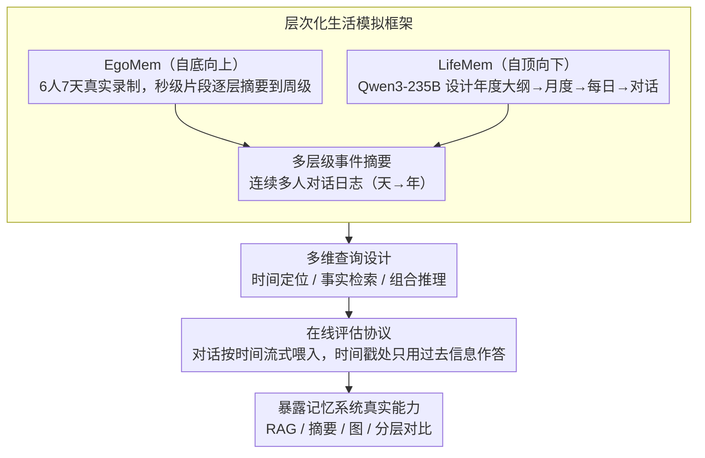

# Evaluating Memory Capability in Continuous Lifelog Scenario

**会议**: ACL 2026 Findings  
**arXiv**: [2604.11182](https://arxiv.org/abs/2604.11182)  
**代码**: [https://github.com/RayNeo-AI-2025/LifeDialBench](https://github.com/RayNeo-AI-2025/LifeDialBench)  
**领域**: LLM评测  
**关键词**: 生活日志记忆、在线评估、可穿戴设备、RAG基线、长期对话

## 一句话总结
本文提出LifeDialBench，一个评估连续生活日志场景下记忆能力的基准（含7天真实数据的EgoMem和1年模拟的LifeMem），引入在线评估协议确保时间因果性，反直觉地发现简单RAG基线一致优于复杂记忆系统。

## 研究背景与动机

**领域现状**：可穿戴设备（如智能眼镜Ray-Ban Meta、小米AI眼镜等）已能实现麦克风常开，持续录制环境对话，创造了巨大的记忆系统应用机会。LLM记忆系统通常包含记忆管理器、摘要代理和检索器。

**现有痛点**：现有记忆基准主要聚焦在线一对一聊天或人-AI交互，忽略了连续生活日志的独特需求——多人交互、随意且时序性的事件线、模拟社交网络。更关键的是，传统离线评估协议存在"时间泄漏"——允许系统在回答任何问题之前访问完整数据集，系统性高估真实世界性能。

**核心矛盾**：现有复杂记忆系统（如基于图的、分层的）引入了有损压缩（摘要、实体抽取等），这些压缩可能丢失在生活日志场景中至关重要的细节信息。但由于缺乏严格的在线评估协议，这种信息损失被离线评估的时间泄漏所掩盖。

**本文目标**：(1) 构建符合连续生活日志特征的记忆评估基准；(2) 提出遵循时间因果性的在线评估协议；(3) 揭示现有记忆系统的真实能力。

**切入角度**：利用EgoLife真实第一人称视频数据集（6人7天录制）构建真实场景数据，同时用LLM模拟1年生活来扩展时间跨度。引入严格的在线评估——信息按时间线性流入，系统只能用"当前时间点之前"的信息回答。

**核心 idea**：在严格时间因果约束下评估记忆系统，揭示了一个反直觉发现——简单的RAG基线优于所有复杂的专用记忆系统，因为原始文本保存比有损压缩更重要。

## 方法详解

### 整体框架

LifeDialBench 要解决的问题是：在"麦克风常开、对话持续流入"的可穿戴场景下，记忆系统到底记得住多少。为此它把数据、查询、评估三件事打通——先用两个互补子集（EgoMem 取自真实第一人称录制、LifeMem 由 LLM 模拟）造出从天到年的连续多人对话日志，再从这些日志的多层级事件摘要中派生出覆盖不同时间粒度的 QA 对，最后用一套强制时间因果的在线协议把对话流式喂给系统、在沿途的时间戳处发问。整条流水线的关键不在数据量，而在于评估时不让系统"看到未来"，从而把记忆系统的真实能力暴露出来。

### 关键设计

**1. 层次化生活模拟框架：用两种相反的构造方向兼顾真实性与时间跨度。** 

连续生活日志的难点在于既要真实又要够长，单一来源很难同时满足。EgoMem 走自底向上路线，把 EgoLife 的 6 人 7 天真实录制从秒级视频片段逐层摘要到分钟、小时、天、周级，保证每个事件都有真实接地；LifeMem 走自顶向下路线，先让 Qwen3-235B-Instruct 设计年度大纲，再展开为月度计划、每日事件直至具体对话，把时间跨度拉到一整年并覆盖多人社交网络。7 天的真实样本已足够验证概念，1 年的模拟样本补足了长期记忆和场景多样性，两者拼起来才构成一个既可信又有挑战的记忆战场。

**2. 多维查询设计：用三类查询探测不同粒度的记忆能力。** 

生活日志里的提问远不止"发生了什么"这种事实检索。本文从多层级事件摘要出发生成三类 QA：时间定位（确定事件何时发生）、事实检索（回忆具体细节）、组合推理（跨事件关联与推断）。三类查询天然落在不同时间粒度上，既覆盖单点回忆也覆盖跨事件的时间推理，从而能区分出"细节记得住"与"时间对得上"这两种被以往基准混为一谈的能力——实验也正是借此发现"何时发生"是所有方法的通用瓶颈。

**3. 在线评估协议：用严格的时间线性消除"时间泄漏"。** 

传统离线评估默认系统在答任何一题前已读完整份数据集，这等于给了它"上帝视角"——回答 2 月的问题时可以偷看 12 月才发生的事，从而系统性高估真实性能。本文要求系统从空状态出发，按时间顺序逐步接收对话；每到一个带查询时间戳的评估点，系统只能用该时刻之前已存储的信息作答，信息增量更新、评估在存储过程中间歇穿插。这把"在持续数据流里维持并检索记忆"这一真实部署条件如实复现，也正是后续反直觉结论得以成立的前提。

> 评测对象为四类代表性记忆系统：简单 RAG 基线、摘要压缩方法、图结构方法与分层记忆方法；本文不涉及任何模型训练。

## 实验关键数据

### 主实验

| 记忆系统 | EgoMem | LifeMem | 说明 |
|---------|--------|---------|------|
| Simple RAG | **最高** | **最高** | 简单检索原始文本 |
| 摘要压缩方法 | 低于RAG | 低于RAG | 有损压缩丢失细节 |
| 图结构方法 | 低于RAG | 低于RAG | 过度设计反而有害 |
| 分层记忆方法 | 低于RAG | 低于RAG | 结构复杂但效果不佳 |

### 消融实验

| 评估方式 | 效果差异 | 说明 |
|---------|---------|------|
| 在线评估 | 所有系统分数下降 | 消除时间泄漏后性能降低 |
| 离线评估 | 普遍偏高 | 存在时间泄漏 |
| 在线vs离线排序变化 | 存在排序反转 | 离线评估可能误判系统优劣 |

### 关键发现
- 反直觉结论：简单RAG基线一致优于所有复杂记忆系统，包括先进的图结构和分层方法
- 有损压缩（摘要、实体抽取）在生活日志场景中弊大于利——细节信息的保持比结构化抽象更重要
- 时间检索是所有方法的通用瓶颈——"何时发生"的问题比"发生了什么"更难回答
- 在线评估揭示了离线评估掩盖的真实能力差距——某些在离线测试中表现良好的系统在在线测试中显著退化
- 当前记忆系统的设计方向可能存在根本性误判——高保真上下文保持比智能压缩更重要

## 亮点与洞察
- **在线评估协议的重要性**：揭示了离线评估中的时间泄漏问题，这对所有时序相关的AI评估都有广泛启发。许多NLP基准可能也存在类似的信息泄漏问题。
- **简单即有效的反直觉发现**：精心设计的复杂记忆系统反不如简单RAG，说明在数据保真度和结构化抽象之间，前者在当前阶段更重要。
- **可穿戴设备场景的前瞻性**：随着智能眼镜等设备的普及，连续生活日志将成为重要的AI应用场景，本基准为此方向提供了评估基础设施。

## 局限与展望
- LifeMem的对话由LLM合成，可能不完全反映真实对话的随机性和混乱性
- EgoMem仅覆盖7天6人，时间和人群多样性有限
- 简单RAG在数据量极大时（如数年的日志）可能面临检索效率问题
- 未评估多模态记忆（如结合视觉信息的记忆）

## 相关工作与启发
- **vs LoCoMo**：聚焦人-人对话但非连续记录、无在线评估。LifeDialBench更贴近真实场景
- **vs LongMemEval**：人-AI交互场景，高达50K会话但缺乏多人和连续特性
- **vs MemBank**：10天人-AI交互，规模小且场景单一。LifeDialBench覆盖1年多人场景

## 评分
- 新颖性: ⭐⭐⭐⭐⭐ 在线评估协议和反直觉发现都是重要贡献
- 实验充分度: ⭐⭐⭐⭐ 多个记忆系统、两个子集、在线/离线对比
- 写作质量: ⭐⭐⭐⭐ 问题定义清晰，反直觉发现的讨论深入
- 价值: ⭐⭐⭐⭐⭐ 指出了当前记忆系统的根本性设计问题，有广泛影响

<!-- RELATED:START -->

## 相关论文

- [\[ACL 2026\] StratMem-Bench: Evaluating Strategic Memory Use in Virtual Character Conversation Beyond Factual Recall](stratmem-bench_evaluating_strategic_memory_use_in_virtual_character_conversation.md)
- [\[ACL 2026\] Exploring the Capability Boundaries of LLMs in Mastering of Chinese Chouxiang Language](exploring_the_capability_boundaries_of_llms_in_mastering_of_chinese_chouxiang_la.md)
- [\[ACL 2026\] SCAN: Structured Capability Assessment and Navigation for LLMs](scan_structured_capability_assessment_and_navigation_for_llms.md)
- [\[NeurIPS 2025\] MEMTRACK: Evaluating Long-Term Memory and State Tracking in Multi-Platform Dynamic Agent Environments](../../NeurIPS2025/llm_evaluation/memtrack_evaluating_long-term_memory_and_state_tracking_in_multi-platform_dynami.md)
- [\[ACL 2026\] HoWToBench: Holistic Evaluation for LLM's Capability in Human-level Writing using Tree of Writing](howtobench_holistic_evaluation_for_llms_capability_in_human-level_writing_using_.md)

<!-- RELATED:END -->
