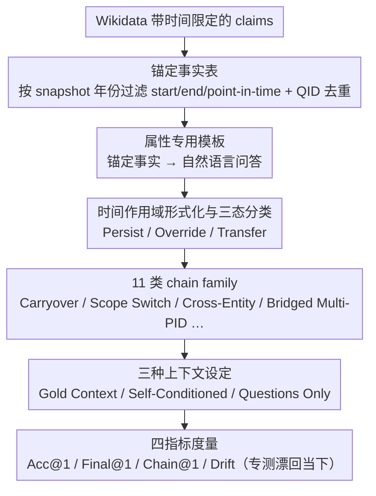

# Evaluating Temporal Consistency in Multi-Turn Language Models

**会议**: ACL 2026  
**arXiv**: [2604.23051](https://arxiv.org/abs/2604.23051)  
**代码**: <https://github.com/yashkumaratri/ChronoScope>  
**领域**: LLM 评测 / 时序推理 / 多轮对话  
**关键词**: 时序一致性、多轮问答、ChronoScope、Wikidata、present-day bias

## 一句话总结
本文提出 ChronoScope，一个基于 Wikidata 自动合成的 146 万条多轮问答 chain 评测集，专门用来测 LLM 能否在多轮交互中"维持先前对话隐含的时间作用域"，发现包括 GPT-4 / Gemini-2.5 在内的强模型都会系统性地"漂移到现在"（present-day drift），且交互越长越严重，即便给 oracle 上文也无法消除。

## 研究背景与动机

**领域现状**：单轮时序问答（TempQuestions、TimeQA、TimeR1、PAT-Questions 等）已经被研究得很多，但都是"每一题都显式给时间"——模型只要在 prompt 里看到 "in 2010" 这样的标记就能正确召回。而真实多轮对话里，用户只会在第一轮设一次时间框架，后续 follow-up 默认沿用，不会反复重复年份。

**现有痛点**：LLM 在这种"隐式时间继承"场景下表现极不稳定。表面上模型有正确的事实知识（单轮能答对 2010 年的英国首相），但一旦上下文要求把 2010 这个 scope 隐式带到下一句（"那么他主导了哪些政策？"），模型却经常切换到 2024 的现任答案。这种"事实正确但时间错配"的失败模式，没有任何已有 benchmark 在系统量化。

**核心矛盾**：单轮事实准确性 ≠ 多轮时序一致性。模型的参数没有变，知识库没有变，但跨轮 inference 时它对 query 的解释会漂移。这暴露的是 inference-time 的上下文绑定失败，而不是 knowledge gap。

**本文目标**：(i) 把"时间作用域稳定性 (temporal scope stability)"形式化为可测量的多轮属性；(ii) 构造一个能在受控条件下隔离这一失败模式的 benchmark；(iii) 系统量化 SOTA 模型在 implicit carryover / explicit switch / cross-entity transfer / 长轨迹四类时序模式下的失败率。

**切入角度**：作者借鉴语言学经典的 Reichenbach (1947)「speech time / event time / reference time」框架与 Discourse Representation Theory，把"时间作用域"视作一个跨轮维护的隐式 discourse 状态变量，可被显式覆盖、隐式继承或转移到相关实体。

**核心 idea**：用 Wikidata 知识图谱里带时间限定的事实 + 确定性模板生成 146 万条 chain，每条 chain 显式标注它属于哪种 scope 转移模式（11 种 chain family），并在三种上下文设定下评测，让"present-day bias"成为一个能被独立测量的 metric（Drift）。

## 方法详解

### 整体框架

ChronoScope 想隔离的失败是"事实知道、时间错配"：用户只在第一轮设一次时间框架，模型却在后续轮把作用域悄悄漂回当下。为此本文搭了一条全确定性、无人写无 LLM 生成的两阶段流水线——先构造锚定事实表（对每个 snapshot 年份和锚定日期，从 Wikidata claims 中按 start/end/point-in-time 过滤出该锚点有效的事实并用 QID 去重），再用属性专用模板把锚定事实变成自然语言问答、按 11 种 chain family 组合成多轮 chain。评测端把同一批 chain 放进三种上下文设定下跑模型，并用 Acc@1 / Final@1 / Chain@1 / Drift 四个指标度量，其中 Drift 专门捕捉"漂回现在"这一现象，让 present-day bias 成为一个可独立测量的量。

### 关键设计

**1. 时间作用域的形式化与三态分类：把"隐式上下文继承"变成可评分的离散状态。** 

"模型有没有维持住时间"原本是个模糊概念，本文先把它形式化。一条 chain 记为 $\{(q_1,a_1),\dots,(q_L,a_L)\}$，第一轮显式给出 anchor year（如 "In 2010"），此后每轮的时间作用域只能取三种演化：Persist（继承）、Override（被新时间覆盖）、Transfer（迁移到相关实体但保留时间）。每条 chain 被标注为 11 个 family 之一，且每 family 的 "Avg Scope Shift" 与 "Implicit Turns %" 都被定量给出。以往多轮 QA（HotpotQA / CoQA / Parrot）默认事实跨轮稳定，无法说清失败到底出在哪一步；显式区分 scope 状态后，evaluation 才能精确归因——是没继承时间、没切换、还是没跨实体迁移。

**2. 11 类 chain family：用最小但完整的模板集合覆盖整个时序模式空间。** 

单一模板容易被模型过拟合，本文用 11 类 chain 把失败模式逐一探出来：Carryover / Carryover-Then 测最基础的隐式继承，Scope Switch 测显式覆盖，Cross-Entity Then 测时间不变而实体切换，Multi-Turn Chain（3–6 轮）测长程稳定性，Change Point 测多轮隐式后突然显式切换，Interval Reasoning / Interval Change / Distinct Count 测区间型时序，Temporal Narrative 模拟编年史，Bridged Multi-PID 测多属性叠固定时间。各类的链长、scope shift 次数、时间跨度都不同，既能做压力测试又能做归因——比如 Bridged Multi-PID 失败率最高，就直接指向模型在多 hop 加时间约束下表现最差。

**3. 三种上下文设定 + Drift 指标：把"知识缺失"和"时序漂移"两类失败彻底解耦。** 

答错可能是不知道，也可能是知道却选错了时间，二者必须分开。本文设三种上下文：Gold Context 每轮注入金标答案以消除单轮事实错误，Self-Conditioned 用模型自己上一轮的预测作上下文以叠加错误传播，Questions Only 完全无上下文作最严苛档。在此之上，Drift 指标专测"答错且答的是 present-day（2025）的正确事实"——这种错误无法用"模型不知道"解释，只能归于 inference-time 的 scope 切换失败。于是若模型在 Gold Context 下 Drift 仍高，就证明问题不在错误累积、而在模型本身维持不住隐式时间状态，这正是全文最有诊断力的实验设计。

> 本文不训练任何模型，所有评测在 zero-shot 下进行；prompting / decoding / sampling / matching 细节统一见 Appendix A.2.1。Acc@1 / Final@1 / Chain@1 越大越好，Drift 越小越好。

## 实验关键数据

### 主实验

| 模型 | Gold Acc@1 | Gold Final@1 | Gold Drift | Self Final@1 | Self Drift |
|------|------------|--------------|------------|--------------|------------|
| ChatGPT-4 | 0.441 | 0.516 | 0.163 | 0.353 | 0.215 |
| Gemini-2.5-Flash | 0.384 | 0.446 | 0.197 | 0.264 | 0.254 |
| ChatGPT-3.5 | 0.323 | 0.384 | 0.226 | 0.226 | 0.284 |
| Qwen-2.5-7B | 0.306 | 0.387 | 0.042 | 0.286 | 0.007 |
| Qwen-3-4B | 0.292 | 0.382 | 0.066 | 0.130 | 0.013 |
| DeepSeek-V3 | 0.247 | 0.276 | 0.081 | 0.291 | 0.008 |
| LLaMA-3.1-8B | 0.253 | 0.306 | 0.022 | 0.249 | 0.008 |

最强的 GPT-4 在 Gold Context 下 Final@1 仅 0.516，且 Drift 高达 0.163；Gemini-2.5-Flash Drift 接近 0.20。商用大模型整体表现更强但 Drift 更高，说明 RLHF 训练让它们更倾向于"用最新事实回答"。

### 消融实验（基于 Table 2 chain family 结构 + Table 3 三种 setting）

| 配置 / 失败模式 | 表现 | 关键观察 |
|----------------|------|----------|
| Gold Context (oracle 上文) | GPT-4 Final@1=0.516, Drift=0.163 | 即使给金标上文，模型仍系统性漂移 |
| Self-Conditioned (模型上文) | Final@1 普遍掉 0.1-0.2 | 错误传播放大 scope 漂移 |
| Questions Only (无上文) | Acc@1 全线 < 0.2 | 失去 context 后模型几乎完全切到 present-day |
| 开源 vs 商用 | Drift: Qwen/LLaMA < 0.05, GPT-4/Gemini > 0.15 | 越强的模型 present-day bias 越严重 |
| 长链 (Multi-Turn / Temporal Narrative) | Final@1 单调下降 | 交互越长，漂移越严重 |

### 关键发现
- **能力越强 Drift 越严重的反直觉规律**：开源中小模型（Qwen 7B / LLaMA 8B）Drift 普遍 < 0.05，而 GPT-4 / Gemini-2.5 的 Drift > 0.15-0.20。作者推测大模型经历了更激进的 RLHF "always be helpful and current" 训练，导致它们偏好用 2024 数据回答。
- **Oracle 上文消不掉漂移**：Gold Context 已经把上一轮答案以 ground-truth 形式注入，但 Drift 依然在 0.04-0.23 之间。这是本文最重要的诊断结论——证明这不是 retrieval / memory 问题，而是 inference 阶段 scope 绑定能力的缺陷。
- **链长 vs 漂移单调**：从 2 轮到 11 轮 chain，Final@1 持续下降，说明问题不会因为模型"消化更多上文"而缓解，反而被放大。
- **Chain@1 极低（普遍 < 0.10）**：要求一整条 chain 全对的指标几乎全军覆没，说明 LLM 的多轮一致性还有数量级的提升空间。

## 亮点与洞察
- **把 present-day bias 与 hallucination 解耦**：以往很多研究把"答错最新事实"归为幻觉，但 ChronoScope 通过 Drift 指标证明这不是"不知道"，而是"知道但选错了时间"。这一区分对后续 mitigation 设计意义重大——要修的是 inference-time scope binding，而不是知识更新。
- **完全确定性 + 1.46M 规模**：所有问答都来自 Wikidata + 固定模板，无人写、无 LLM 生成，意味着完美可复现 + 无标注成本 + 可扩展到任意新 snapshot。这是"用知识图谱替代人工标注"的优雅工程实践。
- **借用 Reichenbach 三时（speech/event/reference）框架**给 LLM 评测，是一种把"半个世纪前的语言学理论"重新激活的 nice move，提示 NLP 圈应该多回头读 discourse 理论而非反复发明轮子。

## 局限与展望
- 评测只覆盖事实型 QA，没有触及"观点 / 计划"等会随时间变化的非事实信息——这类信息的 scope binding 可能完全不同。
- Drift 指标依赖能找到对应的 present-day 答案，对没有 2025 对应事实的属性（如"已死亡人物的现任职业"）天然没法测。
- 没有提供 mitigation——作者只指出问题不给解决方案。后续工作可以试试在 prompt 里显式注入 "today is 2010"，或在 RLHF 阶段加 temporal-anchored preference data。
- 11 类 chain family 是手工设计，可能仍漏掉某些真实对话中的 scope 演化模式（如否定时间 "before 2010 but not in 2009"）。

## 相关工作与启发
- **vs TimeQA / TimeR1 / PAT-Questions**：那些都是单轮、每轮显式给时间；ChronoScope 让时间作用域成为隐式跨轮状态变量，捕捉到完全不同的失败模式。
- **vs Laban et al. (2025) / Parrot / MTSA**：相关多轮 follow-up 评测多关注 underspecified query；本文聚焦时间这一具体 scope 维度，更可控、更可诊断。
- **vs continual learning 视角**：作者把"temporal scope stability"类比为 inference-time 版的"continual knowledge retention"——continual learning 是参数级别绑定旧知识，本文是 inference 级别绑定上下文时间，这一类比为 mitigation 方法迁移提供了桥梁。

## 评分
- 新颖性: ⭐⭐⭐⭐⭐ 第一个把"隐式时间作用域稳定性"作为独立测量目标的多轮评测集
- 实验充分度: ⭐⭐⭐⭐ 9 个 SOTA 模型 × 3 setting × 11 chain family，但只评 zero-shot，缺少 few-shot / CoT 对比
- 写作质量: ⭐⭐⭐⭐⭐ 概念清晰、动机层层递进、Drift 指标的设计读完即懂
- 价值: ⭐⭐⭐⭐⭐ 1.46M 自动生成 + 完全可复现 + 暴露强模型新失败模式，会被广泛引用

<!-- RELATED:START -->

## 相关论文

- [\[ACL 2026\] Beyond Itinerary Planning: A Real-World Benchmark for Multi-Turn and Tool-Using Travel Tasks](beyond_itinerary_planning-a_real-world_benchmark_for_multi-turn_and_tool-using_t.md)
- [\[ACL 2026\] Modeling Multi-Dimensional Cognitive States in Large Language Models under Cognitive Crowding](modeling_multi-dimensional_cognitive_states_in_large_language_models_under_cogni.md)
- [\[ACL 2026\] ReTraceQA: Evaluating Reasoning Traces of Small Language Models in Commonsense Question Answering](retraceqa_evaluating_reasoning_traces_of_small_language_models_in_commonsense_qu.md)
- [\[ICML 2025\] Consistency in Language Models: Current Landscape, Challenges, and Future Directions](../../ICML2025/llm_evaluation/consistency_in_language_models_current_landscape_challenges_and_future_direction.md)
- [\[ACL 2026\] NovBench: Evaluating Large Language Models on Academic Paper Novelty Assessment](novbench_evaluating_large_language_models_on_academic_paper_novelty_assessment.md)

<!-- RELATED:END -->
