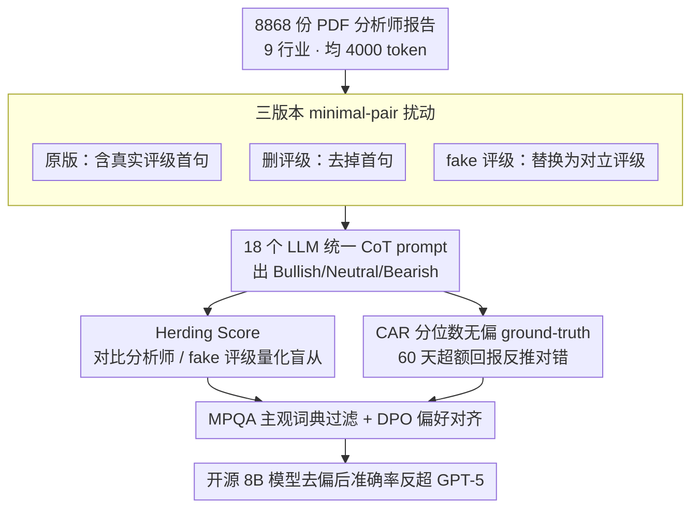

# Fin-Bias: Comprehensive Evaluation for LLM Decision-Making under human bias in Finance Domain

**会议**: ACL 2026  
**arXiv**: [2605.09106](https://arxiv.org/abs/2605.09106)  
**代码**: https://github.com/Xiaoyu1216/Fin-Bias.git (有)  
**领域**: LLM 评测 / 金融决策 / 行为偏差  
**关键词**: Herding、分析师报告、投资评级、MPQA Lexicon、DPO

## 一句话总结
Fin-Bias 用 8868 份长篇分析师报告构造了一个"原始 / 去掉评级 / 替换为假评级"三版输入的对照基准，证明 18 个 LLM（含 GPT-5、Claude-4-Sonnet）在金融投资评级时严重"羊群" — 即使是无中生有的 fake rating 也会被 30% 的样本盲从，而用 MPQA 主观词典过滤上下文里的人类观点 + DPO 微调可以把开源 8B 模型反推到比 GPT-5 还准的水准。

## 研究背景与动机
**领域现状**：金融场景下的 LLM agent（如 FinMem、FinCon、TradingAgents）大量依赖分析师报告 / 新闻 / 推文等带人类观点的文本做交易决策。现有 finance benchmark（FinQA、ConvFinQA、FiQA-SA、INVESTORBENCH 等）要么只考短上下文，要么不显式注入人类偏见，要么只覆盖少数明星股。

**现有痛点**：分析师存在系统性"过度乐观"偏差（本文样本 72.28% 给 Bullish，0.29% Bearish），而当前 LLM 决策框架几乎从不评估 "模型是不是会盲从这种系统性偏见"，更别说在 "假评级反向操作" 的极端情形下能否守住自己的判断。

**核心矛盾**：(1) 真实金融决策需要 LLM 在大量带主观观点的长文本里独立思考，(2) 但 LLM 倾向于把上下文中显式的人类判断当作 "soft label" 学过去；这种 herding 在多数人错的时候会让 LLM 一起错，而金融市场上 "多数人错" 并不罕见。

**本文目标**：(1) 量化 18 个主流 LLM 在金融决策上对分析师评级的依赖程度；(2) 测试它们能否抵抗反向 "fake rating"；(3) 评估 LLM 投资能力相对真实分析师的差距；(4) 给出缓解 herding 的可行方案。

**切入角度**：构造同一份报告的三个 minimal pair 变体 — 原版（含真实评级第一句）/ 去掉第一句 / 替换为相反的 fake 评级 — 然后用同一个 chain-of-thought prompt 让模型出 Bullish/Neutral/Bearish 评级，比较三个版本的差异就能精确分离 "human bias 信号的边际影响"。

**核心 idea**：把 "herding 倾向" 当作可测量的 score（model 评级和 human 评级一致率），并用三类 ground-truth：(a) 真分析师评级、(b) fake 评级、(c) 60 天 Cumulative Abnormal Return (CAR) 分位数反推的 "真正" 投资评级。

## 方法详解

### 整体框架
Fin-Bias 把"LLM 在金融决策里会不会盲从人类观点"做成一条可量化的对照实验链：先从 Yahoo Finance 抓取 8868 份覆盖 9 个行业、平均 4000 token 的 PDF 分析师报告，再对每份报告做一句话级别的扰动，造出"原版（含真实评级首句）/ 删掉评级首句 / 替换为对立 fake 评级"三个 minimal pair；随后用统一的 CoT prompt 让 18 个模型在三个版本上各出一次 Bullish/Neutral/Bearish 评级，分别和分析师评级、fake 评级、60 天 CAR 分位数三类 ground-truth 比对，量出 herding 程度；最后用 MPQA 主观词典过滤 + DPO 偏好优化两步给开源模型"去偏"。

### 关键设计

**1. 三版本 minimal-pair 扰动 + Herding Score：用一句话的因果操纵分离"模型独立判断"和"模型抄分析师"**

仅看准确率分不清模型是自己判对还是抄分析师抄对。本文在同一份报告上只改第一句，构造出原版 / 删评级 / 替换为对立 fake 评级三个 minimal pair，并定义羊群度 $\text{Herding Score} = \frac{1}{N} \sum_{i=1}^N \mathbb{I}(m_i, a_i)$，其中 $m_i$ 是模型评级、$a_i$ 是 analyst 或 fake 评级。当 $a_i$ 是真实评级时，高分还能解释成"合理的同向判断"；可一旦 $a_i$ 换成与后文分析逻辑互相矛盾的 fake 评级，高分就是赤裸裸的盲从。三版输入配两类 herding score，干净地把"信号 vs 噪声"剥开。

**2. CAR 分位数构造无偏 ground-truth：用市场真实回报反推对错，绕开分析师自身的系统性偏差**

直接拿分析师评级当 ground-truth 会陷入循环论证——本文样本里分析师 72.28% 看多。于是改用 risk-adjusted abnormal return：先用市场模型 $R_{i,t} = \alpha_i + \beta_i R_{m,t} + \varepsilon_{i,t}$ 做 OLS 估出 $\hat{\alpha}_i, \hat{\beta}_i$，再对每份报告发布日起 60 个交易日累计 $CAR = \sum \hat{\alpha}_i = \sum(\bar{R}_i - \hat{\beta}_i \bar{R}_m)$，最后按年度对所有 CAR 排序，前 30% 标 Bullish、后 30% 标 Bearish、中间 40% 标 Neutral。相比 daily return 阈值（>1% 算 bullish）那种任意又忽略 firm-specific 风险的做法，CAR 是金融文献里超额回报的标准量度，年度分位又避免了行情漂移干扰，最终 30/30/40 的标签分布远比分析师的 72.28/24.74/0.29 平衡。

**3. MPQA 主观词典过滤 + DPO 偏好对齐：先在 prompt 层剥掉主观观点，再在模型层内化"健康怀疑"**

只删评级首句是表面功夫，剩余报告仍布满隐式主观判断。本文先用 MPQA Subjectivity Lexicon 标出 `strongsubj` 词项，把含这类词的整句从报告里整体剔除，相当于在输入侧逐层"剥洋葱"；再做 DPO，把每份带偏见报告 $x$ 配上一对 reasoning——$y_w$ 是用市场真值倒推的"独立推理"、$y_l$ 是顺着 analyst 视角生成的"跟随推理"，优化 $\max \log \frac{\pi(y_w|x)}{\pi(y_l|x)}$。词典过滤治标、DPO 治本，后者把"独立思考"显式定义成模型可学习的偏好行为，让它对 high-consensus 人类信号保持怀疑。

### 损失函数 / 训练策略
评测部分全程零样本 CoT prompt，不更新参数。DPO 微调只针对开源模型（Qwen3-8B、Qwen2.5-7B-It、Meta-Llama-3-8B-It），目标函数：

$$\mathcal{L}_{\text{DPO}} = -\log \sigma\left(\beta \log \frac{\pi(y_w|x)}{\pi_{\text{ref}}(y_w|x)} - \beta \log \frac{\pi(y_l|x)}{\pi_{\text{ref}}(y_l|x)}\right)$$

注：用 inline 形式 $\beta$ 控制 reference policy 偏离强度，依标准 DPO 实现。

## 实验关键数据

### 主实验
18 个 LLM 在 9 行业的 Herding Score（with / without analyst rating）和准确率（vs 33% 分析师 baseline）：

| 模型 | Herd vs analyst (with/without rating) | Herd vs fake rating | 准确率 (with/without rating) | MPQA 过滤后准确率 |
|------|---------------------------------------|---------------------|-------------------------------|-------------------|
| GPT-5 | 94.6 / 87.4 | 33.5 | 33.0 / 33.6 | 34.16 |
| GPT-4 | 95.9 / 89.5 | 48.8 | 33.0 / 33.9 | 35.88 |
| Claude-4-Sonnet | 90.6 / 79.5 | 35.9 | 33.0 / 33.8 | 35.70 |
| Mistral-7B-It-v0.3 | 96.4 / 78.8 | **60.4** | 33.1 / 34.1 | **35.99** |
| Qwen3-8B | 98.3 / 84.4 | 36.9 | 33.1 / 34.2 | **36.49** |
| DeepSeek-V2-Lite-Chat | 78.0 / 57.3 | **55.9** | 33.9 / 34.6 | 35.30 |
| Yi-1.5-9B-Chat-16K | 83.4 / 69.7 | 32.8 | 34.5 / 28.7 | **37.67** |
| 分析师 baseline | — | — | 33.08 | — |

关键事实：(1) 加分析师评级后所有模型 Herding Score 平均涨 5-10 个点，几乎都飙到 90%+；(2) **fake rating 平均 30% 的样本盲从**，连 GPT-5 都有 33.5%；(3) 准确率在三种条件下几乎都贴着分析师 33% 浮动 — 没有任何条件下模型大幅超越分析师。

### 消融实验
MPQA 过滤 + DPO 微调对开源模型的提升（准确率，9 行业平均）：

| 模型 | 仅删第一句 | + MPQA 过滤 | + MPQA + DPO | 相对分析师 |
|------|------------|--------------|---------------|------------|
| Qwen3-8B | 34.2 | 36.49 | **38.23** | **+5.15** |
| Meta-Llama-3-8B-It | 27.5 | 34.91 | **37.09** | **+4.01** |
| Qwen2-7B-It | 27.1 | 33.82 | **35.15** | +2.07 |
| 分析师 | 33.08 | — | — | — |
| GPT-5 (无 DPO) | 33.6 | 34.16 | — | +1.08 |

### 关键发现
- **Herding 与模型大小无关** — GPT-5 同样会盲从 fake rating（33.5%），开源 Mistral-7B 反而最严重（60.4%），说明这不是"小模型才会犯的错"。
- 删第一句这种简单操纵下，开源模型表现两极分化：Gemma/Llama/Yi 这种模型掉 6 个点，但 Mistral/Qwen3/DeepSeek 反而涨 1 点 — 说明部分开源模型确实有独立推理能力，只是被分析师信号"压抑"了。
- **MPQA + DPO 的双 buff** 让 Qwen3-8B 这种 8B 小模型在 9 行业平均准确率达到 38.23%，超过 GPT-5 (33.0%) 和分析师 (33.08%)，证明 "去偏 + 偏好对齐" 是一条对开源模型特别划算的路径。
- Industry-level 趋势一致：Real Estate / Healthcare 等模型整体表现差，可能因为这些行业受宏观因素干扰更大；Financial Services / Utilities 表现稳定。

## 亮点与洞察
- **三版扰动 + Herding Score** 是个非常干净的因果设计 — 几乎可以原样迁移到任何"上下文里塞了人类判断"的 LLM 评测场景（医疗诊断、法律建议、政策分析）。
- 用 60 天 CAR 分位数构造无偏 ground-truth 是这篇文章方法论上最扎实的一笔 — 直接打掉了 "用 analyst rating 当 ground-truth" 这种循环论证陷阱，给后续金融 LLM benchmark 立了标杆。
- DPO 用 "市场真值反推独立 reasoning vs analyst-style 跟随 reasoning" 来构造 preference pair 的思路非常巧妙 — 它把"独立思考"显式定义成了模型可学习的偏好行为，而不是空喊"鲁棒性"。
- 最反直觉的发现：MPQA 过滤后小开源模型反超 GPT-5 — 这暗示"模型独立思考能力"和"模型参数规模"是两条独立的轴，prompt/data engineering 比堆参数更划算。

## 局限与展望
- 只研究 single-agent decision，没碰多 agent 场景下的 herding（很多 trading agent 框架是多 agent 投票，herding 在 agent 之间也会传染）。
- 数据来源是分析师报告，不代表全市场投资者；Reddit/Twitter 类散户上下文里的 herding 模式可能完全不同。
- 只测金融 domain；这套 herding 量化框架在医疗/法律 LLM 上是否同样有效尚需验证。
- DPO 训练数据本身依赖 "市场真值倒推 reasoning"，假设市场短期定价是有效的 — 在极端行情下这个假设可能崩。
- 没分析 reasoning 模型（o1-style）在 herding 上是否表现更好 — 这是个值得加的对照。

## 相关工作与启发
- **vs INVESTORBENCH / Fintrade**: 都做 LLM 金融决策评测，但只在 ~20 只明星股上跑，且不显式注入人类偏见；Fin-Bias 横跨 9 行业 + 显式 herding 实验，覆盖度和因果性都更强。
- **vs ACL18 (Xu & Cohen)**: 用 tweets 做股票预测，但样本数受限；Fin-Bias 用 8868 份长报告 + 完整 ground-truth 构造，更接近真实 sell-side 研究场景。
- **vs DeLLMa (Liu 2025)**: 测 LLM 在不确定性下的决策，但只用历史价格；本工作用长篇文本上下文，更贴近 real-world investing。
- **vs TradingAgents (Xiao 2025)**: 提出多 agent trading 框架，但没量化 agent 之间的 herding；本工作的 herding score 可以作为它们的诊断工具。

## 评分
- 新颖性: ⭐⭐⭐⭐ Herding Score 这个度量 + 三版扰动 + fake rating 极端 case 的组合是金融 LLM benchmark 里少见的 clean 因果设计。
- 实验充分度: ⭐⭐⭐⭐ 18 模型 × 9 行业 × 3 扰动 × 多 ground-truth 体量惊人，DPO 部分还跑了 3 个开源模型对照。
- 写作质量: ⭐⭐⭐⭐ 数据来源、扰动方式、ground-truth 构造讲得很透，case study 和 prompt 模板都附录给了。
- 价值: ⭐⭐⭐⭐ 对所有把 LLM 用于 high-stakes 决策的人都是警钟 — 不仅证明问题存在，还给出缓解方案，GitHub 开源数据集会立刻被业界用起来。

<!-- RELATED:START -->

## 相关论文

- [\[ACL 2026\] Contrastive Decoding Mitigates Score Range Bias in LLM-as-a-Judge](contrastive_decoding_mitigates_score_range_bias_in_llm-as-a-judge.md)
- [\[ACL 2026\] Common to Whom? Regional Cultural Commonsense and LLM Bias in India](common_to_whom_regional_cultural_commonsense_and_llm_bias_in_india.md)
- [\[ICLR 2026\] BiasScope: Towards Automated Detection of Bias in LLM-as-a-Judge Evaluation](../../ICLR2026/llm_evaluation/biasscope_towards_automated_detection_of_bias_in_llm-as-a-judge_evaluation.md)
- [\[ACL 2026\] Stability vs. Manipulability: Evaluating Robustness Under Post-Decision Interaction in LLM Judges](stability_vs_manipulability_evaluating_robustness_under_post-decision_interactio.md)
- [\[ACL 2026\] When Vision-Language Models Judge Without Seeing: Exposing Informativeness Bias](when_vision-language_models_judge_without_seeing_exposing_informativeness_bias.md)

<!-- RELATED:END -->
