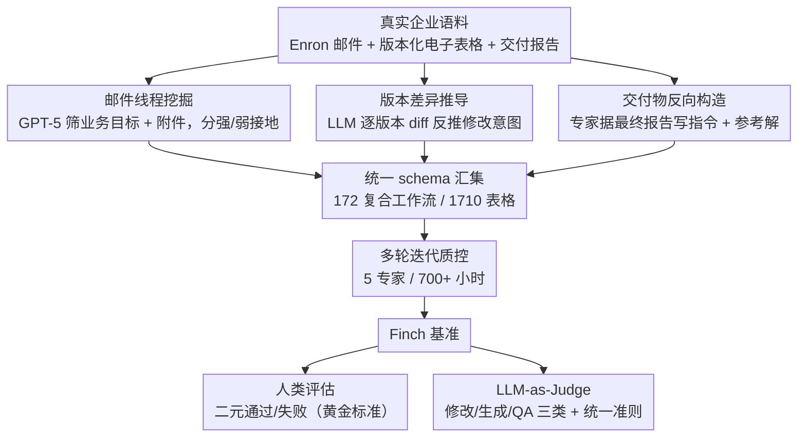

# Finch: Benchmarking Finance & Accounting across Spreadsheet-Centric Enterprise Workflows

**会议**: ACL 2026 Findings  
**arXiv**: [2512.13168](https://arxiv.org/abs/2512.13168)  
**代码**: [HuggingFace](https://huggingface.co/FinWorkBench)  
**领域**: LLM评测  
**关键词**: 金融会计, 电子表格, 企业工作流, Agent评估, 长时序任务

## 一句话总结

本文提出 Finch（FinWorkBench），一个从真实企业环境（Enron 数据集等）构建的金融会计工作流基准，包含 172 个复合工作流和 1,710 个电子表格（2700 万单元格），即使最强的 GPT 5.1 Pro 花费平均 16.8 分钟也仅通过 38.4% 的工作流，揭示了前沿 AI Agent 在真实企业场景中的严重不足。

## 研究背景与动机

**领域现状**：前沿 AI 系统（Claude、ChatGPT、Gemini、Copilot）正日益嵌入企业日常工作流。金融会计（F&A）是高风险、知识密集型领域，对每个组织都至关重要。AI 辅助工具在文档起草、数据探索、电子表格操作等方面影响日增。

**现有痛点**：(1) 真实 F&A 工作本质上是混乱的——工件跨异构电子表格、PDF 和其他文档互联，经历多版本协作编辑；(2) 电子表格包含复杂结构——跨表引用、不规则布局、合并单元格、隐式公式链、图表等；(3) 工作流是长时序的——需要多步推理，涵盖数据录入、编辑、检索、计算、建模、验证、报告生成等；(4) 现有基准通常使用干净的单表输入，无法反映真实复杂度。

**核心矛盾**：当今前沿 AI Agent 能否真正处理专业人员日常面对的混乱、长时序、知识密集的工作流？

**本文目标**：构建首个真正企业级的 F&A 工作流基准，从真实企业环境源头获取，保持原始的多模态复杂性。

**切入角度**：从 Enron 邮件语料库的协作线程和电子表格版本历史中挖掘真实工作流——"存在先于本质"。

**核心 idea**：工作流应从真实企业环境中观察后再形式化定义，而非人工设计。通过邮件线程提取、版本差异分析和专家标注三条路径构建基准。

## 方法详解

### 整体框架

Finch 信奉"存在先于本质"——工作流不该由人凭空设计，而应先从真实企业环境里观察、再形式化。它从 Enron 邮件语料和版本化电子表格出发，沿三条路径构建数据：邮件线程里自然描述的业务目标、连续版本差异中隐含的修改意图、以及最终交付报告反推的任务指令。三条路径产出的工作流被汇入统一 schema（自然语言指令 + 输入文件 + 参考解），再经 5 位专家、700+ 小时的多轮迭代质控，最终凝成 172 个复合工作流、1,710 个电子表格（2700 万单元格）的基准。评测分人机两层：人类评估给出黄金标准的二元通过/失败，LLM-as-Judge 则把修改 / 生成 / QA 三类任务自动判分以做规模化评测。评测对象既覆盖产品端 Agent（ChatGPT GPT 5.1 Pro、Claude Sonnet/Opus 4.5 思考模式），也覆盖 API 端模型（GPT 5.1、Gemini 3 Pro、Grok 4、Qwen 3 Max 等），并以 SpreadsheetBench 作为基线代码生成框架。

### 关键设计

**1. 从邮件线程挖掘工作流：把协作沟通当作工作流的"自然文档"**

真实 F&A 工作的目标和上下文往往散落在日常邮件里，而非显式的任务说明书。本文用 GPT-5 从 Enron 语料（15,000 文件 + 500,000 邮件）中筛出同时满足两个条件的协作消息——显式陈述业务目标、且引用一个或多个附件电子表格。当输入和参考工件都齐备时归为强接地（strongly grounded）案例，仅部分工件可用时归为弱接地（weakly grounded）案例并交专家补全缺口，从而把藏在沟通流里的真实意图固化成可评测的工作流。

**2. 从版本差异推导工作流：给电子表格的修改历史做"考古"**

许多工作流根本没在邮件里被描述，却清晰地写在文件一版版的演变里。本文收集版本化的工作簿族，用 LLM 逐对比较连续版本的差异（diff），推断出背后的数据变换与分析步骤及其详细描述，再交人类专家核验，确认这些差异构成有意义的工作流而非偶然改动。这条路径补上了邮件挖掘覆盖不到的隐式工作流，是 Finch 独有的数据来源。

**3. 从高质量交付物反向构造工作流：拿专家级成品倒推任务**

前两条路径都从"过程痕迹"里挖工作流，但企业里还沉淀着大量已完成的高质量成品。本文让领域专家以这些最终交付物为参考解，反向撰写贴合真实场景的工作流指令、并构造对应的输入文件——例如把投行的估值模型改造成财务建模任务、把世界银行报告改造成数据摘要与可视化任务、把加拿大政府的双语文件改造成翻译与一致性核查任务。此外还吸收 WideSearch、DABStep 等已有数据集的少量样本扩成多步工作流，进一步丰富任务类型覆盖。三条路径产出的工作流统一进同一 schema，再经多轮迭代质控（约 40% 工作流至少返修一轮、20+ 篇过三轮以上）保证质量。

**4. 人机两层评估框架：让混乱电子表格的对错可以被可靠判定**

电子表格不能简单逐单元格比对——等价公式、替代布局都可能是合理答案。本文搭了人机两层评估：人类专家逐工作流对照输入 / 参考 / 模型输出给出二元通过或失败，作为黄金标准；LLM-as-Judge 则把任务归为修改（modify）、生成（generate）、QA 三类，各用专门 prompt 但共享同一套评分准则自动判分。两层都统一关注完整性、数值与逻辑正确性、是否过度编辑以及格式可读性，既保证标准一致又让评测可扩展（自动评估与人类判断在 82%–90% 工作流上一致）。

## 实验关键数据

### 主实验

| 模型/Agent | 工作流通过率 |
|-----------|------------|
| GPT 5.1 Pro（人类评估） | 38.4% |
| Claude Opus 4.5 | 第二强但 <50% |
| Gemini 3 Pro | 显著低于 GPT 5.1 |
| GPT 5.1 Pro ≤2 tasks | 44.3% |
| GPT 5.1 Pro >2 tasks | 23.5% |
| GPT 5.1 Pro（含 PDF/图像） | 35.0% |

### 消融实验

| 复杂度维度 | 影响 |
|-----------|------|
| 任务组合性 | ≤2 task 44.3% → >2 task 23.5%，误差累积严重 |
| 多模态工件 | 含 PDF/图像时下降到 35.0% |
| 电子表格复杂度 | 中位数 15K 单元格，最大 370 万单元格 |
| 工具调用次数 | 中位数 16 次，范围 6-107 次 |
| 长时序依赖 | 跨表引用和隐式公式链导致频繁失败 |

### 关键发现

- 即使最强 Agent（GPT 5.1 Pro）在 700+ 小时专家标注的基准上也仅通过 38.4%
- 复合性是关键瓶颈——多任务工作流的通过率比单任务低近一半
- 混乱的电子表格结构（合并单元格、嵌套表头、不规则布局）频繁导致数据检索错误
- Agent 难以重建电子表格公式中编码的隐式业务逻辑
- LLM-as-Judge 与人类评估高度一致，提供了可扩展的评估方案

## 亮点与洞察

- "存在先于本质"的数据集构建哲学很有说服力——从真实企业邮件和版本历史中挖掘工作流，比人工设计更真实
- 92.4% 的工作流涉及多个电子表格、平均 8 个 sheet 的规模远超现有基准——这才是真实企业场景
- 38.4% 的通过率对行业是个清醒的提醒——AI 在企业 F&A 工作中还远未到"自动化"的程度
- 700+ 小时的标注投入和多轮质控保证了基准的高质量

## 局限与展望

- 以英语为主，未覆盖多语言企业场景
- Enron 数据虽然真实但年代较久（2000 年代），部分业务实践可能已过时
- 工作流评估的二元通过/失败可能对部分完成的高质量工作不公平
- 未覆盖实时协作和多 Agent 场景

## 相关工作与启发

- **vs SpreadsheetBench**: 后者设计为较小较干净的电子表格任务，Finch 扩展到大型混乱企业级工件
- **vs DABStep**: 后者聚焦数据分析步骤，Finch 覆盖端到端复合工作流
- **vs WideSearch**: 后者聚焦网络搜索任务，Finch 将其整合为更大工作流的组成部分

## 评分

- 新颖性: ⭐⭐⭐⭐⭐ 首个真实企业级 F&A 工作流基准，从邮件/版本历史挖掘工作流的方法论新颖
- 实验充分度: ⭐⭐⭐⭐⭐ 多个前沿模型/Agent、人类+自动评估、详细的复杂度分析
- 写作质量: ⭐⭐⭐⭐⭐ 数据集构建过程透明详尽，统计分析全面
- 价值: ⭐⭐⭐⭐⭐ 为企业 AI Agent 评估提供了急需的高质量真实基准

<!-- RELATED:START -->

## 相关论文

- [\[ACL 2026\] Fin-Bias: Comprehensive Evaluation for LLM Decision-Making under human bias in Finance Domain](fin-bias_comprehensive_evaluation_for_llm_decision-making_under_human_bias_in_fi.md)
- [\[ACL 2026\] AgentEval: DAG-Structured Step-Level Evaluation for Agentic Workflows with Error Propagation Tracking](agenteval_dag-structured_step-level_evaluation_for_agentic_workflows_with_error_.md)
- [\[ICCV 2025\] ForCenNet: Foreground-Centric Network for Document Image Rectification](../../ICCV2025/llm_evaluation/forcennet_foreground-centric_network_for_document_image_rectification.md)
- [\[ACL 2026\] AJ-Bench: Benchmarking Agent-as-a-Judge for Environment-Aware Evaluation](aj-bench_benchmarking_agent-as-a-judge_for_environment-aware_evaluation.md)
- [\[ACL 2026\] Personalized Benchmarking: Evaluating LLMs by Individual Preferences](personalized_benchmarking_evaluating_llms_by_individual_preferences.md)

<!-- RELATED:END -->
