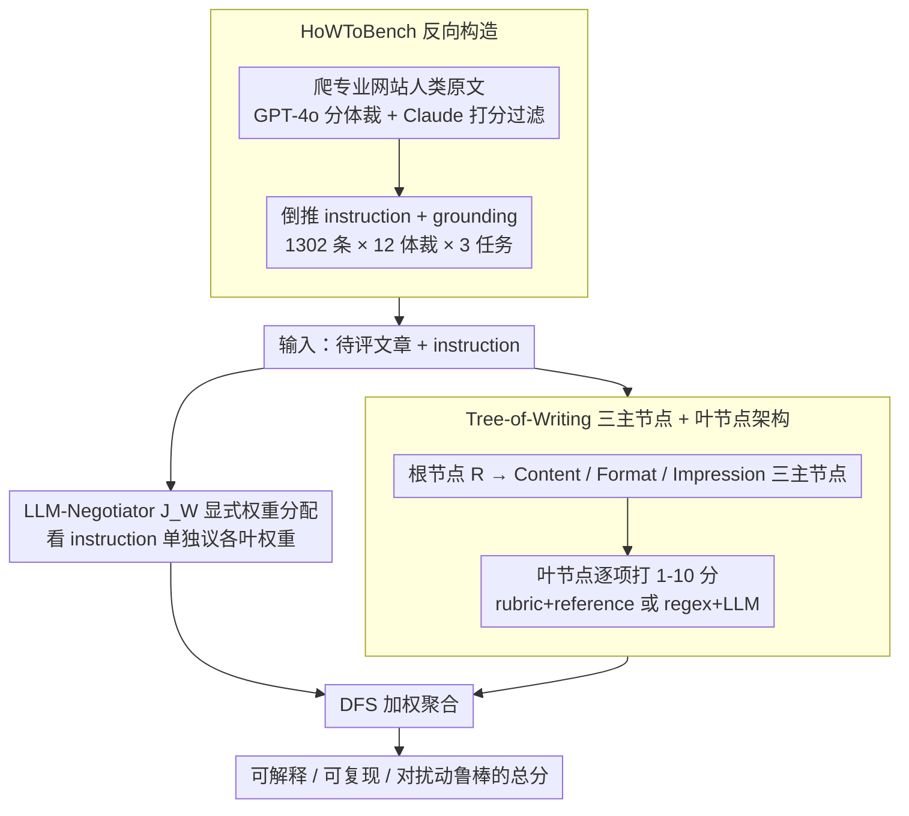

# HoWToBench: Holistic Evaluation for LLM's Capability in Human-level Writing using Tree of Writing

**会议**: ACL 2026  
**arXiv**: [2604.19071](https://arxiv.org/abs/2604.19071)  
**代码**: https://github.com/ZhuoerFeng/ACL2026-Tree-of-Writing (有)  
**领域**: LLM 评测 / 写作 / LLM-as-a-judge  
**关键词**: Tree-of-Writing, 写作评测, negotiation 偏差, 长度悖论, 鲁棒性

## 一句话总结
本文指出 LLM-as-a-judge 在长篇开放式写作上有 "negotiation inconsistency" —— 子分聚合不稳定且不可解释，提出 Tree-of-Writing (ToW) 把写作评测显式建模成"内容 / 格式 / 印象"三主节点 + 子叶节点 + 显式 LLM-negotiator 权重的树形流水线，在 1302 条中文 12 体裁的 HoWToBench 上把 system-level Pearson 相关性从 0.85-0.89 拉到 **0.93** 并对常见文本扰动鲁棒。

## 研究背景与动机

**领域现状**：LLM 写作评测要么用 BLEU/ROUGE 这种 reference-based overlap 指标（对千字开放式生成几乎没区分力），要么用 LLM-as-a-judge 范式让 GPT-4 给个总分（verbosity / position bias 严重），要么走 Auto-Plan 让 LLM 自己临场决定子维度 + 权重再打分（每次跑结果都不一样）。

**现有痛点**：作者把 LLM 临场聚合的不确定性命名为 **Negotiation Inconsistency** —— Auto-Plan 在 self-consistency N=5 下子分比例的轨迹波动 $\delta = 0.273, \sigma = 0.059$，这意味着同一篇文章跑 5 次 prompt 子分加权方式都会漂；同时长文本写作评价天然多维（语言 / 逻辑 / 情节 / 格式 / 段落），单纯平均显然不合理。

**核心矛盾**：人类专家评写作是显式的层级决策 —— 先按子准则打分再按文体加权聚合；但 LLM-as-a-judge 把这套流程隐式塞进一次 generation，导致权重决策与子分决策互相干扰、不可复现、不可解释。

**本文目标**：(1) 提出一种能减少 negotiation 偏差、可解释、对扰动鲁棒的写作评测框架；(2) 建立一个真正覆盖人类专业写作多体裁的大规模中文基准。

**切入角度**：把人类评分流程显式拆成"打子分"与"按指令规划权重"两个独立 LLM 调用 —— 子分由 expert agent 给（rubric + reference），权重由 negotiator $J_W$ 在看 instruction 后单独决定，再用 DFS 加权聚合。

**核心 idea**：用树形 + 显式权重把 LLM-as-a-judge 的"评估即一次 generation"拆解为"评估即可复现的图遍历"，从而把不可解释的黑盒变成可审计的工作流。

## 方法详解

### 整体框架
HoWToBench 这篇工作其实是两件事并行：一套评测框架 ToW 和一个配套基准。ToW 的核心思路是把人类专家评写作的隐式流程显式化——人类是先按子准则逐项打分、再按文体加权聚合，而 LLM-as-a-judge 把这两步压进一次 generation，导致权重决策和子分决策互相干扰、不可复现。ToW 因此搭了一棵评估树：根节点 $R$ 连接 Content / Format / Impression 三个主节点，前两者各挂若干叶节点；每个叶节点用 rubric + reference 由 LLM 单独打 1-10 分（format 部分混合 regex 与 LLM），而"哪个维度更重要"则交给一个独立的 negotiator $J_W$ 看完 instruction 后单独给权重，最后用 DFS 加权聚合成总分。基准这一侧则反向构造：从 5 个高质专业写作网站爬来 1302 条人类原文，倒推出 instruction + grounding 信息，覆盖 12 体裁 × 3 任务形态（Completion / Guide / Open）。整体上，输入是一篇待评文章与其 instruction，中间走"逐叶打分 → 单独议权重 → 树上聚合"，输出是一个可解释、可复现、对扰动鲁棒的总分。

### 关键设计

**1. Tree-of-Writing 三主节点 + 叶节点架构：把 holistic 评分拆成可遍历的图**

把"打一个总分"换成"在一棵树上逐节点打分再聚合"，是为了把"评分"和"聚合"两件本该独立的事彻底解耦。评估树的聚合规则是层层加权：$\text{Score}(R) = \sum_{j \in \{C,F,I\}} w_{E_j} \text{Score}(V_j)$，而每个主节点又是其叶节点的加权和，例如 $\text{Score}(V_C) = \sum_{L_i \in \text{Child}(V_C)} w_{E_{V_C L_i}} \text{Score}(L_i)$。Content 主节点的叶子（opening-ending、language-rhetoric、argumentative-logics、emotion）用 rubric + reference 让 LLM 评分，rubric 给标准、reference 给锚点，避免模型自己临场想标准；Format 主节点的叶子（plots-structure、paragraphing、formatting）则混合 regex（检查 markdown 标题、列表层级这类硬规则）与 LLM（看软规则）。树结构强制每个维度先独立打分、最后才聚合，这正是后面能单独审计权重的前提。

**2. LLM-Negotiator $J_W$ 显式权重分配：把"权重"从隐式聚合里抽出来**

写作评测最隐蔽的不稳定来源，是 LLM 把"各维度该占多大比重"也一并塞进了打分这一次 generation 里，导致同一篇文章每次跑权重都漂。ToW 把这步单独拎出来：对每条 instruction $\mathcal{I}^i$，negotiator $J_W$ 单独输出一组叶节点权重 $(w_{E_{V_X L_1}}, \cdots, w_{E_{V_X L_n}})^i$，受约束 $\sum w = 1, w \in (-1, 1)$。不同体裁的权重分布明显不同——"logics"在议论文里权重高且波动大，"opening-ending"则跨体裁稳定在 ~10%。把权重做成显式输入的直接好处是可做 self-consistency 比较：实测 ToW 的权重轨迹方差 $\delta = 0.080, \sigma = 0.017$，远小于 Auto-Plan 临场聚合的 $0.273 / 0.059$，量化地证明显式议权重比隐式聚合稳得多，同时权重本身可视化、让评测结果可解释。

**3. HoWToBench 反向构造（Reverse Construction）：让参考永远是真人写的上限**

要评"人类水平写作"，参考必须本身就是高质量人类文本，正向标注很难保证这一点，于是基准走反向构造。流程是：先从专业网站爬原文 $\mathcal{R}$，用 GPT-4o 分体裁分类（准确率 98.6%），再用 Claude-3.5 按 rubric 打 1-5 分过滤（只留 ≥4 分的）；对 Completion 任务人工抠掉若干段落作为 grounding $\mathcal{G}$、用模板拼成 instruction $\mathcal{I}$，对 Guide / Open 任务则用 Gemini-2.0-Flash 做 back-construction 生成 $(S, T, \mathcal{G})$ 三元组。这样设计有三层考量：反向构造而非正向标注保证了 reference 是真人写的；Completion / Guide / Open 三种递进信息量让评测能区分模型在不同 grounding 下的能力；而其中 137/1302 个案例由专家从"人类 + 3 个 LLM"四个候选里挑最佳，进一步把参考钉在质量上限。

### 损失函数 / 训练策略
ToW 框架本身无训练，所有 LLM 调用通过 prompt 工程实现，作者用 GPT-4o 作为主要 judge model；HoWToBench 用三位人文专家做最终质量审核（96.85% 通过率）。MetaEditor 元评估集 221 instruction × 9 LLM 由 36 位写作背景标注者各打分两次（Cohen's κ=0.71, Pearson=0.87）。

## 实验关键数据

### 主实验

| Method (Overall) | Cost ($) | Pearson ρ | Kendall τ | Spearman σ |
|---|---|---|---|---|
| BLEU-1 | - | 0.75 | 0.56 | 0.72 |
| ROUGE-L | - | 0.46 | 0.06 | 0.17 |
| Elaborated Rubric - best | 1.31 | 0.89 | 0.67 | 0.87 |
| Elaborated Rubric + SC (n=10) | 13.17 | 0.89 | 0.61 | 0.82 |
| Auto-Plan - best | 0.89 | 0.88 | 0.67 | 0.83 |
| Auto-Plan + SC (n=10) | 8.93 | 0.88 | 0.61 | 0.82 |
| Average scoring (ToW w/o plan) | 7.02 | 0.89 | 0.61 | 0.82 |
| **ToW (本文)** | 7.34 | **0.93** | **0.83** | **0.93** |

| LLM | All | Completion | Guide | Open |
|---|---|---|---|---|
| DeepSeek-R1 | **6.10** | 6.10 | 6.15 | 6.06 |
| o3-mini | 5.86 | 6.16 | 5.80 | 5.69 |
| GPT-4o-1120 | 5.81 | **6.60** | 5.61 | 5.36 |
| Claude-3.5-Sonnet | 5.58 | 5.55 | 5.76 | 5.43 |
| Gemini-2.0-Flash | 5.43 | 5.43 | 5.53 | 5.33 |
| DeepSeek-V3 | 5.42 | 5.44 | 5.52 | 5.31 |
| Llama-3.3-70B-Instruct | 4.59 | 4.36 | 4.89 | 4.47 |

### 消融实验

| 配置 (Guide / Open) | ρ Guide | τ Guide | ρ Open | τ Open |
|---|---|---|---|---|
| ToW (full) | **0.85** | **0.76** | **0.89** | **0.78** |
| w/o Content | 0.81 | 0.76 | 0.84 | 0.78 |
| w/o Format | 0.80 | 0.65 | 0.89 | 0.72 |
| w Content only | 0.79 | 0.65 | 0.89 | 0.78 |
| w Format only | 0.71 | 0.71 | 0.67 | 0.50 |
| w Impression only | 0.81 | 0.70 | 0.90 | 0.72 |

| 鲁棒性扰动 (Initial Score) | ToW | Auto-Plan | BLEU | BLEU-rt |
|---|---|---|---|---|
| Initial | 5.41 | 6.82 | 24.66 | 37.43 |
| Drop 段落 | -0.36 | -0.06 | -7.27 | -2.07 |
| Repeat 段落 | -0.49 | -0.30 | **+4.23** | -0.35 |
| 改为 Comment | -0.30 | **+0.08** | +0.97 | -2.37 |
| 改为 Poem | -0.62 | **+0.82** | -8.50 | +1.91 |

### 关键发现
- **ToW 在三套相关性上全面 SOTA 且对扰动鲁棒**：Auto-Plan 在"改为 Poem"扰动下分数反而 +0.82（被骗），BLEU 在"重复段落"扰动下 +4.23 —— 都属于 reward hacking；ToW 对 6 种扰动全部给出预期的下降。
- **Negotiation 偏差定量证据**：Auto-Plan + Self-Consistency 子分比例轨迹 δ=0.273；ToW 权重轨迹 δ=0.080，量化证明显式聚合更稳。
- **长度与质量负相关**：input length vs Guide overall 是 -0.44，反直觉地说明"喂更多 grounding"不会让 LLM 写得更好，这与 verbosity bias 的传统认知相反。
- **GPT-4o 在 Completion 上 6.60 全场最高，但在 Open 上跌到 5.36**：说明它"模仿"能力强但"创造"能力弱；DeepSeek-R1 反而在三个 task 上都最稳，验证 reasoning model 在开放写作上的潜力。
- **格式节点单独无法支撑评估** (Format only ρ=0.67) **但去掉它会让性能掉很多** —— 说明 format 是"必要但不充分"的维度，必须和 content / impression 联合才能涵盖人类对写作的整体观感。

## 亮点与洞察
- **Tree-of-Writing 把"评测"变成"图遍历"**：这种 explicit pipeline 思想可以直接迁移到任何复杂主观评测场景（代码 review、医学诊断、设计美学），用 negotiator 单独决策权重是关键。
- **HoWToBench 的反向构造法很值钱**：1302 条专业人类参考 + 12 体裁 + 3 任务形态，且 96.85% 专家通过率，是中文长篇写作评测最 solid 的 ground truth 之一。
- **"长度悖论"是 LLM 评测者最重要的反直觉发现**：传统认为 LLM 偏好长输出，本文证明对真正高质量评测系统而言"长 ≠ 好"，纠正了文献中 verbosity bias 的简单叙事。

## 局限与展望
- **只覆盖 12 体裁的 category 层**：fiction 下面的悬疑 / 言情 / 武侠的细分能力差异未测；多语言扩展（英文子集只 852 条且只做了初步验证）也是开放问题。
- **single-round 生成**：自我迭代、人机协作、多轮反馈这些真实写作流程未涵盖。
- **树的可扩展性未测**：作者承认没系统验证"加新叶节点会不会破坏现有相关性"；当前 3+4 层级别可能不够覆盖更复杂的任务（如学术论文 review）。
- **ToW cost 与 Rubric self-consistency 同级**：7.34 vs 6.53 —— 性能优势靠不是靠堆算力买的，但单条评测 0.5-1 美元仍较贵，工业部署需要进一步降本。

## 相关工作与启发
- **vs WritingBench (Wu et al. 2025)**：他们也走 Auto-Plan 路线让 LLM 临场生成 rubric；本文证明这种隐式聚合在 self-consistency 下不收敛，必须用显式 negotiator $J_W$ 才能稳定。
- **vs AlignBench (Liu et al. 2024)**：那条线是 75 任务 4 维度 rubric；本文把维度数推到 8+ 叶节点 + 12 体裁 + 1302 任务，且引入"反向构造 + 专家审核"提升参考质量。
- **vs HelloBench (Que et al. 2024)**：他们提出长文本能力的分类法；本文用类似的层级评估理念但提供完整的可复现框架与基准。

## 评分
- 新颖性: ⭐⭐⭐⭐ ToW 的"评测即图遍历"范式 + "negotiation inconsistency"概念都是清晰原创贡献
- 实验充分度: ⭐⭐⭐⭐⭐ 1302 任务 × 12 体裁 × 10 LLM × 多基线，MetaEditor 36 位专家标注，鲁棒性 + 消融 + 长度分析齐全
- 写作质量: ⭐⭐⭐⭐ 问题动机 → 框架 → 数据 → 验证四段论清晰，可视化（树形图、权重分布）讲得明白
- 价值: ⭐⭐⭐⭐⭐ HoWToBench 是高质量公开资源，ToW 框架的"显式 negotiator"思想可迁移到任何复杂主观评测

<!-- RELATED:START -->

## 相关论文

- [\[ACL 2026\] Reward Modeling for Scientific Writing Evaluation](reward_modeling_for_scientific_writing_evaluation.md)
- [\[ACL 2026\] Fin-Bias: Comprehensive Evaluation for LLM Decision-Making under human bias in Finance Domain](fin-bias_comprehensive_evaluation_for_llm_decision-making_under_human_bias_in_fi.md)
- [\[ACL 2026\] AgentEval: DAG-Structured Step-Level Evaluation for Agentic Workflows with Error Propagation Tracking](agenteval_dag-structured_step-level_evaluation_for_agentic_workflows_with_error_.md)
- [\[ACL 2026\] HumanLLM: Benchmarking and Improving LLM Anthropomorphism via Human Cognitive Patterns](humanllm_benchmarking_and_improving_llm_anthropomorphism_via_human_cognitive_pat.md)
- [\[ACL 2026\] Evaluating Memory Capability in Continuous Lifelog Scenario](evaluating_memory_capability_in_continuous_lifelog_scenario.md)

<!-- RELATED:END -->
