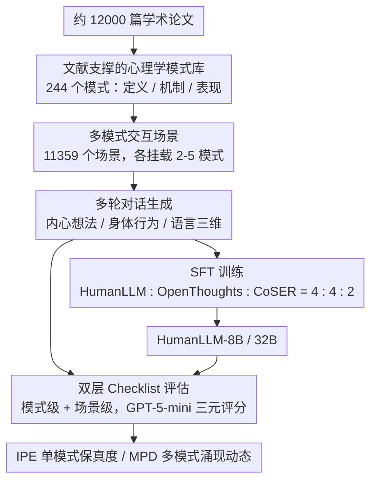

# HumanLLM: Benchmarking and Improving LLM Anthropomorphism via Human Cognitive Patterns

**会议**: ACL 2026  
**arXiv**: [2601.10198](https://arxiv.org/abs/2601.10198)  
**代码**: [GitHub](https://github.com/YJGoodbye2024/HumanLLM)  
**领域**: 角色扮演 / 人格模拟  
**关键词**: 拟人化, 认知模式, 多模式动态, 角色扮演Agent, 心理学建模

## 一句话总结

本文提出 HumanLLM 框架，将 244 个心理学模式（100 个人格特质 + 144 个社会认知模式）建模为相互作用的因果力而非孤立标签，构建了 11,359 个包含 2-5 个模式交互的场景和多轮对话数据集，通过双层 checklist 评估实现与人类判断的高对齐（$r=0.90$），HumanLLM-8B 在多模式动态上以 4 倍小的参数量超越 Qwen3-32B。

## 研究背景与动机

**领域现状**：角色扮演语言 Agent（RPLA）已从概念框架发展为数字克隆、AI 伴侣和社会模拟等实际应用。现有人格注入方法包括：(1) 提示法——通过指令赋予人格标签；(2) 微调法——在角色特定数据上训练；(3) 激活转向——通过 persona vector 操纵内部表示。

**现有痛点**：(1) 现有方法将人格建模为孤立的标签→行为映射（"外向"→"健谈"），忽略了多个认知模式之间的动态交互——现实中一个健谈的人在"聚光灯效应"激活时可能沉默；(2) 这导致"人格幻觉"——模型在自我报告中声称具有某种特质但行为表现不一致；(3) 现有评估使用整体性指标（如 CoSER 的 Anthropomorphism），但这些指标隐式地将"好的拟人化"等同于"亲社会行为"，惩罚了真实但负面的人类特质（如防御性归因）。

**核心矛盾**：人类行为是多个认知模式动态交互的产物——自信的人可能在从众压力下让步，健谈的人在被关注时变得沉默。但现有方法只能模拟单一特质，无法捕捉这种"模式间的张力和调制"。

**本文目标**：(1) 构建大规模心理学模式数据集（每个模式基于约 50 篇学术论文）；(2) 设计多模式交互场景让模型学习模式间的动态关系；(3) 提出能区分"模拟准确性"和"社会期望性"的评估框架。

**切入角度**：基于 Lewin 场论——人的认知由两个维度组成：稳定的人格特质（Person）和情境触发的社会认知模式（Environment）。将模式视为相互作用的因果力而非孤立标签——通过让模型在多模式场景中训练，隐式学习模式间的增强、冲突和条件性调制。

**核心 idea**：将心理学模式建模为交互因果力，通过在多模式交互场景中训练 LLM，让模型学习"不只是人类做什么，更是产生这些行为的心理过程"——从行为模仿升级为认知建模。

## 方法详解

### 整体框架

HumanLLM 把"拟人化"从给角色贴标签升级为对认知过程本身建模，整条流水线沿着"心理学知识 → 交互场景 → 行为评估"三段推进。它先从约 12,000 篇学术论文里把 244 个心理学模式（100 个人格特质 + 144 个社会认知模式）提炼成"定义 + 机制 + 表现"的结构化表示；再把这些模式两两到五五地组合进 11,359 个场景，生成包含 2-6 个角色、带内心想法/身体行为/语言三维表达的多轮对话；最后用一套双层 checklist 把每个角色的输出拆成可逐条核对的行为指标，分别度量单模式保真度（IPE）和多模式涌现动态（MPD）。

### 关键设计

**1. 文献支撑的心理学模式库：让每个特质都有约 50 篇论文兜底**

现有角色描述大多直接从模型的参数知识里"脑补"出来，心理学效度无从保证。HumanLLM 改用学术文献作为唯一真相源：人格特质沿用 Goldberg 的 100 个单极标记（Big Five 每维 20 个描述符），社会认知模式则从认知偏差（Tversky & Kahneman）、社会影响（Cialdini）、进化心理学与动机研究中策展，要求充分实证验证且非冗余，从 232 个候选里筛出 144 个。每个模式先经 Gemini Deep Search 检索约 50 篇论文，再由 Gemini 2.5 Pro 综合成"定义 / 核心机制 / 真实世界表现"三层结构。

这套构建方式的价值在人工验证里得到印证——平均评分落在 3.20–3.70（4 分制），标注者一致性 Krippendorff $\alpha = 0.58\text{–}0.76$。正是这层文献锚定，使后续训练学到的不是"外向→健谈"这种表层映射，而是行为背后的心理机制。

**2. 多模式交互场景：把"模式间张力"做成可学习的训练信号**

人格幻觉的根源是孤立建模——模型只会叠加单一特质，却不知道"健谈的人在聚光灯效应激活时反而会沉默"。HumanLLM 为此让每个场景同时挂载 2-5 个模式，并刻意覆盖三类交互：增强（"自利偏差"放大"过度自信效应"）、冲突（"自信" vs "从众"）、条件调制（"健谈"被"聚光灯效应"抑制）；角色同时携带自我感知与他者感知以制造信息不对称，并用 DIAMONDS 模型保证情境多样性。

由 Claude Sonnet 4.5 生成的 12-20 轮对话采用三维表达：内心想法（方括号）、身体行为（圆括号）、语言表达。这种"内在认知 vs 表面行为"的显式分离，配合每个场景预先给定的预期行为倾向，迫使模型在模式相互"谈判"的张力中学习调制规律，而不是简单地把特质拼在一起。

**3. 双层 Checklist 评估：把模拟准确性与社会期望性解耦**

传统整体性指标（如 CoSER 的 Anthropomorphism）与人类判断只有 $r=0.43$ 的弱相关，且存在"规范性混淆"——LLM 评判会因为"缺乏共情"把真实的"防御性归因"打成低拟人化，等于把"亲社会"偷换成"像人"。HumanLLM 改用价值中性的行为核对：模式级 checklist 从定义推导出每个模式 12-15 个跨场景通用指标（如聚光灯效应的"过度估计他人对自己外表的关注"），场景级 checklist 从预期行为倾向推导出每个角色 2-6 个情境特定预期（如"在截止日期压力下仍坚持概念完整性"），再由 GPT-5-mini 做三元评分（+1 满足 / 0 未展示 / −1 违反）。

在此之上定义两个核心指标：IPE（Individual Pattern Expression）度量单模式保真度，MPD（Multi-Pattern Dynamics）度量多模式交互的涌现行为。这种逐条核对的方式把人类对齐拉到了 $r=0.90$，而且因为只看行为是否出现、不看行为是否"讨喜"，真负面特质也能被如实评估。

### 损失函数 / 训练策略

训练走标准监督微调（SFT）：把每个角色的对话转成 ShareGPT 格式，得到 30,543 个 HumanLLM 样本，再与 OpenThoughts-114k（指令遵循）和 CoSER（角色扮演）按 4:4:2 混合成 76,358 样本，在 Qwen3-8B/32B 基座上微调。混入通用数据是为了在强化心理模式表达的同时保住指令遵循能力——消融显示仅用 OpenThoughts+CoSER 反而会触发负迁移，HumanLLM 数据既补偿了它又带来协同增益。

## 实验关键数据

### 主实验

**IPE 和 MPD 评估（%, 3 次评判均值±标准差）**

| 模型 | IPE | MPD |
|------|-----|-----|
| GPT-5 | 15.5±0.4 | 43.4±1.1 |
| Claude Sonnet 4.5 | 34.8±0.3 | 79.5±0.4 |
| Gemini 3 Pro | 41.3±0.3 | 85.1±0.4 |
| Qwen3-8B | 18.6±0.7 | 54.4±2.1 |
| Qwen3-32B | 26.0±0.4 | 65.8±0.7 |
| DeepSeek-R1 | 23.3±0.6 | 69.0±0.5 |
| **HumanLLM-8B** | **25.7±0.4** | **70.3±0.6** |
| **HumanLLM-32B** | **32.8±0.3** | **73.6±0.4** |

### 消融实验

**数据消融（8B 变体）**

| 配置 | IPE | MPD |
|------|-----|-----|
| Qwen3-8B (base) | 18.6 | 54.4 |
| Qwen3-8B (OT+CoSER, 无 HumanLLM 数据) | 9.1 | 31.3 |
| HumanLLM-8B (完整) | 25.7 | 70.3 |

**评估框架对齐验证（100 个场景）**

| 指标类型 | 人类 | LLM | Δ | 相关系数 r |
|---------|------|-----|---|----------|
| Anthropomorphism (整体) | 84.6 | 53.8 | -30.8 | 0.43 |
| Character Fidelity (整体) | 83.1 | 65.4 | -17.7 | 0.61 |
| **IPE (checklist)** | **38.4** | **37.8** | **-0.6** | **0.90** |
| **MPD (checklist)** | **72.1** | **75.8** | **+3.7** | **0.88** |

### 关键发现

- HumanLLM-8B 在 MPD 上（70.3%）超越 Qwen3-32B（65.8%），4 倍参数量差异证明心理学训练数据比模型规模更重要
- GPT-5 表现意外低（IPE: 15.5%），分析显示其强指令遵循倾向导致过度字面化的角色扮演——通用能力不自动迁移到心理学模拟
- 负迁移发现：仅用 OpenThoughts+CoSER 训练反而使性能大幅下降（IPE: 18.6→9.1），通用数据抑制了模型的心理模式表达能力。HumanLLM 数据不仅补偿了这种负迁移还产生了协同效应
- 传统整体性指标存在"规范性混淆"——LLM 评判将社会期望性等同于模拟准确性，checklist 方法有效解耦了两者

## 亮点与洞察

- 将心理学模式建模为"交互因果力"而非"孤立标签"是概念上的重要突破——这一视角可推广到任何需要多维人格模拟的应用（游戏 NPC、社会模拟、心理咨询训练）
- 规范性混淆的发现具有方法论价值——揭示了 LLM-as-Judge 在评估人类行为模拟时的系统性偏差，checklist 方法提供了一个可复用的解决方案
- 负迁移发现对 SFT 数据配比有直接启示——通用数据可能"淹没"领域特定能力，需要锚定性数据（如 HumanLLM）来保持

## 局限与展望

- 对话平均 16.4 轮，长程角色一致性（50+ 轮）未评估
- 心理学理论主要来自 WEIRD 人群，跨文化适用性存疑——如从众压力在集体主义文化中表现可能不同
- 训练数据全部由 LLM 合成，合成数据与真实人类交互之间仍有差距
- 高保真的负面特质模拟（如操纵、偏见）带来安全和伦理风险——部署需要额外的安全层

## 相关工作与启发

- **vs CoSER**: CoSER 从 771 本书提取对话，评估用整体性指标。HumanLLM 从学术论文构建心理学模式，评估用 checklist——实现了 $r=0.90$ vs CoSER 的 $r=0.43$ 的人类对齐
- **vs Character-LLM**: 通过经验重建训练历史人物 Agent，关注单一角色。HumanLLM 关注通用认知模式而非特定角色，更可泛化
- **vs Persona Vectors (Chen et al.)**: 通过激活转向操纵特质，但无法处理多特质冲突。HumanLLM 通过场景训练隐式学习多模式动态

## 评分

- 新颖性: ⭐⭐⭐⭐⭐ "认知模式为交互因果力"的框架化 + 12000 篇论文支撑的模式库 + 规范性混淆的发现
- 实验充分度: ⭐⭐⭐⭐⭐ 多基线对比 + 消融 + 外部 benchmark + 人类对齐验证 + 规范性混淆案例
- 写作质量: ⭐⭐⭐⭐ 框架清晰，心理学理论与工程实现的衔接自然，但论文较长
- 价值: ⭐⭐⭐⭐⭐ 为 LLM 人格模拟提供了从标签映射到认知建模的范式转变，数据集和评估框架可独立复用

<!-- RELATED:START -->

## 相关论文

- [\[ACL 2026\] The Silent Vote: Improving Zero-Shot LLM Reliability by Aggregating Semantic Neighborhoods](the_silent_vote_improving_zero-shot_llm_reliability_by_aggregating_semantic_neig.md)
- [\[ACL 2026\] Modeling Multi-Dimensional Cognitive States in Large Language Models under Cognitive Crowding](modeling_multi-dimensional_cognitive_states_in_large_language_models_under_cogni.md)
- [\[ACL 2026\] HoWToBench: Holistic Evaluation for LLM's Capability in Human-level Writing using Tree of Writing](howtobench_holistic_evaluation_for_llms_capability_in_human-level_writing_using_.md)
- [\[ACL 2026\] arXiv2Table: Toward Realistic Benchmarking and Evaluation for LLM-Based Literature-Review Table Generation](arxiv2table_toward_realistic_benchmarking_and_evaluation_for_llm-based_literatur.md)
- [\[ICLR 2026\] Human-LLM Collaborative Feature Engineering for Tabular Learning](../../ICLR2026/llm_evaluation/human-llm_collaborative_feature_engineering_for_tabular_data.md)

<!-- RELATED:END -->
