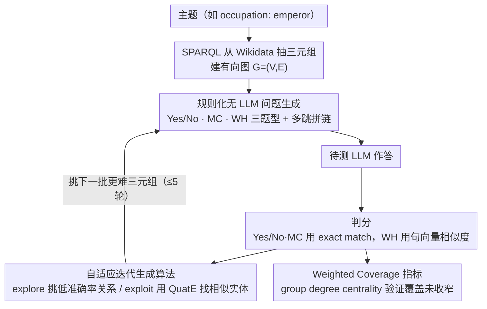

<!-- 由 src/gen_stubs.py 自动生成 -->
# Identifying the Achilles' Heel: An Iterative Method for Dynamically Uncovering Factual Errors in Large Language Models

**会议**: ACL 2026 Findings  
**arXiv**: [2401.00761](https://arxiv.org/abs/2401.00761)  
**代码**: <https://github.com/Mysterchan/HalluHunter>  
**领域**: LLM 评测 / 事实性 / 自动测试  
**关键词**: 知识图谱测试, 事实错误检测, 自适应问题生成, 多跳推理, 数据污染

## 一句话总结
HalluHunter 是一个基于知识图谱的全自动 LLM 事实错误测试框架——用 Wikidata 抽事实三元组、规则化生成 Yes/No、MC、WH 三种问题类型并支持多跳推理，再用"自适应迭代算法"基于上一轮错误回答的实体相似度和关系准确率挑下一批难题，5 轮迭代后能把 9 个主流 LLM 的准确率降低 32-42%，最多触发 55% 题目错误，并显著优于静态 benchmark。

## 研究背景与动机

**领域现状**：LLM 事实性评测目前主流路径：(1) 静态 benchmark（TruthfulQA、SimpleQA、LAMA、PopQA），手工设计或人工标注；(2) 半自动生成 QA（PAQ、KQA Pro）；(3) 基于 KG 的少量自动评测（Head-to-Tail、DyKnow）。

**现有痛点**（作者 Table 1 总结四点）：
- **高人力成本**：TruthfulQA / CommonsenseQA 等都依赖人工设计 + 标注。
- **数据污染**：静态评测集大概率已被 LLM 训练时见过（OpenAI 2023 报告承认 GPT-4 训练数据来自全网），评测结果不可信。
- **覆盖面有限**：LAMA 系列只测 "place of birth" 等少数关系；多数 benchmark 只用 MC 一种题型且偏向特定主题。
- **错误暴露机制弱**：所有现有 benchmark 都是"一次性单轮"，没有机制能根据模型的错误模式去**有针对性地**生成更难的题。

**核心矛盾**：要彻底测出 LLM 的事实弱点，必须 (a) 动态生成避免污染、(b) 覆盖广题型多、(c) 能基于模型反馈定位弱区——三者同时满足。但 KG 上盲目随机采样虽然解决了 (a)(b)，仍然像撒胡椒面一样命不中具体弱点。

**本文目标**：构造一个能同时解决以上 4 个痛点的自动框架，并验证它真能比随机采样和已有 benchmark 更有效地暴露 LLM 弱点。

**切入角度**：把"找 LLM 事实错误"看作一个**搜索问题**——KG 是搜索空间，弱关系 / 难实体是高奖励区域。先随机采一批问题做种子，再用 LLM 的对错反馈自适应缩窄到"经常错的关系 + 与之结构相似的实体"周围继续探。

**核心 idea**：KG-grounded 规则化生成 + 自适应迭代算法（基于关系准确率 + 实体 embedding 相似度选下一批 triplet），全程零 LLM 介入题目生成，避开污染。

## 方法详解

### 整体框架

HalluHunter 把"找 LLM 事实错误"当成在知识图谱上的一次有反馈的搜索：KG 是搜索空间，模型经常答错的关系和实体是高奖励区域，全程不用 LLM 生成题目以躲开数据污染。给定一个主题（如 "occupation: emperor"），系统先用 SPARQL 从 Wikidata 抽出 (SUBJECT, relation, OBJECT) 三元组建成有向图 $G=(V,E)$（每域约 50–60 万三元组、1 万多实体），再纯规则地把三元组转成 Yes/No、MC、WH 三类题，多跳题靠相邻三元组拼链（例如把 (Michelle Obama, spouse, Barack Obama) 接上 (Barack Obama, educated at, Harvard) 得到"Where was Michelle Obama's spouse educated at?"）。模型作答后，Yes/No 与 MC 用 exact match、WH 用 sentence-transformer 相似度判分，判分结果回灌给自适应迭代算法，由它根据各关系的滚动准确率和错答实体的相似邻居挑出下一批更难的三元组，如此 5 轮把模型逼到弱区。

### 关键设计

**1. 规则化无 LLM 问题生成：用确定性转换换来可验证与抗污染**

如果用 LLM 生成题目，既会引入它自身的偏差和 API 成本，生成内容还可能与训练数据重叠，让评测失真。HalluHunter 因此把三元组确定性地映射成三种题型：Yes/No 题根据关系词词性挑助动词（名词配 "is"、动词配 "does"），并造等量的"No"-题（把 object 换成同关系下的错误实体）以平衡正负样本、压制 sycophancy；MC 题用 NER 选疑问词，四个选项里 1 正 3 错，干扰项取自同关系的其他三元组；WH 题严格只用"该关系唯一出边"的三元组（如 (China, capital, Beijing) 而非有多解的 (China, city, Shanghai)），保证答案唯一可判。

多跳题用 $(s, \{r_1, r_2\}, o)$ 的链式形式拼接，并在词性层面对最终关系做助动词分析。这种规则化带来的是可重复、可控、答案确定的题面——附录 G.2 显示规则化有 98.5% 的题符合语义，而 ChatGPT 生成的 200 题里有 26 题偏离指令。

**2. 自适应迭代生成算法（Algorithm 1）：把撒胡椒面变成精准制导**

作者假设 LLM 的事实错误并非孤立——"如果模型不知道氢的原子质量 1.008，那它多半也不知道氧的原子质量"，错误往往聚成知识点 cluster。算法因此维护两个状态：每个关系的滚动准确率 $R^{(l)}(r)$ 和已用三元组集 $T^{(l)}$。生成下一批题时按 explore-exploit 切换——以概率 $e=0.2$ 走 explore，专挑 $R(r)<a=0.4$ 的低准确率关系；否则走 exploit：若上一题答错（$c_i=\text{False}$），就用 QuatE 训练的 KG embedding 找与原 subject 最相似的 top-$k=10$ 实体集 $C$，从 $T^{(l+1)}$ 里挑 subject $\in C$ 的三元组继续问同关系的题；若答对则随机换一个新三元组，题型始终与原题保持一致。

围着错答的相似实体探，比随机采样更快命中弱点；而 $e=0.2$ 的探索比例又防止算法陷在某个小区域里出不来——附录 Table 10、11 的敏感性分析表明 $e=0.2$ 正是兼顾难度与覆盖的甜区。

**3. Weighted Coverage 指标（Group Degree Centrality）：证明追难度没有牺牲广度**

只看准确率下降还不够，必须排除"算法把全部预算耗在一个冷门角落"的可能。HalluHunter 把所有被问过题的实体集 $S$ 当作节点子集，先取其开邻域 $N(S)=\{v\in V\setminus S:\exists u\in S,(u,v)\in E\}$，再算归一化的 group degree centrality

$$\widehat{C}_{\deg}(S) = \frac{|N(S)|}{|V| - |S|} \in [0,1]$$

值越大说明问过的实体越靠近 KG 的 hub、覆盖越广。实验里 Trial 5 的平均覆盖率 0.473 反而比随机采样的 0.406 高出约 17%，正面回应了"自适应迭代会不会钻牛角尖"的质疑——它在逼出难题的同时仍保持了广覆盖。

### 损失函数 / 训练策略

本框架是测试方法而非训练方法，不更新任何 LLM 参数。唯一涉及"训练"的是 KG embedding $\mathcal{M}$：用 QuatE 在 PyKEEN 里训出实体 embedding，供 exploit 阶段做相似实体检索。关键超参为探索常数 $e=0.2$、低准确率阈值 $a=0.4$、相似实体数 $k=10$；每域每题型每轮 1000 题、共 5 轮迭代，跑完 9 个 LLM 的总 API 成本约 \$400。

## 实验关键数据

### 主实验（9 个 LLM 在 5 轮迭代后的中位数准确率，跨 3 域）

| Trial | Humanity 中位准确率 | Social Science | STEM |
|-------|---------------------|----------------|------|
| Seed (Trial 0) | 0.712 (0%) | 0.699 (0%) | 0.649 (0%) |
| Trial 1 | 0.542 (−19.5%) | 0.524 (−28.1%) | 0.478 (−24.8%) |
| Trial 2 | 0.516 (−24.1%) | 0.462 (−31.5%) | 0.428 (−31.7%) |
| Trial 3 | 0.492 (−29.2%) | 0.439 (−37.5%) | 0.406 (−36.1%) |
| Trial 5 | **0.462 (−32.7%)** | **0.384 (−40.2%)** | **0.373 (−41.8%)** |

按单模型看：GPT-4o 在 Humanity Yes/No 上从 84.4% 跌到 65.8%，MC 从 82.9% 跌到 54.1%，WH 类问题更是普遍跌到 ~10%。WH 题型一直最难，所有模型平均仅 37.4%（Trial 0）。多跳题：1→2 hops 准确率急剧下降（GPT-4o STEM MC 从 72.6% 跌到 49.6%），2→4 hops 下降变缓但持续。

### 消融实验（关键超参敏感性）

| 配置 | Trial 5 Accuracy | Trial 5 Coverage |
|------|------------------|-------------------|
| $e=0.2, a=0.3$（激进 exploit） | 0.371 | **0.417**（偏低） |
| $e=0.2, a=0.4$（默认） | **0.373** | 0.471 |
| $e=0.2, a=0.5$（宽松 exploit） | 0.450 | 0.468 |
| $e=0.1, a=0.4$（少 explore） | 0.430 | 0.460 |
| $e=0.3, a=0.4$（多 explore） | 0.412 | 0.472 |

**Trial 5 Coverage 比较**：HalluHunter 0.473 > Random 0.406（Table 3，跨 3 域 3 题型 9 个配置的平均），证明迭代算法不损失 KG 覆盖度。

### 关键发现
- **自适应迭代算法效果显著**：5 轮下来 STEM 域准确率掉 41.8%，比随机问题（Trial 0）暴露的错误多得多；线性回归 p-value 单跳 0.031、多跳 0.01，统计显著。
- **STEM > Social Science > Humanity 的难度排序**：STEM 掉得最狠（−41.8%），人文最稳（−32.7%），说明 LLM 在精确知识（化学原子质量、数学质因数）上比文化记忆更脆弱。
- **GPT-4o 的盲点是物理**："binding energy" 准确率仅 0.258，"mass excess" 仅 0.237，但生物 "genetic association" 高达 0.778，说明训练数据偏向生物医学。
- **Claude-3.5-Haiku 的盲点是数论**："prime factor" 仅 0.313（831 题），同主题 Gemini-2.0 和 GPT-4o 都能到 0.60。模型特异性弱点能被精确定位。
- **WH 题最难**：所有模型平均 37.4%，跨模型一致；这与 SimpleQA / Head-to-Tail 的发现一致——开放生成式问题对 parametric knowledge 的要求远高于选项式。
- **多跳 Amplification 效应**：从 1 hop 到 2 hops 准确率跌得最猛（GPT-4o STEM MC −31.7%），从 2→4 hops 下降变缓——说明"打开第一扇推理之门"最难，后续链式推理一旦走通就稳定。
- **Coverage 不退反进**：迭代算法 Trial 5 覆盖率 0.473 > Random 0.406，证明 explore 机制（$e=0.2$）有效，没陷在小区域里。

## 亮点与洞察
- **"用 KG embedding 找相似实体生成下一轮难题"是经典 exploit-explore 框架在 LLM 测试上的精彩应用**——它把"LLM 错答"作为搜索的 reward signal，把 KG embedding 作为 "structurally similar entity" 的度量，完整地把 active testing 范式搬到了 KG 上。
- **完全规避了用 LLM 生成测试题这一陷阱**：很多最近的"自动 evaluation" 工作用 LLM 生成题再用 LLM 答，存在 self-bias 闭环；HalluHunter 用规则化 + KG 完全绕开，结果更可信。这个思路可以推广到任何"评测 LLM 时要避免 LLM 闭环"的场景（代码评测、推理评测等）。
- **错误模式分析（J.5）能定位模型-领域级弱点**，e.g., GPT-4o 强生物弱物理、Claude 弱数论，这种 fine-grained 的诊断信息对模型 vendor 而言是金矿——它告诉你具体该补什么训练数据。
- **Weighted Coverage 指标**用 group degree centrality 度量覆盖广度，比简单的"问过多少实体"更合理——hub 实体周围更"接地气"，反映真实知识分布。
- **多跳 question generation 的 single-outgoing-edge 约束**是一个看似简单但极关键的工程细节：保证答案唯一才能用 exact match 评估，否则 WH 多跳题答案天然多解，无法自动化评测。

## 局限与展望
- 作者承认：(1) 完全依赖 Wikidata 一个 KG，其错误和不完整性会传递到测试；(2) 没提出新的 mitigation 方法，纯 diagnostic。
- 自己看到的：**多跳只到 2-4 hops** 且只用"链式拼接"形式，没有树状或环状多跳；现实推理常需要多分支整合。
- **Sentence Transformer F1 仅 87%** 评估 WH 题准确性，意味着 ~13% 的 WH 评判可能噪声大；用 LLM-as-judge 可能更准但又陷入 LLM 闭环陷阱。
- **Adaptive 算法依赖 QuatE embedding** 找相似实体，embedding 质量直接影响 exploit 效果；对动态 KG（实体频繁加减）需要重训。
- **没和 LLM-driven adversarial probing**（如 AutoDetect、Self-Challenge）做严格对比，只在 Related Work 里口头比较；建议未来加上数值对比。
- **5 轮可能不够**：Section J.7 提到"动态停止 = 覆盖增量收敛"，但论文只跑 5 轮，未给出实践中收敛的具体步数。

## 相关工作与启发
- **vs Head-to-Tail (Sun et al., 2023)**：同样用 KG 测 LLM 事实性，但只测一种题型（cloze）、不支持多跳、不能迭代；HalluHunter 把它扩展到三题型多跳 + 自适应迭代，把 GPT-4o WH 准确率从 ~40% 进一步压到 10% Trial 5。
- **vs AutoDetect / Self-Challenge (Chen et al., 2024; Cheng et al., 2024)**：这些工作用 LLM 自动找 LLM 弱点，但依赖 LLM 闭环；HalluHunter 用 KG 完全跳出闭环。
- **vs TruthfulQA / SimpleQA**：静态人工 benchmark，存在污染；HalluHunter 每次跑都重新生成题目。
- **vs DyKnow (Mousavi et al., 2024)**：动态测时间敏感事实，关注 temporal staleness；HalluHunter 关注一般事实并支持迭代攻击。
- **启发**：自适应迭代 + 结构化搜索 + reward-driven exploit 这套打法可以迁移到代码 bug 检测（CodeKG）、推理弱点定位（推理图）、安全测试（对抗 prompt 树）等任何"评测 = 搜索"的场景。

## 评分
- 新颖性: ⭐⭐⭐⭐ KG-grounded 全自动 + 自适应迭代是相对新颖的组合，但单点技术（KG QA 生成、QuatE embedding）都不新。
- 实验充分度: ⭐⭐⭐⭐⭐ 9 个主流 LLM × 3 域 × 3 题型 × 6 轮迭代 × 1000 题，详尽消融 + 超参敏感性 + Coverage 验证 + 错误模式分析，工作量极大。
- 写作质量: ⭐⭐⭐⭐ 故事讲得非常清晰，Table 1 一图对比 14 个相关工作的痛点定位明确；Algorithm 1 伪代码清楚，附录补充非常详细。
- 价值: ⭐⭐⭐⭐ 框架完全自动化、可重复，开源代码，且能持续生成新题避免污染——对 LLM 评测社区有长期价值。但只 diagnostic 不 fix，限制了直接 impact。

<!-- RELATED:START -->

## 相关论文

- [\[ICML 2025\] Correlated Errors in Large Language Models](../../ICML2025/llm_evaluation/correlated_errors_in_large_language_models.md)
- [\[ACL 2026\] EngiBench: A Benchmark for Evaluating Large Language Models on Engineering Problem Solving](engibench_a_benchmark_for_evaluating_large_language_models_on_engineering_proble.md)
- [\[ACL 2026\] Comprehensiveness Metrics for Automatic Evaluation of Factual Recall in Text Generation](comprehensiveness_metrics_for_automatic_evaluation_of_factual_recall_in_text_gen.md)
- [\[ACL 2026\] How Hypocritical Is Your LLM Judge? Listener–Speaker Asymmetries in the Pragmatic Competence of Large Language Models](how_hypocritical_is_your_llm_judge_listener-speaker_asymmetries_in_the_pragmatic.md)
- [\[ACL 2026\] Capabilities and Evaluation Biases of Large Language Models in Classical Chinese Poetry Generation: A Case Study on Tang Poetry](capabilities_and_evaluation_biases_of_large_language_models_in_classical_chinese.md)

<!-- RELATED:END -->
