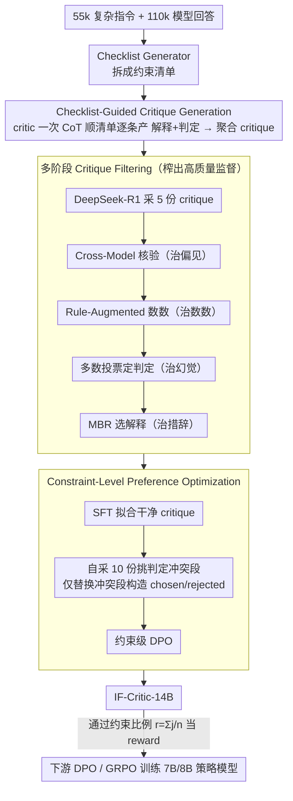

# IF-Critic: Towards a Fine-Grained LLM Critic for Instruction-Following Evaluation

**会议**: ACL 2026  
**arXiv**: [2511.01014](https://arxiv.org/abs/2511.01014)  
**代码**: https://github.com/thu-coai/IF-CRITIC (有)  
**领域**: LLM 评测 / 奖励模型 / 指令跟随  
**关键词**: 指令跟随评测、Checklist Critic、约束级 DPO、Critique Filtering、GRPO 奖励信号

## 一句话总结
本文提出 IF-Critic-14B：先用一个 Checklist Generator 把复杂指令拆成约束清单，再让 critic 在**一次推理内**对所有约束逐条给出"解释+0/1 判断"，并通过多阶段过滤的高质量 critique 训练 + 约束级 DPO 进行训练，最终在四个指令跟随评测榜上超过 o4-mini / Gemini-3-Pro，并以约 1/3 的算力让 7B/8B 策略模型在 Multi-IF / CFBench / SysBench 上经 GRPO 训练后追平 32B/70B 同族模型。

## 研究背景与动机

**领域现状**：把 LLM 当作 LLM-as-a-Judge 来评估指令跟随、并将其打分作为 DPO / RLHF / GRPO 的奖励，是当前提升复杂指令遵循能力的主流范式（SPaR、RECAST、Conifer 等都走这条路）。

**现有痛点**：作者点出两个长期被低估的问题：(1) **算力贵**——主流做法是用 GPT-4o / QwQ-32B 这类大模型，对每条约束**分别**调用一次判定，复杂指令常有 5~20 条约束，意味着同一条样本要推理十几次；(2) **判定不可靠**——LLM Judge 在错误检测上召回低，对"长度=8 个字"之类需要数数的约束尤其差，导致奖励信号噪声大。

**核心矛盾**：现有缓解手段（如引入 code-verifiable 约束）虽然可靠但**约束类型单一、无法覆盖自然语言指令的组合性**（如"前 3 段每段以问号结尾且总字数 ≤ 300"），所以"可靠"与"覆盖广"之间存在 trade-off。

**本文目标**：拆成三个子问题——(a) 如何把"一次评一条"压缩成"一次评一清单"以省算力；(b) 如何在 critique 训练数据收集阶段同时克服 LLM 的偏置与数数缺陷；(c) 如何让偏好优化只聚焦于"判定不同"的关键段而不被其它无关 token 稀释。

**切入角度**：把指令评测重写为"checklist-guided critique generation"——以 checklist 作为统一的中间表征，让 critic 在一次 CoT 里对所有约束输出 (解释, 判定) 对；数据侧用 cross-model + rule-augmented + self-consistency 的四级过滤；训练侧把 DPO 比较粒度从"整条 critique"降到"判定不同的那几段"。

**核心 idea**：用一个 14B 的"checklist-aware critic"替代每条约束单独跑一次的大模型 judge，让"细粒度可靠 + 单次推理高效"同时成立。

## 方法详解

### 整体框架
本文的核心是用一个 14B 的 checklist-aware critic 替代"对每条约束分别调一次大模型 judge"的昂贵做法：给定一条复杂指令和某模型的回答，先由 Checklist Generator 把指令拆成约束清单 $\{c_k\}_{k=1}^n$，再让 critic 在一次 CoT 推理里顺着清单逐条产出"解释 $e_k$ + 0/1 判定 $j_k$"，聚合即得整条 critique，下游把通过约束比例 $r_i=\frac{1}{n}\sum_k j_{ik}$ 当作 reward 喂给 DPO/GRPO 训练 7B/8B 策略模型。系统训练数据来自 55k 条真实复杂指令（按 CritiqueLLM 的 10 类任务分类、并用小分类器打约束复杂度分），每条随机挑 2 个模型（共 15 个）生成回答得到 110k 条评测样本；Checklist Generator 由 DeepSeek-R1 的约束分解结果蒸馏微调而来，人工抽检 1k 样本达单约束 99.29% / 整清单 97.50% 正确率，critic 则基于 Qwen2.5-14B-Instruct 经 SFT + 约束级 DPO 得到。

### 关键设计

**1. Checklist-Guided Critique Generation：一次前向批量评完所有约束**

主流 judge 对 5~20 条约束逐条调用一次大模型，同一样本要推理十几次，算力开销随约束数线性增长。IF-Critic 把 (instruction, response, checklist) 一起喂给 critic，让它沿 checklist 顺序在单条 CoT 里产出每个 $(e_k, j_k)$ 段后聚合成完整 critique，把 $O(n)$ 次推理压成一次前向；由于"有哪些约束"这条线索已经显式给出，critic 不必再自己从指令里推断隐藏约束，自我一致性也能直接基于 $j_k$ 投票而非整段文本比对。作者还观察到 reasoning model（o4-mini、QwQ-32B）在 Checklist-Level Prompt 下反而强于 Constraint-Level Prompt，说明长链推理能利用 checklist 的全局视野感知约束间关系，这正是该训练目标成立的依据。

**2. 多阶段 Critique Filtering：四级流水线榨出高质量监督**

用 DeepSeek-R1 为每条 (x, y, checklist) 采 $N=5$ 份 expert critique，但 LLM judge 自带偏见、幻觉和"不会数数"等硬伤，直接拿来训会污染 critic。于是为每条约束设计四级过滤选出最干净的 $(e_k^*, j_k^*)$：(i) Cross-Model Verification 用 GLM-4-Plus 与 Qwen2.5-72B 双盲核验"解释是否正确""解释与判定是否一致"，任一不过即丢、剔除约 11.3%（治偏见）；(ii) Rule-Augmented Verification 先用 Qwen2.5-72B 抽出受长度约束的片段、再用 Python 真值数数、最后让 DeepSeek-R1 据此修订 critique（治数数）；(iii) Final Judgement Selection 对每条约束在 5 份 critique 上多数投票、丢弃置信度 $<0.75$ 者（治幻觉）；(iv) Final Explanation Selection 在与最终判定一致的解释集合 $\mathcal{H}_k$ 上做 MBR 选择 $e_k^* = \arg\max_{e \in \mathcal{H}_k} \frac{1}{|\mathcal{H}_k|} \sum_{\tilde e \in \mathcal{H}_k} u(\tilde e, e)$（相似度 $u$ 由 difflib 实现，治措辞噪声）。四级恰好对应 LLM-as-a-Judge 的四类典型失败模式，70 条样本 353 约束的人工复核达 96.03% 判定 + 92.35% 解释完全正确。

**3. Constraint-Level Preference Optimization：把偏好对局部化到判定冲突的段**

传统响应级 DPO 会把"两段都对"的描述也算进对比，真正想强化的判定差异被无关 token 稀释。本文先把数据按 6:4 切成 $D_\text{sft} \cup D_\text{ref}$，SFT 阶段最小化 $\mathcal{L}_\text{SFT} = -\sum_i \log P_\theta(C_i \mid p_i)$；偏好阶段对 $D_\text{ref}$ 每条样本从 SFT critic 采 $M=10$ 份 critique，挑出"至少一条判定与专家不符"者作 $C_l$，构造 $C_w$ 时保留与专家一致的段不动、仅把不一致段替换为"自采池中与专家判定一致且 MBR 最优的解释 $\hat e_k$ + 专家判定 $j_k^*$"，使 $C_w$ 与 $C_l$ 的 token 差异只落在判定冲突段。随后跑标准 DPO 损失 $\mathcal{L}_\text{DPO}(\pi_\theta;\pi_\text{ref}) = -\mathbb{E}\big[\log \sigma\big(\beta\log \frac{\pi_\theta(C_w|p)}{\pi_\text{ref}(C_w|p)} - \beta\log \frac{\pi_\theta(C_l|p)}{\pi_\text{ref}(C_l|p)}\big)\big]$。用"自采解释"而非"专家解释"作替换源，是为了保证 $C_w$ 仍处在 SFT critic 的解码空间内，让优化更稳。

### 损失函数 / 训练策略
critic 端两阶段：SFT（公式 3）+ 约束级 DPO（公式 5），$\beta$ 取 DPO 标配，基模型为 Qwen2.5-14B-Instruct。下游策略训练给出 DPO 与 GRPO 两种用法，GRPO 时每条指令采 32 rollouts、每个 rollout 的奖励即通过约束比例 $r_i = \frac{1}{n}\sum_k j_{ik}$，policy 端为 Qwen2.5-7B-Instruct 与 Llama-3.1-8B-Instruct。

## 实验关键数据

### 主实验

四个 meta-eval benchmark（EvalCritic / CFBench / TRACE / Multi-IF）上的"Positive F1 + Negative F1"平均（数值越高越好）：

| 评测器 | Prompt 形式 | EvalCritic 平均 F1 | CFBench 平均 F1 | TRACE 平均 F1 | Multi-IF 平均 F1 | 四榜平均 |
|--------|-------------|--------------------|------------------|----------------|-------------------|----------|
| Gemini-3-Pro | Checklist-Level | 0.822 | 0.877 | 0.794 | 0.926 | 0.855 |
| o4-mini | Checklist-Level | 0.832 | 0.848 | 0.782 | 0.932 | 0.849 |
| GPT-4.1 | Checklist-Level | 0.722 | 0.778 | 0.720 | 0.866 | 0.771 |
| DeepSeek-R1 | Checklist-Level | 0.806 | 0.827 | 0.745 | 0.883 | 0.815 |
| QwQ-32B | Checklist-Level | 0.778 | 0.819 | 0.746 | 0.863 | 0.801 |
| **IF-Critic-14B (本文)** | Checklist-Level | **0.867** | **0.861** | **0.841** | **0.895** | **0.866** |

下游策略训练（Qwen2.5-7B-Instruct 为初始模型）：

| 训练方式 | 奖励来源 | 相对算力 | Multi-IF Turn1 | CFBench PSR | SysBench SSR |
|----------|----------|----------|----------------|--------------|---------------|
| 基线 | - | - | 76.14 | 0.56 | 19.10 |
| DPO | Skywork-V2-8B | 0.79× | 77.86 | 0.63 | 23.60 |
| DPO | QwQ-32B | 13.4× | 80.44 | 0.61 | 24.23 |
| DPO | **IF-Critic-14B** | **1.00×** | **81.25** | 0.63 | 28.71 |
| GRPO | QwQ-32B | 3.08× | 78.59 | 0.64 | 37.58 |
| GRPO | **IF-Critic-14B** | **1.00×** | **81.87** | **0.69** | **44.44** |

GRPO + IF-Critic 让 Qwen2.5-7B 在 SysBench SSR 上从 19.10 飙到 44.44，已与 Qwen2.5-32B-Instruct（44.83）持平，而算力仅为 QwQ-32B 路线的 1/3。

### 消融实验

| 配置 | EvalCritic | CFBench | TRACE | Multi-IF |
|------|------------|---------|--------|----------|
| Full IF-Critic-14B | **0.861** | **0.863** | **0.840** | **0.895** |
| w/ Constraint-Level Critique（拆成逐约束训练）| 0.844 | 0.830 | 0.816 | 0.859 |
| w/ Raw Data（不做任何过滤）| 0.814 | 0.792 | 0.774 | 0.780 |
| w/o Cross-Model Verification | 0.851 | 0.858 | 0.832 | 0.874 |
| w/o Rule-Augmented Verification | 0.827 | 0.823 | 0.789 | 0.825 |
| w/o Final Judgement Selection | 0.840 | 0.804 | 0.821 | 0.849 |
| w/o Final Explanation Selection | 0.840 | 0.846 | 0.807 | 0.858 |
| w/ Vanilla DPO（响应级偏好对）| 0.797 | 0.797 | 0.785 | 0.841 |
| w/ Expert Critique（chosen 替换源用专家） | 0.828 | 0.836 | 0.801 | 0.840 |
| w/o Preference Learning（只 SFT） | 0.815 | 0.810 | 0.810 | 0.841 |

### 关键发现
- **Checklist-guided 训练是性能基石**：去掉 checklist 一次性评估而改回逐约束 critique，四个榜全跌（最多 -3.6pt），说明"clue 已给出 + 长链 CoT"才能学到约束间关系。
- **Critique 过滤里 Rule-Augmented 最关键**：去掉它在 CFBench/TRACE 跌 4-5pt，证明 LLM 在长度类约束上"不会数数"是评测噪声的最大来源；而完全用 raw data 训跌幅最大（-5~12pt），说明 noisy label 真的会害死 critic。
- **约束级 DPO 优于响应级 DPO**：把 chosen/rejected 局部化到"判定不同的段"后，Multi-IF 比 Vanilla DPO 高 5.4pt，验证了"无关 token 稀释偏好信号"的假设。
- **下游 GRPO > DPO**：在所有 critic 下 GRPO 都强于 DPO，且 IF-Critic 的提升幅度最大，体现可靠 reward 对 RL 是真正的瓶颈解除。
- **解释质量人评**：IF-Critic 在 win-rate 上对 QwQ-32B / DeepSeek-R1 分别 +9.3% / +7.7%，与 o4-mini 持平，说明 14B critic 的解释能力已逼近顶级 reasoning 模型。

## 亮点与洞察
- **"checklist 当中间表征"是一个很灵巧的解耦**：它把"指令理解"（由 Checklist Generator 完成）和"约束判断"（由 IF-Critic 完成）拆开，二者都用 LLM 但训练数据/loss 各自独立，相当于显式构造了一个 inductive bias，使 critic 不再背负"猜出隐藏约束"的认知负担。
- **多阶段 Critique Filtering 是一份"如何驯化 LLM Judge"的实操菜单**：cross-model 治偏见、rule 治数数、self-consistency 治幻觉、MBR 治措辞——这套四件套可以原样搬到任何需要 LLM-as-a-Judge 的细粒度评测场景（如长文事实性、代码安全审计）。
- **约束级 DPO 提出了"偏好对应该在哪一段"的新视角**：传统 DPO 只关心整条响应的好坏，但当 critique 本身就是结构化的多段输出时，这种"局部偏好对"思想可直接迁移到 step-level reward modeling、reasoning chain DPO 等领域。
- **算力账算得很漂亮**：QwQ-32B reward 路线在 DPO 时算力是 IF-Critic 的 13.4×、GRPO 时 3.08×，而效果反而更差——这说明在 RLHF/RLAIF 时代，"小而准的 critic"比"大而粗的 judge"更具工程价值。

## 局限与展望
- 作者承认 **Rule-Augmented Verification 目前只覆盖长度约束**，对关键词出现、结构格式等其他 code-verifiable 约束尚未覆盖；扩展到更多约束类型可能带来再一轮提升。
- 与所有 LLM Judge 一样，IF-Critic 仍可能受 **self-enhancement、verbosity bias** 影响；论文未引入推理时的 multi-agent debate 等缓解机制。
- 个人观察：(a) 评测集中文偏多，对英文长上下文场景的泛化未深入；(b) checklist generator 的 99% 正确率是在"复杂指令"分布上测的，对模糊指令（如开放式创作）可能掉点严重，而 critic 的下游误差是 generator 与 critic 串联的乘积；(c) 14B critic 也并非无成本，在 online RLHF 大规模 rollout 时仍可能成为瓶颈，未来可考虑把 critic 蒸到更小尺寸或转成回归 reward head。

## 相关工作与启发
- **vs SPaR (ICLR 25)**：SPaR 用 self-play tree-search refinement 构 DPO 数据，依赖强 LLM 做 refiner；IF-Critic 不依赖 refiner，而是把奖励信号本身做强、做细粒度，从而让 DPO/GRPO 都受益。
- **vs RECAST**：RECAST 把约束分成 soft（GPT-4o 评）+ hard（代码评）；IF-Critic 是"统一以 LLM critic + 选择性 rule 增强"的方案，覆盖面更广也更便宜。
- **vs Skywork-Reward-V2 等通用 RM**：通用 reward model 在指令跟随任务上几乎不涨点（CFBench 仅 +0.04），说明"通用奖励"和"指令遵循的细粒度偏好"是两个不同的 reward 空间，未来奖励模型应朝任务专属化方向发展。
- **vs Prometheus / RM-R1**：通用 critic 在指令跟随 pairwise agreement 上仅 0.4~0.7，IF-Critic 高达 0.88~0.98，说明"checklist-guided 单次推理 + 多约束输出"才是该任务的正确建模姿势。

## 评分
- 新颖性: ⭐⭐⭐⭐ Checklist-guided critique 范式 + 约束级 DPO 都是清晰的组合创新，单点不算颠覆但叠加效果扎实。
- 实验充分度: ⭐⭐⭐⭐⭐ 4 个 meta-eval + 3 个下游 benchmark + 跨模型 baselines（含 o4-mini/Gemini-3-Pro/QwQ-32B/Skywork-V2）+ 详尽消融 + 人评，覆盖度堪称模板。
- 写作质量: ⭐⭐⭐⭐ 章节逻辑清晰，公式/算法/数据流图一一对照；细节多但偶尔需要对照 appendix 才能完全还原。
- 价值: ⭐⭐⭐⭐⭐ 直接给指令跟随 RLHF/GRPO 提供了一个开源 14B critic + 训练配方，实际工程可省下数倍算力，对应用社区价值很大。

<!-- RELATED:START -->

## 相关论文

- [\[ACL 2026\] IF-RewardBench: Benchmarking Judge Models for Instruction-Following Evaluation](if-rewardbench_benchmarking_judge_models_for_instruction-following_evaluation.md)
- [\[ACL 2026\] Rethinking Meeting Effectiveness: A Benchmark and Framework for Temporal Fine-grained Automatic Meeting Effectiveness Evaluation](rethinking_meeting_effectiveness_a_benchmark_and_framework_for_temporal_fine-gra.md)
- [\[ACL 2026\] Revisiting the Reliability of Language Models in Instruction-Following](revisiting_the_reliability_of_language_models_in_instruction-following.md)
- [\[ACL 2026\] LoCar: Localization-Aware Evaluation of In-Vehicle Assistants through Fine-Grained Sociolinguistic Control](locar_localization-aware_evaluation_of_in-vehicle_assistants_through_fine-graine.md)
- [\[ACL 2026\] K-MetBench: A Multi-Dimensional Benchmark for Fine-Grained Evaluation of Expert Reasoning, Locality, and Multimodality in Meteorology](k-metbench_a_multi-dimensional_benchmark_for_fine-grained_evaluation_of_expert_r.md)

<!-- RELATED:END -->
