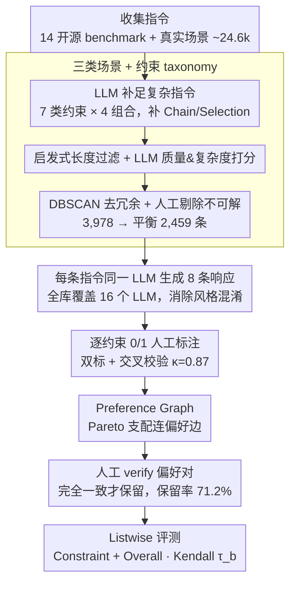

# IF-RewardBench: Benchmarking Judge Models for Instruction-Following Evaluation

**会议**: ACL 2026  
**arXiv**: [2603.04738](https://arxiv.org/abs/2603.04738)  
**代码**: https://github.com/thu-coai/IF-RewardBench (有)  
**领域**: LLM 评测 / 奖励模型 / Judge Benchmark  
**关键词**: 指令跟随、Judge Model、Preference Graph、Listwise 评测、Pareto Dominance

## 一句话总结
本文提出 IF-RewardBench：第一个同时覆盖单轮 / 多轮 / 系统提示三类指令、由 16 个 LLM 生成响应、由人工严格标注 (Cohen's $\kappa$=0.87) 的 judge 元评测基准；它把传统的 pairwise / BoN 评测范式升级为基于 **Pareto-dominance 偏好图**的 listwise 评测，对 22 个 SOTA judge（含 Gemini-3-Pro / GPT-5.1 / 各类 reward model）一通跑后发现：最强 judge 的 Kendall $\tau_b$ 也只有 0.609（远低于人类 0.755），所有专用 RM 均不超过 0.2，且本榜与下游 BoN 性能的相关性显著高于 RewardBench-2、PPE-IF 等现有 benchmark。

## 研究背景与动机

**领域现状**：LLM-as-a-Judge 已经成为指令跟随能力评估和 RLHF/DPO 奖励信号的核心组件，但"judge 本身有多可靠"几乎完全靠经验估计。现有元评测榜（LLMBar、InfoBench、IFBench、PPE-IF、RewardBench-2-IF）大多是 pairwise 或 BoN 一选一的形式。

**现有痛点**：作者点出三大短板——(1) **数据覆盖窄**：现有 benchmark 几乎只用 code-verifiable 约束（IFEval 派系）和 AND 组合，缺多轮对话、系统提示场景；(2) **评测范式过于简化**：pairwise/BoN 是"赢者通吃"，但真实 RLHF 优化需要的是"对多条响应做精排"，winner-take-all 无法度量这种能力；(3) **GT 不可靠**：很多 benchmark 偏好对是 LLM 自动合成或脚本判定，没有人工 verify，存在评测偏置和长度/风格混淆。

**核心矛盾**：当我们想用 RewardBench 这类榜单"挑一个好 judge 去当 DPO/GRPO 的 reward model"时，榜单分数和下游 alignment 性能的相关性其实很弱——因为榜单测的是"哪条响应更好"，下游用的是"5 条响应 rerank"，能力维度不对齐。

**本文目标**：(a) 构造一个覆盖单轮/多轮/系统提示三种场景、约束类型与组合完整的指令池；(b) 把"一对好坏"升级为"多条响应的偏好图"以测排序能力；(c) 全部 GT 由经过培训的人工标注 + 多轮 cross-check。

**切入角度**：从"判 judge 应有哪两种核心能力"反推数据格式——Verification（每条约束 0/1 判定能否做对）和 Ranking（基于约束级判定推出的多响应排序能否对得上 ground truth），同时这两条能力都对应下游 RL 真正用到的信号。

**核心 idea**：用"Pareto-dominance 推出的偏好图 + listwise Kendall $\tau_b$"取代"pairwise 准确率"，把 judge 评测对齐到真实优化场景。

## 方法详解

### 整体框架
IF-RewardBench 是一套"数据集 + 评测协议"而非模型，目标是把 judge 评测从"哪条响应更好"的 pairwise/BoN 对齐到 RLHF 真正需要的"多条响应精排"。数据侧从 14 个开源 benchmark + 真实场景收集 ~24.6k 指令，经 LLM 按 7 类约束 × 4 种组合补足复杂指令、启发式长度过滤、LLM 质量&复杂度打分、基于 Conan-embedding 的 DBSCAN 聚类去冗余、人工剔除不可解题后得 3,978→平衡到 2,459 条，每条指令由同一个 LLM 生成 $m=8$ 条响应（全库共覆盖 16 个 LLM，同指令同模型以消除写作风格混淆）；标注侧由 22 名学生对每条响应逐约束打 0/1 判定 $j^*_{ik}$，据此用 Pareto-dominance 推出偏好图并再过一轮人工 verify。最终每条指令对应一张 preference graph（平均 7.14 条响应 / 10.86 条偏好边），judge 在 Constraint Assessment（逐约束打 0/1、按 Eq.1 聚合，指标为 Positive/Negative F1）与 Overall Assessment（对响应集合打分或两两比较、经 ELO 转 listwise）两类任务上被以 Kendall $\tau_b$ 度量排序质量。

### 关键设计

**1. Preference Graph：用 Pareto-dominance 把评测升级为 listwise**

按均值 $r_y=\frac{1}{n}\sum j_k$ 推偏好会出现"两条响应各满足不同约束但总分相同"的歧义对，污染 GT。本文为每个 instruction 配一张图 $G=(I,\{c_k\},\{y_i\},\mathcal{J},\mathcal{E})$：节点是 8 条响应，边仅在严格 Pareto 支配 $\forall k,\, j^*_{vk} \ge j^*_{uk} \,\land\, \exists k,\, j^*_{vk} > j^*_{uk}$ 成立时才连 $(y_u,y_v)$，保证每条偏好边都"真正确"。评测时用 Kendall $\tau_b$ 比对 judge 排序与图诱导的偏序，比 pairwise 准确率信息量更大，也正好对应下游对多响应 rerank 的真实能力。

**2. 三类指令场景 + 完整约束 taxonomy：把覆盖面拉满**

IFEval 派系为追求"代码可验证"，约束类型只剩字数/格式/关键词等客观类，测不出 judge 对主观约束的处理。本文沿两个轴扩展覆盖：指令场景含 Single-Turn / Multi-Turn（约束跨轮继承）/ System-Prompt Steerability（system prompt 优先于 user prompt）三类；约束 taxonomy 含 Numerical、Format、Content、Linguistic、Style、Situation、Action 七大类 × Single、And、Chain、Selection 四种组合，其中 LLM 合成的复杂指令专门补足现有 benchmark 稀缺的 Chain 与 Selection。把覆盖面拉满后作者才发现，Style/Situation 这类主观约束才是 judge 真正的短板。

**3. 多步人工标注 + Pareto verify 的双层质控：杜绝合成噪声**

以往 instruction-following judge benchmark 几乎都没有"对推导出的偏好对再人工 verify"这一步，使"两条都违反但程度不同""非指令跟随因素差异过大"的混淆样本流入评测。本文做两层把关：先招 22 名经过上岗考试的学生做约束级 0/1 标注，每条两人独立标 + 第三人 cross-check，初标 Cohen's $\kappa=0.67$、交叉校验 $\kappa=0.87$；Pareto 自动构造偏好对后再让两名不同标注员逐对人工 verify，仅在完全一致时保留，最终保留率 71.2%，并辅以 length-difference 分析（Appendix F）确认偏好对不受长度偏置混淆。

## 实验关键数据

### 主实验

22 个 judge 在 Constraint Assessment（约束级 verify + 由 verify 聚合得到的排序 $\tau_b$）上的平均结果（节选）：

| 类别 | 模型 | Avg P-F1 | Avg N-F1 | Avg Kendall $\tau_b$ |
|------|------|----------|----------|------------------------|
| Human Baseline | 22 大学生 | **0.923** | **0.744** | **0.755** |
| Proprietary | Gemini-3-Pro | 0.909 | 0.681 | **0.609** |
| Proprietary | Gemini-3-Flash | 0.901 | 0.660 | 0.572 |
| Proprietary | GPT-5.1 | 0.887 | 0.610 | 0.525 |
| Proprietary | GPT-5-mini | 0.897 | 0.628 | 0.519 |
| Open-source | DeepSeek-V3.2 | 0.882 | 0.496 | 0.395 |
| Open-source | GLM-4.6 | 0.880 | 0.531 | 0.422 |
| Open-source | QwQ-32B | 0.865 | 0.455 | 0.356 |
| Open-source | Qwen-3-32B | 0.853 | 0.336 | 0.285 |
| Open-source | Llama-3.3-70B-Instruct | 0.845 | 0.335 | 0.238 |
| Open-source | Qwen-2.5-72B-Instruct | 0.840 | 0.251 | 0.181 |
| Open-source | Llama-3.1-8B-Instruct | 0.751 | 0.297 | 0.089 |

所有专用 reward model（Skywork-V2、RM-R1、RRM 等）τ_b 均 < 0.2，论文未在此处列出但在 Appendix 中报告。

### 消融实验（Overall Assessment vs Constraint Assessment，节选 $\tau_b$）

| Judge | Single-Turn | Multi-Turn | System-Prompt | Avg | vs 自身 Constraint Avg |
|-------|--------------|-------------|----------------|------|-------------------------|
| Gemini-3-Flash | 0.589 | 0.460 | 0.489 | 0.513 | 0.572（Constraint 更高 +0.06） |
| GPT-5-mini | 0.521 | 0.438 | 0.410 | 0.456 | 0.519（+0.06） |
| DeepSeek-V3.2 | 0.397 | 0.257 | 0.208 | 0.288 | 0.395（+0.11） |

可见 **Constraint-level 评估始终强于 Overall pairwise**，且模型越弱差距越大（DeepSeek-V3.2 差 0.11）。

### 关键发现
- **顶级 judge 离人类还很远**：Gemini-3-Pro 拿到本榜最高分 0.609 (Kendall)，但比人类基线 0.755 低 0.15；这说明 instruction-following judge 还远没有"达标"。
- **N-F1（错误检测）是真正瓶颈**：所有模型 P-F1 都很高（0.85+），但 N-F1 在开源模型上普遍只有 0.2~0.5，表明 judge 主要不是"误报正确"，而是"漏报错误"——这也直接拉低 listwise 排序质量。
- **Constraint-Level 优于 Overall Pairwise**：把每条约束单独打分再聚合，比 LLM 直接做"哪个更好"的整体比较更稳；这给"用 LLM-as-Judge 怎么 prompt"提供了清晰的工程指引。
- **Multi-Turn / System-Prompt 是新的难点**：多轮和系统提示场景下，几乎所有 judge 的 Overall pairwise 表现都比 single-turn 差，说明现有 judge 的注意力机制对"跨轮约束"和"system prompt 优先级"敏感度不足。
- **Style / Situation 类约束最难**：相比代码可验证的客观约束，主观约束类（如风格、场景适配）让 judge 性能普遍下降 5~10pt，提示 LLM judge 在"主观判定"上仍有结构性弱点。
- **下游相关性显著强于现有 benchmark**：在 BoN 采样下游任务上，IF-RewardBench 的 judge 排名与 BoN-1@8 的 Spearman 相关系数显著高于 PPE-IF / RewardBench-2-IF，意味着用本榜挑 judge 更能挑出对真实 alignment 有效的模型。

## 亮点与洞察
- **Preference Graph + Pareto 推导**这条数据 pipeline 是非常聪明的设计：(i) 用约束级 0/1 GT 而非 holistic 打分，让 GT 本身就具备粒度；(ii) Pareto 严格化避免了"均值相同的歧义对"，每条边都站得住脚；(iii) 同一条指令所有响应都由**同一个 LLM** 生成，自然消除了写作风格混淆——这是同类 benchmark 几乎都忽视的细节。
- **本文给"为什么 RewardBench 越来越不灵"提供了一个清晰诊断**：单一 pairwise/BoN 的评测维度根本测不出"对多条响应做精排"的能力，而 RLHF 真正用的就是这一能力；listwise $\tau_b$ 应该成为下一代 reward bench 的默认指标。
- **N-F1 比 P-F1 更值得关注**这条观察可直接搬到任何二分类 LLM judge 场景——大多数 judge 的真实失败模式是"漏报"，而不是"误报"，这意味着在做 reward training 时应有意上采样负样本。
- **专用 RM 全军覆没**（τ_b < 0.2）是一个让人警醒的结果：当前主流的 reward model 在指令跟随这种结构化任务上完全不可用，必须配合 critic-style LLM 评估（与同组的 IF-Critic 工作呼应）。

## 局限与展望
- 作者承认 benchmark 仍以英文为主、合成指令依赖 LLM 自身偏置；指令难度分布也偏 mid-hard，对"超长系统提示 + 多轮跨语言"这类极端场景覆盖不足。
- 个人观察：(a) 偏好图只用 Pareto-dominance 构造，无法表达"两条响应优劣相当"的并列偏好，可能错失"软偏好"信息；(b) 所有 GT 由人类标注，难以低成本扩展到更多指令——是否可以用"IF-RewardBench 训出来的 critic 再来扩 benchmark"形成 bootstrap？(c) 下游相关性实验只在 BoN-1@8 单一任务上验证，未跑 GRPO 完整流水线相关性。
- 未来方向：把 listwise + preference graph 推到 reasoning / coding judge bench，并加入"判定不确定度"维度（不只是 0/1 而是有 abstain 选项）。

## 相关工作与启发
- **vs RewardBench-2-IF (2025)**：RewardBench-2 是 BoN，且偏好对是合成的；本榜是 listwise + Pareto + 人工 verify，覆盖类型多 3 倍，下游相关性更强。
- **vs PPE-IF (2025)**：PPE 是 pairwise & BoN 都做但合成 GT，本榜的 22 个 judge 排名与 PPE 的排名差异较大，凸显评测范式对榜单结果的关键影响。
- **vs IFBench / InfoBench**：这两个早期 benchmark 没有 multi-turn / system-prompt，且 InfoBench 是 pointwise（无偏好），本榜把这三种维度全部扩充。
- **vs IF-Critic (同组 2511.01014)**：IF-Critic 是模型，IF-RewardBench 是 benchmark，两者互补——前者证明"为指令跟随专门训 critic 是值得的"，后者证明"通用 reward model 在指令跟随上根本不行"，共同形成一个完整论证链。

## 评分
- 新颖性: ⭐⭐⭐⭐ Preference Graph + listwise $\tau_b$ + 人工 verify 三件套是清晰的范式升级；单点不是颠覆但组合非常 timely。
- 实验充分度: ⭐⭐⭐⭐⭐ 22 个 judge × 三类场景 × 两类任务 × 下游相关性验证，是迄今为止最完整的 instruction-following judge meta-eval。
- 写作质量: ⭐⭐⭐⭐ 问题动机和数据构造规范，但全文细节多、需要交叉 appendix 才能完全还原。
- 价值: ⭐⭐⭐⭐⭐ 直接揭示了"通用 RM 不能当指令跟随 reward 用"这一结论，对 RLHF/GRPO 社区有立竿见影的指导价值。

<!-- RELATED:START -->

## 相关论文

- [\[ACL 2026\] IF-Critic: Towards a Fine-Grained LLM Critic for Instruction-Following Evaluation](if-critic_towards_a_fine-grained_llm_critic_for_instruction-following_evaluation.md)
- [\[ACL 2026\] Revisiting the Reliability of Language Models in Instruction-Following](revisiting_the_reliability_of_language_models_in_instruction-following.md)
- [\[ACL 2026\] AJ-Bench: Benchmarking Agent-as-a-Judge for Environment-Aware Evaluation](aj-bench_benchmarking_agent-as-a-judge_for_environment-aware_evaluation.md)
- [\[ACL 2026\] When Vision-Language Models Judge Without Seeing: Exposing Informativeness Bias](when_vision-language_models_judge_without_seeing_exposing_informativeness_bias.md)
- [\[ACL 2026\] arXiv2Table: Toward Realistic Benchmarking and Evaluation for LLM-Based Literature-Review Table Generation](arxiv2table_toward_realistic_benchmarking_and_evaluation_for_llm-based_literatur.md)

<!-- RELATED:END -->
