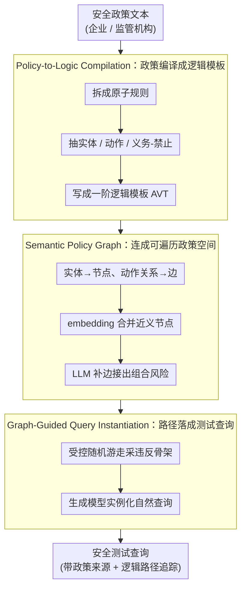

# Inverting the Shield: Systematically Generating Safety Tests from Policy Specifications

**会议**: ACL2026  
**arXiv**: [2605.24883](https://arxiv.org/abs/2605.24883)  
**代码**: https://github.com/huac-lxy/POLARIS  
**领域**: LLM安全评测 / 规约驱动测试  
**关键词**: 安全策略规约, 形式化测试, 红队评测, 一阶逻辑, 覆盖率驱动生成  

## 一句话总结
POLARIS把自然语言安全策略先编译成一阶逻辑规约，再构造语义策略图并系统遍历生成测试查询，从而让LLM安全评测从启发式红队转向可追踪、可覆盖、可复现的规约驱动测试。

## 研究背景与动机
**领域现状**：LLM安全评测通常有两条路线：一类是AdvBench、HarmBench、SORRY-Bench这类静态基准，另一类是自动红队或好奇心驱动的动态攻击生成。前者便于横向比较，后者更能发现新失败模式。

**现有痛点**：静态基准成本高、容易过时，也可能被训练数据污染；动态红队虽然灵活，但大多依赖启发式搜索，缺少对安全策略空间的系统覆盖保证。它们可以告诉我们“模型失败了”，却很难说明“哪条策略被测过、哪些策略组合还没测”。

**核心矛盾**：安全策略原本是防护边界，但以自然语言存在时并不是机器可验证的规约。评测若只从已有攻击样例出发，就会被样例分布牵着走；若从策略本身出发，又需要先把模糊政策变成可遍历、可实例化的结构。

**本文目标**：作者希望把软件工程里的规约测试思想迁移到AI安全评测中：从政策文本抽取可验证逻辑约束，系统探索策略空间，把抽象违反模式实例化为自然语言测试，并保留每个测试到原始政策条款的追踪链路。

**切入角度**：论文的关键观察是“盾牌也定义了攻击边界”。安全政策规定了模型不能跨越的边界，一旦这些边界被形式化，就可以反向生成测试用例来覆盖边界附近的风险场景。

**核心 idea**：用“自然语言政策 → 一阶逻辑模板 → 语义策略图 → 图遍历实例化”的流水线，替代只靠已有攻击样例或LLM自由发挥的安全测试生成。

## 方法详解

### 整体框架
POLARIS 的核心立场是“盾牌本身也画出了攻击边界”：安全政策规定了模型不能越过的线，只要把这些线形式化，就能反向生成贴着边界的测试。整个系统因此从政策文本出发、而不是从已有攻击 prompt 出发，分三个阶段把模糊政策一步步变成可遍历、可追踪的测试。第一阶段把自然语言政策拆成原子规则，并转写成一阶逻辑形式的 Abstract Violation Templates（AVT）；第二阶段把所有 AVT 里的实体、动作和关系组织成 Semantic Policy Graph，并靠语义合并和 LLM 补边把隐含关联也连上；第三阶段在图上做受控随机游走，采出抽象违反路径，再由生成模型把路径落成自然语言测试查询。输入是企业或监管机构的安全政策文本，输出是一组带策略来源、逻辑路径和自然语言表述的安全测试——每个测试都能追回它覆盖的是哪条政策条款。

### 关键设计

**1. Policy-to-Logic Compilation：把模糊政策编译成可验证的逻辑模板**

自然语言政策不是机器可验证的规约，生成器若直接照着政策语言写，最多只能模仿措辞，没法证明某条查询到底覆盖了哪条规则。POLARIS 先把复合政策拆成原子规则——比如“不要分发毒品或枪支”拆成两个独立禁止项——再抽取其中的实体、动作和义务/禁止这类 deontic modality，写成形如 $\forall x,y:\ \mathcal{P}_{pre}(x,y) \Rightarrow \textsc{Violation}(R_i)$ 的 AVT。这样每个测试都挂着一个明确的“违反条件”，测试用例和原始政策条款之间也就有了可追溯的链路。

**2. Semantic Policy Graph：把孤立的逻辑模板连成可遍历的政策空间**

单条政策规则只能覆盖一个孤立场景，可真实安全失败常常发生在多个概念拼接之后。POLARIS 把所有 AVT 里的实体映射成图节点、动作和关系映射成边，再用 embedding 相似度合并近义节点，用 LLM-driven link prediction 补上常识或因果连接。例如政策里显式出现的“化学实验室”和另一条款里的“前体化学品”，本来分属两条规则，补边后可能连成一条组合风险路径。语义图让评测从“逐条规则”升级到“多跳违反路径”，去触碰那些任何单条政策都没明写、但拼起来才危险的场景。

**3. Graph-Guided Query Instantiation：把抽象路径落成自然且可追踪的测试查询**

逻辑路径直接翻译成查询会很机械，而真实模型往往是在更自然的叙事上下文里才翻车。这一阶段在补全后的图上做受控随机游走，采样出违反场景的骨架，再让生成模型结合场景、上下文和意图伪装变量生成最终查询；同时保留它走过的图路径和 AVT 来源，使“可验证”一路落到“可执行”而不丢追踪信息。（笔记此处只保留高层机制，不展开具体有害 prompt 内容。）

### 一个完整示例：从一条政策到一条测试
拿“禁止协助制造危险化学品”这类政策走一遍：编译阶段把它拆成若干原子禁止项，抽出 `化学实验室`、`前体化学品`、`合成步骤` 等实体和“提供/获取”动作，各写成一条 AVT；建图阶段这些实体成为节点、原政策内的关系成为边，补边模块再凭常识把“前体化学品”和另一条款里的“受管制物质”连上，形成一条原政策没有明写的组合路径；游走阶段在图上采出 `化学实验室 → 获取前体化学品 → 合成步骤` 这样一条违反骨架；实例化阶段把它包装成一段带身份伪装和上下文的自然提问。最终这条测试既能追回它覆盖的政策条款，又比直接照搬政策语言更像真实用户会问出口的话。

### 损失函数 / 训练策略
POLARIS 不训练目标 LLM，而是构建一个测试生成系统。实验用 16 份来自 9 家 AI 公司的公开政策外加 4 份中国监管文件，编译成策略知识库；生成阶段的主要开销是 GPT-4-Turbo 的 API 调用。评估用三组指标：密度加权的 Coverage / Novelty、Policy Clause Coverage 和 Attack Success Count。其中 Coverage 把“已有基准样本到生成集的最近邻距离低于阈值”记为被覆盖，Novelty 统计生成样本里未被基准覆盖的比例，并用局部密度权重压低那些密集重复区域的贡献——因为安全基准里常堆着大量相似攻击，普通最近邻覆盖会被这些密集簇带偏。

## 实验关键数据

### 主实验
| 评测维度 | 关键设置 | POLARIS结果 | 对照 / 解释 |
|----------|----------|-------------|-------------|
| Policy Clause Coverage | 16个企业政策 + 4份监管文件 | 100% | 表明每条政策规则至少能实例化出测试查询 |
| Coverage @ $\tau=0.6$ | 相对HarmBench | 93.21% | 说明生成集能覆盖大部分已有安全基准语义空间 |
| Novelty @ $\tau=0.6$ | 相对HarmBench | 35.26% | 在高覆盖同时仍保留新增语义内容 |
| Mistral-7B攻击成功数 | GPT-5-mini评判 | 13,722 | AirBench为2,850，约4.8倍 |
| Qwen-7B攻击成功数 | GPT-5-mini评判 | 11,150 | 最强对照Curiosity为2,294，约4.9倍 |
| Vicuna攻击成功数 | DeepSeek-R1评判 | 8,590 | AirBench为1,639，约5.2倍 |

### 消融实验
| 模块 / 指标 | 完整POLARIS | 去掉模块后的结果 | 说明 |
|-------------|-------------|------------------|------|
| 逻辑形式化：Policy Compliance | 92.90% | w/o Logic为88.90% | 形式化约束能减少生成内容偏离政策目标 |
| 语义图遍历：Average Novelty @ $\tau=0.6$ | 28.00% | w/o Graph为24.80% | 图结构帮助发现随机采样难覆盖的新组合路径 |
| Policy-to-Logic质量：Fine-grained score | 9.10 / 10 | 无直接对照 | LLM judge认为大部分逻辑表达能保留语义细节 |
| Policy-to-Logic质量：Binary Accuracy | 92.06% | 无直接对照 | 严格逻辑正确性仍有少量误差，需要过滤机制 |
| 生成成本 | 28,660条查询花费70.52美元，4.86小时 | 实例化边际成本0.94美元/千条 | 语义图构建是一次性成本，后续扩展较便宜 |

### 关键发现
- POLARIS在现代模型上优势最明显，尤其是Mistral-7B和Qwen-7B，攻击成功数相对强基线达到约4到6倍。
- 静态基准并没有被简单复制：在高Coverage的同时，Novelty仍然保留相当比例，说明图遍历确实扩大了测试空间。
- 形式化逻辑和语义图都不是装饰模块。去掉逻辑会降低政策符合度，去掉图会降低新颖性。

## 亮点与洞察
- 最大亮点是把LLM安全评测重新表述为“规约测试”问题。这个视角让评测从样例驱动转向政策驱动，特别适合监管或企业合规场景。
- Density-weighted Coverage / Novelty比普通最近邻覆盖更合理，因为安全基准里常有大量相似攻击，普通覆盖率会被密集簇误导。
- 语义策略图提供了一个可复用中间资产。只要政策图构好，后续可以针对不同领域、模型或风险偏好继续实例化测试，而不是每次重新写prompt。
- 对安全评测工具链的启发是：未来benchmark不应只发布问题集，还应发布问题集背后的策略规约、覆盖定义和生成轨迹。

## 局限与展望
- 作者明确指出，生成质量受输入政策质量限制。如果政策本身含糊、冲突或遗漏，POLARIS只能系统化这些缺陷，无法自动补全规范。
- 当前方法主要处理静态单轮交互，尚未覆盖多轮对话、工具调用代理或状态性风险；这些场景需要把时间状态和行动约束纳入逻辑表达。
- 中间步骤依赖LLM抽取实体、动作和FOL模板，虽然验证分数较高，但并非完全正确。大规模部署需要更强的人工抽检、形式验证或一致性过滤。
- 攻击成功数强调发现失败的数量，但不同失败的严重性不完全相同。后续可以加入风险权重、危害等级和修复优先级。

## 相关工作与启发
- **vs 静态安全基准**: AdvBench、HarmBench、SORRY-Bench等提供固定测试集，POLARIS则从政策规约持续生成测试。前者便于复现，后者更适合应对政策和模型快速变化。
- **vs 自动红队**: Curiosity-driven red teaming等方法依赖探索启发式，POLARIS把探索空间显式绑定到政策图，优势是覆盖和追踪性更强。
- **vs Evol-Instruct / MAGPIE**: 这些方法生成更复杂的指令来提升模型能力，POLARIS生成的是规约可追踪的安全测试，目标完全不同。
- **对后续研究的启发**: 可以把形式化规约引入多轮agent安全、工具调用权限测试和企业内部安全验收，把“测了多少prompt”升级为“覆盖了多少政策状态”。

## 评分
- 新颖性: ⭐⭐⭐⭐⭐ 把规约驱动软件测试系统性迁移到LLM安全评测，问题定义和方法组合都很有辨识度。
- 实验充分度: ⭐⭐⭐⭐☆ 覆盖、攻击成功、成本、逻辑验证和消融都比较完整，但多轮/agent场景还未覆盖。
- 写作质量: ⭐⭐⭐⭐☆ 结构清晰，实验问题设置明确；部分附录表格很多，主文可读性略受压缩。
- 价值: ⭐⭐⭐⭐⭐ 对安全评测、合规测试和动态benchmark构建都有直接启发。

<!-- RELATED:START -->

## 相关论文

- [\[ACL 2026\] PolicyLLM: Towards Excellent Comprehension of Public Policy for Large Language Models](policyllm_towards_excellent_comprehension_of_public_policy_for_large_language_mo.md)
- [\[ACL 2026\] Stability vs. Manipulability: Evaluating Robustness Under Post-Decision Interaction in LLM Judges](stability_vs_manipulability_evaluating_robustness_under_post-decision_interactio.md)
- [\[ACL 2026\] NovBench: Evaluating Large Language Models on Academic Paper Novelty Assessment](novbench_evaluating_large_language_models_on_academic_paper_novelty_assessment.md)
- [\[ACL 2026\] Question Difficulty Estimation for Large Language Models via Answer Plausibility Scoring](question_difficulty_estimation_for_large_language_models_via_answer_plausibility.md)
- [\[ACL 2026\] Same Voice, Different Lab: On the Homogenization of Frontier LLM Personalities](same_voice_different_lab_on_the_homogenization_of_frontier_llm_personalities.md)

<!-- RELATED:END -->
