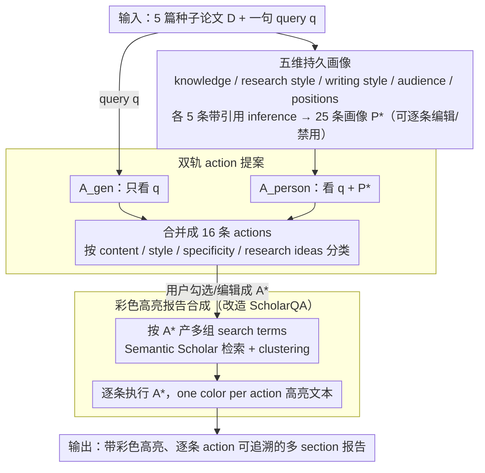

# Language Models Don't Know What You Want: Evaluating Personalization in Deep Research Needs Real Users

**会议**: ACL 2026  
**arXiv**: [2603.16120](https://arxiv.org/abs/2603.16120)  
**代码**: https://github.com/allenai/personalized-scholarqa-eval  
**领域**: LLM 评测 / 个性化 / Deep Research / 人机交互  
**关键词**: 个性化 Deep Research、LLM-as-Judge、用户研究、可解释代理、user-centered eval

## 一句话总结
作者构建了首个开源个性化 Deep Research 系统 MyScholarQA（profile → action → report 三段式），在 16 项离线指标上几乎全胜其它 DR baseline；但 21 位真实研究员的 90 分钟访谈揭示了 9 类离线评测完全检测不到的个性化失败模式，且四个主流 LLM judge 都预测不准用户满意度，给"用 LLM judge 替代真实用户"敲响了警钟。

## 研究背景与动机

**领域现状**：Deep Research（DR）工具用 LLM 检索 + 综合论文写多 section 带引用的报告，已成研究者必备工具；但绝大多数 DR 系统不个性化——对一位 Diffusion 研究者和一位 NLP 研究者问同一个 "什么是 Attention"，答案几乎一样。少数 DR（如 OpenAI/Gemini DR）会反问 clarifying questions，但每次新查询都要重新解释自己。

**现有痛点**：ACL'25 上 31 篇个性化相关论文里，**所有 31 篇**都做离线评测（18 篇用合成用户数据集 + 17 篇用 LLM judge），只有 2 篇跑了真人用户研究。这种"离线评测霸权"假定 LLM judge 能代替用户判断——但作者要拷问：这是不是个 systemic illusion？

**核心矛盾**：(1) 个性化 ≠ 可验证的客观属性，它本质是"这位特定用户是否觉得有用"，但 LLM judge 没有"我"；(2) DR 报告 5 分钟才生成一份，需要某种持久的 user model 而不是每次重提示；(3) 真用户用得开心的指标和离线评测得高分的指标可能根本不重合。

**本文目标**：(1) 构建一个能落地、可控、可解释的个性化 DR 系统作为载体；(2) 在 16 项离线指标上验证它确实优秀；(3) 把同样的系统当作"探针 (technology probe)" 给真人用，把 LLM judge 漏掉的失败模式逼出来；(4) 提炼出"必须真用户"的方法论与设计教训。

**切入角度**：借鉴 80 年代 Brusilovsky 的 adaptive hypermedia——构造一个持久 user model（从用户挑的论文里推断），再把它转成针对每条 query 的可编辑 actions 列表，最后用 actions 驱动一个多步 LLM 检索-写作 pipeline。每一步都让用户能 toggle/edit，是为了把"个性化在哪里发生、怎么发生"做成可观察的实验变量。

**核心 idea**：让一个真实可用的个性化 DR 系统同时跑两套评测——离线 metric + 21 位真人访谈，用两者的差异反证 LLM judge 不可代替真实用户。

## 方法详解

### 整体框架
MyScholarQA（MYSQA）要解决的是"DR 报告 5 分钟才生成一份、不可能每次重问偏好"的矛盾，于是把个性化拆成一条用户全程可见、可编辑的三段流水线：先从用户挑的论文里抽出一个持久画像，再把画像和当前 query 翻成一张可勾选的 action 清单，最后让 action 驱动检索-写作并把"个性化发生在哪段文字"用颜色标出来。整条链的输入是 5 篇种子论文 + 一句 query，中间产物是可逐条改的 profile $P^*$ 和 actions $A^*$，输出是带彩色高亮、逐条 action 可追溯的多 section 报告；关键在于每一步都把"个性化"显式化成用户能干预的实体，从而让它成为可观测的实验变量。骨干 LLM 为 Claude-4 Sonnet，三步全开源并提供在线 demo。

### 关键设计

**1. 从论文反推五维持久画像：把"你是谁"做成跨 query 可复用的证据链**

DR 的痛点在于偏好表达成本太高——OpenAI DR 那种每次新 query 都反问 clarifying questions 的范式，让用户疲于重复解释自己（受访者 U21 直言"我希望它了解我一次，然后照办"）。MYSQA 的做法是让用户上传 5 篇感兴趣的论文 $D$，prompt LLM 在 knowledge / research style / writing style / audience / positions 五个 aspect 上各产 5 条 sentence-level inference，凑成 $n_1{=}25$ 条的画像 $P=\{I_1,\dots,I_{25}\}$；每条 $I$ 都必须显式 cite $D$ 中的具体段落并附 explanation，使画像不是空泛标签而是可核查的证据链，用户可逐条 edit / disable 收敛成 $P^*$。正因为有引用约束，画像质量可被量化：Gemini-2.5 Pro 在 inference accuracy 97.1%、citation relevance 97.4%、specificity 3.73/5 上综合最佳，被选为 profile backbone。

**2. Generic 与 Personalized 双轨 action 提案：在动笔前把"打算怎么个性化"摊开给用户控制**

如果直接由 profile 生成报告，个性化就成了无法审查的黑箱，事后也无从分析"哪种个性化让用户不满"。MYSQA 在 query $q$ 进来后先不写报告，而是用两条 prompt 分别生成只看 $q$ 的 $A_{\text{gen}}$ 与同时看 $q$ 和 $P^*$ 的 $A_{\text{person}}$，合并成 $n_2{=}16$ 条 actions $A=A_{\text{gen}}\cup A_{\text{person}}$，按 content / style / specificity / research ideas 四类组织，用户勾选/编辑成 $A^*$。这里刻意不写硬规则，只给 LLM 软提示（如"对专家跳过基础术语"），让"如何个性化"本身成为用户研究里可被观察的对象。这一设计既是 query clarification 的变体（Zhang et al. 2025），又因为把个性化外化成离散 action，才使得后文"哪类 action 最容易踩雷"的细粒度归因成为可能——LLM judge 给 $A_{\text{person}}$ 的 win rate 高达 91–95%、uniqueness 60–72%，说明这些 action 确实随 profile 而变。

**3. 彩色高亮的报告合成：用最小 prompt 改造让"个性化在哪"一眼可见、可审、可探针**

报告侧基于 SCHOLARQA pipeline（Semantic Scholar 检索 + clustering + 多 section 生成），MYSQA 只动两处 prompt 把 $A^*$ 注入：检索阶段把 `q → search terms` 改为"按 $A^*$ 产多组 search terms"，生成阶段把 `section generation` 改为"逐条执行 $A^*$，并用 one color per action 高亮相应文本片段"。Action adherence 指标据此评测每条 action 是否被报告任一处遵循。高亮表面上只是透明化手段——用户扫一眼就知道个性化落在哪几句——但它同时是研究者最好用的失败探针：一条 action 若在报告里找不到对应颜色，就直接暴露出 IGNORE 类失败；而用户研究还发现一个隐患，多数人看到某 action 没高亮时会默认"这条信息不存在"，而非"系统漏执行了"，构成 personalization 的过度信任陷阱。

### 损失函数 / 训练策略
本文不训练新模型，MYSQA 全靠 prompt 工程 + 多 LLM chain。骨干 LLM 各步独立选型：profile 在 Gemini-2.5 Pro / Claude-4 Sonnet (thinking) / o3 / DS-r1 间比较，action 在 Gemini-2.5 Flash / GPT-4.1 / Claude-4 Sonnet / DS-V3 间比较，report 默认 Claude-4 Sonnet。Profile 生成温度 1.0、max token 40960，检索走 Semantic Scholar API。评测用 ScholarQA-CS2 的 200 个 DR query 做合成 benchmark，每个 query 用 CS-PaperSum 里的作者论文模拟低/中/高 expertise 三类 user，并以 GRIT-LM 嵌入的 cosine 相似度划分专长档位。

## 实验关键数据

### 主实验
**Profiles**（4 个 LLM × 4 个指标，0-100% / specificity 1-5）：

| LLM | Inf. Acc | Cit. Rel. | Cat. Acc. | Specificity |
|-----|----------|-----------|-----------|-------------|
| Gemini-2.5 Pro | **97.1** | **97.4** | 99.4 | 3.73 |
| Claude-4 Sonnet | 92.5 | 97.4 | 99.1 | 4.12 |
| OpenAI o3 | 88.6 | 91.8 | **99.8** | **4.20** |
| DeepSeek-R1 | 77.8 | 80.7 | 97.2 | 3.56 |

**Reports**（vs 5 个 DR baseline，5 指标）：

| 系统 | Ans. Cov ↑ | Ans. Prec ↑ | Cit. Prec ↑ | Cit. Rec ↑ | Action Adh ↑ |
|------|------------|-------------|-------------|------------|--------------|
| **MYSQA** | **91.4** | 89.9 | **91.8** | **81.4** | 83.2 |
| ScholarQA (基底) | 88.9 | 89.1 | 90.5 | 76.9 | 81.3 |
| OpenScholar | 77.2 | **97.4** | 82.5 | 60.4 | 82.5 |
| STORM | 72.0 | 92.2 | 73.3 | 64.7 | 74.4 |
| Sonar DR | 81.0 | 82.9 | 64.3 | 46.3 | 75.0 |
| o3 DR | 89.1 | 90.2 | 79.2 | 56.7 | **93.8** |

MYSQA 在 5 项里有 3 项最好、1 项第二，超过所有 baseline；并且始终优于基底 ScholarQA。

### 消融实验（用户研究里离线指标完全错过的 9 类失败模式）

| 输出 | 失败类型 | 描述 | 出现频率 |
|------|----------|------|----------|
| Profile | DOMAIN | 用错领域术语 | 27.6% |
| Profile | OVERCLAIM | 把局部论文结论扩到整个用户 | 17.9% |
| Profile | CONVENTION | 把领域通用做法当成"你"的特点 | 12.8% |
| Profile | CONTRAST | 用错误对比歪曲用户立场 | 12.2% |
| Action | NARROW | action 过窄，覆盖不全 | 43.8% |
| Action | OFFTOPIC | action 偏离 query 意图 | 23.6% |
| Report | UNINFORM | 内容太泛、不够细 | 38.0% |
| Report | PRESENT | 呈现风格 / 格式不匹配 | 25.3% |
| Report | IGNORE | 忽略了 action 中的隐式/显式要求 | 22.8% |

**LLM judge 预测用户满意度**：4 个 LLM judge（Gemini-2.5 Flash / GPT-4.1 / Claude-4 Sonnet / DS-V3）在 9 类失败上分别做"用户会不会满意"的二分类，给定与用户相同的上下文 + 6 shot example + 每类定义。结果：**没有任何一个 LLM 在任一类失败上显著超过 majority-class baseline**（α=0.05 Binomial test + Bonferroni 校正）。删 few-shot、删定义、加 zero/3-shot 都救不回来。

### 关键发现
- **MYSQA 整体可用度 73%**：21 位真人对 profile / action / report 总满意度 73%；但剩余 27% 几乎全部对应离线指标 0 命中。
- **DOMAIN + NARROW + UNINFORM 是最常见痛点**：profile 容易被通用术语带跑、action 容易过窄、report 容易过泛——这三者构成"个性化幻觉"的主轴。
- **真人偏好和 LLM judge 偏好不一致**：LLM judge 在 win rate 上给 personalized actions 91-95%，但真人只觉得 ~60% 的 personalized actions 比 generic 好；说明 LLM judge 系统性 over-prefer "看起来更专门"的答案。
- **真人想要更多控制**：用户希望能新增 actions（U3, U16）、加权 emphasis（U4）、用 paper filters / 多轮对话 / 长期 memory 控制，证明"持久 + 可编辑 user model"方向对路。
- **过度信任陷阱**：当某条 action 没有对应高亮时，多数用户假设"这条信息不存在"而非"系统漏执行了"，是个 personalization 的隐藏风险。
- **跨 setting 的 LLM judge 仅做 "necessary but insufficient" 的检查**：作者明确提出离线评测应被视为初筛而非终审。

## 亮点与洞察
- 把"DR 个性化"重新理解成 HCI 里的 adaptive hypermedia 问题，引入持久 user model 和可控 action 列表，把"个性化在哪里发生"这个无形维度变成可观测、可干预的实体。
- ACL'25 31 篇个性化论文里 0 篇真人评估的统计，本身就是一个非常震撼的 community 现状量化——这种"用文献调研做 motivation"的方式值得借鉴。
- "用同一个系统跑离线 + 在线两套评测、再用满意度二分类挑战 LLM judge"的实验设计，把"LLM judge 可不可替代真人"这个争议性问题做成了几乎不可反驳的实证证据。
- 9 类失败模式里有些是已知 NLP 问题（DOMAIN ≈ factuality、PRESENT ≈ style transfer），有些是只有真人才发现（TRUST、UNIMPORT），暗示"用户研究"在 NLP 里仍然有不可替代的 epistemic 价值。

## 局限与展望
- MYSQA 一份报告需要 ~5 分钟、profile ~3 分钟，已经比 OpenAI DR 快但仍 too slow；用更小模型蒸馏 / 预计算可能是工程方向。
- 仅在 DR 单一设定下做了 21 人访谈；其它个性化 NLP 任务（对话、推荐、个性化 RAG）能否复现"LLM judge 不可替代"结论待验证。
- LLM judge 实验受 prompt 工程影响；作者承认可能存在更好的 prompt 或专门训练的 reward model 能逼近用户。
- 仅基于论文做 user model；对没有发表论文的研究者（学生、产业研究员）适用性有限。
- 个性化可能强化 filter bubble，且有用户身份偏见（如把"语法稍奇怪 → 非英语母语 → 暗示研究水平"），伦理风险需更多 safeguard。

## 相关工作与启发
- **vs Co-STORM / OpenAI DR**：他们靠 query 时的 clarifying questions 做轻个性化；MYSQA 走持久 profile + 可编辑 action，用户研究证明后者更被偏好。
- **vs OpenScholar / STORM / Perplexity Sonar / o3 DR**：纯 outcome 质量上 MYSQA 全面占优，但更重要的贡献是揭示"高分 ≠ 个性化做得好"。
- **vs LaMP / Persona-DB / Step-back Profiling**：这些工作都是离线评测个性化方法；本文用 user study 给整个范式打了问号。
- **vs Liang et al. 2025 (个性化 DR benchmark)**：他们也用合成数据 + LLM judge，但不发系统、不做真人；本文正面反证这种范式的盲区。

## 评分
- 新颖性: ⭐⭐⭐⭐ 首个开源个性化 DR 系统 + 首个反 LLM-judge 的大规模用户研究，方法论上的"反向贡献"很稀缺。
- 实验充分度: ⭐⭐⭐⭐⭐ 16 项离线 metric × 5 baseline × 4 LLM judge × 21 真人 × 90 分钟访谈 × 9 失败模式细分，几乎是 NLP 论文里少见的"双轨完整"。
- 写作质量: ⭐⭐⭐⭐ 把"系统 + 实验 + 用户研究 + lessons"四块串得很顺，4 条 lesson 写得很 actionable；图 5/6 直接立住结论。
- 价值: ⭐⭐⭐⭐⭐ 对个性化 NLP 社区是一次方法论上的当头棒喝；同时 MYSQA 本身是一个可上线、可被借鉴的 personalization architecture。

<!-- RELATED:START -->

## 相关论文

- [\[ACL 2026\] Teaching Language Models to Forecast Research Success Through Comparative Idea Evaluation](teaching_language_models_to_forecast_research_success_through_comparative_idea_e.md)
- [\[ACL 2026\] Can LLMs Act as Historians? Evaluating Historical Research Capabilities of LLMs via the Chinese Imperial Examination](can_llms_act_as_historians_evaluating_historical_research_capabilities_of_llms_v.md)
- [\[ACL 2026\] ReTraceQA: Evaluating Reasoning Traces of Small Language Models in Commonsense Question Answering](retraceqa_evaluating_reasoning_traces_of_small_language_models_in_commonsense_qu.md)
- [\[ACL 2026\] Evaluating Temporal Consistency in Multi-Turn Language Models](evaluating_temporal_consistency_in_multi-turn_language_models.md)
- [\[ACL 2026\] EngiBench: A Benchmark for Evaluating Large Language Models on Engineering Problem Solving](engibench_a_benchmark_for_evaluating_large_language_models_on_engineering_proble.md)

<!-- RELATED:END -->
