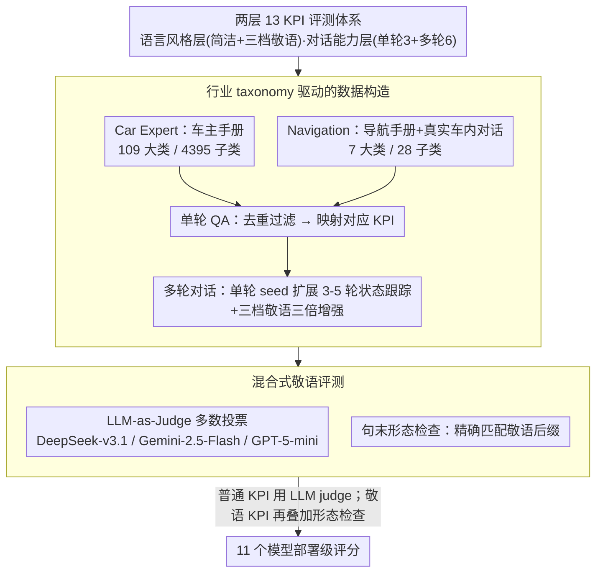

# LoCar: Localization-Aware Evaluation of In-Vehicle Assistants through Fine-Grained Sociolinguistic Control

**会议**: ACL2026  
**arXiv**: [2605.21086](https://arxiv.org/abs/2605.21086)  
**代码**: 无公开代码；数据包含行业合作方专有材料，论文说明不可公开  
**领域**: LLM 评测 / 本地化 / 车载助手  
**关键词**: 本地化评测、韩语敬语、车载助手、LLM-as-a-Judge、多轮对话  

## 一句话总结
LoCar 面向韩语车载助手提出 13 个部署级 KPI，并用人工校准的 LLM-as-a-Judge 与敬语形态验证来评测 11 个模型，发现通用理解能力接近饱和，但细粒度敬语控制和多轮策略性引导仍明显不稳定。

## 研究背景与动机
**领域现状**：车载助手正在从固定命令系统变成能解释车辆手册、理解导航需求、管理多轮对话的 LLM 应用。现有评测多关注通用知识、推理能力或英文交互质量，但商业部署中的本地化要求往往更细，例如韩语中不同敬语等级会直接影响用户感知的礼貌、信任和专业度。

**现有痛点**：常规 LLM benchmark 很难覆盖车载场景里的两类需求：一类是与车辆操作和导航相关的功能正确性，另一类是面向特定语言市场的社会语言学规范。即使模型能答对问题，也可能在敬语等级、简洁性、澄清时机或主动建议上不符合本地部署标准。

**核心矛盾**：部署级评测需要细到语言文化规范和车内交互流程，但人工评测成本高，普通 LLM judge 又容易混淆相近的韩语敬语形式。作者要解决的是如何在可自动化的前提下，让评测既覆盖功能能力，也能可靠检查本地化语言风格。

**本文目标**：构建一个韩语车载助手评测框架，覆盖 Car Expert 和 Navigation 两个核心用例；定义语言风格层和对话能力层 KPI；合成并增强测试数据；用人工标注校准评测器；最后分析不同模型在本地化部署要求上的差异。

**切入角度**：论文没有把“韩语能力”当成一个整体分数，而是拆成可操作的 KPI：简洁性、Hae/Haeyo/Hapsyo 三种敬语、隐式理解、上下文理解、有害问题响应、澄清、保持、细化、反思、主动建议和故障排查。

**核心 idea**：用行业场景 taxonomy 生成车载助手数据，再用“LLM judge 多数投票 + 韩语句尾形态检查”的混合评测管线，把本地化语言规范变成可量化的部署评测。

## 方法详解
LoCar 的贡献更像一个完整评测系统，而不是单一模型。它先定义车载助手的任务 taxonomy，再基于车辆手册、导航手册和真实车内对话构造单轮与多轮样本，最后按 KPI 选择合适的自动评测方式。

### 整体框架
框架包含三步。第一步是数据 taxonomy：Car Expert 覆盖车辆知识、操作和诊断，来自车主手册层级；Navigation 覆盖目的地搜索、路线解释、交通咨询和上下文推荐。第二步是数据构造：单轮问答从手册和导航 taxonomy 合成，多轮对话从单轮 seed 扩展为需要状态跟踪的交互流，并用韩语敬语进行三倍增强。第三步是评测：对普通 KPI 使用人工校准后的 LLM-as-a-Judge，多模型多数投票；对敬语 KPI 加入句尾形态验证，补足 LLM judge 对相近敬语等级的识别缺陷。整体上，先确定要测什么（13 KPI），再在真实车载功能上长出测试集，最后用混合评测器打分。

### 关键设计

**1. 两层 13 KPI 评测体系：车载助手的"答得对"和"说得体"分开打分**

车载助手的失败远不止答错问题——说得太啰嗦、礼貌等级用错、危险场景没拒答、多轮里丢了状态，都是部署级硬伤，但传统 benchmark 一个总分根本测不出这些。LoCar 把能力拆成两层 13 个 KPI：语言风格层管"怎么说"，含 Conciseness 与 Hae/Haeyo/Hapsyo 三档敬语；对话能力层管"会不会聊"，单轮含隐式理解、上下文理解、有害问题响应，多轮含澄清（Clarification）、保持（Retention）、细化（Refinement）、反思（Reflection）、主动建议（Proactive）、故障排查（Troubleshooting）。这样一来评测就能精确指出某模型是"知识不够"还是"礼貌不对"还是"多轮管不住状态"。

**2. 行业 taxonomy 驱动的数据构造：让测试集长在真实车载功能上，而非泛化闲聊**

本地化评测如果用通用聊天样本，再高的分也保证不了车里真能用。LoCar 直接从产品资料里长出测试集：Car Expert 解析车主手册形成 109 个大类、4,395 个子类（覆盖车辆知识、操作、诊断），Navigation 取自导航手册和真实车内对话形成 7 个大类、28 个子类（目的地搜索、路线解释、交通咨询、上下文推荐）。单轮 QA 先去重过滤再映射到对应 KPI，多轮数据则从单轮种子扩展成 3-5 轮、需要状态跟踪的交互流，并用三档韩语敬语做三倍增强。每条样本都对齐到具体产品功能，分数才有部署意义。

**3. 混合式敬语评测：LLM 判语义、规则查后缀，各取所长**

韩语敬语等级主要由句末形态标记体现，Hae/Haeyo/Hapsyo 这类相邻等级长得像，纯 LLM-as-a-Judge 极易混淆——评测器自己都不可靠，分数就无从谈起。LoCar 的做法是分工：LLM judge 负责上下文语义判断，一个轻量的句末形态检查负责精确匹配敬语后缀，当高精度的错误过滤器补上 LLM 的短板。这一改让敬语分类的人类-评测器一致性从 0.69 提到 0.94（+24 个百分点），而且越正式的 hapsyo 受益越大。

### 损失函数 / 训练策略
本文不训练被评测模型。评测器选择基于 803 个人工标注校准样本，每个样本由 3 名标注者独立标注。候选 judge 模型按跨 KPI 一致性和总体 agreement 选择，最终采用 DeepSeek-v3.1、Gemini-2.5-Flash 和 GPT-5-mini 的多数投票。实验对每个对话能力 KPI 随机采样 50 个测试实例，多轮样本随机选一个目标轮作为评测轮，并随机指定 hae、haeyo 或 hapsyo 作为目标敬语风格。

## 实验关键数据

### 主实验
| 实验项 | 设置 | 关键数据 | 结论 |
|--------|------|---------|------|
| 人工校准集 | 13 KPI，单轮与多轮 | 803 个人工标注样本，每个样本 3 名标注者 | 为 LLM-as-a-Judge 选择和校准提供依据 |
| 敬语混合评测 | LLM-only vs LLM + 形态验证 | 人类-judge 一致性 0.69 → 0.94，提升 24 个百分点 | 句尾形态检查显著改善细粒度敬语判别 |
| 单轮整体平均 | 11 个模型 | Navigation: 隐式理解 0.92、上下文理解 0.94、有害问题响应 0.85；Car Expert: 隐式理解 0.96、有害问题响应 0.93 | 单轮理解类指标接近饱和 |
| 多轮整体平均 | 11 个模型 | Navigation: Clarification 0.58、Proactive 0.78、Retention 0.88、Refinement 0.95、Reflection 0.95；Car Expert: Clarification 0.51、Troubleshooting 0.95 | 策略性澄清最难，状态保持和一致性更稳定 |
| 评测模型规模 | 被评测模型 | 共 11 个模型，其中包括 6 个韩国本地模型和多个全球 API 模型 | 框架能比较本地模型与全球模型的部署差异 |

### 消融实验
| 分析项 | 配置 | 关键数据 | 说明 |
|------|------|---------|------|
| 敬语 judge 改进 | Gemini-2.5-Flash | Hae +0.06，Haeyo +0.11，Hapsyo +0.19 | 形态验证对更正式的 hapsyo 提升更明显 |
| 敬语 judge 改进 | GPT-5-mini | Hae +0.08，Haeyo +0.18，Hapsyo +0.52 | GPT-5-mini 在 hapsyo 上的 LLM-only 混淆最严重，受益最大 |
| 敬语 judge 改进 | DeepSeek-v3.1 | Hae +0.03，Haeyo +0.08，Hapsyo +0.09 | 三个 judge 都有一致收益 |
| 多轮代表模型 | gpt-5.1 | Navigation Clarification 0.84、Proactive 1.00、Retention 0.98、Refinement 1.00、Reflection 1.00；Car Expert Clarification 0.92、Troubleshooting 1.00 | 前沿模型在多轮策略性 KPI 上更强 |
| 多轮低分案例 | kanana-1.5-15.7b-a3b | Navigation Clarification 0.28、Proactive 0.50；Car Expert Clarification 0.22 | 澄清和主动介入是本地模型也容易不稳的部分 |
| 推理时间 | 11 个模型 | solar-pro-3_free 91.16s，gpt-5.1 50.4s，Qwen3 32.88s，EXAONE-4.0.1 27.84s | 更高延迟并不必然对应更好的多轮策略表现 |

### 关键发现
- 单轮理解类指标已经很高，说明车载问答的“知道答案”不是最大瓶颈。
- 细粒度敬语控制仍不稳定，尤其 haeyo 与 hapsyo 这类相邻礼貌等级容易混淆。
- 多轮对话中 Clarification 和 Proactive 明显比 Retention、Refinement、Reflection 更难，因为它们要求模型判断何时介入，而不只是延续上下文。
- 评测器本身也需要本地化：LLM judge 对韩语敬语并不天然可靠，必须结合语言形态知识。

## 亮点与洞察
- LoCar 把“本地化”从泛泛的多语言能力拆成具体、可执行的社会语言学指标，这比只测韩语问答准确率更接近真实部署。
- 混合评测设计很务实：LLM judge 擅长上下文理解，规则形态检查擅长抓敬语后缀，两者结合比单独使用任何一方都稳。
- 论文清楚展示了车载助手的两个能力层次：理解车辆和导航知识只是基础，真正难的是在多轮中做正确的澄清、主动建议和安全边界处理。
- 对其他语言市场也有启发。即使不是韩语，很多语言也有本地礼貌、方言、称谓、语域或文化规约，需要专门评测组件。

## 局限与展望
- LoCar 只在韩语和韩国车载市场上开发验证，敬语检测依赖韩语句末形态，不能直接迁移到礼貌由词汇、语序或上下文编码的语言。
- 数据包含行业合作方专有材料，不能公开发布，这会限制复现和社区扩展。
- 评测是离线文本设置，没有覆盖真实车载 ASR 误识别、TTS 呈现、车内噪声、多模态屏幕信息和驾驶实时状态。
- 论文刻意排除了车辆厂商特定指标以保留通用性，但真实部署会需要动态天气、位置、用户历史和工具调用等上下文。
- 后续可以扩展到跨语言 LoCar、真实车内闭环测试、语音端到端评测，以及和 RAG / 工具调用结合的动态车载助手评估。

## 相关工作与启发
- **vs MT-Bench / Arena-Hard**: 通用对话评测关注整体回答质量，LoCar 关注车载部署中的本地语言风格和任务连续性。
- **vs Korean-specific benchmarks**: 韩语通用理解基准能测语言能力，LoCar 进一步要求敬语等级、车载功能和多轮管理。
- **vs 纯 LLM-as-a-Judge**: 纯 LLM judge 在细粒度韩语敬语上不可靠，LoCar 加入形态验证作为高精度约束。
- **vs 汽车领域 QA 数据集**: 普通汽车 QA 往往只测知识正确性，LoCar 同时测安全响应、澄清、主动性和社会语言学适配。

## 评分
- 新颖性: ⭐⭐⭐⭐☆ 把车载助手本地化拆成 13 个 KPI 并加入敬语形态验证，问题定义很有应用价值。
- 实验充分度: ⭐⭐⭐⭐☆ 有 803 人工校准样本、11 个模型和单轮/多轮评测，但数据不可公开且只覆盖韩语。
- 写作质量: ⭐⭐⭐⭐☆ 结构清晰，taxonomy、评测器和部署含义衔接自然。
- 价值: ⭐⭐⭐⭐☆ 对多语言车载助手、本地化评测和企业级 LLM 部署都有直接启发。

<!-- RELATED:START -->

## 相关论文

- [\[ACL 2026\] IF-Critic: Towards a Fine-Grained LLM Critic for Instruction-Following Evaluation](if-critic_towards_a_fine-grained_llm_critic_for_instruction-following_evaluation.md)
- [\[ACL 2026\] K-MetBench: A Multi-Dimensional Benchmark for Fine-Grained Evaluation of Expert Reasoning, Locality, and Multimodality in Meteorology](k-metbench_a_multi-dimensional_benchmark_for_fine-grained_evaluation_of_expert_r.md)
- [\[ACL 2026\] Rethinking Meeting Effectiveness: A Benchmark and Framework for Temporal Fine-grained Automatic Meeting Effectiveness Evaluation](rethinking_meeting_effectiveness_a_benchmark_and_framework_for_temporal_fine-gra.md)
- [\[ICLR 2026\] Enabling Fine-Grained Operating Points for Black-Box LLMs](../../ICLR2026/llm_evaluation/enabling_fine-grained_operating_points_for_black-box_llms.md)
- [\[ACL 2026\] AJ-Bench: Benchmarking Agent-as-a-Judge for Environment-Aware Evaluation](aj-bench_benchmarking_agent-as-a-judge_for_environment-aware_evaluation.md)

<!-- RELATED:END -->
